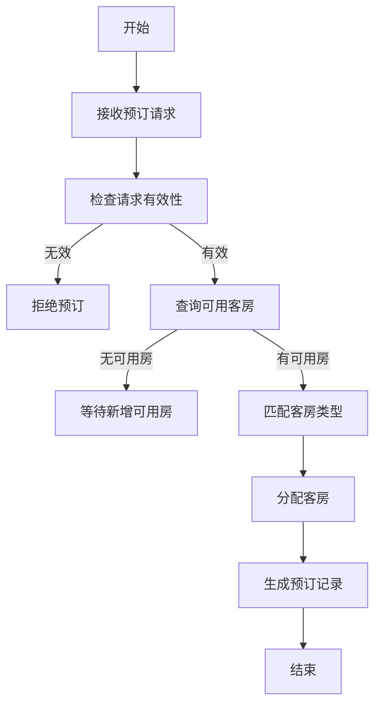

# 酒店客房管理系统详细设计与具体代码实现

## 1.背景介绍

酒店客房管理系统是酒店运营的核心系统之一,旨在高效管理酒店客房资源,提高客房使用率和收益。随着旅游业的蓬勃发展,酒店客房管理系统的重要性日益凸显。本文将深入探讨酒店客房管理系统的设计和实现,帮助读者全面理解其工作原理和实践应用。

## 2.核心概念与联系

酒店客房管理系统涉及以下核心概念:

1. **客房类型(Room Type)**: 根据房间大小、设施等级等划分,如标准房、豪华房等。
2. **房态(Room Status)**: 表示客房当前状态,如空房、占房、离店等。
3. **入住率(Occupancy Rate)**: 占房房间数与总房间数的比率。
4. **房价(Room Rate)**: 不同客房类型的定价策略。
5. **预订(Reservation)**: 客人预定客房的过程。
6. **入住(Check-in)**: 客人办理入住手续的过程。
7. **离店(Check-out)**: 客人结账离店的过程。

这些概念相互关联,构成了酒店客房管理的核心业务流程。

## 3.核心算法原理具体操作步骤

酒店客房管理系统的核心算法包括:

1. **房态更新算法**:根据入住、离店等操作实时更新客房状态。
2. **房价计算算法**:根据季节性、房态等因素动态调整房价。
3. **预订分配算法**:根据预订要求和房态,分配合适的客房。
4. **收益管理算法**:最大化客房收益,提高入住率和平均房价。

以预订分配算法为例,其操作步骤如下:



该算法首先验证预订请求的有效性,然后查询可用客房,匹配合适的客房类型,最终分配客房并生成预订记录。

## 4.数学模型和公式详细讲解举例说明

酒店客房管理系统中常用的数学模型包括:

1. **预测模型**:预测未来客房需求,如基于时间序列的ARIMA模型。
2. **定价模型**:根据供需关系确定动态房价,如基于收益管理的定价模型。
3. **优化模型**:最大化酒店收益,如基于线性规划的优化模型。

以基于收益管理的定价模型为例,其目标是最大化预期收益:

$$\max \sum_{i=1}^{n}p_i \cdot q_i(p_i)$$

其中:
- $n$为客房类型数量
- $p_i$为第$i$种客房类型的房价
- $q_i(p_i)$为第$i$种客房类型在房价$p_i$时的需求量

该模型需要满足以下约束条件:
- 客房供给约束:$\sum_{i=1}^{n}q_i(p_i) \leq C$,其中$C$为总客房数量
- 房价区间约束:$p_i^{min} \leq p_i \leq p_i^{max}$

通过求解该优化问题,可以得到最优房价,从而最大化预期收益。

## 5.项目实践:代码实例和详细解释说明

以下是一个简化的Python实现示例,演示了酒店客房管理系统的核心功能:

```python
class Room:
    def __init__(self, room_type, rate):
        self.room_type = room_type
        self.rate = rate
        self.status = 'Available'

class Hotel:
    def __init__(self, rooms):
        self.rooms = rooms

    def check_availability(self, room_type, check_in_date, check_out_date):
        available_rooms = [room for room in self.rooms
                           if room.room_type == room_type and room.status == 'Available']
        return len(available_rooms)

    def make_reservation(self, room_type, check_in_date, check_out_date):
        available_rooms = [room for room in self.rooms
                           if room.room_type == room_type and room.status == 'Available']
        if available_rooms:
            room = available_rooms.pop()
            room.status = 'Occupied'
            print(f'Reservation made for {room_type} room.')
        else:
            print(f'No {room_type} rooms available for the requested dates.')

# 创建客房对象
rooms = [Room('Standard', 100), Room('Deluxe', 150), Room('Suite', 200)]

# 创建酒店对象
hotel = Hotel(rooms)

# 检查可用客房
available_standard_rooms = hotel.check_availability('Standard', '2023-06-01', '2023-06-03')
print(f'Available Standard rooms: {available_standard_rooms}')

# 预订客房
hotel.make_reservation('Deluxe', '2023-06-01', '2023-06-03')
```

在这个示例中,我们定义了`Room`和`Hotel`类。`Room`类表示单个客房,包含客房类型、房价和状态属性。`Hotel`类表示整个酒店,包含所有客房对象,并提供检查可用客房和预订客房的方法。

代码首先创建了三种类型的客房对象,然后创建了一个`Hotel`实例。接下来,我们调用`check_availability`方法检查标准房的可用数量,并调用`make_reservation`方法预订豪华房。

该示例演示了基本的客房管理功能,但在实际项目中,您需要添加更多功能,如入住、离店、收益管理等。

## 6.实际应用场景

酒店客房管理系统在以下场景中发挥着重要作用:

1. **在线预订系统**:客户可以通过酒店网站或第三方预订平台预订客房。
2. **前台管理**:前台人员可以使用系统查看房态、办理入住和离店手续。
3. **收益管理**:酒店管理层可以根据供需情况动态调整房价,最大化收益。
4. **报表分析**:系统可以生成各种报表,如入住率、平均房价等,供决策参考。

## 7.工具和资源推荐

以下是一些常用的酒店客房管理系统工具和资源:

1. **Opera企业解决方案**:由Oracle提供的全面的酒店管理系统。
2. **Cloudbeds酒店管理软件**:面向中小型酒店的云端解决方案。
3. **Hotelogix酒店管理系统**:提供全方位的前台、后勤和分销管理功能。
4. **开源项目**:如Hotelmock、Hotel Booking Cancellation等。
5. **在线课程**:如Coursera的"酒店收益管理"课程。
6. **行业论坛**:如HotelExecutive、HotelNewsNow等。

## 8.总结:未来发展趋势与挑战

酒店客房管理系统未来将面临以下发展趋势和挑战:

1. **智能化**:利用人工智能和大数据技术,实现更精准的需求预测和收益优化。
2. **移动化**:提供移动应用,让客户能够随时随地预订和管理客房。
3. **个性化**:根据客户偏好和历史数据,提供更加个性化的服务和定价策略。
4. **集成化**:与其他系统(如PMS、CRS等)实现无缝集成,提高运营效率。
5. **安全性**:加强系统安全性,保护客户隐私和交易数据。

## 9.附录:常见问题与解答

1. **如何确定合理的房价?**
   答:可以利用收益管理模型,根据供需关系和市场竞争情况动态调整房价。同时也要考虑成本、目标利润等因素。

2. **如何提高入住率?**
   答:可以采取促销活动、优惠政策等营销手段吸引客户。同时也要提供优质的客房和服务,树立良好的品牌形象。

3. **如何处理超预订情况?**
   答:可以先将客户安排在其他酒店,并提供适当的补偿。长期来看,需要改进预订分配算法,避免过度预订。

4. **如何管理季节性波动?**
   答:可以根据历史数据预测旺季和淡季,并相应调整房价和营销策略。同时也要合理安排人员和资源,应对客流高峰。

作者:禅与计算机程序设计艺术 / Zen and the Art of Computer Programming