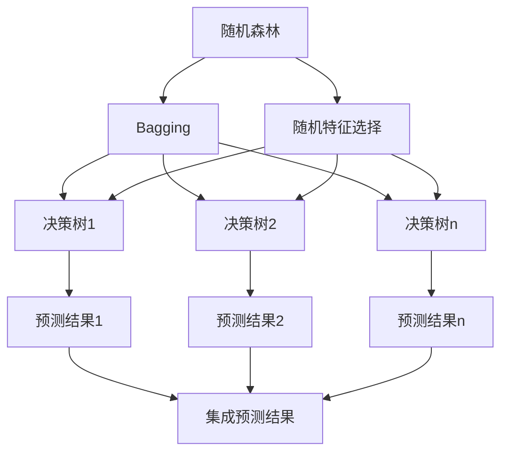

# 随机森林原理与代码实例讲解

## 1. 背景介绍

随机森林(Random Forest)是一种基于集成学习(Ensemble Learning)理念的监督式机器学习算法。它通过构建多个决策树,并将它们的预测结果进行综合,从而形成一个强大且鲁棒的模型。随机森林在解决分类和回归问题方面表现出色,被广泛应用于多个领域,如金融、医疗、计算机视觉等。

随机森林的核心思想是通过集成多个弱分类器(决策树)来构建一个强大的分类器。每个决策树都是在原始数据集的不同子集上训练得到的,这些子集是通过有放回抽样(Bagging)和随机选择特征子集(Feature Bagging)获得的。这种随机性有助于降低模型对于噪声数据的敏感性,并减少决策树之间的相关性,从而提高整体预测性能。

## 2. 核心概念与联系

### 2.1 决策树(Decision Tree)

决策树是一种基本的机器学习算法,它通过构建一个类似于流程图的树状结构来进行决策。每个内部节点代表一个特征,每个分支代表该特征取值的一种可能情况,而每个叶节点则代表一个分类或回归值。在训练过程中,算法会根据特征的信息增益或信息熵等指标,选择最优特征进行分裂,从而构建出一棵决策树。

### 2.2 集成学习(Ensemble Learning)

集成学习是将多个弱学习器(如决策树)组合成一个强大的学习器的过程。它的核心思想是通过训练多个弱学习器,并将它们的预测结果进行综合,从而获得比单个学习器更好的性能。常见的集成学习方法包括Bagging、Boosting等。

### 2.3 Bagging(Bootstrap Aggregating)

Bagging是一种通过自助采样(Bootstrap Sampling)和投票(Voting)或平均(Averaging)的方式来减少方差的集成学习技术。在随机森林中,Bagging用于从原始数据集中抽取多个子集,每个子集用于训练一棵决策树。

### 2.4 随机特征选择(Random Feature Selection)

在构建每棵决策树时,随机森林不是使用所有特征,而是从全部特征中随机选择一个特征子集。这种随机性有助于减少决策树之间的相关性,从而提高整体性能。



## 3. 核心算法原理具体操作步骤

随机森林算法的核心步骤如下:

1. **数据准备**: 对原始数据集进行预处理,包括处理缺失值、编码分类特征等。

2. **创建决策树集合**:
   a. 通过有放回抽样(Bagging)从原始数据集中抽取 N 个子集。
   b. 对于每个子集,从全部特征中随机选择 m 个特征(m << 总特征数)。
   c. 使用选定的 m 个特征,基于该子集训练一棵决策树。
   d. 重复步骤 b 和 c,直到生成 N 棵决策树。

3. **进行预测**:
   a. 对于新的测试样本,将其输入到每一棵决策树中。
   b. 对于分类问题,采用投票(Voting)的方式,选择票数最多的类别作为最终预测结果。
   c. 对于回归问题,计算所有决策树预测值的平均值作为最终预测结果。

4. **评估模型性能**: 使用测试集或交叉验证等方法,评估随机森林模型的性能指标,如准确率、F1分数、均方根误差等。

## 4. 数学模型和公式详细讲解举例说明

### 4.1 信息增益(Information Gain)

在构建决策树时,通常使用信息增益作为选择最优特征的指标。信息增益度量了使用某个特征进行分裂后,数据集的不确定性减少的程度。

对于一个包含 k 个类别的数据集 D,其信息熵(Entropy)定义为:

$$
\text{Entropy}(D) = -\sum_{i=1}^{k} p_i \log_2 p_i
$$

其中 $p_i$ 表示数据集 D 中属于第 i 个类别的样本占比。

假设我们根据特征 A 将数据集 D 分为 n 个子集 $D_1, D_2, \ldots, D_n$,则使用特征 A 进行分裂后的信息熵为:

$$
\text{Entropy}_A(D) = \sum_{j=1}^{n} \frac{|D_j|}{|D|} \text{Entropy}(D_j)
$$

信息增益(Information Gain)定义为:

$$
\text{Gain}(A) = \text{Entropy}(D) - \text{Entropy}_A(D)
$$

在构建决策树时,我们选择信息增益最大的特征进行分裂,从而最大程度地减少不确定性。

### 4.2 基尼系数(Gini Impurity)

基尼系数是另一种常用的特征选择指标,它度量了一个数据集的"纯度"。对于一个包含 k 个类别的数据集 D,其基尼系数定义为:

$$
\text{Gini}(D) = 1 - \sum_{i=1}^{k} p_i^2
$$

其中 $p_i$ 表示数据集 D 中属于第 i 个类别的样本占比。

与信息熵类似,我们可以计算使用特征 A 进行分裂后的基尼系数:

$$
\text{Gini}_A(D) = \sum_{j=1}^{n} \frac{|D_j|}{|D|} \text{Gini}(D_j)
$$

基尼增益(Gini Gain)定义为:

$$
\text{Gain}(A) = \text{Gini}(D) - \text{Gini}_A(D)
$$

在构建决策树时,我们选择基尼增益最大的特征进行分裂,从而最大程度地提高数据集的"纯度"。

### 4.3 示例

假设我们有一个包含两个类别(0和1)的数据集 D,其中包含 10 个样本,类别分布如下:

- 类别 0: 6 个样本
- 类别 1: 4 个样本

我们计算该数据集的信息熵:

$$
\begin{aligned}
\text{Entropy}(D) &= -\left(\frac{6}{10} \log_2 \frac{6}{10} + \frac{4}{10} \log_2 \frac{4}{10}\right) \\
&= -\left(0.6 \log_2 0.6 + 0.4 \log_2 0.4\right) \\
&\approx 0.971
\end{aligned}
$$

现在,我们根据一个二值特征 A 将数据集 D 分为两个子集 $D_1$ 和 $D_2$:

- $D_1$: 6 个样本,其中 4 个属于类别 0,2 个属于类别 1
- $D_2$: 4 个样本,全部属于类别 0

我们计算使用特征 A 进行分裂后的信息熵:

$$
\begin{aligned}
\text{Entropy}_A(D) &= \frac{6}{10} \text{Entropy}(D_1) + \frac{4}{10} \text{Entropy}(D_2) \\
&= \frac{6}{10} \left(-\frac{4}{6} \log_2 \frac{4}{6} - \frac{2}{6} \log_2 \frac{2}{6}\right) + \frac{4}{10} \left(-0 \log_2 0 - 1 \log_2 1\right) \\
&\approx 0.611
\end{aligned}
$$

因此,使用特征 A 进行分裂的信息增益为:

$$
\text{Gain}(A) = \text{Entropy}(D) - \text{Entropy}_A(D) \approx 0.971 - 0.611 = 0.360
$$

我们可以看到,使用特征 A 进行分裂后,数据集的不确定性降低了 0.360。在构建决策树时,我们会选择信息增益最大的特征进行分裂。

## 5. 项目实践: 代码实例和详细解释说明

以下是使用Python中的scikit-learn库实现随机森林算法的示例代码:

```python
from sklearn.ensemble import RandomForestClassifier
from sklearn.datasets import make_classification
from sklearn.model_selection import train_test_split
from sklearn.metrics import accuracy_score

# 生成示例数据集
X, y = make_classification(n_samples=1000, n_features=10, n_informative=5, random_state=42)

# 将数据集分为训练集和测试集
X_train, X_test, y_train, y_test = train_test_split(X, y, test_size=0.2, random_state=42)

# 创建随机森林分类器
rf_clf = RandomForestClassifier(n_estimators=100, max_depth=5, random_state=42)

# 训练模型
rf_clf.fit(X_train, y_train)

# 在测试集上进行预测
y_pred = rf_clf.predict(X_test)

# 计算准确率
accuracy = accuracy_score(y_test, y_pred)
print(f"Random Forest Accuracy: {accuracy}")
```

代码解释:

1. 首先,我们从scikit-learn的`make_classification`函数生成一个示例数据集,包含1000个样本,10个特征,其中5个特征是有信息量的。

2. 使用`train_test_split`函数将数据集分为训练集和测试集,测试集占20%。

3. 创建一个`RandomForestClassifier`对象,设置`n_estimators=100`表示生成100棵决策树,`max_depth=5`表示每棵决策树的最大深度为5。

4. 使用`fit`方法在训练集上训练随机森林模型。

5. 在测试集上进行预测,使用`predict`方法获取预测结果。

6. 使用`accuracy_score`函数计算预测结果的准确率。

在实际应用中,我们还需要进行特征工程、模型调参等步骤,以获得更好的性能。此外,随机森林还可以用于回归问题,只需将`RandomForestClassifier`替换为`RandomForestRegressor`即可。

## 6. 实际应用场景

随机森林由于其优秀的性能和鲁棒性,在多个领域都有广泛的应用:

1. **金融**: 用于信用评分、欺诈检测、风险管理等。

2. **医疗**: 用于疾病诊断、基因分析、药物开发等。

3. **计算机视觉**: 用于图像分类、目标检测、人脸识别等。

4. **自然语言处理**: 用于文本分类、情感分析、机器翻译等。

5. **推荐系统**: 用于个性化推荐、用户行为预测等。

6. **网络安全**: 用于入侵检测、恶意软件识别等。

7. **生物信息学**: 用于基因表达数据分析、蛋白质结构预测等。

8. **环境科学**: 用于气候模式预测、生态系统建模等。

随机森林的优点包括:

- 能够处理高维数据,并自动进行特征选择
- 不易过拟合,具有良好的泛化能力
- 可以处理缺失值和异常值
- 可以估计特征的重要性
- 易于并行化,提高计算效率

## 7. 工具和资源推荐

1. **Python库**:
   - scikit-learn: 机器学习库,提供了随机森林的实现
   - XGBoost: 高效的梯度提升树库,也支持随机森林
   - LightGBM: 另一个高效的梯度提升树库,支持随机森林

2. **在线课程**:
   - Coursera上的"机器学习"课程,由Andrew Ng教授授课
   - Udacity的"机器学习工程师纳米学位"项目
   - edX上的"机器学习基础"课程,由哈佛大学开设

3. **书籍**:
   - "机器学习实战"(Python版),作者Peter Harrington
   - "模式识别与机器学习",作者Christopher M. Bishop
   - "An Introduction to Statistical Learning",作者Gareth James等

4. **在线社区**:
   - Kaggle: 数据科学竞赛平台,可以学习和实践机器学习算法
   - Stack Overflow: 技术问答社区,可以查找和