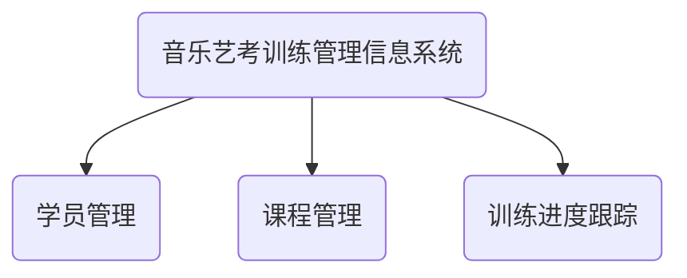

## 1.背景介绍

随着科技的发展，信息技术已经深入到各个行业领域，音乐艺考训练也不例外。音乐艺考训练是一个复杂的过程，涉及到的内容包括音乐理论知识的学习、技能的训练、演奏的实践等。因此，如何有效地管理这个过程，提高训练效率，成为了一个重要的问题。为了解决这个问题，本文提出了一个音乐艺考训练管理信息系统的设计方案。

## 2.核心概念与联系

音乐艺考训练管理信息系统是一个基于Web的应用系统，主要包括三个部分：学员管理、课程管理和训练进度跟踪。学员管理主要是对学员的基本信息进行管理，包括学员的注册、信息修改等；课程管理主要是对课程的信息进行管理，包括课程的添加、修改、删除等；训练进度跟踪主要是对学员的训练进度进行跟踪，包括学员的学习计划、学习进度、学习成果等。



## 3.核心算法原理具体操作步骤

音乐艺考训练管理信息系统的设计主要包括以下几个步骤：

1. 需求分析：通过与艺考训练机构、教师和学员的交流，了解他们的需求，确定系统的功能需求和性能需求。

2. 系统设计：根据需求分析的结果，设计系统的架构和模块，包括学员管理模块、课程管理模块和训练进度跟踪模块。

3. 系统实现：根据系统设计的结果，选择合适的技术和工具，进行系统的编码和测试。

4. 系统部署：将系统部署到服务器上，进行系统的配置和优化。

## 4.数学模型和公式详细讲解举例说明

在音乐艺考训练管理信息系统中，我们需要对学员的学习进度进行量化，以便于进行跟踪和管理。我们可以使用以下的数学模型来表示学员的学习进度：

设 $P$ 表示学员的学习进度，$T$ 表示学员的学习目标，$C$ 表示学员已完成的学习内容，那么，学员的学习进度可以用以下的公式来计算：

$$P = \frac{C}{T} \times 100\%$$

## 5.项目实践：代码实例和详细解释说明

下面以学员管理模块为例，给出一个简单的代码实例。这个代码实例是使用Python的Django框架编写的，用于实现学员的注册功能。

```python
from django.contrib.auth.models import User
from django import forms

class RegistrationForm(forms.ModelForm):
    password = forms.CharField(widget=forms.PasswordInput)

    class Meta:
        model = User
        fields = ['username', 'email', 'password']

    def save(self, commit=True):
        user = super(RegistrationForm, self).save(commit=False)
        user.set_password(self.cleaned_data['password'])
        if commit:
            user.save()
        return user
```

## 6.实际应用场景

音乐艺考训练管理信息系统可以应用在各种音乐艺考训练机构，如音乐学校、艺术学院、音乐培训机构等。通过这个系统，机构可以更有效地管理学员的学习过程，提高训练效率；学员也可以更方便地跟踪自己的学习进度，提高学习效果。

## 7.工具和资源推荐

在设计和实现音乐艺考训练管理信息系统时，可以使用以下的工具和资源：

- 需求分析和系统设计：使用UML工具，如Rational Rose、StarUML等。

- 系统实现：使用Web开发框架，如Python的Django框架、Java的Spring框架等；使用数据库管理系统，如MySQL、Oracle等。

- 系统部署：使用云服务，如阿里云、腾讯云等。

## 8.总结：未来发展趋势与挑战

随着信息技术的发展，音乐艺考训练管理信息系统的设计将面临更多的挑战和机遇。一方面，如何利用大数据、人工智能等新技术，提高系统的智能化水平，将是一个重要的研究方向；另一方面，如何保证系统的安全性、稳定性和可扩展性，也是一个需要重点考虑的问题。

## 9.附录：常见问题与解答

1. 问题：音乐艺考训练管理信息系统的设计需要哪些基础知识？

答：音乐艺考训练管理信息系统的设计需要掌握计算机科学基础知识、数据库知识、Web开发知识等。

2. 问题：音乐艺考训练管理信息系统的设计有哪些难点？

答：音乐艺考训练管理信息系统的设计的难点主要包括需求分析的准确性、系统设计的合理性、系统实现的技术难度等。

作者：禅与计算机程序设计艺术 / Zen and the Art of Computer Programming