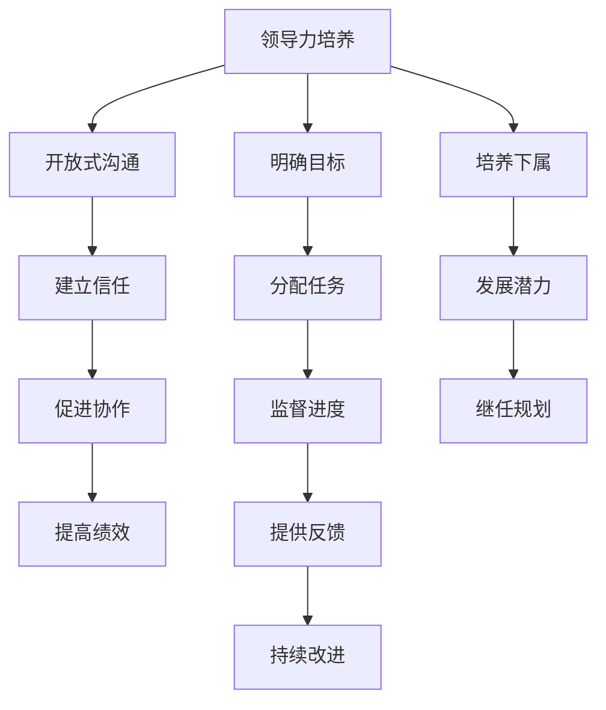

# 领导力培养：跨部门、跨职能沟通，并能够有效培养和管理下属

## 1. 背景介绍

在当今快节奏的商业环境中，领导力是组织成功的关键因素之一。有效的领导不仅需要专业知识和技能,更需要优秀的沟通能力和人际管理技巧。跨部门和跨职能的沟通协作已经成为现代组织的常态,而培养和管理下属则是领导者的核心职责之一。本文将探讨如何培养跨部门、跨职能的沟通能力,并有效地培养和管理下属,以提高领导力和组织绩效。

## 2. 核心概念与联系

### 2.1 跨部门沟通

跨部门沟通是指不同部门之间的信息交流和协作。它涉及不同职能部门、不同层级和不同地理位置的员工之间的沟通。有效的跨部门沟通可以促进信息共享、资源整合和协同工作,从而提高组织效率和决策质量。

### 2.2 跨职能沟通

跨职能沟通是指不同职能领域之间的信息交流和协作。它涉及不同专业背景、不同技能和不同角色的员工之间的沟通。有效的跨职能沟通可以促进不同领域的专业知识整合,提高问题解决能力和创新能力。

### 2.3 培养下属

培养下属是指通过教导、指导和支持,帮助下属发展所需的知识、技能和能力。有效的培养可以提高下属的工作绩效,促进个人成长,并为组织培养未来的领导者。

### 2.4 管理下属

管理下属是指通过设定目标、分配任务、监督进度和提供反馈,来指导和控制下属的工作表现。有效的管理可以确保工作目标的实现,维护团队纪律,并促进员工的积极性和责任心。

### 2.5 领导力

领导力是指影响他人实现共同目标的能力。优秀的领导者应该具备远见卓识、决策能力、沟通技巧和人际管理能力,能够激励和团结团队,推动组织发展。

## 3. 核心算法原理具体操作步骤

在本节中,我们将介绍提高跨部门、跨职能沟通能力,以及有效培养和管理下属的核心算法原理和具体操作步骤。



### 3.1 开放式沟通

开放式沟通是建立有效跨部门和跨职能沟通的基础。它包括以下步骤:

1. 鼓励不同部门和职能之间的定期会议和信息共享。
2. 建立正式和非正式的沟通渠道,如电子邮件、即时通讯工具和面对面交流。
3. 培养开放、诚实和尊重的沟通文化,鼓励员工表达不同观点和建议。
4. 提供清晰的信息,避免模糊和误解。

### 3.2 建立信任

建立信任是促进有效沟通和协作的关键。它包括以下步骤:

1. 保持一致性和可靠性,履行承诺。
2. 展现专业素质和诚信,赢得他人的尊重。
3. 倾听并理解不同观点,表现出包容和开放的态度。
4. 建立相互支持和关怀的关系,增强团队凝聚力。

### 3.3 促进协作

促进协作可以充分利用不同部门和职能的专业知识和资源。它包括以下步骤:

1. 明确共同目标和责任,确保所有相关方都在朝着同一方向努力。
2. 鼓励不同部门和职能之间的资源共享和知识交流。
3. 建立跨部门和跨职能的工作小组或项目团队,促进协作。
4. 提供必要的工具和技术支持,如协作软件和视频会议系统。

### 3.4 明确目标

明确目标是有效管理下属的第一步。它包括以下步骤:

1. 与下属共同制定具体、可衡量、可实现、相关和有时限的目标(SMART目标)。
2. 确保目标与组织的整体战略和优先事项保持一致。
3. 明确目标的重要性和预期结果,增强下属的责任感和动机。
4. 定期审查和调整目标,以适应变化的环境和需求。

### 3.5 分配任务

合理分配任务可以确保工作的高效完成。它包括以下步骤:

1. 根据下属的技能、经验和工作量合理分配任务。
2. 提供清晰的任务描述、期望和截止日期。
3. 确保下属了解任务的重要性和对整体目标的贡献。
4. 鼓励下属提出问题和寻求支持,以确保任务的顺利完成。

### 3.6 监督进度

监督进度可以及时发现和解决问题。它包括以下步骤:

1. 建立定期的进度报告和更新机制,了解任务的进展情况。
2. 提供必要的指导和支持,帮助下属解决遇到的困难和障碍。
3. 及时识别潜在的风险和问题,并采取适当的纠正措施。
4. celebration成就和里程碑,增强下属的动力和信心。

### 3.7 提供反馈

提供反馈可以促进下属的持续改进和发展。它包括以下步骤:

1. 建立定期的反馈机制,如绩效评估和一对一会议。
2. 提供具体、及时和建设性的反馈,关注both优点和需要改进的地方。
3. 鼓励双向沟通,倾听下属的观点和建议。
4. 制定改进计划,并提供必要的资源和支持。

### 3.8 培养下属

培养下属可以发展他们的潜力,为组织培养未来的领导者。它包括以下步骤:

1. 识别下属的优势和发展需求,制定个性化的培养计划。
2. 提供各种培训和发展机会,如课程、mentor和工作轮换。
3. 给予下属更多的责任和挑战性任务,促进他们的成长。
4. 提供指导和反馈,帮助下属克服困难和不足。

### 3.9 持续改进

持续改进是保持领导力和组织绩效的关键。它包括以下步骤:

1. 定期评估沟通、协作和管理实践的有效性。
2. 收集来自下属和其他利益相关方的反馈和建议。
3. 识别改进的机会和需求,制定行动计划。
4. 持续学习和适应,与时俱进地提高领导力。

## 4. 数学模型和公式详细讲解举例说明

在领导力培养过程中,我们可以借助数学模型和公式来量化和优化相关指标,从而提高决策的准确性和效率。

### 4.1 员工绩效评估模型

员工绩效评估是管理下属的重要环节。我们可以使用加权评分模型来综合考虑多个评估指标,计算员工的总体绩效分数。

设有 $n$ 个评估指标,每个指标的权重为 $w_i$,满足 $\sum_{i=1}^n w_i = 1$。对于第 $j$ 位员工,在第 $i$ 个指标上的得分为 $s_{ij}$。则该员工的总体绩效分数 $S_j$ 可以计算如下:

$$S_j = \sum_{i=1}^n w_i s_{ij}$$

通过调整各个指标的权重,我们可以根据组织的战略重点来确定评估的侧重点。

### 4.2 项目资源分配模型

在跨部门和跨职能的协作项目中,合理分配资源是确保项目成功的关键。我们可以使用线性规划模型来优化资源分配。

设有 $m$ 个任务,每个任务需要 $r_i$ 个资源单位。我们有 $R$ 个可用资源单位,目标是最大化完成的任务数量。令决策变量 $x_i$ 表示任务 $i$ 是否被选择(1表示选择,0表示不选择),则优化问题可以表示为:

$$\begin{aligned}
\max & \sum_{i=1}^m x_i \\
\text{s.t.} & \sum_{i=1}^m r_i x_i \leq R \\
& x_i \in \{0, 1\}, \quad i = 1, 2, \ldots, m
\end{aligned}$$

通过求解这个线性规划问题,我们可以得到最优的资源分配方案,从而最大化完成的任务数量。

### 4.3 培训效果评估模型

为了评估培训活动对员工绩效的影响,我们可以使用回归分析模型。

设有 $n$ 位员工参加了培训,第 $i$ 位员工的培训前绩效为 $y_i^0$,培训后绩效为 $y_i^1$。我们可以建立如下线性回归模型:

$$y_i^1 = \beta_0 + \beta_1 y_i^0 + \beta_2 x_i + \epsilon_i$$

其中 $x_i$ 是一个虚拟变量,表示员工是否参加了培训(1表示参加,0表示未参加),$\epsilon_i$ 是随机误差项。通过估计回归系数 $\beta_0$、$\beta_1$ 和 $\beta_2$,我们可以评估培训对员工绩效的影响程度。如果 $\beta_2$ 显著为正,则说明培训对提高员工绩效有显著作用。

通过上述数学模型和公式,我们可以更加科学和量化地支持领导力培养中的决策和评估过程。

## 5. 项目实践:代码实例和详细解释说明

在本节中,我们将提供一些实际的代码示例,展示如何应用数学模型和算法来支持领导力培养的相关任务。

### 5.1 员工绩效评估

以下是使用Python实现员工绩效评估模型的代码示例:

```python
import numpy as np

# 评估指标及权重
indicators = ['工作质量', '工作量', '主动性', '团队合作', '时间管理']
weights = [0.3, 0.2, 0.15, 0.2, 0.15]

# 员工评分数据
employee_scores = {
    'Alice': [4, 5, 4, 3, 4],
    'Bob': [3, 4, 3, 4, 3],
    'Charlie': [5, 4, 4, 5, 4]
}

# 计算员工总体绩效分数
def calculate_performance_score(scores, weights):
    return np.dot(scores, weights)

# 输出员工绩效评估结果
for employee, scores in employee_scores.items():
    performance_score = calculate_performance_score(scores, weights)
    print(f'{employee}的总体绩效分数为: {performance_score:.2f}')
```

在这个示例中,我们首先定义了评估指标及其权重。然后,我们使用字典存储了三位员工的评分数据。`calculate_performance_score`函数使用NumPy的点积函数`np.dot`来计算员工的总体绩效分数。最后,我们遍历每位员工,计算并输出他们的总体绩效分数。

### 5.2 项目资源分配

以下是使用Python实现项目资源分配模型的代码示例:

```python
from pulp import LpProblem, LpMaximize, LpInteger, LpVariable

# 任务及所需资源
tasks = [(1, 3), (2, 4), (3, 2), (4, 5), (5, 3)]
total_resources = 10

# 创建优化问题
prob = LpProblem("Resource Allocation", LpMaximize)

# 定义决策变量
x = [LpVariable(f"x{i}", cat=LpInteger) for i in range(len(tasks))]

# 设置目标函数
prob += sum(x)

# 添加约束条件
prob += sum(r * x[i] for i, (_, r) in enumerate(tasks)) <= total_resources

# 求解优化问题
prob.solve()

# 输出结果
print("最优解:")
for i, (t, r) in enumerate(tasks):
    if x[i].value() == 1:
        