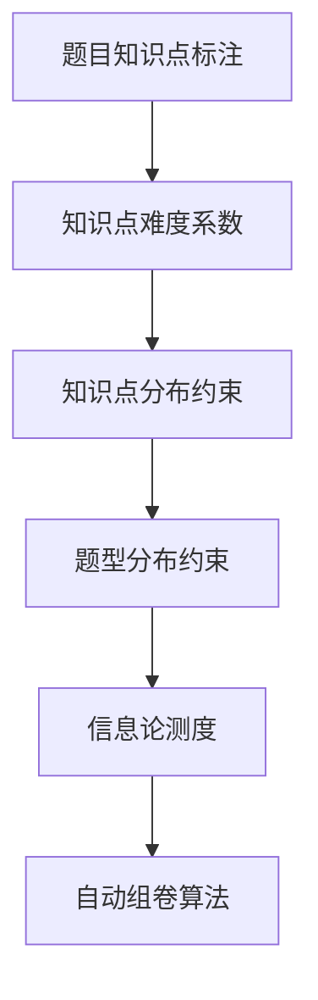
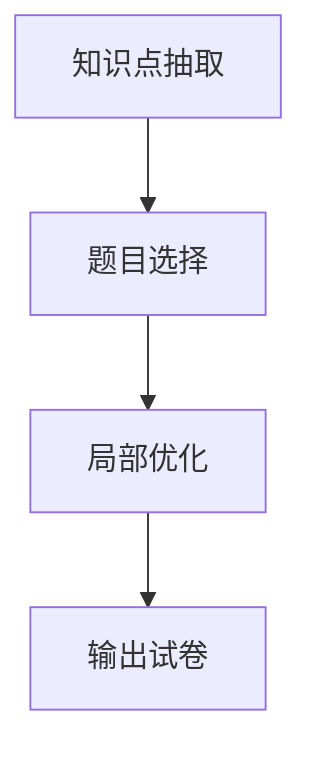

# 题库自动组卷系统详细设计与具体代码实现

## 1.背景介绍

随着教育信息化的不断推进,自动组卷系统作为教学辅助工具备受关注。传统的人工组卷方式存在诸多弊端,如工作量大、效率低下、题目选择缺乏客观性等。因此,开发一套高效、智能的自动组卷系统,能够极大地减轻教师的工作负担,提高组卷质量和效率。

自动组卷系统的核心在于根据教学大纲、知识点分布等约束条件,从题库中自动选取适量题目并生成试卷。这需要综合运用多种技术,如数据库、算法设计、知识图谱等。系统需要对题目特征进行分析,建立知识点与题目的映射关系,并通过设计合理的算法实现自动组卷。

## 2.核心概念与联系

### 2.1 题目知识点标注

每道题目都对应一个或多个知识点,知识点标注是题库的基础工作。可采用人工标注或自然语言处理技术自动标注的方式。知识点通常按教材章节、知识模块的层级结构组织。

### 2.2 知识点难度系数

为了控制试卷难度,需要对每个知识点设置难度系数。可根据历年考题数据、专家评审等方式确定难度系数。

### 2.3 知识点分布约束

根据教学大纲的要求,对试卷中知识点的分布提出约束,如每个模块的知识点数量、难度比例等。

### 2.4 题型分布约束 

同样需要控制试卷中不同题型(选择、填空、简答等)的分布情况。

### 2.5 信息论测度

在自动组卷过程中,可借助信息论测度(如信息熵)评估题目的区分度和试卷的信息量,以提高试卷质量。



## 3.核心算法原理具体操作步骤

### 3.1 知识点抽取算法

根据知识点分布约束,从题库中抽取适量知识点作为试卷知识点集合的初始种子集。常用的抽取策略有:

1. 蒙特卡洛抽样
2. 基于知识点关联规则的抽取
3. 基于知识点间耦合度的抽取

### 3.2 题目选择算法

在确定试卷知识点集合后,需要从题库中选取相应题目,并满足题型分布约束。可采用的算法有:

1. 基于0-1规划的选择算法
2. 基于信息论测度的选择算法 
3. 基于知识点覆盖度的贪婪算法

### 3.3 局部优化算法

由于知识点抽取和题目选择存在启发式过程,可能得到的初始解不是最优解。这时可采用局部优化算法进一步改进,如:

1. 模拟退火算法
2. 禁忌搜索算法
3. 基于知识点相关度的交换优化

### 3.4 算法流程



1. 根据知识点分布约束,从题库抽取初始知识点集合
2. 基于题型分布约束,从题库选取相应题目
3. 对初始解进行局部优化,提高试卷质量
4. 输出最终试卷

## 4.数学模型和公式详细讲解举例说明

### 4.1 知识点抽取模型

设知识点集合为$K=\{k_1,k_2,...,k_n\}$,其中$k_i$表示第i个知识点。定义知识点分布约束向量为:

$$\vec{C}=(c_1,c_2,...,c_n)$$

其中$c_i$表示第i个知识点在试卷中的期望出现次数。

知识点抽取可建模为0-1规划问题:

$$\max\limits_{x}\sum_{i=1}^{n}x_i$$
$$s.t.\sum_{i=1}^{n}x_ic_i=m$$
$$x_i\in\{0,1\},i=1,2,...,n$$

其中$x_i$为0-1变量,表示知识点$k_i$是否被选中;m为试卷所需知识点总数。

该模型的目标是最大化被选中知识点的数量,同时满足知识点分布约束。可采用整数规划算法或启发式算法求解。

### 4.2 题目选择模型

设题库中题目集合为$Q=\{q_1,q_2,...,q_m\}$,其中$q_j$表示第j道题目。定义题型分布约束向量为:

$$\vec{T}=(t_1,t_2,...,t_l)$$

其中$t_i$表示第i种题型在试卷中的期望出现次数。

进一步定义题目-知识点关联矩阵$A$:

$$A=
\begin{bmatrix}
    a_{11} & a_{12} & \cdots & a_{1n} \\
    a_{21} & a_{22} & \cdots & a_{2n} \\
    \vdots & \vdots & \ddots & \vdots \\
    a_{m1} & a_{m2} & \cdots & a_{mn}
\end{bmatrix}$$

其中$a_{ij}$为0-1变量,表示题目$q_i$是否涉及知识点$k_j$。

题目选择可建模为0-1规划问题:

$$\max\limits_{y}\sum_{j=1}^{m}y_j$$
$$s.t.\sum_{j=1}^{m}a_{ij}y_j\geq c_i,i=1,2,...,n$$
$$\sum_{j=1}^{m}t(q_j)y_j=\vec{T}$$
$$y_j\in\{0,1\},j=1,2,...,m$$

其中$y_j$为0-1变量,表示题目$q_j$是否被选中;$t(q_j)$表示题目$q_j$的题型。

该模型的目标是最大化被选题目的数量,同时满足知识点覆盖约束和题型分布约束。

### 4.3 信息熵测度

信息熵可用于衡量题目的区分度和试卷的信息量。

对于某道题目$q$,设其正确率为$p$,错误率为$1-p$,则其信息熵为:

$$H(q)=-p\log_2p-(1-p)\log_2(1-p)$$

信息熵值越大,说明题目的区分度越好。

对于整个试卷$P$,设其包含$n$道题目,第$i$题的信息熵为$H(q_i)$,则试卷的总信息熵为:

$$H(P)=\sum_{i=1}^{n}H(q_i)$$

信息熵较大的试卷具有较好的区分度,可作为优化目标之一。

## 5.项目实践:代码实例和详细解释说明

以下是一个基于Python的自动组卷系统示例代码,包括知识点抽取、题目选择和局部优化三个模块。

### 5.1 知识点抽取模块

```python
import random

# 知识点及其分布约束
knowledge_points = {
    'k1': 3, 'k2': 2, 'k3': 1, 'k4': 2, 'k5': 1
}

# 蒙特卡洛抽样算法抽取知识点
def extract_kps(constraints, num_kps):
    kp_list = list(constraints.keys())
    extracted = []
    for i in range(num_kps):
        kp = random.choices(kp_list, weights=list(constraints.values()), k=1)[0]
        extracted.append(kp)
        constraints[kp] -= 1
        if constraints[kp] == 0:
            kp_list.remove(kp)
    return extracted
```

该模块使用蒙特卡洛抽样算法从题库中抽取指定数量的知识点,作为试卷知识点集合的初始种子集。

### 5.2 题目选择模块

```python
from pulp import LpProblem, LpMaximize, LpInteger, LpBinary, lpSum

# 题目-知识点关联矩阵
qkp_matrix = [
    [1, 0, 1, 0, 0], # q1
    [0, 1, 0, 1, 0], # q2
    [0, 0, 1, 1, 0], # q3
    ...
]

# 题型分布约束
question_types = [2, 3, 1] # 选择题2道,填空题3道,简答题1道

# 0-1规划模型选择题目
def select_questions(kp_list, qkp_matrix, num_questions, question_types):
    n = len(qkp_matrix)
    m = len(kp_list)
    
    prob = LpProblem("Question_Selection", LpMaximize)
    
    # 创建决策变量
    choices = LpVariable.dicts("Choice", list(range(n)), cat=LpBinary)
    
    # 设置目标函数
    prob += lpSum(choices.values()), "Total_Questions"
    
    # 添加知识点覆盖约束
    for i in range(m):
        prob += lpSum(qkp_matrix[j][i] * choices[j] for j in range(n)) >= 1, f"Cover_KP{i}"
    
    # 添加题型分布约束
    for t, num in enumerate(question_types):
        prob += lpSum(choices[j] for j in range(n) if qkp_matrix[j][t]) == num, f"Type{t}_Constraint"
        
    # 求解
    status = prob.solve()
    
    # 输出选中的题目
    selected = [j for j in range(n) if choices[j].value() == 1.0]
    return selected
```

该模块使用0-1整数规划模型选择题目,满足知识点覆盖约束和题型分布约束。使用PuLP求解器求解模型。

### 5.3 局部优化模块  

```python
import random
import math

# 模拟退火算法优化
def anneal(initial_soln, kp_list, qkp_matrix, question_types, T=1000.0, cooling=0.995):
    def energy(soln, kp_list, qkp_matrix, question_types):
        # 计算目标函数值(被选题目数量)
        obj = -len(soln)
        
        # 计算知识点覆盖违反数量
        kp_covered = [False] * len(kp_list)
        for q in soln:
            for i, val in enumerate(qkp_matrix[q]):
                if val:
                    kp_covered[i] = True
        obj += sum(1 for c in kp_covered if not c)
        
        # 计算题型分布违反数量
        type_counts = [0] * len(question_types)
        for q in soln:
            type_counts[sum(qkp_matrix[q])] += 1
        obj += sum(abs(c - t) for c, t in zip(type_counts, question_types))
        
        return obj
    
    current = initial_soln
    cur_energy = energy(current, kp_list, qkp_matrix, question_types)
    best = current[:]
    best_energy = cur_energy
    
    while T > 1e-6:
        new = current[:]
        new_idx = random.randint(0, len(new) - 1)
        new[new_idx] = (new[new_idx] + random.randint(1, len(qkp_matrix) - 1)) % len(qkp_matrix)
        
        new_energy = energy(new, kp_list, qkp_matrix, question_types)
        delta = new_energy - cur_energy
        
        if delta < 0 or random.random() < math.exp(-delta / T):
            current = new
            cur_energy = new_energy
        
        if cur_energy < best_energy:
            best = current[:]
            best_energy = cur_energy
        
        T *= cooling
    
    return best

# 使用模拟退火算法优化初始解
initial_soln = select_questions(kp_list, qkp_matrix, 10, question_types)
optimized = anneal(initial_soln, kp_list, qkp_matrix, question_types)
```

该模块使用模拟退火算法对题目选择的初始解进行局部优化,以提高试卷质量。目标函数包括最大化选中题目数量、满足知识点覆盖约束和题型分布约束。

## 6.实际应用场景

自动组卷系统可广泛应用于各级各类考试,如:

- 学校期中、期末考试
- 招生入学考试
- 职业资格认证考试
- 企业内部培训测评
- 网络在线考试等

该系统不仅能够提高组卷效率,更重要的是提高了试卷质量的客观性和公平性,避免了人工组卷的主观偏差。

除考试场景外,自动组卷系统的核心技术还可扩展到其他领域,{"msg_type":"generate_answer_finish","data":"","from_module":null,"from_unit":null}