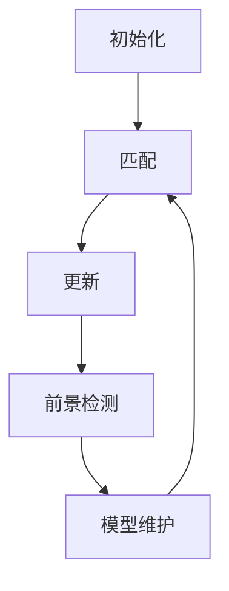
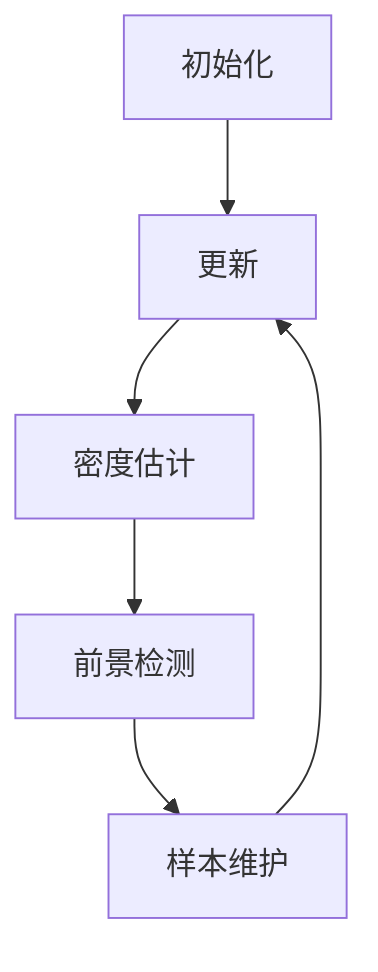
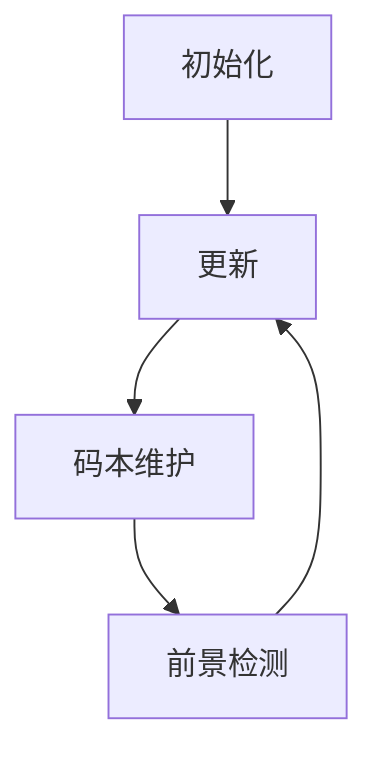

# 🌌背景建模：分离目标与背景的艺术

## 1.背景介绍

在计算机视觉和图像处理领域,背景建模是一个非常重要的任务。它旨在从复杂的视觉场景中分离出感兴趣的目标对象和背景区域。准确地分离目标和背景对于许多应用程序至关重要,例如视频监控、人机交互、增强现实等。

背景建模的挑战在于,背景通常是动态的、多变的,并且可能会受到光照变化、阴影、遮挡等因素的影响。此外,目标对象的形状、大小和运动也可能是高度多样化的。因此,设计一种鲁棒、高效的背景建模算法是一个具有挑战性的任务。

## 2.核心概念与联系

背景建模算法通常涉及以下几个核心概念:

1. **背景模型**:用于表示背景的数学模型或统计模型。常见的背景模型包括高斯混合模型(GMM)、核密度估计(KDE)、码本模型等。

2. **前景检测**:基于背景模型,将当前帧与背景模型进行比较,检测出前景(目标)像素。

3. **模型更新**:根据新的观测数据,不断更新背景模型以适应背景的变化。

4. **后处理**:对前景检测的结果进行后处理,如形态学操作、连通域分析等,以获得更好的目标分割结果。

这些概念相互关联,共同构成了完整的背景建模算法。其中,背景模型和模型更新是核心部分,直接影响算法的性能和鲁棒性。

## 3.核心算法原理具体操作步骤

### 3.1 高斯混合模型(GMM)

高斯混合模型是最广泛使用的背景建模算法之一。它将每个像素的背景建模为一个由多个高斯分布组成的混合模型。算法的具体步骤如下:

1. **初始化**:为每个像素初始化一个高斯分布,均值为当前像素值,较大的方差。

2. **匹配**:对于新的观测值,计算它与每个高斯分布的概率,并将其与最匹配的高斯分布相关联。

3. **更新**:根据新的观测值,更新相关联的高斯分布的参数(均值、方差、权重)。

4. **前景检测**:将与任何高斯分布的概率较低的观测值标记为前景。

5. **模型维护**:根据需要增加或删除高斯分布,以适应背景的变化。

GMM算法的优点是能够较好地处理缓慢的背景变化,但对于快速的背景变化或者周期性的背景变化,它的性能会下降。



### 3.2 核密度估计(KDE)

核密度估计是另一种流行的背景建模方法。它使用核函数(如高斯核)来估计每个像素的背景概率密度函数(PDF)。算法步骤如下:

1. **初始化**:为每个像素初始化一个空的样本集合。

2. **更新**:将新的观测值添加到相应像素的样本集合中。

3. **密度估计**:使用核函数对样本集合进行密度估计,获得背景PDF。

4. **前景检测**:将概率低于某个阈值的观测值标记为前景。

5. **样本维护**:根据需要从样本集合中删除旧的样本,以限制样本集合的大小。

KDE算法的优点是能够适应任意复杂的背景分布,但计算代价较高,并且对噪声较为敏感。



### 3.3 码本模型

码本模型是另一种常用的背景建模方法。它将背景建模为一组代码词(码字),每个码字代表一种可能的背景模式。算法步骤如下:

1. **初始化**:为每个像素初始化一个空的码本。

2. **更新**:将新的观测值与码本中的码字进行匹配,如果没有匹配的码字,则将其添加到码本中。

3. **码本维护**:根据需要从码本中删除旧的或者冗余的码字,以限制码本的大小。

4. **前景检测**:将与任何码字的距离较大的观测值标记为前景。

码本模型的优点是计算效率较高,但它对噪声敏感,并且需要合理设置码本的大小和更新策略。



## 4.数学模型和公式详细讲解举例说明

### 4.1 高斯混合模型(GMM)

在GMM算法中,每个像素的背景建模为一个由K个高斯分布组成的混合模型:

$$
P(X_t) = \sum_{i=1}^{K} \omega_{i,t} * \eta(X_t, \mu_{i,t}, \Sigma_{i,t})
$$

其中:
- $X_t$是时间t的像素观测值
- $K$是高斯分布的数量
- $\omega_{i,t}$是第i个高斯分布的权重,满足$\sum_{i=1}^{K} \omega_{i,t} = 1$
- $\eta(X_t, \mu_{i,t}, \Sigma_{i,t})$是第i个高斯分布的概率密度函数,具有均值$\mu_{i,t}$和协方差矩阵$\Sigma_{i,t}$

对于新的观测值$X_{t+1}$,我们计算它与每个高斯分布的概率:

$$
P(X_{t+1} | i) = \omega_{i,t} * \eta(X_{t+1}, \mu_{i,t}, \Sigma_{i,t})
$$

然后将$X_{t+1}$与概率最大的高斯分布相关联,并根据以下公式更新该高斯分布的参数:

$$
\mu_{i,t+1} = (1 - \rho) \mu_{i,t} + \rho X_{t+1} \\
\Sigma_{i,t+1} = (1 - \rho) \Sigma_{i,t} + \rho (X_{t+1} - \mu_{i,t+1})^T (X_{t+1} - \mu_{i,t+1}) \\
\omega_{i,t+1} = (1 - \alpha) \omega_{i,t} + \alpha M_{i,t+1}
$$

其中$\rho$和$\alpha$是学习率,用于控制模型的更新速度。$M_{i,t+1}$是一个指示函数,表示$X_{t+1}$是否与第i个高斯分布相关联。

如果$X_{t+1}$与任何高斯分布的概率都较低,则将其标记为前景。同时,我们需要根据需要增加或删除高斯分布,以适应背景的变化。

### 4.2 核密度估计(KDE)

在KDE算法中,每个像素的背景PDF通过核函数对样本集合进行密度估计得到:

$$
\hat{f}(x) = \frac{1}{N} \sum_{i=1}^{N} K(x - x_i)
$$

其中:
- $x$是当前像素值
- $x_i$是样本集合中的第i个样本
- $N$是样本集合的大小
- $K(\cdot)$是核函数,通常使用高斯核:$K(x) = \frac{1}{\sqrt{2\pi}\sigma} \exp(-\frac{x^2}{2\sigma^2})$

对于新的观测值$x_{t+1}$,我们计算它的背景概率:

$$
P(x_{t+1}) = \hat{f}(x_{t+1})
$$

如果$P(x_{t+1})$低于某个阈值,则将$x_{t+1}$标记为前景。同时,我们需要将$x_{t+1}$添加到样本集合中,并根据需要删除旧的样本,以限制样本集合的大小。

### 4.3 码本模型

在码本模型中,每个像素的背景建模为一组代码词(码字)$\{c_1, c_2, \dots, c_M\}$,其中$M$是码本的大小。

对于新的观测值$x_{t+1}$,我们计算它与每个码字的距离:

$$
d(x_{t+1}, c_i) = \|x_{t+1} - c_i\|
$$

如果存在一个码字$c_j$,使得$d(x_{t+1}, c_j) < \tau$($\tau$是距离阈值),则将$x_{t+1}$与$c_j$相关联。否则,将$x_{t+1}$标记为前景,并将其添加到码本中作为一个新的码字。

同时,我们需要根据需要从码本中删除旧的或者冗余的码字,以限制码本的大小。

## 5.项目实践:代码实例和详细解释说明

这里我们提供一个使用OpenCV实现的GMM背景建模算法的Python代码示例:

```python
import cv2
import numpy as np

# 初始化BackgroundSubtractorMOG2对象
bg_subtractor = cv2.createBackgroundSubtractorMOG2(history=500, varThreshold=16, detectShadows=True)

# 打开视频流
cap = cv2.VideoCapture('path/to/video.mp4')

while True:
    # 读取一帧
    ret, frame = cap.read()
    if not ret:
        break

    # 应用背景建模
    mask = bg_subtractor.apply(frame)

    # 进行形态学操作
    kernel = cv2.getStructuringElement(cv2.MORPH_ELLIPSE, (5, 5))
    mask = cv2.morphologyEx(mask, cv2.MORPH_OPEN, kernel)

    # 显示结果
    cv2.imshow('Frame', frame)
    cv2.imshow('Foreground Mask', mask)

    if cv2.waitKey(1) == ord('q'):
        break

cap.release()
cv2.destroyAllWindows()
```

在这个示例中,我们首先初始化`cv2.BackgroundSubtractorMOG2`对象,它是OpenCV中实现的GMM背景建模算法。我们可以设置一些参数,如`history`(用于控制背景模型的持续时间)、`varThreshold`(用于控制检测阈值)和`detectShadows`(用于检测阴影)。

然后,我们打开一个视频流,并在循环中读取每一帧。对于每一帧,我们调用`bg_subtractor.apply()`方法来应用背景建模,得到一个前景掩码。

接下来,我们对前景掩码进行形态学操作(这里使用开运算),以减少噪声和填补小洞。

最后,我们显示原始帧和前景掩码,并等待用户按下'q'键退出程序。

请注意,这只是一个简单的示例,在实际应用中,您可能需要进一步优化和调整算法参数,以获得更好的性能。

## 6.实际应用场景

背景建模技术在许多实际应用场景中发挥着重要作用,例如:

1. **视频监控**:通过背景建模可以检测出移动目标,用于安防监控、交通监控等。

2. **人机交互**:通过分离人体和背景,可以实现基于手势的人机交互系统。

3. **增强现实**:将虚拟对象准确地插入到真实场景中,需要先将目标和背景分离。

4. **视频编辑**:可以基于背景建模实现视频中的对象抠图、替换背景等编辑操作。

5. **智能视频分析**:背景建模是许多高级视频分析任务(如目标跟踪、行为识别等)的基础。

6. **医学图像处理**:在医学图像中,背景建模可用于分割感兴趣的器官或病灶区域。

7. **无人驾驶**:自动驾驶汽车需要准确检测道路上的行人、车辆等移动目标,背景建模是关键技术之一。

8. **视频编码**:通过只编码前景区域,可以提高视频编码的效率。

总的来说,背景建模技术广泛应用于需要从复杂视觉场景中分离目标对象的各种领域。

## 7.工具和资源推荐

在实现背景建模算法时,可以利用以下工具和资源:

1. **OpenCV**:一个开源的计算机视觉库,提供了多种背景建模算法的实现,如GMM、KDE等。

2. **BGSLibrary**:一个专门用于背景建模的开源库,包含了多种算