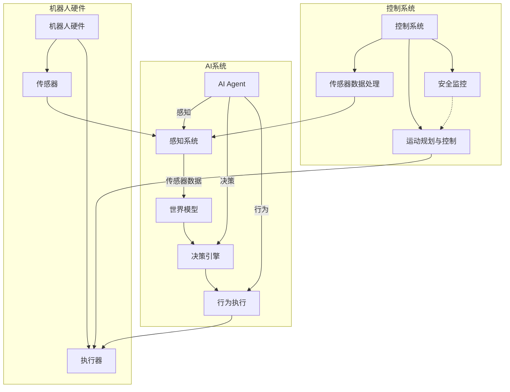

# AI Agent: AI的下一个风口 具身机器人的应用场景

## 1.背景介绍

### 1.1 人工智能发展历程

人工智能(Artificial Intelligence, AI)的发展经历了几个重要阶段。早期的AI系统主要集中在基于规则的系统和专家系统上,旨在模拟人类专家的决策过程。随后,机器学习和神经网络的出现,使AI系统能够从数据中自动学习模式和规律,这极大推动了AI在诸多领域的应用。

近年来,深度学习技术的兴起,使得AI系统在计算机视觉、自然语言处理等领域取得了突破性进展。然而,这些AI系统大多局限于狭义人工智能,即只能在特定任务上表现出人类级别的智能,缺乏通用智能和情景理解能力。

### 1.2 具身智能的兴起

为了实现通用人工智能,研究人员开始关注具身智能(Embodied AI)的概念。具身智能旨在让AI系统拥有类似人类的身体存在,能够感知和交互with实体世界,从而获得更丰富的情景理解能力。

具身智能的核心是AI Agent,即拥有感知、决策和行为能力的智能体。AI Agent通过传感器获取环境信息,并基于内部模型和算法做出决策,进而通过执行器(如机器人手臂)与外部世界互动。

### 1.3 具身机器人的重要性

具身机器人是具身智能的重要载体,它们集成了AI Agent、机器人硬件和控制系统。相比于纯软件AI系统,具身机器人能够更自然地融入现实世界,在诸多领域发挥重要作用,如:

- 服务机器人:为人类提供家居服务、医疗护理等
- 工业机器人:自动化生产、物流运输等
- 探索机器人:执行危险作业、太空探索等
- 社交机器人:与人类进行自然交互

总的来说,具身机器人有望成为AI发展的下一个风口,推动人工智能向通用智能的方向发展。

## 2.核心概念与联系

### 2.1 AI Agent

AI Agent是具身智能系统的核心,是一种拥有感知、决策和行为能力的智能体。AI Agent通过传感器获取环境信息,基于内部模型和算法做出决策,并通过执行器与外部世界互动。

AI Agent的关键组成部分包括:

- 感知系统:获取环境信息,如视觉、听觉、触觉等
- 世界模型:表示对环境状态的理解
- 决策引擎:根据感知信息和世界模型,规划行为策略
- 行为执行:通过执行器(如机器人手臂)执行规划的行为

### 2.2 机器人硬件

机器人硬件为AI Agent提供了物理实体,使其能够真正与现实世界交互。机器人硬件通常包括:

- 机身结构:提供机器人的机械支撑和运动能力
- 传感器:视觉、声学、触觉等传感器,用于环境感知
- 执行器:如机械手臂、轮式或足式运动机构等,用于执行行为
- 计算硬件:运行AI算法和控制系统的计算平台

### 2.3 控制系统

控制系统是连接AI Agent和机器人硬件的桥梁,负责协调两者的交互。控制系统的主要功能包括:

- 传感器数据处理:对原始传感器数据进行滤波、融合等处理
- 运动规划与控制:根据AI Agent的决策,规划和控制机器人的运动
- 安全监控:监测机器人状态,确保运行安全

### 2.4 系统集成

具身机器人系统需要将AI Agent、机器人硬件和控制系统紧密集成,形成一个高度协调的整体。系统集成需要解决诸多挑战,如:

- 硬件抽象层:屏蔽底层硬件细节,为AI Agent提供统一接口
- 实时性:确保AI Agent的决策能够实时反映到机器人行为上
- 鲁棒性:应对环境变化和硬件故障等不确定因素

总的来说,AI Agent、机器人硬件和控制系统是具身机器人系统的三大核心组成部分,它们的紧密集成是实现高效具身智能的关键。

## 3.核心算法原理具体操作步骤

### 3.1 感知系统

感知系统负责从各种传感器获取环境信息,并对原始数据进行处理,为AI Agent提供可用的环境表示。主要算法包括:

#### 3.1.1 计算机视觉

1) 图像预处理:降噪、增强、校正等,提高图像质量
2) 特征提取:提取图像的边缘、角点、纹理等特征
3) 目标检测:基于深度学习模型(如Faster R-CNN)检测图像中的目标
4) 语义分割:对图像中的每个像素进行语义标注
5) 三维重建:从多视角图像重建三维场景

#### 3.1.2 声学感知

1) 声音检测:检测声音事件及其发生时间
2) 语音识别:将语音转录为文本
3) 声源定位:利用多传感器阵列定位声源位置
4) 语音分离:从混合信号中分离出不同声源

#### 3.1.3 触觉感知

1) 接触检测:检测机器人与物体的接触情况
2) 力/力矩估计:估计作用在机器人上的力和力矩
3) 滑移检测:检测机器人与物体之间是否发生滑移
4) 材料识别:通过触觉信号识别物体材质

#### 3.1.4 多模态融合

1) 时间同步:对不同模态的传感器数据进行时间同步
2) 特征级融合:将不同模态的特征进行融合
3) 决策级融合:将不同模态的检测/识别结果进行融合

### 3.2 世界模型

世界模型是AI Agent对环境状态的内部表示,是决策的基础。主要算法包括:

#### 3.2.1 场景表示

1) 基于网格:将环境离散化为二维/三维网格
2) 基于特征:使用点云等表示场景的几何和语义特征  
3) 层次表示:将场景分解为不同层次的元素(房间、物体等)
4) 动态更新:根据新的感知信息,不断更新场景表示

#### 3.2.2 物理模型

1) 刚体动力学:模拟刚体在各种作用力下的运动
2) 变形建模:模拟柔性物体的形变过程
3) 流体动力学:模拟液体和气体的流动
4) 碰撞检测:快速检测物体之间是否发生碰撞

#### 3.2.3 上下文建模

1) 语义理解:对场景中的元素进行语义标注
2) 因果推理:推理事物之间的因果关系
3) 规则提取:从数据中学习场景的隐式规则
4) 状态估计:估计当前场景的状态(如人的意图)

### 3.3 决策引擎

决策引擎根据感知信息和世界模型,规划行为策略。主要算法包括:

#### 3.3.1 规划算法  

1) 路径规划:计算机器人在环境中的最优运动路径
2) 动作规划:规划一系列动作以完成特定任务
3) 任务规划:将复杂任务分解为子任务,并安排执行顺序
4) 运动规划:计算机器人关节的精确运动轨迹

#### 3.3.2 决策理论

1) 马尔可夫决策过程:在不确定环境下做出最优决策
2) 多智能体决策:协调多个AI Agent的行为
3) 逆强化学习:从示例行为中学习决策策略
4) 人机决策:将人类决策纳入AI决策流程

#### 3.3.3 目标推理

1) 目标建模:对人类或其他智能体的目标进行建模
2) 意图识别:推断出智能体当前的意图和目的
3) 博弈论:分析多个智能体之间的对策行为

### 3.4 行为执行

行为执行模块负责将决策引擎的输出转化为机器人的实际动作。主要算法包括:

#### 3.4.1 运动控制

1) 逆运动学:计算机器人关节角度以实现期望的末端位姿
2) 轨迹插补:生成连续的关节运动轨迹
3) 伺服控制:精确控制每个关节的运动
4) 阻抗控制:调节机器人在受力时的运动响应

#### 3.4.2 机器人操作

1) 抓取规划:计算夹持物体的最佳手臂姿态和力矩
2) 操作规划:规划一系列动作以操作特定物体
3) 机器人视觉伺服:基于视觉反馈闭环控制机器人运动
4) 力觉伺服:基于力/力矩反馈控制机器人运动

#### 3.4.3 人机交互

1) 自然语言交互:与人类进行自然语言对话
2) 手势识别:识别和理解人类手势指令  
3) 表情识别:识别和理解人类面部表情
4) 社交行为生成:生成自然、富有表现力的社交行为

## 4.数学模型和公式详细讲解举例说明

### 4.1 计算机视觉模型

#### 4.1.1 卷积神经网络

卷积神经网络(Convolutional Neural Network, CNN)是计算机视觉领域广泛使用的深度学习模型。CNN由卷积层、池化层和全连接层组成,能够自动从图像数据中学习特征表示。

卷积层的计算过程可以表示为:

$$
y_{ij}^l = f\left(\sum_{m}\sum_{p=0}^{P_l-1}\sum_{q=0}^{Q_l-1}w_{pq}^{lm}x_{i+p,j+q}^{l-1} + b_m^l\right)
$$

其中:
- $x_i^l$是第l层的输入特征图
- $y_i^l$是第l层的输出特征图
- $w_{pq}^{lm}$是第l层第m个卷积核在位置(p,q)处的权重
- $b_m^l$是第l层第m个卷积核的偏置
- $P_l, Q_l$分别是第l层卷积核的高度和宽度
- $f$是激活函数,如ReLU函数

池化层通过下采样操作,提取输入特征图中的最大值或均值,从而实现了一定程度的平移不变性和对小扰动的鲁棒性。

全连接层则将前面卷积层和池化层学习到的高级特征映射到最终的分类或回归输出。

通过反向传播算法对CNN的参数进行训练,可以学习出对目标任务(如图像分类、目标检测等)有效的特征表示和分类器。

#### 4.1.2 生成对抗网络

生成对抗网络(Generative Adversarial Network, GAN)是一种用于生成式建模的深度学习框架,可以从噪声分布生成逼真的图像数据。

GAN由生成器(Generator)G和判别器(Discriminator)D两个对抗的神经网络组成。生成器G从噪声z中生成假样本G(z),旨在欺骗判别器;而判别器D则努力区分生成样本G(z)和真实样本x,目标是最大化判别准确率。

生成器G和判别器D的损失函数可以表示为:

$$
\begin{aligned}
\min_G\max_DV(D,G) &= \mathbb{E}_{x\sim p_{data}(x)}[\log D(