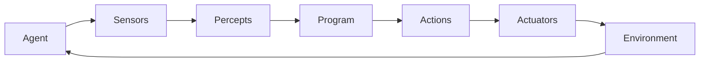
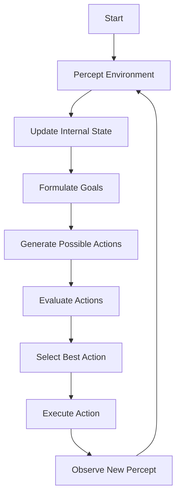

# AI Agent: AI的下一个风口 如何改变用户体验

## 1. 背景介绍

### 1.1 人工智能的发展历程

人工智能(Artificial Intelligence, AI)的概念可以追溯到20世纪50年代,当时一群先驱者提出了"赋予机器智能"的想法。自那时起,AI经历了几个重要的发展阶段:

- 1950年代:AI的雏形出现,主要集中在游戏、数学推理和神经网络等领域。
- 1960-1970年代:专家系统和知识表示成为研究热点。
- 1980-1990年代:机器学习、神经网络等技术取得突破。
- 2000年后:深度学习、大数据和云计算的兴起推动AI进入新的发展时期。

随着算力、数据和算法的不断进步,AI已经渗透到我们生活的方方面面,改变着人类的工作和生活方式。

### 1.2 AI Agent的兴起

在AI的发展过程中,Agent技术作为一种新兴的人工智能范式逐渐引起广泛关注。AI Agent是指具有一定自主性、可以感知环境、做出决策并采取行动的智能软件实体。

Agent技术的核心思想是赋予计算机系统某种程度的智能,使其能够代表用户执行特定任务,并与用户及其他Agent进行交互协作。这种新型人机交互模式有望彻底改变传统的用户体验。

## 2. 核心概念与联系  

### 2.1 AI Agent的定义

AI Agent可以形式化定义为:一个感知环境的实体,能够在该环境中持续地执行动作以实现设计目标。更具体地说,AI Agent由以下几个核心组件构成:

- **感知器(Sensors)**: 用于获取环境信息的输入接口。
- **执行器(Actuators)**: 用于对环境作出反应的输出接口。  
- **程序(Program)**: 根据感知信息做出决策,控制执行器对环境作出响应的核心算法。

AI Agent与环境之间是一个持续的感知-决策-行动循环过程,如下面的Mermaid流程图所示:



### 2.2 AI Agent的分类

根据程序的不同,AI Agent可以分为以下几种类型:

- **简单反射Agent**: 只根据当前感知作出反应,没有其他历史信息。
- **基于模型的Agent**: 利用环境模型进行规划和决策。
- **基于目标的Agent**: 根据设定目标制定行为序列。
- **基于效用的Agent**: 根据预期效用最大化做出决策。
- **学习Agent**: 能够从经验中学习,改进自身的决策过程。

### 2.3 AI Agent与传统系统的区别

与传统的软件系统相比,AI Agent具有以下几个显著特点:

- **自主性**: 能够根据环境变化自主做出决策和行为调整。
- **主动性**: 不需要人为干预,可以主动采取行动完成任务。
- **持续性**: 与环境保持持续的交互,而非一次性计算。
- **智能性**: 具备一定的学习、推理和决策能力。
- **社交性**: 能够与人类用户及其他Agent进行协作。

这些特性使得AI Agent在很多应用场景下比传统系统更加灵活和高效。

## 3. 核心算法原理具体操作步骤

不同类型的AI Agent所采用的核心算法各不相同,但是它们都遵循一个基本的决策循环过程。以下是一个通用的AI Agent决策过程:



1. **感知环境(Percept Environment)**: Agent通过感知器获取环境的当前状态信息。

2. **更新内部状态(Update Internal State)**: 将新获得的感知信息与Agent的内部状态进行融合,形成对环境的整体认知。

3. **制定目标(Formulate Goals)**: 根据设计目标和当前状态,确定Agent需要完成的具体任务。

4. **生成可能动作(Generate Possible Actions)**: 列出在当前状态下Agent可以采取的所有可能动作。

5. **评估动作(Evaluate Actions)**: 对每个可能动作进行评估,估算其对完成目标的效用值。

6. **选择最佳动作(Select Best Action)**: 从可能动作中选择效用值最大的动作作为本次决策的结果。

7. **执行动作(Execute Action)**: 通过执行器对环境实施选定的动作。

8. **观察新感知(Observe New Percept)**: 动作执行后,获取环境的新状态感知,并重复上述过程。

不同类型的Agent在具体实现上会有所差异,但整体上都遵循这个基本框架。下面将介绍几种常见Agent类型的核心算法思路。

### 3.1 简单反射Agent

简单反射Agent是最基本的Agent类型,它只根据当前的感知信息作出反射性反应,没有任何历史数据或环境模型。其核心算法可以用一个条件-动作规则来表示:

$$
\textrm{Action} = R(P) 
$$

其中,P表示当前感知,R是一个条件-动作规则映射函数,根据感知输出对应的动作。这种Agent通常用于一些反应性很强的场景,如机器人避障等。

### 3.2 基于模型的Agent

基于模型的Agent利用了对环境的模型知识,可以进行状态预测和规划。其核心算法可以概括为:

1. 使用感知信息更新环境状态S。
2. 生成可能的动作序列。
3. 对每个动作序列,基于环境模型预测其导致的状态序列。
4. 根据目标函数(如最短路径等)评估每个状态序列,选择评估值最优的动作序列执行。

这种Agent需要对环境建模,模型的精确性直接影响了Agent的决策效果。常见的建模方法有扩展卡尔曼滤波、马尔可夫决策过程等。

### 3.3 基于目标的Agent

基于目标的Agent将任务目标形式化为一个或多个需要达成的条件,然后搜索能够达成这些条件的动作序列。其核心算法可以用如下伪代码表示:

```python
def Goal_Based_Agent(percept):
    state = update_state(state, percept)
    goal = formulate_goal(state)
    action = plan(state, goal)
    return action
```

其中,plan函数根据当前状态和目标条件,搜索能够达成目标的一系列动作。常用的搜索算法包括A*、STRIPS等。这种Agent适用于目标明确、环境有限的情况。

### 3.4 基于效用的Agent

基于效用的Agent旨在最大化某种预期效用函数,通常用于决策过程中需要权衡多个因素的情况。其核心算法可以概括为:

1. 使用感知信息更新环境状态S。
2. 对每个可能的动作序列a,计算其期望效用值:
   $$EU(a) = \sum_{s'} P(s'|s,a)U(s')$$
   其中,P(s'|s,a)是执行动作a从状态s转移到s'的概率,U(s')是s'状态的效用值。
3. 选择期望效用值最大的动作序列执行。

这种Agent需要定义合理的效用函数,并对状态转移概率进行建模,常用的方法有马尔可夫决策过程、蒙特卡罗树搜索等。

### 3.5 学习Agent

学习Agent能够从过往经验中积累知识,不断优化自身的决策过程。常见的学习算法包括:

- **监督学习**: 从标注的训练数据中学习映射规则,如决策树、支持向量机等。
- **非监督学习**: 在无标注数据的情况下发现数据内在模式,如聚类、关联规则挖掘等。
- **强化学习**: 通过反复试错并获得反馈,学习在特定环境中获取最大累积奖励的策略,如Q-Learning、策略梯度等。
- **深度学习**: 利用多层神经网络自动从数据中提取特征,在计算机视觉、自然语言处理等领域表现优异。

学习是赋予Agent智能的关键,通过学习,Agent可以不断提高自身的决策水平,适应复杂多变的环境。

## 4. 数学模型和公式详细讲解举例说明

在AI Agent的设计和实现中,数学模型和公式扮演着重要角色。以下是一些常见的数学模型及其在Agent中的应用。

### 4.1 马尔可夫决策过程(MDP)

马尔可夫决策过程是描述Agent与环境交互的重要数学框架。一个MDP可以用一个四元组(S, A, P, R)来表示:

- S是环境的状态集合
- A是Agent可执行的动作集合
- P是状态转移概率,P(s'|s,a)表示从状态s执行动作a转移到状态s'的概率
- R是奖励函数,R(s,a,s')表示从状态s执行动作a转移到s'获得的即时奖励

Agent的目标是找到一个策略π:S→A,使得期望的累积奖励最大化:

$$
\max_\pi E\left[ \sum_{t=0}^\infty \gamma^t R(s_t, a_t, s_{t+1}) \right]
$$

其中,γ∈[0,1]是折现因子,用于权衡即时奖励和长期奖励。

MDP为Agent提供了一个通用的决策框架,可以用于规划、强化学习等多种算法。

### 4.2 贝叶斯网络

贝叶斯网络是一种概率图模型,用于表示随机变量之间的条件独立性和因果关系。它由一组节点(表示随机变量)和有向边(表示条件依赖关系)组成。

在AI Agent中,贝叶斯网络常用于状态估计和预测。例如,一个自动驾驶汽车Agent可以使用贝叶斯网络对路况、车辆状态和行人行为等多个因素进行建模,并基于观测数据对车辆下一步的运动状态进行推断。

贝叶斯网络遵循贝叶斯公式:

$$
P(X|Y) = \frac{P(Y|X)P(X)}{P(Y)}
$$

通过网络结构捕获变量间的条件独立性,可以高效地计算联合概率分布,是Agent进行概率推理的有力工具。

### 4.3 马尔可夫链

马尔可夫链是一种描述随机过程的数学模型,它具有"无后效性",即下一状态的条件概率分布只与当前状态有关,与过去状态无关。

$$
P(X_{n+1}=x|X_n=x_n, X_{n-1}=x_{n-1}, \ldots, X_0=x_0) = P(X_{n+1}=x|X_n=x_n)
$$

马尔可夫链广泛应用于自然语言处理、推荐系统等领域。例如,在语言模型中,可以将文本看作是一个马尔可夫链,其中每个状态是一个单词,转移概率则是该单词在给定前一单词的条件概率。

通过构建马尔可夫链模型并估计其参数,Agent可以对序列数据(如文本、音频等)进行生成和预测。

### 4.4 蒙特卡罗树搜索(MCTS)

蒙特卡罗树搜索是一种有效的启发式决策算法,常用于具有大规模搜索空间的问题,如国际象棋、围棋等游戏。

MCTS将可能的动作序列建模为一棵树,每个节点表示一个状态,边表示动作。算法通过反复模拟,不断更新每个节点的访问次数和评估值,最终选择评估值最高的动作执行。

具体来说,MCTS由四个基本步骤组成:

1. **选择(Selection)**: 从根节点出发,递归地选择评估值最高的子节点,直到遇到未探索的节点。
2. **扩展(Expansion)**: 为未探索节点添加一个或多个子节点。
3. **模拟(Simulation)**: 从新节点出发,随机模拟后续动作序列直到终止,获得最终评估值