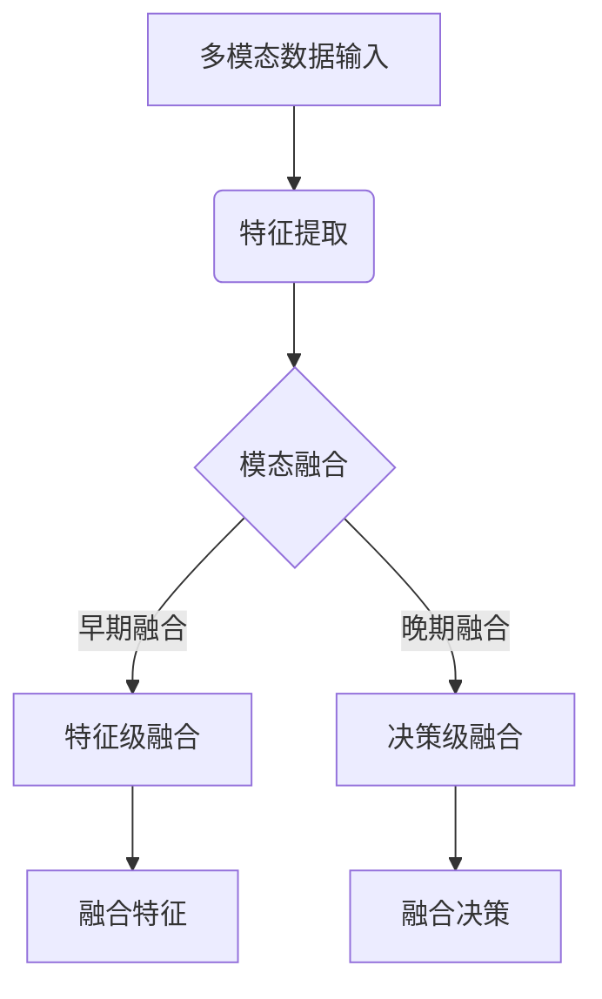
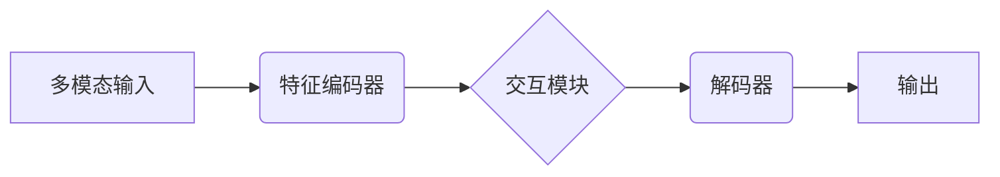
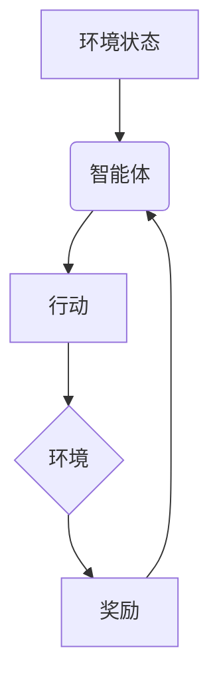
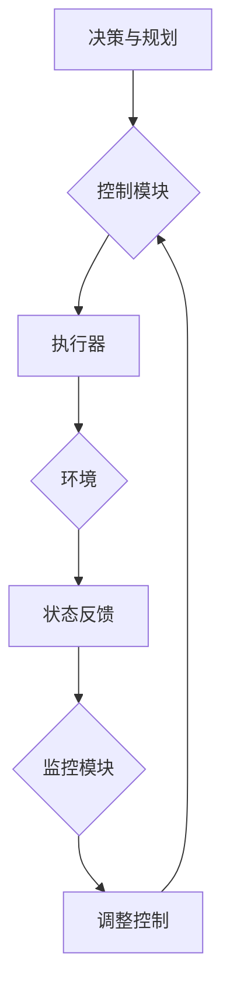

# AI Agent: AI的下一个风口 感知和解析环境与自主决策

## 1.背景介绍

### 1.1 人工智能的发展历程

人工智能(Artificial Intelligence, AI)是当代科技发展的核心驱动力之一,已经渗透到我们生活的方方面面。从20世纪50年代AI概念的提出,到今天深度学习、强化学习等技术的飞速发展,AI已经取得了令人瞩目的进步。

### 1.2 AI Agent的重要性

在人工智能的大背景下,AI Agent(智能代理)作为连接现实世界与AI系统的桥梁,扮演着至关重要的角色。AI Agent需要感知并解析复杂的环境信息,并基于这些信息自主做出明智的决策和行动。

### 1.3 AI Agent的挑战

然而,构建高度智能化的AI Agent并非易事。它需要解决多个层面的挑战:

- 感知层面:如何高效获取环境多模态信息(视觉、语音、文本等)
- 理解层面:如何深入解析这些信息的语义
- 决策层面:如何基于理解做出明智的判断和规划
- 行动层面:如何将决策高效地转化为行动

只有突破这些关键挑战,AI Agent才能发挥其潜力,推动人工智能的下一个飞跃。

## 2.核心概念与联系

### 2.1 AI Agent的定义

AI Agent是一种能够感知环境、处理复杂信息、自主做出决策并采取行动的智能系统。它是连接现实世界与AI系统的桥梁,扮演着关键角色。

### 2.2 AI Agent的核心能力

一个高度智能化的AI Agent应当具备以下三大核心能力:

1. **环境感知与理解能力**
   - 多模态信息感知(视觉、语音、文本等)
   - 信息深度解析(语义理解、知识表示等)

2. **自主决策与规划能力**  
   - 基于环境理解做出明智决策
   - 制定行动计划实现既定目标

3. **高效行动执行能力**
   - 将决策与规划转化为实际行动  
   - 动态调整以适应环境变化

这三大能力相互关联、环环相扣,缺一不可。只有全面提升这些核心能力,AI Agent才能发挥最大潜力。

### 2.3 AI Agent与其他AI系统的关系

AI Agent并非是一个独立的AI系统,而是多种AI技术的融合与集成。例如:

- 计算机视觉为感知环境提供支持
- 自然语言处理赋予理解语义的能力  
- 机器学习算法支撑决策与规划
- 控制与规划技术指导行动执行

AI Agent将这些技术有机结合,形成一个智能化的整体,是AI系统在现实世界中的具体体现和应用。

## 3.核心算法原理具体操作步骤

构建高度智能的AI Agent需要多种算法技术的支撑,包括但不限于以下几个方面:

### 3.1 多模态感知与融合



1. **多模态数据输入**:获取视觉、语音、文本等多种模态的环境数据
2. **特征提取**:对每种模态数据分别提取特征表示
3. **模态融合**:
   - 早期融合(特征级):在特征层面对多模态特征进行融合
   - 晚期融合(决策级):在决策层面对来自各模态的结果进行融合
4. **融合特征/决策**:生成融合后的特征表示或决策结果

### 3.2 端到端感知与理解



1. **多模态输入**:输入视觉、语音、文本等多模态数据
2. **特征编码器**:提取每种模态的特征表示
3. **交互模块**:
   - 自注意力机制捕获模态内部特征关系
   - 跨模态注意力捕获模态间关联
4. **解码器**:融合编码特征,生成对应的输出(如:分类、检测、识别等)

### 3.3 强化学习决策与规划



1. **环境状态**:获取当前环境的状态信息
2. **智能体**:根据状态选择行动策略
3. **行动**:执行相应的行动
4. **环境**:环境根据行动产生新的状态和奖励反馈
5. **奖励**:奖励信号指导智能体优化策略

通过不断尝试、反馈与学习,智能体可以获得最优的决策与规划策略。

### 3.4 行动执行与控制



1. **决策与规划**:输入期望的决策与行动计划
2. **控制模块**:生成控制指令并发送给执行器
3. **执行器**:执行实际的行动
4. **环境**:行动作用于环境并产生新的状态
5. **状态反馈**:获取行动后环境的新状态
6. **监控模块**:监控状态与计划的偏差
7. **调整控制**:根据偏差调整控制策略

这种闭环控制可确保行动的高效执行和对环境变化的适应性。

## 4.数学模型和公式详细讲解举例说明

构建智能AI Agent需要多种数学模型的支持,下面将详细介绍其中的几种关键模型。

### 4.1 多模态融合模型

多模态融合是AI Agent感知与理解的关键环节。一种常用的融合模型是基于门控循环单元(Gated Recurrent Unit, GRU)的多模态融合网络。

给定视觉模态特征$x_v$、语音模态特征$x_a$和文本模态特征$x_t$,其融合过程如下:

$$
\begin{aligned}
h_v^t &= \text{GRU}(x_v^t, h_v^{t-1})\\
h_a^t &= \text{GRU}(x_a^t, h_a^{t-1})\\
h_t^t &= \text{GRU}(x_t^t, h_t^{t-1})\\
h^t &= h_v^t \oplus h_a^t \oplus h_t^t
\end{aligned}
$$

其中$\oplus$表示特征拼接操作。通过GRU编码每一模态的时序特征,并将它们拼接得到融合特征表示$h^t$。

在实际应用中,我们可以根据任务需求选择不同的融合策略(如加权求和等)。

### 4.2 注意力模型

注意力机制是AI Agent理解复杂信息的关键。以视觉注意力为例,我们可以使用类似的Transformer Encoder结构:

$$
\begin{aligned}
Q &= X_qW_q\\
K &= X_kW_k\\
V &= X_vW_v\\
\text{Attention}(Q, K, V) &= \text{softmax}(\frac{QK^T}{\sqrt{d_k}})V
\end{aligned}
$$

其中$X_q$、$X_k$、$X_v$分别表示查询(Query)、键(Key)和值(Value)的特征输入。通过计算查询与键的相似性,我们可以获得每个值特征对应的注意力权重,并据此组合出注意力加权的特征表示。

对于更复杂的跨模态注意力,我们可以使用类似的多头注意力机制,从而学习到更丰富的模态间关联信息。

### 4.3 强化学习模型

强化学习是AI Agent自主决策与规划的重要手段。一种常用的强化学习模型是基于深度Q网络(Deep Q-Network, DQN)的Q-Learning算法。

在DQN中,我们使用一个深度神经网络$Q(s, a; \theta)$来估计在状态$s$下执行行动$a$的长期回报(Q值)。该网络的目标是最小化真实Q值与预测Q值之间的均方误差:

$$
L(\theta) = \mathbb{E}_{(s, a, r, s')\sim D}\left[(Q(s, a; \theta) - y)^2\right]
$$

其中$y = r + \gamma \max_{a'}Q(s', a'; \theta^-)$是基于下一状态$s'$的目标Q值,使用了目标网络$\theta^-$进行估计以确保收敛性。

通过不断优化该损失函数,我们可以获得一个近似最优的Q值函数,指导智能体做出明智的行动选择。

### 4.4 控制与规划模型

行动执行与控制是AI Agent闭环的关键环节。一种常用的控制模型是基于线性二次调节器(Linear Quadratic Regulator, LQR)的最优控制理论。

在LQR中,我们旨在最小化一个代价函数:

$$
J = \sum_{t=0}^{\infty} x_t^TQx_t + u_t^TRu_t
$$

其中$x_t$和$u_t$分别表示时刻$t$的系统状态和控制输入,$Q$和$R$是相应的代价矩阵。

通过求解一个离散代数里克方程(Discrete Algebraic Riccati Equation, DARE):

$$
P = Q + A^TPA - (A^TPB)(R + B^TPB)^{-1}(B^TPA)
$$

我们可以获得一个状态反馈控制律:

$$
u_t = -Kx_t = -(R + B^TPB)^{-1}B^TPAx_t
$$

该控制律可以使代价函数$J$最小化,从而实现对系统的最优控制。

以上仅是AI Agent中一些核心模型的示例,在实际应用中还有许多其他模型可以使用,需要根据具体任务和场景进行选择和设计。

## 5.项目实践:代码实例和详细解释说明

为了更好地理解AI Agent的工作原理,我们将通过一个具体的项目实践来演示其中的关键技术。该项目旨在构建一个视觉导航智能体,能够在模拟的3D环境中自主导航并完成指定任务。

### 5.1 环境设置

我们使用了AI2-THOR环境模拟器,它提供了逼真的3D室内场景和丰富的交互接口。智能体的目标是根据给定的语言指令,在场景中找到并移动到指定的目标物体。

例如,一条指令可能是"去厨房,把苹果放在餐桌上"。智能体需要理解这条指令的语义,并相应地导航到厨房、找到苹果、把它移动到餐桌。

### 5.2 感知与理解模块

```python
import torch
import torch.nn as nn

class PerceptionModule(nn.Module):
    def __init__(self):
        super(PerceptionModule, self).__init__()
        # 视觉编码器
        self.vision_encoder = ...
        # 语言编码器 
        self.language_encoder = ...
        # 多模态融合模块
        self.fusion_module = ...
        
    def forward(self, vision_input, language_input):
        # 编码视觉和语言特征
        vision_features = self.vision_encoder(vision_input)
        language_features = self.language_encoder(language_input)
        
        # 多模态融合
        fused_features = self.fusion_module(vision_features, language_features)
        
        return fused_features
```

上面是感知与理解模块的简化代码示例。它包括:

1. **视觉编码器**:使用CNN等模型从环境图像中提取视觉特征
2. **语言编码器**:使用RNN或Transformer等模型从指令文本中提取语义特征
3. **多模态融合模块**:将视觉和语言特征进行融合,生成多模态融合特征

这些融合特征将被送入后续的决策与规划模块,指导智能体的行为。

### 5.3 决策与规划模块

```python
import torch
import torch.nn as nn

class PolicyModule(nn.Module):
    def __init__(self):
        super(PolicyModule, self).__init__()
        self.state_encoder = ...
        self.policy_network = ...
        
    def