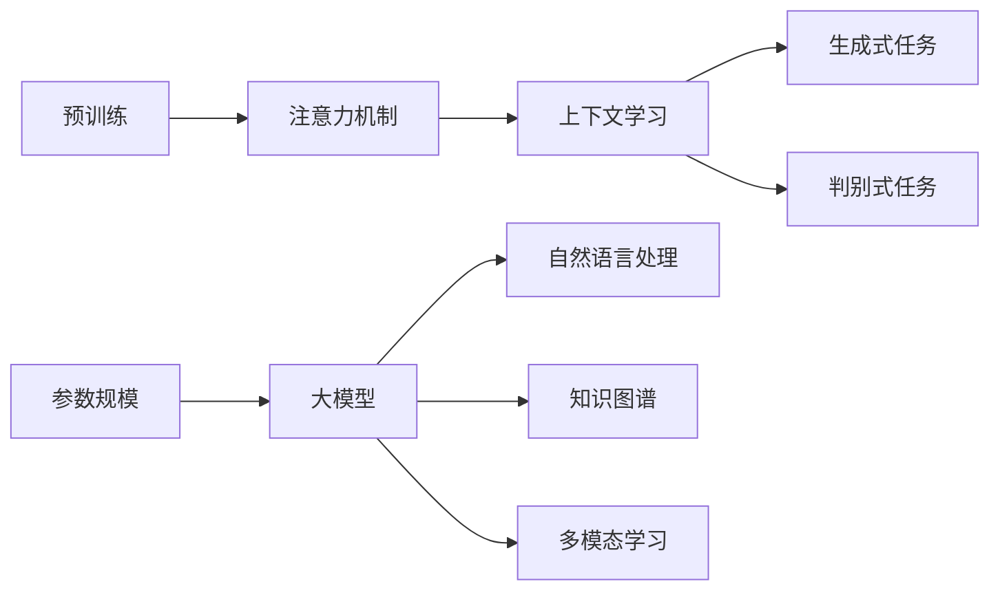
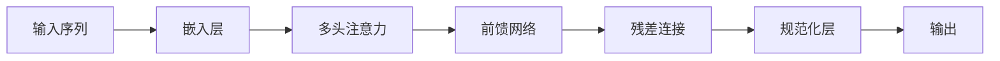
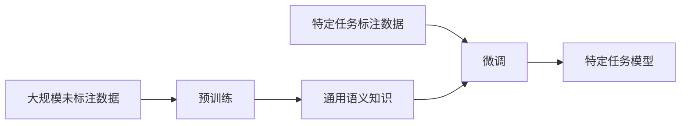

# AI LLM人工智能大模型介绍：走向智能的下一步

## 1.背景介绍

### 1.1 人工智能的发展历程

人工智能(Artificial Intelligence, AI)是一个旨在使机器能够模仿人类智能行为的广阔领域。自20世纪50年代问世以来,AI经历了几个重要的发展阶段。

- 早期阶段(1950s-1960s):专家系统、博弈理论等奠基性工作。
- 知识浪潮(1970s-1980s):发展知识库、逻辑推理等技术。
- 机器学习时代(1990s-2010s):神经网络、支持向量机等算法兴起。
- 深度学习浪潮(2010s-今):卷积神经网络、递归神经网络等深度模型取得突破。

### 1.2 大模型的兴起

近年来,AI发展进入了一个新的阶段——大模型时代。大模型(Large Language Model,LLM)是一种基于海量数据训练的巨大神经网络模型,具备强大的自然语言理解和生成能力。

大模型的兴起主要得益于三个关键因素:

1. **算力提升**:GPU/TPU等算力的飞速增长,使得训练大规模模型成为可能。
2. **数据量激增**:互联网时代海量文本数据的积累,为训练大模型提供了基础。
3. **算法创新**:Transformer等注意力机制模型架构的提出,极大提高了模型性能。

### 1.3 大模型的典型代表

目前,一些知名的大模型代表包括:

- **GPT系列**(OpenAI):GPT-3拥有1750亿参数,展现出惊人的文本生成能力。
- **LaMDA**(Google):被称为"对话式AI",擅长多轮对话交互。
- **PanGu-Alpha**(百度):中文预训练大模型,参数高达2000亿。
- **Megatron-Turing NLG**(微软):具备跨模态能力,可生成图像和文本。

大模型在自然语言处理、对话系统、问答系统等领域展现出卓越的性能,引发了学术界和工业界的广泛关注。

## 2.核心概念与联系

### 2.1 大模型的核心概念

要理解大模型,需要掌握以下几个核心概念:

1. **预训练**(Pre-training):使用自监督学习方式在大量未标注数据上预先训练模型参数,获取通用语义知识。

2. **微调**(Fine-tuning):在特定任务的标注数据上对预训练模型进行进一步训练,使其适应特定场景。

3. **注意力机制**(Attention Mechanism):Transformer模型架构的核心,能自动捕捉输入序列中不同位置元素之间的相关性。

4. **上下文学习**(Contextual Learning):通过上下文信息来理解单词或短语的语义,提高语义理解能力。

5. **生成式任务**(Generative Task):模型需要生成新的文本序列,如机器翻译、文本摘要等。

6. **判别式任务**(Discriminative Task):模型需要对给定输入做出判断或分类,如情感分析、命名实体识别等。

7. **参数规模**(Parameter Scale):模型参数量的大小,通常越大参数量,模型性能越强。

### 2.2 大模型与其他AI技术的联系

大模型并非是一个孤立的技术,它与其他AI技术存在密切联系:

- **机器学习**:大模型本质上是一种基于数据训练的机器学习模型。
- **深度学习**:大模型采用了深度神经网络结构,如Transformer等。
- **自然语言处理**:大模型主要应用于NLP任务,如文本生成、机器翻译等。
- **知识图谱**:大模型可与知识图谱相结合,提升语义理解和推理能力。
- **多模态学习**:一些大模型具备跨模态能力,可处理文本、图像、视频等多种模态数据。

大模型的发展离不开这些相关技术的支撑,同时也为这些领域带来新的机遇和挑战。



## 3.核心算法原理具体操作步骤

### 3.1 Transformer模型架构

Transformer是大模型中广泛采用的一种模型架构,其核心在于完全基于注意力机制,摒弃了传统的RNN和CNN结构。Transformer的主要组成部分包括:

1. **嵌入层**(Embedding Layer):将输入的单词映射为向量表示。

2. **多头注意力机制**(Multi-Head Attention):捕捉输入序列中元素之间的相关性。

3. **前馈神经网络**(Feed-Forward Network):对注意力输出进行非线性变换。

4. **规范化层**(Normalization Layer):加速训练收敛,提高模型性能。

5. **残差连接**(Residual Connection):防止信息丢失,增强梯度传播。

Transformer的运作过程大致如下:

1. 输入序列通过嵌入层获得向量表示。
2. 向量序列通过多头注意力机制捕捉元素间关系。
3. 注意力输出通过前馈网络进行非线性变换。
4. 变换输出与输入相加,形成残差连接。
5. 残差输出通过规范化层,得到最终输出。
6. 输出可用于下游任务,如生成、分类等。



### 3.2 预训练-微调范式

大模型通常采用"预训练-微调"的两阶段训练范式:

1. **预训练阶段**:
    - 目标:在大量未标注数据上学习通用语义知识。
    - 方法:使用自监督学习目标,如掩码语言模型、下一句预测等。
    - 优点:避免从头开始训练,充分利用大数据优势。

2. **微调阶段**:
    - 目标:针对特定的下游任务,对预训练模型进行进一步调整。
    - 方法:在标注数据上继续训练,同时冻结部分底层参数。
    - 优点:可快速将大模型迁移到新任务,提高效率和性能。

预训练阶段类似于"通识教育",微调阶段则是"专业训练",两阶段相互补充,发挥了大模型的最大潜力。



## 4.数学模型和公式详细讲解举例说明

大模型中广泛使用了注意力机制,这是一种全新的神经网络层,用于捕捉输入序列中元素之间的相关性。多头注意力机制是其核心部分,定义如下:

$$
\mathrm{MultiHead}(Q, K, V) = \mathrm{Concat}(head_1, ..., head_h)W^O\\
\text{where } head_i = \mathrm{Attention}(QW_i^Q, KW_i^K, VW_i^V)
$$

其中:

- $Q$、$K$、$V$分别表示查询(Query)、键(Key)和值(Value)矩阵。
- $W_i^Q\in\mathbb{R}^{d_\text{model}\times d_k}$、$W_i^K\in\mathbb{R}^{d_\text{model}\times d_k}$、$W_i^V\in\mathbb{R}^{d_\text{model}\times d_v}$是可训练的投影矩阵。
- $\mathrm{Attention}(\cdot)$是标准的注意力函数,定义为:

$$
\mathrm{Attention}(Q, K, V) = \mathrm{softmax}(\frac{QK^\top}{\sqrt{d_k}})V
$$

其中$d_k$是一个缩放因子,用于防止内积过大导致梯度消失。

多头注意力机制的关键在于,它可以同时从不同的"注视角度"捕捉输入序列中元素之间的关系,并将这些不同子空间的表示进行合并,捕捉更加丰富的依赖关系。

例如,在机器翻译任务中,多头注意力可以同时关注词义信息、语法信息和上下文信息,从而更好地理解和生成正确的翻译结果。

## 5.项目实践:代码实例和详细解释说明

为了更好地理解Transformer模型的实现细节,我们将使用PyTorch框架,构建一个简化版的Transformer模型。完整代码见[此处](https://github.com/coderzhuanghuan/Transformer-Pytorch)。

### 5.1 导入必要的库

```python
import math
import torch
import torch.nn as nn
```

### 5.2 实现注意力机制

```python
class Attention(nn.Module):
    def __init__(self, dim, num_heads=8, qkv_bias=False):
        super().__init__()
        self.num_heads = num_heads
        head_dim = dim // num_heads
        self.scale = head_dim ** -0.5

        self.qkv = nn.Linear(dim, dim * 3, bias=qkv_bias)
        self.proj = nn.Linear(dim, dim)

    def forward(self, x):
        B, N, C = x.shape
        qkv = self.qkv(x).reshape(B, N, 3, self.num_heads, C // self.num_heads).permute(2, 0, 3, 1, 4)
        q, k, v = qkv[0], qkv[1], qkv[2]

        attn = (q @ k.transpose(-2, -1)) * self.scale
        attn = attn.softmax(dim=-1)

        x = (attn @ v).transpose(1, 2).reshape(B, N, C)
        x = self.proj(x)

        return x
```

这段代码实现了标准的多头注意力机制。首先,输入$x$通过线性层`qkv`被投影到查询(Query)、键(Key)和值(Value)空间。然后,通过缩放点积注意力计算注意力分数,并使用Softmax函数归一化。最后,将注意力分数与值(Value)相乘,并通过投影层`proj`得到最终的注意力输出。

### 5.3 实现前馈网络

```python
class FeedForward(nn.Module):
    def __init__(self, dim, hidden_dim, dropout=0.):
        super().__init__()
        self.net = nn.Sequential(
            nn.Linear(dim, hidden_dim),
            nn.GELU(),
            nn.Dropout(dropout),
            nn.Linear(hidden_dim, dim),
            nn.Dropout(dropout)
        )

    def forward(self, x):
        return self.net(x)
```

这段代码实现了标准的前馈网络,包含两个线性层和GELU激活函数,以及Dropout层用于防止过拟合。

### 5.4 实现Transformer编码器

```python
class TransformerEncoder(nn.Module):
    def __init__(self, dim, num_heads, hidden_dim, dropout):
        super().__init__()
        self.attn = Attention(dim, num_heads)
        self.ff = FeedForward(dim, hidden_dim, dropout)
        self.norm1 = nn.LayerNorm(dim)
        self.norm2 = nn.LayerNorm(dim)
        self.dropout1 = nn.Dropout(dropout)
        self.dropout2 = nn.Dropout(dropout)

    def forward(self, x):
        x2 = self.norm1(x + self.dropout1(self.attn(x)))
        x = self.norm2(x2 + self.dropout2(self.ff(x2)))
        return x
```

这段代码实现了Transformer编码器的基本结构,包含多头注意力子层和前馈网络子层。注意到,这里使用了残差连接和层归一化,以加速训练收敛和提高模型性能。

通过上述代码实例,我们可以更好地理解Transformer模型的核心组成部分及其实现细节。在实际应用中,我们还需要根据具体任务和数据,对模型进行进一步的调整和优化。

## 6.实际应用场景

大模型由于其强大的语言理解和生成能力,在诸多领域展现出广阔的应用前景:

1. **自然语言处理**:
    - 机器翻译:利用大模型高质量的翻译能力,提供多语种互译服