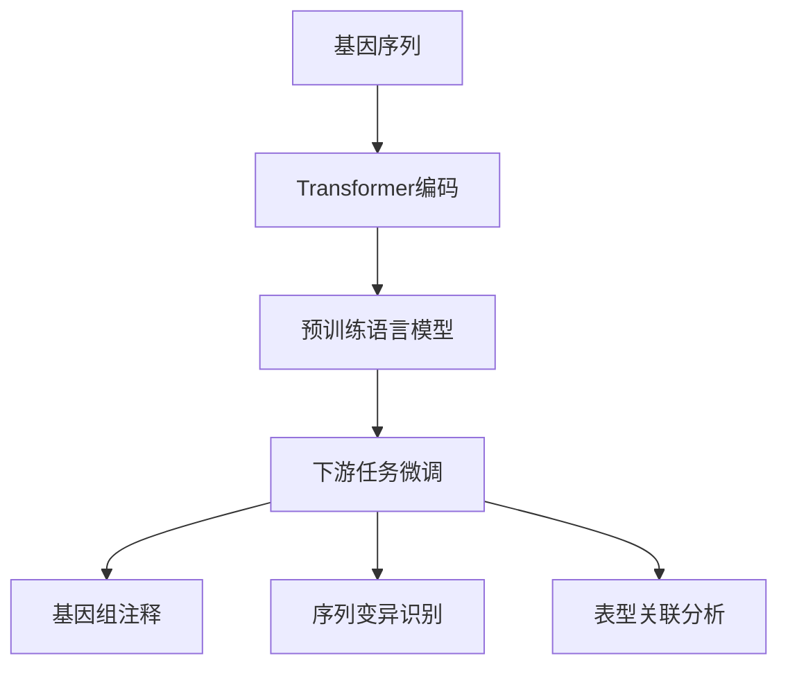

# AI LLM在遗传学研究中的新方法

## 1. 背景介绍
### 1.1 遗传学研究现状
#### 1.1.1 传统遗传学研究方法
#### 1.1.2 高通量测序技术的发展
#### 1.1.3 生物信息学分析工具的应用

### 1.2 人工智能在生物医学领域的应用
#### 1.2.1 机器学习在生物医学数据分析中的应用
#### 1.2.2 深度学习在生物医学图像分析中的应用 
#### 1.2.3 自然语言处理在生物医学文本挖掘中的应用

### 1.3 大语言模型(LLM)的发展
#### 1.3.1 Transformer架构的提出
#### 1.3.2 GPT、BERT等大语言模型的发展
#### 1.3.3 LLM在生物医学领域的应用探索

## 2. 核心概念与联系
### 2.1 遗传学中的核心概念
#### 2.1.1 基因、基因组、转录组
#### 2.1.2 单核苷酸多态性(SNP)、拷贝数变异(CNV) 
#### 2.1.3 表观遗传修饰

### 2.2 大语言模型的核心概念
#### 2.2.1 Transformer注意力机制
#### 2.2.2 自回归语言模型与自编码语言模型
#### 2.2.3 预训练与微调

### 2.3 遗传学与大语言模型的联系
#### 2.3.1 基因序列可视为一种"语言"
#### 2.3.2 基因组注释可借鉴自然语言处理技术
#### 2.3.3 表型-基因型关联分析与语义相似度计算



## 3. 核心算法原理具体操作步骤
### 3.1 基于Transformer的DNA序列编码
#### 3.1.1 将DNA序列转化为数字向量
#### 3.1.2 使用Transformer编码器提取序列特征
#### 3.1.3 加入位置编码表示碱基位置信息

### 3.2 基于LLM的基因组注释
#### 3.2.1 在大量已注释基因序列上预训练LLM
#### 3.2.2 将待注释序列输入训练好的LLM
#### 3.2.3 LLM输出序列各区段的注释标签

### 3.3 基于LLM的变异位点识别
#### 3.3.1 构建包含变异和正常序列的预训练数据集
#### 3.3.2 训练LLM学习变异位点特征
#### 3.3.3 用训练好的LLM扫描待测序列识别变异

## 4. 数学模型和公式详细讲解举例说明
### 4.1 Transformer中的注意力机制
Transformer的核心是自注意力机制，对于一个长度为$n$的输入序列$X=(x_1,\ldots,x_n)$，自注意力机制可以表示为：

$$
\begin{aligned}
Q &= XW^Q \\
K &= XW^K \\
V &= XW^V \\
\text{Attention}(Q,K,V) &= \text{softmax}(\frac{QK^T}{\sqrt{d_k}})V
\end{aligned}
$$

其中$Q$、$K$、$V$分别为查询矩阵、键矩阵和值矩阵，$W^Q, W^K, W^V$为对应的权重矩阵，$d_k$为$K$的维度。

例如，对于一个DNA序列"ATCGGTAC"，可以将其编码为：

$$
X = 
\begin{bmatrix}
0.1 & 0.2 & 0.3 & 0.4 \\
0.2 & 0.3 & 0.4 & 0.1 \\ 
0.3 & 0.4 & 0.1 & 0.2 \\
0.4 & 0.1 & 0.2 & 0.3 \\
0.1 & 0.2 & 0.3 & 0.4 \\
0.2 & 0.3 & 0.4 & 0.1 \\
0.3 & 0.4 & 0.1 & 0.2 \\
0.4 & 0.1 & 0.2 & 0.3
\end{bmatrix}
$$

然后通过自注意力机制，可以提取序列的上下文相关特征。

### 4.2 语言模型的损失函数 
对于自回归语言模型，其损失函数通常基于极大似然估计，即最小化负对数似然：

$$
\mathcal{L}(\theta) = -\sum_{i=1}^{n}\log P(x_i|x_{<i};\theta)
$$

其中$\theta$为模型参数，$x_{<i}$表示$x_i$之前的所有token。

例如，对于一个DNA序列"ATCGGTAC"，自回归语言模型的目标是最大化以下条件概率的乘积：

$$
P(A)P(T|A)P(C|AT)P(G|ATC)P(G|ATCG)P(T|ATCGG)P(A|ATCGGT)P(C|ATCGGTA)
$$

通过最小化负对数似然损失函数，可以训练语言模型学习DNA序列的统计规律。

## 5. 项目实践：代码实例和详细解释说明
下面是使用PyTorch实现Transformer编码器对DNA序列进行特征提取的示例代码：

```python
import torch
import torch.nn as nn

class DNATokenizer:
    def __init__(self):
        self.token2idx = {'A': 0, 'T': 1, 'C': 2, 'G': 3}
    
    def encode(self, seq):
        indices = [self.token2idx[s] for s in seq]
        return torch.tensor(indices)

class TransformerEncoder(nn.Module):
    def __init__(self, d_model, nhead, num_layers):
        super().__init__()
        self.embedding = nn.Embedding(4, d_model)
        self.pos_encoder = PositionalEncoding(d_model) 
        encoder_layer = nn.TransformerEncoderLayer(d_model, nhead)
        self.transformer_encoder = nn.TransformerEncoder(encoder_layer, num_layers)
        
    def forward(self, src):
        src = self.embedding(src)
        src = self.pos_encoder(src)
        output = self.transformer_encoder(src)
        return output

# 位置编码
class PositionalEncoding(nn.Module):
    def __init__(self, d_model, max_len=5000):
        super().__init__()
        pe = torch.zeros(max_len, d_model)
        position = torch.arange(0, max_len, dtype=torch.float).unsqueeze(1)
        div_term = torch.exp(torch.arange(0, d_model, 2).float() * (-math.log(10000.0) / d_model))
        pe[:, 0::2] = torch.sin(position * div_term)
        pe[:, 1::2] = torch.cos(position * div_term)
        self.register_buffer('pe', pe)

    def forward(self, x):
        x = x + self.pe[:x.size(0), :]
        return x
        
# 示例
tokenizer = DNATokenizer()
seq = "ATCGGTACGGCTA"
input_ids = tokenizer.encode(seq)

model = TransformerEncoder(d_model=64, nhead=8, num_layers=2)
features = model(input_ids.unsqueeze(1))
```

上面的代码主要分为以下几个部分：

1. `DNATokenizer`：将DNA序列中的碱基转化为数字索引。
2. `TransformerEncoder`：使用Transformer编码器对输入序列进行特征提取，包括三个主要组件：
   - 词嵌入层(`nn.Embedding`)：将输入tokens映射为连续向量表示。
   - 位置编码层(`PositionalEncoding`)：为输入序列加入位置信息。
   - Transformer编码器层(`nn.TransformerEncoder`)：通过自注意力机制提取序列的上下文相关特征。
3. `PositionalEncoding`：实现Transformer中的位置编码，根据位置生成不同频率的正弦和余弦函数，与词嵌入相加。

通过这个示例，可以看到如何使用PyTorch构建Transformer模型处理DNA序列数据。在实际应用中，还需要在大规模数据集上进行预训练，并针对下游任务进行微调。

## 6. 实际应用场景
### 6.1 基因组注释
利用在大量已知基因序列上预训练的LLM，可以对新的基因组进行快速、全面的注释，包括识别基因、外显子、调控区等功能元件，为后续的研究提供重要的参考信息。

### 6.2 疾病相关变异识别
通过在包含已知致病变异的数据集上训练LLM，可以开发出高效、准确的变异识别工具，用于筛查疾病相关的基因突变，辅助疾病的诊断和风险预测。

### 6.3 基因表达调控机制研究
利用LLM学习基因序列和表达水平之间的关联模式，可以预测不同条件下的基因表达变化，探索转录因子结合位点、增强子等顺式调控元件的作用机制。

### 6.4 新颖生物元件发现
通过在LLM中引入无监督学习任务，如聚类和异常检测，可以从海量的基因组数据中发现新的功能元件和调控模式，拓展对生命活动调控机制的认识。

## 7. 工具和资源推荐
### 7.1 数据资源
- Ensembl (https://www.ensembl.org/)：提供多种物种的基因组注释信息
- UCSC Genome Browser (https://genome.ucsc.edu/)：整合多种基因组数据库和分析工具
- NCBI (https://www.ncbi.nlm.nih.gov/)：包括GenBank、RefSeq等重要的基因序列数据库

### 7.2 工具包
- Biopython (https://biopython.org/)：Python生物信息学工具包，提供了序列处理、数据库访问等功能
- PyTorch (https://pytorch.org/)：深度学习框架，支持动态计算图和灵活的模型构建
- Hugging Face Transformers (https://huggingface.co/docs/transformers/)：Transformer模型的开源库，提供了多种预训练模型和下游任务的API

### 7.3 预训练模型
- Enformer (https://github.com/deepmind/deepmind-research/tree/master/enformer)：DeepMind开发的基因组序列特征提取模型
- DNABERT (https://github.com/jerryji1993/DNABERT)：在DNA序列上预训练的BERT模型，可用于多种下游任务

## 8. 总结：未来发展趋势与挑战
### 8.1 模型架构的改进
当前主流的LLM主要基于Transformer架构，未来可以探索更高效、更具表达能力的序列建模方法，如引入因果卷积、稀疏注意力机制等，以提升模型在长序列上的性能。

### 8.2 多模态数据的整合
除了基因序列信息，还可以将表观组学、空间转录组等多组学数据纳入LLM的训练范畴，学习生物大分子在多层次调控网络中的交互模式，构建更全面、更精准的生命活动模型。

### 8.3 可解释性与因果推理
现有的LLM更多是一种基于相关性的黑盒模型，缺乏明确的生物学解释。未来需要开发出可解释性更强、能进行因果推理的模型，以提供更可靠、更有指导意义的预测结果。

### 8.4 数据共享与隐私保护
基因组数据涉及个人隐私，需要在数据共享和隐私保护之间寻求平衡。联邦学习、差分隐私等技术有望在保护隐私的前提下，实现多中心数据的安全融合和模型训练。

## 9. 附录：常见问题与解答
### 9.1 LLM相比传统机器学习方法有何优势？
LLM能够从大规模非结构化数据中学习复杂的序列模式，对远距离的上下文信息建模能力更强，特别适合处理基因组这类长序列数据。同时，LLM可以通过迁移学习方式，在较小的标注数据集上进行微调，实现样本效率的提升。

### 9.2 LLM应用于遗传学研究需要哪些专业背景知识？ 
应用LLM处理遗传学问题需要跨学科的知识储备，主要涉及以下几个方面：
- 分子生物学：了解基因、基因组、转录组的基本概念和生物学功能。
- 生物信息学：熟悉常用的生物数据库、序列比对算法