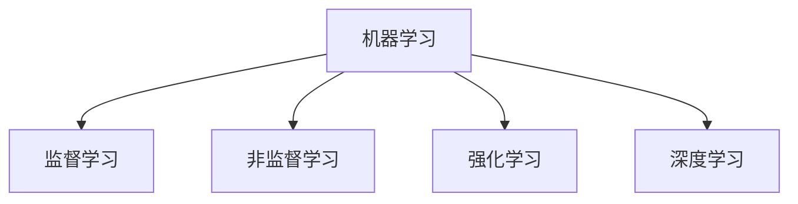
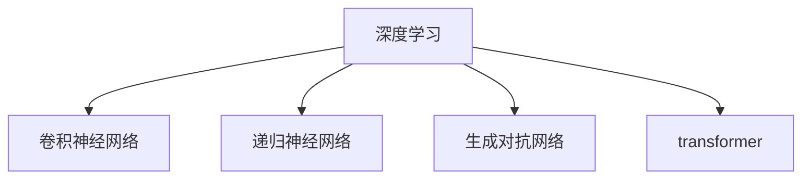
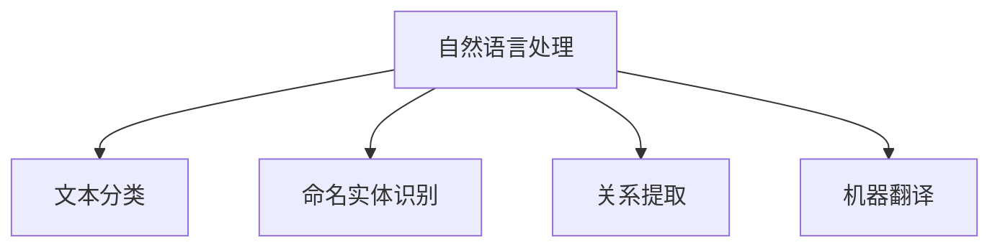
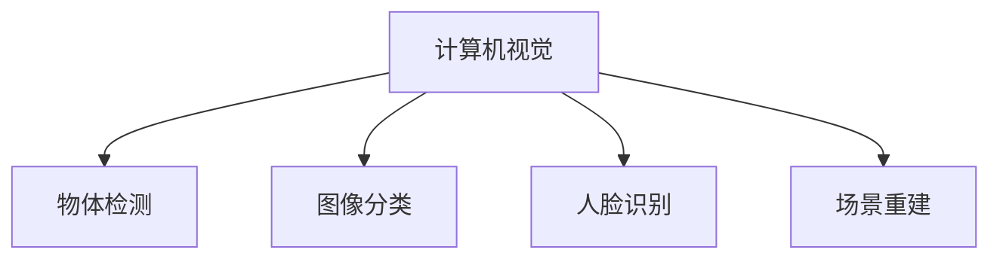

# AI+行业应用案例与解决方案原理与代码实战案例讲解

## 1.背景介绍

在当今时代,人工智能(AI)已经渗透到各行各业,成为推动创新和提高效率的关键驱动力。从金融服务到医疗保健,从制造业到零售业,AI正在彻底改变着商业运营和决策制定过程。本文将探讨AI在不同行业中的应用案例,揭示其背后的核心原理和算法,并通过代码实战案例,帮助读者更好地理解AI如何为企业带来切实价值。

### 1.1 AI的兴起及重要性

人工智能的发展可以追溯到20世纪50年代,当时它被定义为"使机器能够模拟人类智能行为的科学和技术"。经过数十年的发展,AI已经取得了长足的进步,尤其是在机器学习、深度学习和自然语言处理等领域。

AI的重要性不言而喻,它可以帮助企业:

- 提高效率和生产力
- 优化决策过程
- 发现隐藏的见解和模式
- 改善客户体验
- 创造新的商业模式

### 1.2 AI在各行业中的应用

AI已经在多个行业中得到广泛应用,包括但不限于:

- 金融服务
- 医疗保健
- 制造业
- 零售业
- 交通运输
- 能源和公用事业
- 政府和公共部门

每个行业都有独特的挑战和需求,AI可以为其提供量身定制的解决方案,从而提高效率,降低成本,并创造新的收入来源。

## 2.核心概念与联系

在深入探讨AI在各行业中的应用之前,让我们先了解一些核心概念和它们之间的联系。

### 2.1 机器学习

机器学习是AI的一个重要分支,它赋予计算机从数据中学习和改进的能力,而无需显式编程。常见的机器学习算法包括:

- 监督学习
- 非监督学习
- 强化学习
- 深度学习



### 2.2 深度学习

深度学习是机器学习的一个子集,它利用神经网络模拟人脑的工作原理,从大量数据中学习特征表示。深度学习在计算机视觉、自然语言处理和语音识别等领域取得了巨大成功。



### 2.3 自然语言处理

自然语言处理(NLP)是一个跨学科领域,它研究如何使计算机能够理解和生成人类语言。NLP技术在聊天机器人、机器翻译、情感分析和文本摘要等领域得到了广泛应用。



### 2.4 计算机视觉

计算机视觉是AI的另一个重要分支,它赋予计算机从图像或视频中理解和提取信息的能力。计算机视觉在物体检测、图像分类、人脸识别和自动驾驶等领域发挥着关键作用。



这些核心概念相互关联,共同构建了AI的基础框架。在下一节中,我们将探讨AI在不同行业中的具体应用案例。

## 3.核心算法原理具体操作步骤

在本节中,我们将深入探讨一些核心AI算法的原理和具体操作步骤,以帮助读者更好地理解AI是如何工作的。

### 3.1 监督学习算法

监督学习是机器学习中最常见的一种范式,它从标记的训练数据中学习一个函数,以便对新的输入数据进行预测或决策。

#### 3.1.1 线性回归

线性回归是一种简单但有效的监督学习算法,它试图找到一条最佳拟合直线,使得数据点到直线的距离之和最小。

算法步骤:

1. 收集数据
2. 准备数据
3. 选择模型并设置超参数
4. 训练模型
5. 评估模型
6. 调整超参数
7. 预测新数据

```python
# 线性回归示例代码
from sklearn.linear_model import LinearRegression

# 准备数据
X = [[1], [2], [3], [4], [5]]
y = [2, 3, 4, 5, 6]

# 创建模型
model = LinearRegression()

# 训练模型
model.fit(X, y)

# 预测新数据
new_data = [[6]]
prediction = model.predict(new_data)
print(prediction)  # 输出: [7.]
```

#### 3.1.2 逻辑回归

逻辑回归是一种用于分类任务的监督学习算法,它通过估计概率来预测离散值标签。

算法步骤:

1. 收集数据
2. 准备数据
3. 选择模型并设置超参数
4. 训练模型
5. 评估模型
6. 调整超参数
7. 预测新数据

```python
# 逻辑回归示例代码
from sklearn.linear_model import LogisticRegression

# 准备数据
X = [[1, 2], [3, 4], [5, 6], [7, 8], [9, 10]]
y = [0, 0, 1, 1, 1]

# 创建模型
model = LogisticRegression()

# 训练模型
model.fit(X, y)

# 预测新数据
new_data = [[11, 12]]
prediction = model.predict(new_data)
print(prediction)  # 输出: [1]
```

### 3.2 非监督学习算法

非监督学习是另一种机器学习范式,它从未标记的数据中寻找潜在的模式或结构。

#### 3.2.1 K-means聚类

K-means聚类是一种常用的非监督学习算法,它将数据划分为K个聚类,每个数据点属于离它最近的聚类中心。

算法步骤:

1. 选择K个初始聚类中心
2. 将每个数据点分配到最近的聚类中心
3. 重新计算每个聚类的中心
4. 重复步骤2和3,直到聚类中心不再移动

```python
# K-means聚类示例代码
from sklearn.cluster import KMeans

# 准备数据
X = [[1, 2], [3, 4], [5, 6], [7, 8], [9, 10]]

# 创建模型
model = KMeans(n_clusters=2)

# 训练模型
model.fit(X)

# 获取聚类标签
labels = model.labels_
print(labels)  # 输出: [0 0 1 1 1]
```

#### 3.2.2 主成分分析

主成分分析(PCA)是一种用于降维和数据可视化的非监督学习技术,它通过找到数据的主要方向来捕获最大方差。

算法步骤:

1. 标准化数据
2. 计算协方差矩阵
3. 计算特征值和特征向量
4. 选择前K个主成分
5. 将数据投影到主成分空间

```python
# PCA示例代码
from sklearn.decomposition import PCA

# 准备数据
X = [[1, 2], [3, 4], [5, 6], [7, 8], [9, 10]]

# 创建模型
model = PCA(n_components=2)

# 训练模型
X_transformed = model.fit_transform(X)

# 查看结果
print(X_transformed)
```

### 3.3 深度学习算法

深度学习算法是一种基于人工神经网络的机器学习技术,它可以自动从数据中学习多层次的特征表示。

#### 3.3.1 卷积神经网络

卷积神经网络(CNN)是一种常用于计算机视觉任务的深度学习模型,它通过卷积和池化操作来提取图像的空间特征。

算法步骤:

1. 构建CNN模型
2. 准备数据
3. 设置超参数
4. 训练模型
5. 评估模型
6. 调整超参数
7. 预测新数据

```python
# CNN示例代码
import tensorflow as tf
from tensorflow.keras.models import Sequential
from tensorflow.keras.layers import Conv2D, MaxPooling2D, Flatten, Dense

# 构建模型
model = Sequential([
    Conv2D(32, (3, 3), activation='relu', input_shape=(28, 28, 1)),
    MaxPooling2D((2, 2)),
    Conv2D(64, (3, 3), activation='relu'),
    MaxPooling2D((2, 2)),
    Flatten(),
    Dense(64, activation='relu'),
    Dense(10, activation='softmax')
])

# 编译模型
model.compile(optimizer='adam',
              loss='sparse_categorical_crossentropy',
              metrics=['accuracy'])

# 训练模型
model.fit(X_train, y_train, epochs=5)

# 评估模型
test_loss, test_acc = model.evaluate(X_test, y_test)
print('Test accuracy:', test_acc)
```

#### 3.3.2 循环神经网络

循环神经网络(RNN)是一种适用于序列数据的深度学习模型,它可以捕捉序列中的长期依赖关系。

算法步骤:

1. 构建RNN模型
2. 准备数据
3. 设置超参数
4. 训练模型
5. 评估模型
6. 调整超参数
7. 预测新数据

```python
# RNN示例代码
import tensorflow as tf
from tensorflow.keras.models import Sequential
from tensorflow.keras.layers import Embedding, SimpleRNN, Dense

# 构建模型
model = Sequential([
    Embedding(input_dim=10000, output_dim=32),
    SimpleRNN(64, return_sequences=True),
    SimpleRNN(64),
    Dense(1, activation='sigmoid')
])

# 编译模型
model.compile(optimizer='rmsprop',
              loss='binary_crossentropy',
              metrics=['accuracy'])

# 训练模型
model.fit(X_train, y_train, epochs=5, batch_size=128)

# 评估模型
test_loss, test_acc = model.evaluate(X_test, y_test)
print('Test accuracy:', test_acc)
```

这些只是AI算法的一小部分示例,实际上还有许多其他算法和技术,如生成对抗网络、transformer模型、强化学习等,它们都在不同的应用场景中发挥着重要作用。

## 4.数学模型和公式详细讲解举例说明

在本节中,我们将探讨一些AI算法背后的数学模型和公式,并通过具体示例来帮助读者更好地理解它们。

### 4.1 线性回归

线性回归是一种常用的监督学习算法,它试图找到一条最佳拟合直线,使得数据点到直线的距离之和最小。

线性回归的数学模型可以表示为:

$$y = \theta_0 + \theta_1x_1 + \theta_2x_2 + ... + \theta_nx_n$$

其中:

- $y$是目标变量
- $x_1, x_2, ..., x_n$是特征变量
- $\theta_0, \theta_1, ..., \theta_n$是模型参数

我们的目标是找到最优参数$\theta$,使得预测值$\hat{y}$与实际值$y$之间的误差最小化。通常使用最小二乘法来估计参数:

$$\min_\theta \sum_{i=1}^{m} (y^{(i)} - \hat{y}^{(i)})^2$$

其中$m$是训练样本的数量。

让我们通过一个简单的示例来说明线性回归的工作原理。假设我们有一组房屋数据,包括房屋面积和价格,我们希望根据面积来预测房屋价格。

```python
import numpy as np
from sklearn.linear_model import LinearRegression

# 准备数据
area = np.array([1000, 1500, 2000, 2500, 3000])
price = np.array([200000, 300000, 400000, 500000, 600000])

# 创建模型
model = LinearRegression()

# 训练模型
model.fit(area.reshape(-1, 1), price)

# 预测新数据
new_area = 2200
predicted_price = model.predict([[new_area]])
print(f"预测价格: {predicted_price[0]:.2f}")
```

输出:

```
预测价格: 440000.00
```

在这个示例中,我们使用NumPy创建了房屋面积和价格的数据集,然后使用scikit-learn库中的`LinearRegression`