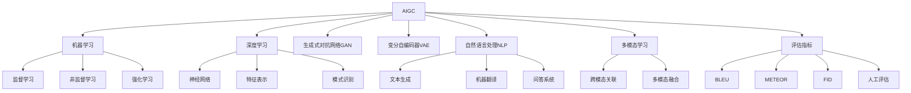

# AIGC 原理与代码实例讲解

## 1. 背景介绍

### 1.1 人工智能的发展历程

人工智能(Artificial Intelligence, AI)是一个旨在模拟人类智能行为的计算机科学领域。自20世纪50年代问世以来,人工智能经历了多个发展阶段,从早期的专家系统和机器学习,到近年来的深度学习和神经网络的兴起。

### 1.2 AIGC的崛起

随着深度学习技术的不断进步,人工智能生成内容(AIGC, AI-Generated Content)应运而生。AIGC是指利用人工智能算法生成文本、图像、音频、视频等各种形式的内容。近年来,AIGC在多个领域获得了广泛应用,如文案创作、图像生成、音视频合成等。

### 1.3 AIGC的重要性

AIGC技术的兴起,为内容创作带来了革命性的变化。它不仅能够提高生产效率,还能创造出富有创意和多样性的内容。AIGC在营销、娱乐、教育等领域发挥着越来越重要的作用,成为推动数字经济发展的重要力量。

## 2. 核心概念与联系

### 2.1 机器学习

机器学习是AIGC的核心技术之一。它是一种通过利用数据,让计算机系统能够自主学习和优化的方法。常见的机器学习算法包括监督学习、非监督学习和强化学习等。

### 2.2 深度学习

深度学习是机器学习的一个子领域,它利用神经网络模型对大量数据进行训练,从而获取特征表示和模式识别的能力。深度学习在图像、语音、自然语言处理等领域表现出色。

### 2.3 生成式对抗网络(GAN)

GAN是一种用于生成式建模的深度学习架构,由生成网络和判别网络组成。生成网络负责生成新的数据样本,而判别网络则判断生成的样本是真是假。两个网络相互对抗,最终达到生成高质量样本的目的。GAN在图像生成等领域有着广泛应用。

### 2.4 变分自编码器(VAE)

VAE是另一种常用的生成模型,它基于编码器-解码器架构,通过编码器将输入数据压缩为低维潜在空间表示,再由解码器从潜在空间重建原始数据。VAE常用于生成图像、文本等。

### 2.5 自然语言处理(NLP)

NLP是AIGC中非常重要的一个分支,它涉及计算机理解和生成人类语言的技术。常见的NLP任务包括文本生成、机器翻译、问答系统等。基于Transformer等模型的大型语言模型在NLP领域取得了突破性进展。

### 2.6 多模态学习

多模态学习是AIGC的一个重要发展方向,它旨在让人工智能系统能够同时处理和生成多种形式的数据,如文本、图像、音频等。多模态模型能够捕捉不同模态之间的相关性,实现更加智能和自然的内容生成。

### 2.7 评估指标

评估AIGC系统的性能是一个重要挑战。常用的评估指标包括BLEU(机器翻译)、METEOR(文本生成)、FID(图像生成)等。此外,人工评估也是必不可少的,以衡量生成内容的质量、多样性和创造力。

## 3. 核心算法原理具体操作步骤

### 3.1 生成式对抗网络(GAN)

GAN是一种用于生成式建模的深度学习架构,由生成网络(Generator)和判别网络(Discriminator)组成。两个网络相互对抗,最终达到生成高质量样本的目的。GAN的训练过程如下:

1. 初始化生成网络G和判别网络D的参数
2. 从真实数据分布采样一批真实样本
3. 从噪声分布采样一批噪声,输入生成网络G生成一批假样本
4. 将真实样本和假样本输入判别网络D,计算真实样本被判别为真的概率和假样本被判别为假的概率
5. 更新判别网络D的参数,使其能够更好地区分真实样本和假样本
6. 更新生成网络G的参数,使其能够生成更加逼真的假样本,以欺骗判别网络D
7. 重复步骤2-6,直到达到收敛条件

GAN的核心思想是生成网络和判别网络相互对抗,生成网络试图生成更加逼真的样本以欺骗判别网络,而判别网络则努力区分真实样本和生成样本。通过这种对抗训练,最终可以获得高质量的生成模型。

### 3.2 变分自编码器(VAE)

VAE是一种常用的生成模型,它基于编码器-解码器架构,通过编码器将输入数据压缩为低维潜在空间表示,再由解码器从潜在空间重建原始数据。VAE的训练过程如下:

1. 初始化编码器(Encoder)和解码器(Decoder)的参数
2. 从真实数据分布采样一批真实样本
3. 将真实样本输入编码器,获得潜在空间表示的均值和方差
4. 从潜在空间表示的均值和方差采样一个潜在变量
5. 将采样的潜在变量输入解码器,重建原始数据
6. 计算重建损失(Reconstruction Loss)和KL散度损失(KL Divergence Loss)
7. 更新编码器和解码器的参数,最小化总损失(重建损失+KL散度损失)
8. 重复步骤2-7,直到达到收敛条件

VAE的关键在于通过最小化重建损失和KL散度损失,学习到一个潜在空间表示,该表示不仅能够重建原始数据,还能够捕捉数据分布的特征。通过对潜在空间的采样,VAE可以生成新的样本。

### 3.3 Transformer

Transformer是一种基于自注意力机制的序列到序列模型,在自然语言处理领域取得了巨大成功。Transformer的核心思想是利用自注意力机制捕捉序列中元素之间的长程依赖关系,从而更好地建模序列数据。

Transformer的主要组成部分包括编码器(Encoder)和解码器(Decoder)。编码器将输入序列映射为高维向量表示,解码器则基于编码器的输出和目标序列生成输出序列。

编码器和解码器都由多个相同的层组成,每一层包含以下子层:

1. 多头自注意力子层(Multi-Head Attention Sublayer)
2. 前馈全连接子层(Feed-Forward Fully Connected Sublayer)

多头自注意力子层通过计算查询(Query)、键(Key)和值(Value)之间的加权和,捕捉序列中元素之间的依赖关系。前馈全连接子层则对每个位置的表示进行非线性变换,提供额外的建模能力。

Transformer的训练过程类似于其他序列到序列模型,通过最小化输出序列与目标序列之间的损失函数(如交叉熵损失)来优化模型参数。

Transformer架构在机器翻译、文本生成、问答系统等多个NLP任务中表现出色,成为当前主流的序列建模方法。

## 4. 数学模型和公式详细讲解举例说明

### 4.1 生成式对抗网络(GAN)

GAN的目标是训练一个生成网络G,使其能够从噪声分布$p_z(z)$生成与真实数据分布$p_{data}(x)$相似的样本。同时,训练一个判别网络D,能够区分生成样本和真实样本。

生成网络G和判别网络D的目标函数可以表示为:

$$\min_G \max_D V(D, G) = \mathbb{E}_{x \sim p_{data}(x)}[\log D(x)] + \mathbb{E}_{z \sim p_z(z)}[\log (1 - D(G(z)))]$$

其中,$\mathbb{E}_{x \sim p_{data}(x)}[\log D(x)]$是真实样本被正确判别为真的期望,$\mathbb{E}_{z \sim p_z(z)}[\log (1 - D(G(z)))]$是生成样本被正确判别为假的期望。

判别网络D试图最大化$V(D, G)$,以更好地区分真实样本和生成样本,而生成网络G则试图最小化$V(D, G)$,以生成更加逼真的样本欺骗判别网络。

在实际训练中,通常采用交替优化的方式,先固定生成网络G,最大化$V(D, G)$优化判别网络D,再固定判别网络D,最小化$V(D, G)$优化生成网络G。

### 4.2 变分自编码器(VAE)

VAE的目标是从观测数据$x$中学习一个潜在变量$z$的分布$q_\phi(z|x)$,使得从该分布中采样的$z$能够通过解码器$p_\theta(x|z)$重建原始数据$x$。

VAE的证据下界(Evidence Lower Bound, ELBO)定义为:

$$\mathcal{L}(\theta, \phi; x) = -D_{KL}(q_\phi(z|x) \| p(z)) + \mathbb{E}_{q_\phi(z|x)}[\log p_\theta(x|z)]$$

其中,$D_{KL}(q_\phi(z|x) \| p(z))$是编码器$q_\phi(z|x)$与先验分布$p(z)$之间的KL散度,$\mathbb{E}_{q_\phi(z|x)}[\log p_\theta(x|z)]$是重建损失的期望。

VAE的目标是最大化ELBO,即最小化KL散度损失和重建损失。在训练过程中,通过重参数技巧(Reparameterization Trick)对ELBO进行近似估计,并使用随机梯度下降法优化编码器$q_\phi(z|x)$和解码器$p_\theta(x|z)$的参数。

通过最小化KL散度损失,VAE能够学习到一个近似于先验分布的潜在空间表示。而最小化重建损失则确保了从该潜在空间表示能够重建原始数据。因此,VAE不仅能够生成新的样本,还能够对原始数据进行有意义的编码和解码。

### 4.3 Transformer中的自注意力机制

自注意力机制是Transformer的核心,它能够捕捉序列中元素之间的长程依赖关系。给定一个查询序列$Q$、键序列$K$和值序列$V$,自注意力机制的计算过程如下:

1. 计算查询$Q$和所有键$K$之间的相似度得分矩阵:

$$\text{Scores}(Q, K) = \frac{QK^\top}{\sqrt{d_k}}$$

其中,$d_k$是缩放因子,用于防止内积过大导致梯度饱和。

2. 对相似度得分矩阵进行软最大值操作(Softmax),得到注意力权重矩阵:

$$\text{Attention}(Q, K, V) = \text{softmax}(\text{Scores}(Q, K))V$$

3. 将注意力权重矩阵与值序列$V$相乘,得到加权和表示:

$$\text{Output} = \text{Attention}(Q, K, V)$$

自注意力机制能够自适应地为每个查询元素分配不同的注意力权重,从而捕捉序列中元素之间的依赖关系。多头自注意力(Multi-Head Attention)则是将多个注意力机制的输出进行拼接,以提高模型的表示能力。

在Transformer中,编码器和解码器都采用了多头自注意力机制,不同之处在于解码器还引入了掩码机制,以确保在生成序列时不会利用未