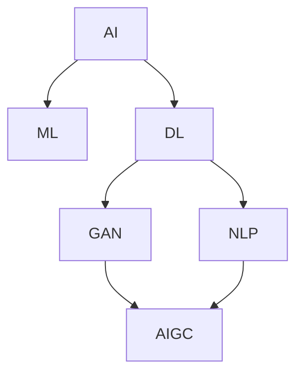

# AIGC从入门到实战：AIGC 赋能行业，产生无数新机会

## 1.背景介绍

### 1.1 人工智能生成内容（AIGC）的兴起

人工智能生成内容（AIGC，Artificial Intelligence Generated Content）是指利用人工智能技术生成各种形式的内容，如文本、图像、音频和视频。随着深度学习和自然语言处理技术的快速发展，AIGC 已经从实验室走向了实际应用，成为各行各业的重要工具。

### 1.2 AIGC 的重要性

AIGC 的重要性在于其能够大幅提高内容生产的效率和质量。传统的内容生产依赖于人类创作者，耗时且成本高昂。而 AIGC 可以在短时间内生成大量高质量的内容，极大地降低了生产成本，并且能够实现个性化和定制化的内容生成。

### 1.3 文章目标

本文旨在深入探讨 AIGC 的核心概念、算法原理、数学模型、实际应用场景以及未来发展趋势。通过详细的代码实例和工具推荐，帮助读者从入门到实战，全面掌握 AIGC 技术。

## 2.核心概念与联系

### 2.1 人工智能（AI）

人工智能是指计算机系统模拟人类智能的能力，包括学习、推理、感知和语言理解等。AI 技术的核心包括机器学习、深度学习和自然语言处理。

### 2.2 生成对抗网络（GAN）

生成对抗网络（GAN，Generative Adversarial Network）是 AIGC 的核心技术之一。GAN 由生成器和判别器两个神经网络组成，通过相互对抗的方式进行训练，生成器生成内容，判别器判断内容的真实性。

### 2.3 自然语言处理（NLP）

自然语言处理（NLP，Natural Language Processing）是 AI 的一个重要分支，涉及计算机对人类语言的理解和生成。NLP 技术在 AIGC 中广泛应用于文本生成、翻译和对话系统等领域。

### 2.4 深度学习（DL）

深度学习是机器学习的一个分支，利用多层神经网络进行数据的特征提取和模式识别。深度学习在图像生成、语音合成和文本生成等 AIGC 应用中发挥了重要作用。

### 2.5 核心概念联系图

## 3.核心算法原理具体操作步骤

### 3.1 生成对抗网络（GAN）

#### 3.1.1 GAN 的基本结构

GAN 由生成器（Generator）和判别器（Discriminator）两个神经网络组成。生成器负责生成假数据，判别器负责区分真假数据。

#### 3.1.2 GAN 的训练过程

1. 初始化生成器和判别器的参数。
2. 生成器生成假数据。
3. 判别器对真实数据和假数据进行分类。
4. 计算判别器的损失，并更新判别器的参数。
5. 计算生成器的损失，并更新生成器的参数。
6. 重复步骤 2-5，直到生成器生成的数据足够真实。

### 3.2 自然语言处理（NLP）

#### 3.2.1 语言模型

语言模型是 NLP 的核心，用于预测句子中下一个词的概率。常见的语言模型包括 n-gram 模型和基于神经网络的模型（如 LSTM 和 Transformer）。

#### 3.2.2 文本生成

文本生成是 NLP 的重要应用之一，常用的方法包括基于模板的方法和基于语言模型的方法。基于语言模型的方法利用训练好的语言模型生成连贯的文本。

### 3.3 深度学习（DL）

#### 3.3.1 卷积神经网络（CNN）

卷积神经网络（CNN，Convolutional Neural Network）是深度学习中常用的网络结构，主要用于图像处理。CNN 通过卷积层和池化层提取图像的特征。

#### 3.3.2 循环神经网络（RNN）

循环神经网络（RNN，Recurrent Neural Network）是处理序列数据的常用网络结构，主要用于文本和语音处理。RNN 通过循环结构捕捉序列数据的时间依赖性。

## 4.数学模型和公式详细讲解举例说明

### 4.1 生成对抗网络（GAN）

#### 4.1.1 GAN 的数学模型

GAN 的目标是找到生成器 G 和判别器 D 的参数，使得生成器生成的数据分布尽可能接近真实数据分布。其损失函数定义为：

$$
\min_G \max_D V(D, G) = \mathbb{E}_{x \sim p_{data}(x)}[\log D(x)] + \mathbb{E}_{z \sim p_z(z)}[\log(1 - D(G(z)))]
$$

其中，$p_{data}(x)$ 是真实数据的分布，$p_z(z)$ 是生成器的输入噪声分布。

#### 4.1.2 训练过程中的优化

在训练过程中，首先固定生成器 G 的参数，优化判别器 D 的参数，使得 D 能够最大化区分真实数据和生成数据的能力。然后固定判别器 D 的参数，优化生成器 G 的参数，使得 G 生成的数据能够欺骗 D。

### 4.2 自然语言处理（NLP）

#### 4.2.1 语言模型的数学表示

语言模型的目标是计算给定上下文的下一个词的概率。对于一个序列 $w_1, w_2, ..., w_T$，语言