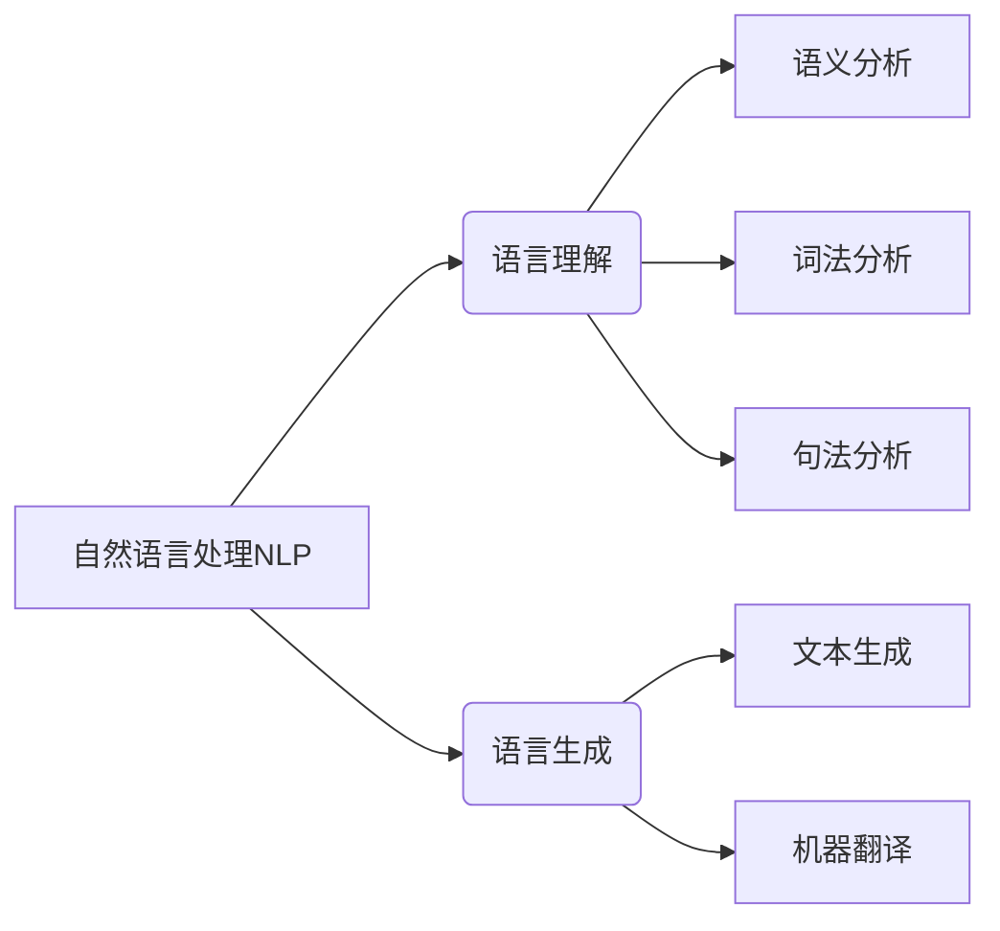
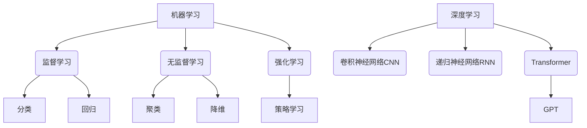
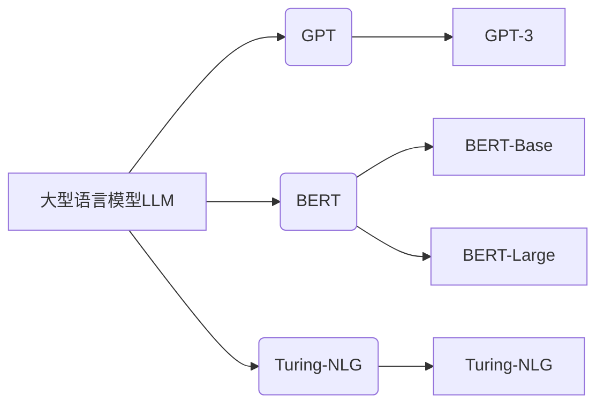
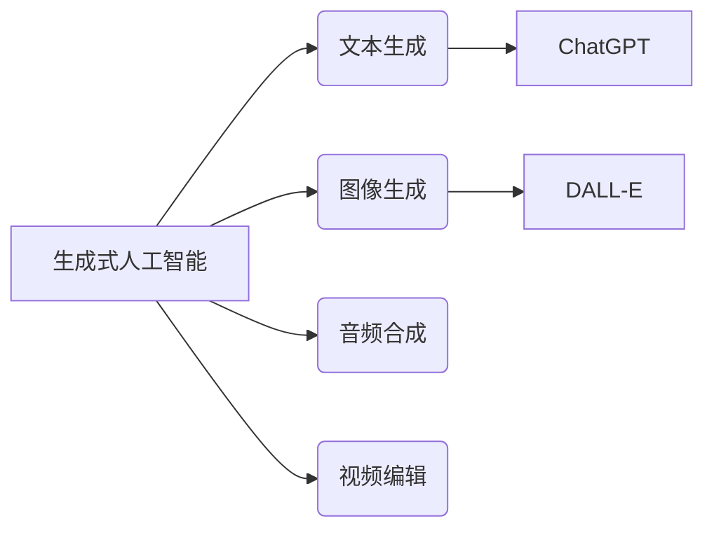
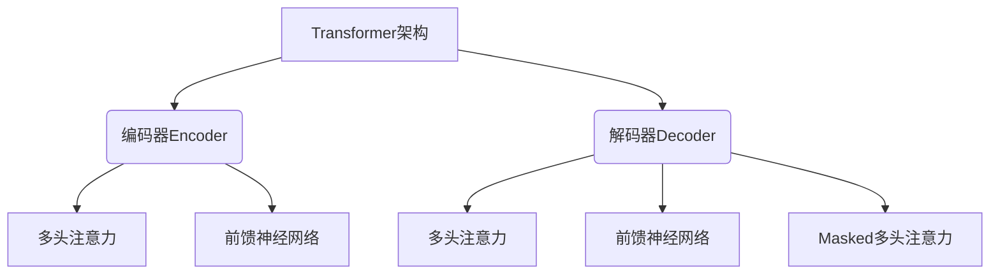
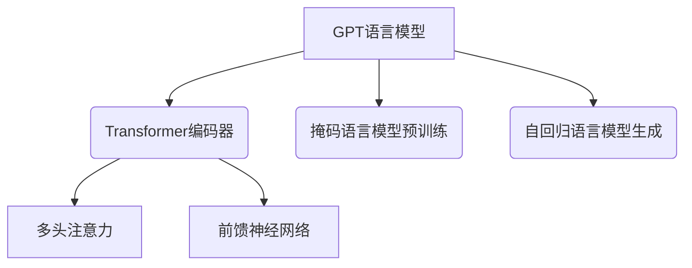

# AIGC从入门到实战：出现：火出圈的 ChatGPT

## 1.背景介绍

### 1.1 人工智能的发展历程

人工智能(Artificial Intelligence, AI)是当代科技发展的重要领域,其起源可以追溯到20世纪50年代。在过去的几十年里,人工智能经历了几次重大的发展浪潮,例如专家系统、机器学习、深度学习等。近年来,benefiting from大数据、强大的计算能力和新的算法模型,人工智能取得了长足的进步,在语音识别、图像识别、自然语言处理等领域展现出了令人惊叹的能力。

### 1.2 AIGC的兴起

AIGC(AI Generated Content,人工智能生成内容)是指利用人工智能技术自动生成文本、图像、音频、视频等多种形式的内容。AIGC的出现,为内容创作带来了全新的可能性。传统的内容创作方式是由人工完成,效率较低且成本较高。而AIGC则可以极大地提高内容生产效率,降低成本,同时还能根据用户需求实现个性化定制。

### 1.3 ChatGPT的爆火

2022年11月,OpenAI推出了ChatGPT,这款基于GPT-3.5语言模型的对话式AI系统迅速在全球引发热潮。ChatGPT展现出了强大的自然语言理解和生成能力,可以就各种话题与人自然地对话,回答问题,撰写文章,解决编程问题等。其出色的表现令全世界为之震惊,被认为是人工智能发展史上的一个重要里程碑。ChatGPT的出现,不仅彰显了AIGC技术的巨大潜力,也加速了人工智能在各行各业的落地应用。

## 2.核心概念与联系

### 2.1 自然语言处理(NLP)

自然语言处理(Natural Language Processing, NLP)是人工智能的一个重要分支,旨在使计算机能够理解和生成人类语言。NLP技术广泛应用于机器翻译、问答系统、信息检索、文本摘要等领域。ChatGPT的核心就是基于NLP技术,能够理解和生成自然语言对话。

### 2.2 机器学习与深度学习

机器学习(Machine Learning)和深度学习(Deep Learning)是人工智能的核心技术。机器学习是一种使计算机具备学习能力的方法,通过训练数据建模,计算机可以自动发现数据中的规律并做出预测。深度学习则是机器学习的一个分支,它通过构建深层次的神经网络模型来模拟人类大脑的工作原理,在语音识别、图像识别、自然语言处理等领域表现出色。

ChatGPT采用了基于Transformer的大型语言模型,这种模型通过在海量文本数据上训练,学习到了自然语言的语义和语法规律,从而具备了出色的语言理解和生成能力。

### 2.3 大型语言模型

大型语言模型(Large Language Model, LLM)是指基于海量文本语料训练的、参数量极其庞大的神经网络模型。这种模型通过自监督学习的方式,捕捉自然语言的语义和语法规律,从而获得了强大的语言理解和生成能力。

GPT(Generative Pre-trained Transformer)是一种流行的大型语言模型,由OpenAI开发。GPT-3拥有1750亿个参数,是目前最大的语言模型之一。ChatGPT就是基于GPT-3.5训练而来的,因此具备了出色的自然语言处理能力。除了GPT系列,还有谷歌的BERT、微软的Turing NLG等知名的大型语言模型。

### 2.4 生成式人工智能

生成式人工智能(Generative AI)是指能够自动生成新内容的人工智能技术,例如生成文本、图像、音频、视频等。与传统的判别式人工智能(识别和分类已有内容)不同,生成式AI可以创造全新的内容。

ChatGPT就是一种生成式AI,它可以根据给定的提示生成高质量的自然语言文本。除了文本生成,生成式AI还可以用于图像生成(DALL-E)、音频合成、视频编辑等多种应用场景。生成式AI的出现,为内容创作带来了革命性的变革。

## 3.核心算法原理具体操作步骤

### 3.1 Transformer架构

Transformer是一种全新的基于注意力机制(Attention Mechanism)的神经网络架构,由Google的Vaswani等人在2017年提出。它不同于传统的基于RNN或CNN的序列模型,完全摒弃了循环和卷积结构,而是通过自注意力(Self-Attention)机制来捕捉序列中任意两个位置之间的依赖关系。

Transformer的核心组件包括编码器(Encoder)和解码器(Decoder)。编码器将输入序列映射为中间表示,解码器则根据中间表示生成输出序列。注意力机制使得编码器和解码器能够自适应地为每个位置分配不同的注意力权重,从而更好地建模长距离依赖关系。

### 3.2 自回归语言模型

自回归语言模型(Autoregressive Language Model)是一种常用的语言模型,它的核心思想是基于给定的上文,预测下一个词的概率分布。具体来说,对于一个长度为T的序列$\{x_1, x_2, ..., x_T\}$,自回归语言模型的目标是最大化该序列的条件概率:

$$
P(x_1, x_2, ..., x_T) = \prod_{t=1}^T P(x_t | x_1, x_2, ..., x_{t-1})
$$

通过最大化上式,模型可以学习到语言的语义和语法规律,从而具备生成自然语言的能力。

GPT系列语言模型就是一种典型的自回归模型。在生成文本时,GPT会根据给定的提示(上文),自回归地预测下一个词的概率分布,并从中采样获得下一个词,如此迭代直到生成完整的文本序列。

### 3.3 注意力机制

注意力机制(Attention Mechanism)是Transformer架构的核心,它允许模型在编码输入序列和解码生成输出序列时,对不同位置的元素分配不同的注意力权重。

具体来说,对于一个长度为T的序列$\{x_1, x_2, ..., x_T\}$,注意力机制首先计算序列中每两个位置之间的相关性得分,然后根据这些得分为每个位置分配一个注意力权重。最后,模型会综合每个位置的注意力加权值,生成该位置的表示。

注意力机制可以形式化表示为:

$$
\text{Attention}(Q, K, V) = \text{softmax}(\frac{QK^T}{\sqrt{d_k}})V
$$

其中$Q$是查询(Query)向量,$K$是键(Key)向量,$V$是值(Value)向量,$d_k$是缩放因子。

注意力机制使得Transformer能够自适应地捕捉输入序列中任意两个位置之间的长距离依赖关系,从而显著提高了模型的表现。

### 3.4 GPT语言模型

GPT(Generative Pre-trained Transformer)是一种基于Transformer架构的大型自回归语言模型,由OpenAI开发。GPT采用了自监督的方式在大规模语料库上预训练,学习到了自然语言的语义和语法知识。

在预训练阶段,GPT使用了"掩码语言模型"(Masked Language Model)的目标,即给定一个带有遮掩词的序列,模型需要预测遮掩位置的词。通过这种方式,GPT可以捕捉序列中任意位置之间的依赖关系。

在微调和生成阶段,GPT则采用标准的自回归语言模型方式。给定一个提示序列,GPT会自回归地预测下一个词的概率分布,并从中采样获得下一个词,如此迭代直到生成完整的文本序列。

GPT的后续版本GPT-2和GPT-3通过增加模型规模和改进训练策略,进一步提升了语言生成的质量和多样性。ChatGPT就是基于GPT-3.5训练而来的对话式AI系统。

## 4.数学模型和公式详细讲解举例说明

### 4.1 自回归语言模型公式

自回归语言模型的核心思想是基于给定的上文,预测下一个词的概率分布。具体来说,对于一个长度为T的序列$\{x_1, x_2, ..., x_T\}$,自回归语言模型的目标是最大化该序列的条件概率:

$$
P(x_1, x_2, ..., x_T) = \prod_{t=1}^T P(x_t | x_1, x_2, ..., x_{t-1})
$$

其中,$P(x_t | x_1, x_2, ..., x_{t-1})$表示基于前$t-1$个词预测第$t$个词的条件概率。通过最大化上式,模型可以学习到语言的语义和语法规律,从而具备生成自然语言的能力。

例如,对于一个句子"今天天气很好,我想去_"。自回归语言模型会首先基于"今天天气很好,我想去"这个上文,预测下一个词的概率分布,假设得到的概率分布为:

- 公园: 0.6
- 散步: 0.3
- 运动: 0.1

则模型会从中采样一个词,假设采样得到"公园"。那么下一步,模型会基于"今天天气很好,我想去公园"这个新的上文,继续预测下一个词的概率分布,如此迭代直到生成完整的句子。

通过这种自回归的方式,语言模型可以捕捉语言的上下文信息,生成流畅自然的文本序列。

### 4.2 注意力机制公式

注意力机制是Transformer架构的核心,它允许模型在编码输入序列和解码生成输出序列时,对不同位置的元素分配不同的注意力权重。

具体来说,对于一个长度为T的序列$\{x_1, x_2, ..., x_T\}$,注意力机制首先计算序列中每两个位置之间的相关性得分,然后根据这些得分为每个位置分配一个注意力权重。最后,模型会综合每个位置的注意力加权值,生成该位置的表示。

注意力机制可以形式化表示为:

$$
\text{Attention}(Q, K, V) = \text{softmax}(\frac{QK^T}{\sqrt{d_k}})V
$$

其中$Q$是查询(Query)向量,$K$是键(Key)向量,$V$是值(