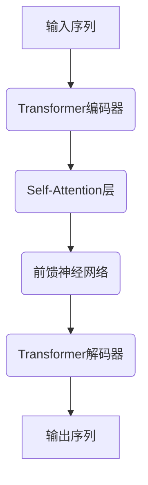
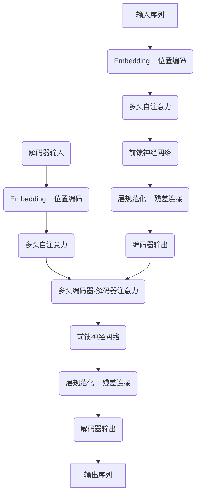

# AIGC从入门到实战：应用：目前ChatGPT能在什么场景下做什么事

## 1.背景介绍

### 1.1 什么是AIGC

AIGC(Artificial Intelligence Generated Content)，即人工智能生成内容，是指利用人工智能技术自动生成文字、图像、音频、视频等多种形式的内容。随着人工智能技术的不断发展,AIGC已经在多个领域得到广泛应用,为人类的工作和生活带来了巨大便利。

### 1.2 ChatGPT概述

ChatGPT是一种基于GPT(Generative Pre-trained Transformer)语言模型的对话式人工智能系统,由OpenAI训练和发布。它能够理解和生成人类语言,进行问答、写作、编程等多种任务。ChatGPT具有强大的语言理解和生成能力,可以根据上下文生成连贯、合理的响应,在多个领域展现出惊人的表现。

## 2.核心概念与联系

### 2.1 GPT语言模型

GPT(Generative Pre-trained Transformer)是一种基于Transformer的大型语言模型,由OpenAI开发。它通过在大量文本数据上进行预训练,学习语言的统计规律和语义关系,从而获得强大的语言理解和生成能力。

GPT模型的核心思想是利用自注意力机制(Self-Attention)捕捉输入序列中元素之间的长程依赖关系,并通过Transformer的编码器-解码器架构生成目标序列。



### 2.2 GPT-3

GPT-3是OpenAI于2020年推出的一种大型语言模型,它比之前的GPT模型更大、更强大。GPT-3拥有1750亿个参数,在170TB的文本数据上进行了预训练,展现出惊人的语言理解和生成能力。

GPT-3可以执行多种任务,如问答、文本生成、代码生成、文本总结等,并且只需少量或无需任务特定的微调,就能在多个领域取得出色表现。

### 2.3 InstructGPT

InstructGPT是一种基于GPT-3的指令优化语言模型。它在GPT-3的基础上,通过大规模的人工标注数据和特殊的训练方法,使模型能够更好地理解和执行人类的自然语言指令。

InstructGPT的关键创新在于,它不仅学习如何生成文本,还学习如何根据指令完成特定的任务。这使得InstructGPT在执行各种指令时表现出色,成为构建对话式AI助手的重要基础。

### 2.4 ChatGPT与InstructGPT

ChatGPT是基于InstructGPT训练而来的对话式人工智能系统。它继承了InstructGPT优秀的指令理解和执行能力,同时针对对话场景进行了特殊优化和训练。

ChatGPT不仅能够生成高质量的文本输出,还能够根据上下文和用户的指令,进行多轮对话、任务规划和推理,提供个性化的响应和解决方案。这使得ChatGPT在多种应用场景下表现出色,成为一种通用的人工智能助手。

## 3.核心算法原理具体操作步骤

### 3.1 Transformer模型

Transformer是ChatGPT等大型语言模型的核心算法,它基于自注意力机制(Self-Attention)和位置编码(Positional Encoding)来捕捉输入序列中元素之间的长程依赖关系。

Transformer的具体操作步骤如下:

1. **输入embedding**: 将输入序列的每个元素(如单词或子词)映射为一个固定长度的向量表示。

2. **位置编码**: 为每个元素的embedding添加位置信息,使模型能够捕捉序列的顺序信息。

3. **多头自注意力**: 计算每个元素与其他元素的注意力权重,捕捉它们之间的关系。这是通过多个独立的注意力头(heads)并行计算实现的。
   $$\mathrm{Attention(Q, K, V) = \text{softmax}(\frac{QK^T}{\sqrt{d_k}})V}$$

4. **前馈神经网络**: 对每个元素的表示进行非线性变换,提取更高层次的特征。

5. **规范化和残差连接**: 对每一层的输出进行层规范化(Layer Normalization),并与输入相加,形成残差连接(Residual Connection),以提高模型的稳定性和性能。

6. **编码器-解码器架构(用于序列生成任务)**: 编码器对输入序列进行编码,解码器根据编码器的输出和前一步的输出,生成目标序列。



### 3.2 预训练和微调

ChatGPT等大型语言模型通常采用两阶段训练策略:预训练(Pre-training)和微调(Fine-tuning)。

1. **预训练**: 在大量无标注的文本数据上训练模型,使其学习语言的一般规律和知识。预训练通常采用自监督学习方式,如掩码语言模型(Masked Language Modeling)和下一句预测(Next Sentence Prediction)等任务。

2. **微调**: 在特定任务的标注数据上,对预训练模型进行进一步的微调,使其适应特定任务的需求。微调过程中,模型的大部分参数保持不变,只对部分参数进行调整和优化。

通过预训练和微调的两阶段训练,大型语言模型能够获得广博的知识和强大的语言理解能力,同时也能针对特定任务进行优化和定制。

### 3.3 提示学习

提示学习(Prompting)是ChatGPT等大型语言模型的一种重要技术。它通过设计合适的提示(Prompt),引导模型生成所需的输出,而无需对模型进行大量的微调。

提示学习的基本思路是,将任务描述和一些示例输入输出对作为提示,输入到模型中。模型会基于提示中的信息,学习任务的模式和规律,从而生成符合要求的输出。

提示学习的优点是:

1. **灵活性**: 可以快速适应新的任务,无需重新训练模型。

2. **可解释性**: 提示本身就是任务的描述,有助于理解模型的行为。

3. **高效性**: 避免了昂贵的从头训练或微调过程。

4. **知识迁移**: 模型可以利用预训练时获得的知识,更好地完成新任务。

提示工程是提示学习的一个重要方向,旨在设计更有效的提示,引导模型表现出更好的性能。

## 4.数学模型和公式详细讲解举例说明

### 4.1 自注意力机制

自注意力(Self-Attention)是Transformer模型的核心,它能够捕捉输入序列中元素之间的长程依赖关系。自注意力的计算过程如下:

1. 将输入序列$X = (x_1, x_2, ..., x_n)$映射为查询(Query)、键(Key)和值(Value)向量:
   $$\begin{aligned}
   Q &= XW^Q\\
   K &= XW^K\\
   V &= XW^V
   \end{aligned}$$

   其中$W^Q, W^K, W^V$是可学习的权重矩阵。

2. 计算查询和键之间的注意力权重:
   $$\mathrm{Attention(Q, K, V) = \text{softmax}(\frac{QK^T}{\sqrt{d_k}})V$$

   其中$d_k$是缩放因子,用于防止内积过大导致的梯度消失问题。

3. 对注意力权重进行缩放和归一化,得到每个元素的注意力输出:
   $$\mathrm{Attention\_Output} = \sum_{i=1}^n \alpha_i v_i$$

   其中$\alpha_i$是第$i$个元素的注意力权重,满足$\sum_{i=1}^n \alpha_i = 1$。

自注意力机制允许模型动态地为每个元素分配注意力权重,关注与当前元素最相关的其他元素,从而捕捉长程依赖关系。

### 4.2 多头自注意力

为了进一步提高表示能力,Transformer采用了多头自注意力(Multi-Head Self-Attention)机制。它将输入序列通过不同的线性投影,分别计算多个自注意力头,然后将这些头的输出进行拼接:

$$\mathrm{MultiHead(Q, K, V) = \text{Concat}(\mathrm{head}_1, ..., \mathrm{head}_h)W^O}$$
$$\text{where } \mathrm{head}_i = \mathrm{Attention}(QW_i^Q, KW_i^K, VW_i^V)$$

其中$W_i^Q, W_i^K, W_i^V$是第$i$个注意力头的线性投影矩阵,$W^O$是可学习的输出权重矩阵。

多头自注意力允许模型从不同的表示子空间捕捉不同的依赖关系,提高了模型的表示能力和性能。

### 4.3 位置编码

由于自注意力机制没有捕捉序列的位置信息,Transformer引入了位置编码(Positional Encoding)来赋予每个元素位置信息。位置编码向量通过一些特定的函数计算得到,并与元素的embedding相加,从而将位置信息融入到表示中。

常用的位置编码函数有正弦和余弦函数:

$$\begin{aligned}
\mathrm{PE}_{(pos, 2i)} &= \sin\left(\frac{pos}{10000^{2i/d_\text{model}}}\right)\\
\mathrm{PE}_{(pos, 2i+1)} &= \cos\left(\frac{pos}{10000^{2i/d_\text{model}}}\right)
\end{aligned}$$

其中$pos$是元素的位置索引,$i$是维度索引,$d_\text{model}$是embedding的维度。

通过位置编码,Transformer模型能够区分不同位置的元素,捕捉序列的顺序信息,从而更好地建模序列数据。

## 5.项目实践:代码实例和详细解释说明

为了更好地理解ChatGPT的工作原理,我们将通过一个简化的Transformer模型实现来演示其核心算法。这个实现使用PyTorch框架,并在一个简单的机器翻译任务上进行训练和测试。

### 5.1 数据准备

我们将使用一个小型的英语-西班牙语平行语料库进行实验。这个语料库包含一些常见的短语对,如:

```
英语: I am a student.
西班牙语: Soy un estudiante.
```

我们将语料库分为训练集和测试集,并对数据进行必要的预处理,如tokenization和padding等。

### 5.2 模型架构

我们将实现一个简化版的Transformer模型,包括编码器和解码器两个主要部分。

```python
import torch
import torch.nn as nn

class TransformerEncoder(nn.Module):
    # 编码器实现...

class TransformerDecoder(nn.Module):
    # 解码器实现...

class Transformer(nn.Module):
    def __init__(self, src_vocab_size, tgt_vocab_size, ...):
        super(Transformer, self).__init__()
        self.encoder = TransformerEncoder(...)
        self.decoder = TransformerDecoder(...)

    def forward(self, src, tgt, ...):
        # 模型前向传播...
```

在编码器和解码器中,我们将实现自注意力层、前馈神经网络层和其他必要的组件。

### 5.3 训练过程

我们将使用序列到序列(Sequence-to-Sequence)的训练方式,对Transformer模型进行端到端的训练。

```python
import torch.optim as optim

model = Transformer(...)
criterion = nn.CrossEntropyLoss()
optimizer = optim.Adam(model.parameters(), ...)

for epoch in range(num_epochs):
    for src, tgt in data_loader:
        optimizer.zero_grad()
        output = model(src, tgt)
        loss = criterion(output, tgt)
        loss.backward()
        optimizer.step()
```