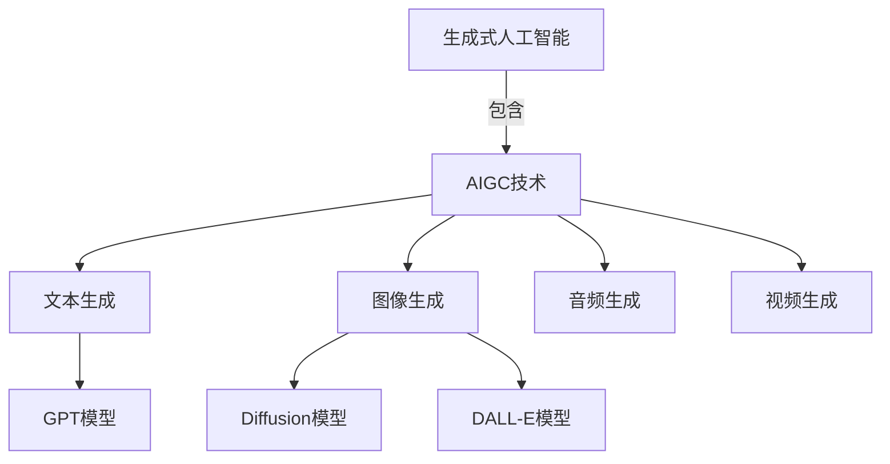
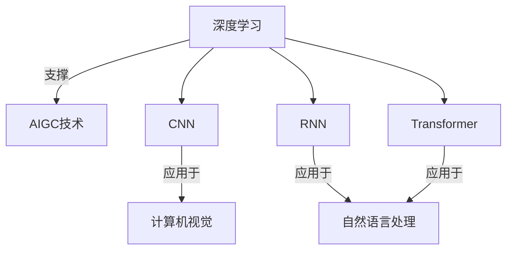
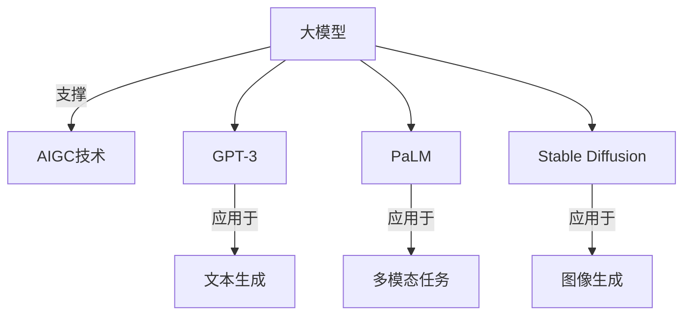
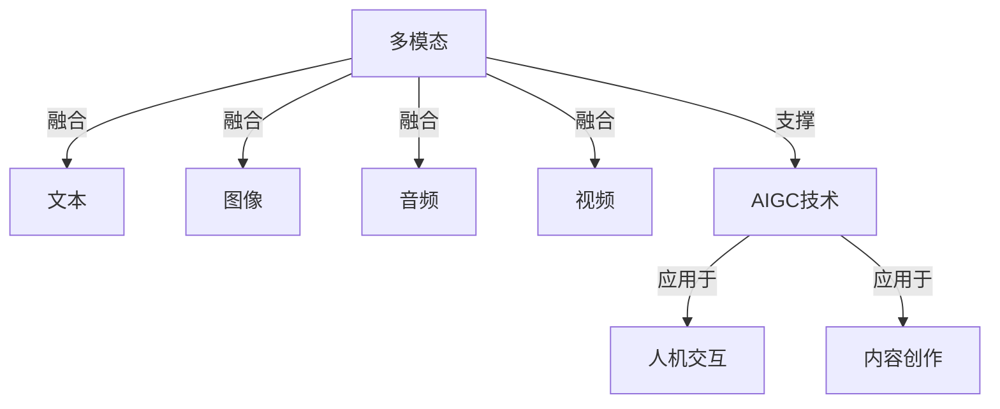

# AIGC从入门到实战：递进：人工智能时代的变化

## 1.背景介绍

人工智能(Artificial Intelligence, AI)已经成为当今科技领域最热门的话题之一。随着算力的不断提升和数据的快速积累,AI技术在各个领域都展现出了巨大的潜力和价值。而近年来,AI生成内容(AI-Generated Content, AIGC)技术的兴起,则进一步推动了AI在内容创作领域的应用和发展。

AIGC技术利用深度学习等人工智能算法,可以自动生成文本、图像、音频、视频等多种形式的内容。这些内容不仅在质量上有了质的飞跃,而且在生产效率方面也远远超过了传统的人工创作方式。AIGC技术的出现,正在重塑内容创作的范式,对各行各业都产生了深远的影响。

### 1.1 AIGC技术发展历程

AIGC技术的发展可以追溯到20世纪60年代,当时的文本生成系统主要基于规则和模板。到了21世纪初,统计语言模型和神经网络开始应用于文本生成任务,取得了一定的进展。2018年,谷歌发布了Transformer模型,极大地提升了序列生成任务的性能,开启了AIGC技术的新时代。

2020年,OpenAI发布GPT-3大型语言模型,展现了AIGC在文本生成方面的强大能力,引发了广泛关注。2021年,稳定扩散模型(Stable Diffusion)的出现,使得AIGC技术在图像生成领域也取得了突破性进展。此后,AIGC技术在音频、视频等多个领域也不断涌现创新应用。

### 1.2 AIGC技术的重要意义

AIGC技术的兴起,不仅为内容创作提供了高效、低成本的新途径,而且还将深刻影响人类的工作和生活方式。AIGC技术可以辅助或部分取代人工进行内容创作,提高生产效率,降低成本。同时,AIGC技术也为普通大众提供了更加便捷的内容创作工具,有助于释放创意,促进知识和文化的传播。

此外,AIGC技术还可以应用于教育、医疗、科研等诸多领域,为人类智力发展提供新的助力。未来,AIGC技术有望成为推动人工智能产业化、促进经济社会发展的重要驱动力。

## 2.核心概念与联系

### 2.1 生成式人工智能

生成式人工智能(Generative AI)是指利用深度学习等技术,从给定的输入数据中学习模式,并生成新的、类似于训练数据但又有所不同的输出内容。生成式AI技术可以应用于文本、图像、音频、视频等多种形式的内容生成。

AIGC技术属于生成式人工智能的一个重要分支,专注于利用AI算法生成各种形式的内容。常见的AIGC模型包括GPT(Generative Pre-trained Transformer)、Diffusion Model、DALL-E等。

### 2.2 深度学习

深度学习(Deep Learning)是机器学习的一个子领域,它通过构建深层次的神经网络模型,从大量数据中自动学习特征表示,并对复杂问题进行建模和预测。深度学习是AIGC技术的核心驱动力,许多AIGC模型都是基于深度学习技术构建的。

常见的深度学习模型包括卷积神经网络(CNN)、循环神经网络(RNN)、Transformer等。这些模型在计算机视觉、自然语言处理等领域都取得了卓越的成绩,为AIGC技术的发展奠定了坚实的基础。

### 2.3 大模型

大模型(Large Model)是指具有数十亿甚至上万亿参数的巨大神经网络模型。大模型通过在海量数据上进行预训练,能够学习到丰富的知识表示,从而在下游任务上表现出强大的泛化能力。

许多AIGC模型都属于大模型范畴,如GPT-3、PaLM、Stable Diffusion等。这些大模型不仅在生成质量上有了突破性提升,而且还展现出了跨模态、多任务的能力,为AIGC技术的发展注入了新的动力。

### 2.4 多模态

多模态(Multimodal)是指同时处理和融合多种形式的数据,如文本、图像、视频等。多模态技术能够捕捉不同模态之间的关联,提高模型的理解和生成能力。

AIGC技术正在朝着多模态方向发展,未来的AIGC模型有望实现跨模态的内容理解和生成,打破单一模态的限制,为人机交互、内容创作等领域带来全新的体验。

## 3.核心算法原理具体操作步骤

AIGC技术中常用的核心算法有Transformer、VAE(Variational Autoencoder)、GAN(Generative Adversarial Network)、Diffusion Model等。这些算法各有特点,适用于不同的任务场景。

### 3.1 Transformer

Transformer是一种基于自注意力机制的序列到序列模型,广泛应用于自然语言处理和计算机视觉等领域。它的核心思想是通过自注意力机制捕捉序列中元素之间的长程依赖关系,从而更好地建模序列数据。

Transformer模型的训练过程包括以下主要步骤:

1. **输入embedding**:将输入序列(如文本或图像)映射为embedding向量表示。
2. **位置编码**:为每个元素添加位置信息,以保留序列的位置信息。
3. **多头自注意力**:计算每个元素与其他元素的注意力权重,捕捉元素之间的关系。
4. **前馈神经网络**:对注意力输出进行非线性变换,提取高阶特征。
5. **残差连接和层归一化**:引入残差连接和层归一化,提高模型的稳定性和收敛速度。
6. **解码器(可选)**:对于序列生成任务,需要使用解码器从编码器的输出生成目标序列。

Transformer模型广泛应用于AIGC任务,如GPT系列语言模型、DALL-E图像生成模型等。

### 3.2 VAE

VAE(Variational Autoencoder)是一种基于变分推理的生成模型,常用于图像、音频等连续数据的生成任务。它的核心思想是将输入数据映射到一个连续的潜在空间,然后从该潜在空间中采样,生成新的数据。

VAE模型的训练过程包括以下主要步骤:

1. **编码器**:将输入数据映射到潜在空间的均值和方差向量。
2. **重参数技巧**:从编码器输出的均值和方差中采样潜在变量。
3. **解码器**:将潜在变量解码为输出数据的分布。
4. **损失函数**:优化重构损失和KL散度,使生成数据逼近真实数据分布。

VAE模型常用于图像内插、图像去噪、语音合成等任务。通过在潜在空间中进行操作和插值,可以生成新的、具有特定属性的图像或音频。

### 3.3 GAN

GAN(Generative Adversarial Network)是一种基于对抗训练的生成模型,常用于图像、视频等高维数据的生成任务。它由一个生成器(Generator)和一个判别器(Discriminator)组成,两者相互对抗,最终达到生成器生成的数据无法被判别器区分的目标。

GAN模型的训练过程包括以下主要步骤:

1. **生成器**:从噪声或潜在变量中生成假数据。
2. **判别器**:判断输入数据是真实数据还是生成器生成的假数据。
3. **对抗训练**:生成器试图欺骗判别器,判别器则努力区分真假数据。通过这种对抗过程,生成器不断提高生成质量。

GAN模型常用于图像生成、风格迁移、超分辨率重建等任务。通过控制生成器的输入,可以生成具有特定属性或风格的图像。

### 3.4 Diffusion Model

Diffusion Model是一种基于扩散过程的生成模型,近年来在图像、音频、视频生成任务中取得了突破性进展。它的核心思想是将数据生成过程建模为一个从噪声到数据的反向扩散过程。

Diffusion Model的训练过程包括以下主要步骤:

1. **正向扩散**:将真实数据逐步加入噪声,得到一系列噪声图像。
2. **反向扩散**:训练一个去噪模型,从噪声图像中逐步移除噪声,最终生成真实数据。
3. **损失函数**:优化去噪模型的重构损失,使生成数据逼近真实数据分布。

Diffusion Model可以生成高质量的图像、音频和视频,并且具有良好的可控性和可扩展性。目前,Stable Diffusion、DALL-E 2等知名AIGC模型都采用了Diffusion Model的技术。

## 4.数学模型和公式详细讲解举例说明

AIGC技术中涉及到了多种数学模型和公式,这些模型和公式是算法的理论基础,对于深入理解AIGC原理至关重要。

### 4.1 自注意力机制

自注意力机制是Transformer模型的核心,它能够捕捉序列中元素之间的长程依赖关系。给定一个查询向量 $\boldsymbol{q}$、键向量 $\boldsymbol{K}$ 和值向量 $\boldsymbol{V}$,自注意力的计算过程如下:

$$\begin{aligned}
\text{Attention}(\boldsymbol{Q}, \boldsymbol{K}, \boldsymbol{V}) &= \text{softmax}\left(\frac{\boldsymbol{Q}\boldsymbol{K}^\top}{\sqrt{d_k}}\right)\boldsymbol{V} \\
&= \sum_{i=1}^n \alpha_i \boldsymbol{v}_i
\end{aligned}$$

其中, $\alpha_i = \frac{\exp(s_i)}{\sum_{j=1}^n \exp(s_j)}$, $s_i = \frac{\boldsymbol{q}\boldsymbol{k}_i^\top}{\sqrt{d_k}}$ 表示查询向量 $\boldsymbol{q}$ 与键向量 $\boldsymbol{k}_i$ 的相似度分数, $d_k$ 是键向量的维度。自注意力机制通过计算查询向量与所有键向量的相似度,对值向量进行加权求和,从而捕捉序列中元素之间的依赖关系。

### 4.2 变分自编码器

变分自编码器(VAE)是一种基于变分推理的生成模型,它将数据映射到一个连续的潜在空间,然后从该空间中采样生成新数据。VAE的核心思想是最大化边际对数似然 $\log p(x)$,但由于后验分布 $p(z|x)$ 难以直接计算,因此引入了一个近似分布 $q(z|x)$ 作为变分下界。

VAE的损失函数可以表示为:

$$\mathcal{L}(\theta, \phi; x) = -\mathbb{E}_{q_\phi(z|x)}[\log p_