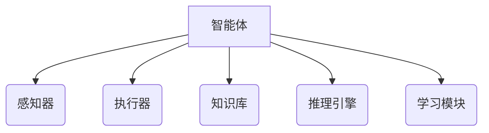
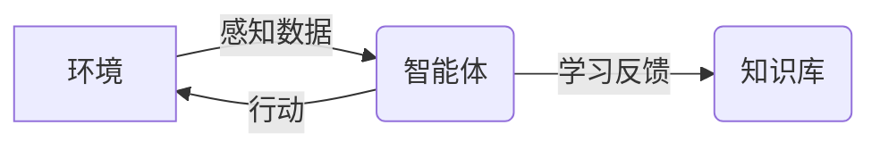
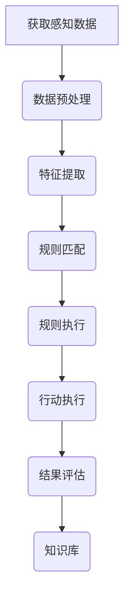

# AI人工智能 Agent：制造业中智能体的应用

## 1.背景介绍

### 1.1 制造业的重要性

制造业是推动经济发展和技术进步的关键驱动力。它不仅为社会提供必需的产品和服务,还创造了大量就业机会。然而,制造业也面临着诸多挑战,例如生产效率低下、资源利用率低、环境污染等问题。为了应对这些挑战,制造企业迫切需要采用创新技术来提高生产力和可持续性。

### 1.2 人工智能在制造业中的作用

人工智能(AI)技术在制造业中的应用可以极大地提高生产效率、优化资源利用、减少浪费和降低成本。AI系统可以通过机器学习算法分析大量数据,从而优化生产流程、预测设备故障、个性化产品设计等。此外,AI还可以辅助人工决策,提高决策的准确性和效率。

### 1.3 智能体(Agent)概念

智能体(Agent)是人工智能领域的一个重要概念。智能体是能够感知环境、处理信息、做出决策并采取行动的自主系统。在制造业中,智能体可以是机器人、软件系统或两者的组合,用于执行各种任务,如装配、检测、物流等。

## 2.核心概念与联系

### 2.1 智能体的构成

一个完整的智能体系统通常包括以下几个核心组件:

1. **感知器(Sensors)**: 用于从环境中获取信息,如视觉、声音、温度等数据。
2. **执行器(Actuators)**: 用于在环境中执行行动,如机械臂、传感器等。
3. **知识库(Knowledge Base)**: 存储智能体所拥有的知识,包括规则、事实、模型等。
4. **推理引擎(Inference Engine)**: 根据知识库和感知数据,进行推理和决策。
5. **学习模块(Learning Module)**: 使智能体能够从经验中学习,不断优化自身的知识和行为。



### 2.2 智能体与环境的交互

智能体通过感知器获取环境信息,经过推理引擎处理后,选择合适的行动通过执行器施加到环境中。同时,智能体也会根据行动的结果更新知识库,进行学习和优化。这种环境感知、决策、行动、学习的循环过程使得智能体能够不断适应和改善自身的行为。



### 2.3 智能体在制造业中的应用

智能体技术在制造业中有广泛的应用前景,例如:

- **智能机器人**: 用于装配、焊接、物流等任务。
- **预测性维护**: 通过分析传感器数据预测设备故障,提高设备利用率。
- **质量控制**: 使用计算机视觉和机器学习算法检测产品缺陷。
- **工厂调度优化**: 利用优化算法和模拟技术优化生产计划和资源分配。
- **个性化产品设计**: 根据用户需求自动生成产品设计方案。

## 3.核心算法原理具体操作步骤

智能体系统的核心是推理引擎,它根据感知数据和知识库进行决策。常用的推理算法包括规则推理、案例推理、约束推理、模糊推理等。以下是一种基于规则推理的智能体决策流程:

1. **获取感知数据**: 从环境中获取相关数据,如视觉、声音、温度等。
2. **数据预处理**: 对原始数据进行清洗、标准化等预处理,以便后续处理。
3. **特征提取**: 从预处理后的数据中提取出对决策有用的特征。
4. **规则匹配**: 将提取的特征与知识库中的规则进行匹配,找到适用的规则。
5. **规则执行**: 执行匹配到的规则,得到决策结果。
6. **行动执行**: 通过执行器将决策结果转化为具体行动,施加到环境中。
7. **结果评估**: 评估行动的效果,并将评估结果反馈到知识库,用于学习和优化。



需要注意的是,不同类型的智能体系统可能采用不同的推理算法,上述流程仅为一种典型示例。在实际应用中,还需要根据具体场景和需求进行算法选择和优化。

## 4.数学模型和公式详细讲解举例说明

### 4.1 机器学习在智能体中的应用

机器学习是智能体系统中一种重要的学习方法,它使智能体能够从数据中自动获取知识和经验。常用的机器学习算法包括监督学习、非监督学习、强化学习等。

#### 4.1.1 监督学习

监督学习是通过学习已标注的训练数据,建立输入和输出之间的映射关系。常用的监督学习算法包括线性回归、逻辑回归、决策树、支持向量机等。

以线性回归为例,我们希望找到一个线性函数 $f(x) = wx + b$ 来拟合训练数据 $(x_i, y_i)$。目标是使得预测值 $\hat{y}_i = f(x_i)$ 与真实值 $y_i$ 之间的差异最小。通常采用最小二乘法来求解参数 $w$ 和 $b$:

$$\min_{w, b} \sum_{i=1}^{n} (y_i - (wx_i + b))^2$$

其中 $n$ 是训练样本的数量。

#### 4.1.2 非监督学习

非监督学习是从未标注的数据中发现潜在的模式和结构。常用的非监督学习算法包括聚类算法(如K-Means)和降维算法(如主成分分析)。

以K-Means聚类为例,给定 $n$ 个数据点 $\{x_1, x_2, \dots, x_n\}$,我们希望将它们划分为 $K$ 个簇 $\{C_1, C_2, \dots, C_K\}$,使得簇内数据点之间的距离尽可能小,簇间数据点之间的距离尽可能大。K-Means算法的目标函数为:

$$\min_{C} \sum_{k=1}^{K} \sum_{x \in C_k} \|x - \mu_k\|^2$$

其中 $\mu_k$ 是簇 $C_k$ 的质心。算法通过迭代优化来求解最优的簇划分。

#### 4.1.3 强化学习

强化学习是一种基于环境反馈的学习方式,智能体通过不断尝试和学习,优化自身的决策策略。强化学习广泛应用于机器人控制、游戏AI等领域。

在强化学习中,智能体的行为可以用马尔可夫决策过程(MDP)来描述。MDP由一个五元组 $(S, A, P, R, \gamma)$ 组成,其中 $S$ 是状态集合, $A$ 是行动集合, $P(s'|s, a)$ 是状态转移概率, $R(s, a)$ 是即时奖励函数, $\gamma$ 是折现因子。

智能体的目标是找到一个策略 $\pi: S \rightarrow A$,使得期望的累积奖励最大:

$$\max_{\pi} \mathbb{E}\left[\sum_{t=0}^{\infty} \gamma^t R(s_t, a_t) \mid \pi\right]$$

常用的强化学习算法包括Q-Learning、策略梯度等。

### 4.2 优化算法在智能体中的应用

除了机器学习算法,优化算法也在智能体系统中发挥着重要作用,例如用于生产计划优化、资源分配优化等。

#### 4.2.1 线性规划

线性规划是一种求解线性目标函数的极值问题,在制造业中常用于资源分配优化。

假设我们有 $n$ 种资源,每种资源的可用量为 $b_i$。同时有 $m$ 种需求,每种需求对第 $j$ 种资源的需求量为 $a_{ij}$,对应的收益为 $c_j$。我们希望找到一种分配方案 $x_j$,使得总收益最大,同时满足资源约束:

$$\max \sum_{j=1}^{m} c_j x_j$$
$$\text{s.t.} \sum_{j=1}^{m} a_{ij} x_j \leq b_i, \quad i = 1, 2, \dots, n$$
$$x_j \geq 0, \quad j = 1, 2, \dots, m$$

这是一个标准的线性规划问题,可以使用单纯形算法或内点法等方法求解。

#### 4.2.2 整数规划

在实际问题中,决策变量往往需要取整数值,这就导致了整数规划问题。整数规划比线性规划更加困难,通常需要使用专门的算法和技术。

一种常用的整数规划问题是装箱问题。假设我们有 $n$ 个物品,每个物品的体积为 $v_i$,我们希望使用最少的箱子将所有物品装下,且每个箱子的容量为 $V$。我们可以引入二进制决策变量 $x_{ij}$,表示第 $i$ 个物品是否放入第 $j$ 个箱子。问题可以表述为:

$$\min \sum_{j=1}^{m} y_j$$
$$\text{s.t.} \sum_{j=1}^{m} x_{ij} = 1, \quad i = 1, 2, \dots, n$$
$$\sum_{i=1}^{n} v_i x_{ij} \leq V y_j, \quad j = 1, 2, \dots, m$$
$$x_{ij} \in \{0, 1\}, \quad y_j \in \{0, 1\}, \quad i = 1, 2, \dots, n, \quad j = 1, 2, \dots, m$$

其中 $y_j$ 是指示变量,表示第 $j$ 个箱子是否被使用。这是一个整数线性规划问题,可以使用分支定界法等算法求解。

## 5.项目实践：代码实例和详细解释说明

为了更好地理解智能体系统的实现,我们将通过一个简单的Python示例来演示如何构建一个基于规则的智能体。

假设我们有一个机器人智能体,需要根据环境中的障碍物做出相应的移动决策。我们将使用一种基于规则的推理方法,根据障碍物的位置和机器人的目标位置,选择合适的移动方向。

### 5.1 环境模拟

首先,我们定义一个简单的环境,包括机器人的当前位置、目标位置和障碍物的位置。

```python
class Environment:
    def __init__(self, robot_pos, target_pos, obstacles):
        self.robot_pos = robot_pos
        self.target_pos = target_pos
        self.obstacles = obstacles

    def get_state(self):
        return (self.robot_pos, self.target_pos, self.obstacles)
```

### 5.2 规则知识库

接下来,我们定义一个规则知识库,包含了机器人移动的规则。在这个简单的示例中,我们只考虑四个基本方向:上、下、左、右。

```python
class RuleBase:
    def __init__(self):
        self.rules = [
            # 如果目标在机器人的上方且没有障碍物,则向上移动
            lambda state: ('up', state[1][1] > state[0][1] and (state[0][0], state[0][1] + 1) not in state[2]),
            # 如果目标在机器人的下方且没有障碍物,则向下移动
            lambda state: ('down', state[1][1] < state[0][1] and (state[0][0], state[0][1] - 1) not in state[2]),
            # 如果目标在机器人的左侧且没有障碍物,则向左移动
            lambda state: ('left', state[1][0] < state[0][0] and (state[0][0] - 1, state[0][1]) not in state[2]),
            # 如果目标在机器人的右侧且没有障碍物,则向右移动
            lambda state: ('right', state[1][0]