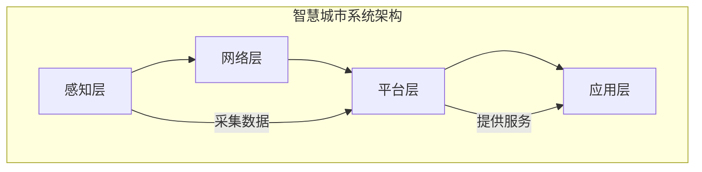
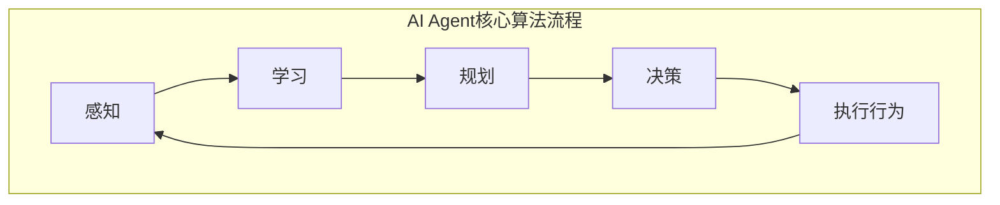

# AI人工智能 Agent：在智慧城市中的应用

## 1.背景介绍

### 1.1 智慧城市的兴起

随着城市化进程的加快,城市面临着交通拥堵、环境污染、能源浪费等一系列挑战。为了应对这些挑战,智慧城市应运而生。智慧城市是一种新型城市发展模式,它利用物联网、云计算、大数据等新兴信息技术,将城市的各种资源进行整合,实现城市运行的智能化管理和服务,提高城市运行效率、改善市民生活质量。

### 1.2 人工智能在智慧城市中的作用

人工智能(Artificial Intelligence,AI)作为智能信息处理的核心技术,在智慧城市建设中扮演着重要角色。AI能够对海量异构数据进行智能分析和决策,为智慧城市的各个领域提供智能化解决方案,如智能交通、智能环保、智能安防等。AI Agent作为AI系统的关键组成部分,在智慧城市的应用中发挥着核心作用。

## 2.核心概念与联系

### 2.1 人工智能Agent概念

人工智能Agent是一种具有自主性、反应性、主动性和持续性等特征的软件实体或硬件系统。它能够感知环境,并根据设定的目标做出理性决策,对环境产生影响。AI Agent通过与环境进行交互,完成特定任务。

AI Agent可以分为以下几种类型:

- 简单反射Agent:只考虑当前感知到的环境状态,对此作出决策和反应。
- 基于模型的Agent:利用环境模型,根据历史信息和当前状态预测未来,做出决策。
- 基于目标的Agent:根据内部知识库和目标函数,制定行为序列实现目标。
- 基于效用的Agent:将目标表示为效用函数,选择能最大化预期效用的行为。
- 学习Agent:具备学习能力,可以根据经验调整自身行为,提高任务完成能力。

### 2.2 智慧城市系统架构

智慧城市系统架构一般由感知层、网络层、平台层和应用层组成,如下图所示:



- 感知层:包括各种传感器设备,用于采集城市运行数据,如交通流量、环境数据等。
- 网络层:负责数据传输,包括有线网络和无线网络。
- 平台层:集成了云计算、大数据、人工智能等技术,对采集的数据进行存储、处理和分析,为上层应用提供支撑。
- 应用层:根据平台层提供的服务,开发智能化应用系统,如智能交通、环境监测等。

AI Agent作为平台层的核心组成部分,对海量数据进行智能分析和决策,为应用层提供智能服务。

## 3.核心算法原理具体操作步骤

AI Agent的核心算法主要包括感知、学习、规划和决策四个部分。下面将详细介绍这四个部分的具体原理和操作步骤。

### 3.1 感知

感知是AI Agent获取环境信息的过程。常见的感知方法有:

1. 通过传感器获取环境数据,如视觉传感器、声音传感器等。
2. 从数据库或知识库中获取相关信息。

感知过程的步骤如下:

1) 确定需要感知的环境状态,如交通流量、天气情况等。
2) 选择合适的传感器设备或数据源。
3) 对原始数据进行预处理,如去噪、特征提取等。
4) 将处理后的数据输入到Agent的状态表示中。

### 3.2 学习

学习是AI Agent获取新知识、优化决策的重要机制。常见的学习方法有:

1. 监督学习:利用带标签的训练数据,学习出一个能够正确预测的模型。
2. 无监督学习:在无标签数据的情况下,发现数据内在的模式和规律。
3. 强化学习:通过与环境交互获得奖励信号,不断优化决策策略。

学习过程的步骤如下:

1) 确定学习目标,如分类、聚类、决策等。
2) 选择合适的学习算法,如决策树、神经网络等。
3) 准备训练数据,对数据进行清洗和预处理。
4) 训练模型,调整模型参数。
5) 在测试数据上评估模型性能,必要时进行模型优化。
6) 将训练好的模型部署到Agent系统中。

### 3.3 规划

规划是AI Agent制定行为序列以实现目标的过程。常见的规划方法有:

1. 经典规划:利用状态空间搜索等方法,生成达到目标的行为序列。
2. 启发式规划:利用评估函数对搜索过程进行引导,提高规划效率。
3. 时序规划:考虑行为执行的时间约束,生成满足时间条件的行为序列。

规划过程的步骤如下:

1) 定义问题域,包括初始状态、目标状态和可执行操作。
2) 选择合适的规划算法,如A*算法、时序约束满足问题求解器等。
3) 根据当前状态和目标状态,生成达到目标的行为序列。
4) 对生成的行为序列进行优化,如删减冗余操作、并行执行等。
5) 将优化后的行为序列输出给决策模块执行。

### 3.4 决策

决策是AI Agent根据当前状态和规划结果,选择合适行为的过程。常见的决策方法有:

1. 基于规则的决策:根据预定义的规则对行为进行选择。
2. 基于效用的决策:根据行为的预期效用值进行选择。
3. 基于策略的决策:根据学习到的最优策略对行为进行选择。

决策过程的步骤如下:

1) 获取当前环境状态和规划生成的行为序列。
2) 根据决策算法,计算每个可选行为的评估值或效用值。
3) 选择评估值最高或效用值最大的行为执行。
4) 观测执行后的环境状态,作为下一周期决策的输入。

上述四个部分相互协作,构成了AI Agent的核心算法流程,如下图所示:



## 4.数学模型和公式详细讲解举例说明

在AI Agent的算法中,常常需要使用数学模型和公式对问题进行形式化描述和求解。下面将介绍几种常用的数学模型和公式。

### 4.1 马尔可夫决策过程

马尔可夫决策过程(Markov Decision Process,MDP)是强化学习和决策理论中常用的数学模型。MDP可以形式化描述一个完全可观测的决策序列问题。

一个MDP可以用一个五元组$(S, A, P, R, \gamma)$来表示:

- $S$是环境的状态集合
- $A$是Agent可执行的动作集合
- $P(s'|s, a)$是状态转移概率,表示在状态$s$执行动作$a$后,转移到状态$s'$的概率
- $R(s, a)$是在状态$s$执行动作$a$后获得的即时奖励
- $\gamma \in [0, 1)$是折现因子,用于权衡未来奖励的重要性

MDP的目标是找到一个策略$\pi: S \rightarrow A$,使得期望的累积折现奖励最大:

$$
\max_\pi \mathbb{E}\left[ \sum_{t=0}^\infty \gamma^t R(s_t, a_t) \right]
$$

其中$s_t$和$a_t$分别表示第$t$个时刻的状态和动作。

常用的求解MDP的算法有价值迭代和策略迭代等。

### 4.2 partially observable马尔可夫决策过程

Partially Observable Markov Decision Process(POMDP)是一种更一般的MDP模型,用于描述部分可观测的决策序列问题。

在POMDP中,Agent无法直接获取环境的真实状态,只能通过观测$o_t$来间接推断状态。POMDP可以用一个六元组$(S, A, P, R, \Omega, O)$来表示:

- $S, A, P, R$的含义与MDP相同
- $\Omega$是观测集合
- $O(o|s', a)$是观测概率,表示在执行动作$a$并转移到状态$s'$后,获得观测$o$的概率

POMDP的目标是找到一个策略$\pi: H \rightarrow A$,使得期望的累积折现奖励最大,其中$H$是历史序列,包含之前的动作和观测。

由于POMDP的状态是部分可观测的,求解POMDP比MDP更加复杂。常用的算法有点基值迭代、有界策略迭代等。

### 4.3 约束优化问题

在AI Agent的决策过程中,常常需要在满足一定约束条件的前提下,寻找最优解。这可以形式化为一个约束优化问题(Constrained Optimization Problem)。

一个约束优化问题可以表示为:

$$
\begin{aligned}
\max_{x} & \quad f(x) \\
\text{s.t.} & \quad g_i(x) \leq 0, \quad i = 1, \ldots, m \\
& \quad h_j(x) = 0, \quad j = 1, \ldots, p
\end{aligned}
$$

其中:

- $x$是决策变量
- $f(x)$是目标函数,需要最大化
- $g_i(x) \leq 0$是不等式约束条件
- $h_j(x) = 0$是等式约束条件

常用的求解约束优化问题的算法有序列二次规划(Sequential Quadratic Programming, SQP)、内点法(Interior Point Method)等。

### 4.4 其他常用数学工具

除了上述模型和公式,AI Agent算法中还常常使用以下数学工具:

- **概率论和统计学**: 用于处理不确定性问题,如贝叶斯推理、高斯过程等。
- **线性代数**: 矩阵和向量运算广泛应用于机器学习算法中,如主成分分析、奇异值分解等。
- **微积分**: 用于建模和优化,如梯度下降、拉格朗日乘数法等。
- **图论**: 用于表示和处理结构化数据,如最短路径、最大流等。
- **逻辑与推理**: 用于知识表示和自动推理,如命题逻辑、一阶逻辑等。

总之,数学模型和工具为AI Agent算法提供了强有力的理论支撑,是实现智能决策的基础。

## 5.项目实践:代码实例和详细解释说明

为了帮助读者更好地理解AI Agent的原理和实现,下面将给出一个简单的智能交通控制系统的代码示例,并进行详细解释。

### 5.1 问题描述

假设我们需要设计一个智能交通控制系统,用于控制一个路口的红绿灯。该系统需要根据来往车辆的流量,自动调节红绿灯的时长,以实现交通流量的最优化。

我们将这个问题建模为一个POMDP,其中:

- 状态$S$是车流量的离散值
- 动作$A$是调整红绿灯时长
- 观测$O$是感知到的车流量
- 奖励$R$是路口的通过率

### 5.2 代码实现

我们使用Python和PyTorch库来实现这个智能交通控制系统。完整代码如下:

```python
import torch
import torch.nn as nn
import torch.optim as optim
import numpy as np

# 定义POMDP参数
NUM_STATES = 10  # 车流量的离散值个数
NUM_ACTIONS = 3  # 调整红绿灯时长的动作个数
NUM_OBSERVATIONS = 5  # 感知到的车流量离散值个数

# 定义环境模型
transition_model = torch.rand(NUM_STATES, NUM_ACTIONS, NUM_STATES)  # 状态转移概率模型
observation_model = torch.rand(NUM_STATES, NUM_ACTIONS, NUM_OBSERVATIONS)  # 观测概率模型
reward_model = torch