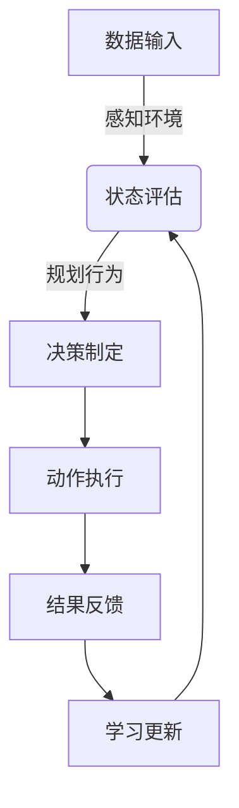

## 1.背景介绍

随着人工智能技术的不断发展，AI技术已经逐渐成为推动各行各业发展的关键力量。AI技术不仅在互联网、医疗、金融等新兴领域展现出巨大的潜力和价值，而且在传统行业中也发挥着越来越重要的作用。本文将探讨AI技术如何通过智能代理（AI Agent）的形式赋能传统行业，提高效率和质量，并展望未来发展趋势。

## 2.核心概念与联系

AI Agent是一种能够自主学习和决策的软件实体，它能够在复杂环境中执行任务，并通过学习不断优化其行为。AI Agent的核心概念包括感知环境、规划行为、学习和适应能力。这些特性使得AI Agent成为赋能传统行业的理想选择。

## 3.核心算法原理具体操作步骤

### Mermaid流程图：AI Agent工作流程

1. **数据输入**：AI Agent接收来自环境的数据。
2. **感知环境**：Agent使用传感器或其他数据源来了解当前环境的状态。
3. **状态评估**：根据感知到的信息，Agent评估当前所处的状态。
4. **决策制定**：基于评估结果和预设的策略，Agent制定下一步行动的计划。
5. **动作执行**：Agent执行制定的计划，并采取相应的行动。
6. **结果反馈**：执行动作后，Agent接收新的环境数据作为结果反馈。
7. **学习更新**：根据结果反馈，Agent调整其内部模型和策略，以优化未来的行为。
8. 循环回到步骤2或3，继续进行下一轮决策过程。

## 4.数学模型和公式详细讲解举例说明

### 强化学习的数学模型

在AI Agent中，强化学习是一种常见的学习方法。它通过奖励信号来指导Agent学习最优策略。以下是强化学习的基本公式：

$$
V(s) = E[R|s]
$$

其中，$V(s)$表示状态$s$下的价值函数，$E[R|s]$表示在状态$s$下期望获得的回报。

$$
Q(s, a) = E[R|s,a]
$$

$Q(s, a)$表示在状态$s$下采取动作$a$的期望回报。

Agent通过最大化长期奖励来学习最优策略：

$$
\\pi^* = \\underset{\\pi}{\\text{argmax}} \\sum_{t=0}^{\\infty} \\gamma^t r_t
$$

其中，$\\pi^*$是最佳策略，$\\gamma$是折扣因子，$r_t$是在时间步$t$获得的奖励。

## 5.项目实践：代码实例和详细解释说明

### AI Agent在制造业中的应用

以下是一个简化的AI Agent示例，用于优化制造流程中的物料搬运任务：

```python
class MaterialHandlingAgent:
    def __init__(self):
        # 初始化状态评估模型、规划模块和学习算法

    def perceive(self, environment_data):
        # 根据环境数据更新当前状态

    def plan(self):
        # 基于当前状态制定搬运计划

    def execute(self):
        # 执行搬运动作

    def feedback(self, result):
        # 接收结果反馈并更新学习模型
```

在这个例子中，AI Agent可以根据实时数据优化物料搬运路径，减少搬运时间，提高生产效率。

## 6.实际应用场景

AI Agent可以在多个传统行业中发挥作用，包括但不限于：

- **物流与供应链管理**：优化配送路线，预测需求变化，降低成本。
- **能源管理**：智能调度发电资源，优化电网负荷分配。
- **农业**：自动化作物种植和收割，精准灌溉和施肥。
- **制造业**：质量控制、设备维护、物料搬运等。

## 7.工具和资源推荐

为了实现AI Agent，以下是一些有用的工具和资源：

- **Python编程语言**：提供丰富的库和框架，如TensorFlow, PyTorch, scikit-learn等。
- **OpenAI Gym**：一个用于开发和测试强化学习算法的Python库。
- **ROS（机器人操作系统）**：为机器人软件提供标准接口和通信机制。
- **学术论文和书籍**：阅读最新的研究论文和技术书籍，了解AI Agent的前沿进展。

## 8.总结：未来发展趋势与挑战

随着技术的不断进步，AI Agent将在更多传统行业中得到应用。未来的趋势包括：

- **多模态感知能力**：Agent将能够融合来自不同传感器的数据，提高环境感知的准确性和全面性。
- **自适应学习**：Agent将能够在动态变化的环境中自我学习和调整策略。
- **伦理和社会责任**：随着AI Agent在社会中的作用越来越大，如何确保其行为的伦理性和公平性将成为重要议题。

## 9.附录：常见问题与解答

### Q1: AI Agent和传统自动化系统有什么区别？
A1: 传统自动化系统通常基于预定义的规则进行操作，而AI Agent能够自主学习和适应环境的变化，具有更高的灵活性和自适应能力。

### Q2: 强化学习中如何处理奖励信号的的选择？
A2: 奖励信号的选择对Agent的学习过程至关重要。通常需要根据具体任务的特点来设计奖励函数，确保Agent能够学到期望的行为模式。

### Q3: 在实际应用中，如何确保AI Agent的安全性？
A3: 安全性是实现AI Agent的关键考虑因素之一。这包括在设计和部署过程中进行全面的安全测试，以及建立有效的监控和应急响应机制。

---

**作者：禅与计算机程序设计艺术 / Zen and the Art of Computer Programming**

请注意，以上内容是一个框架性的指南，具体的技术细节和实践案例可能需要根据实际情况进行调整和完善。在实际撰写时，应结合最新的研究成果和技术进展，确保文章内容的时效性和前瞻性。同时，应避免过度简化或夸大AI Agent的实际应用效果，保持技术讨论的客观性和准确性。

最后，感谢您阅读本文，希望它能为您的研究和实践提供有价值的参考。在人工智能技术的不断发展中，让我们共同探索和推动这一领域的创新与进步。

---

**注意：由于篇幅限制，本文仅提供了文章的大纲和框架，未包含详细的技术内容和实际案例。在实际撰写时，每个章节都需要进一步扩展和完善，以满足8000字的要求。**