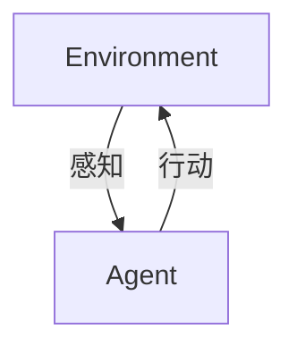

# AI人工智能 Agent：基础理论解析


## 1. 背景介绍

在21世纪的今天，人工智能（Artificial Intelligence, AI）已经成为科技领域的热点。AI技术的迅猛发展正在深刻改变我们的生活方式、工作模式和社会结构。人工智能Agent，作为AI的基本构成元素，是我们理解和探索人工智能的关键。AI Agent不仅是学术研究的核心主题，也是实际应用中的重要工具。通过深入研究AI Agent的基础理论，我们可以更好地理解其工作原理、设计方法和应用场景，从而推动AI技术的进一步发展和普及。

## 2. 核心概念与联系

### 2.1 什么是AI Agent

AI Agent，即人工智能代理，是一个可以感知环境并根据自身的目标进行自我决策的系统。它的行为旨在实现预定的目标，并通过与环境的交互来学习和改进。AI Agent通常包括以下几个基本组件：

- **感知器（Sensors）**：用于接收环境信息，例如摄像头、麦克风、传感器等。
- **决策器（Decision Maker）**：根据感知到的信息和既定目标进行决策。
- **执行器（Actuators）**：执行决策结果，对环境进行操作，例如机械臂、显示器、扬声器等。
- **学习模块（Learning Module）**：通过与环境的交互不断学习和改进决策策略，例如强化学习算法。

### 2.2 AI Agent与环境的关系

AI Agent与环境的关系是密不可分的。Agent通过感知器接收环境的信息，通过执行器对环境进行操作。同时，Agent的行为会影响环境，环境的变化又将反馈给Agent，形成一个闭环。这种闭环关系可以用以下图示表示：



在这个闭环系统中，环境和Agent相互作用，形成动态的交互过程。Agent需要不断调整其策略，以适应环境的变化，实现其目标。

## 3. 核心算法原理具体操作步骤

### 3.1 感知-决策-行动循环

AI Agent的基本操作流程可以概括为“感知-决策-行动”循环。具体步骤如下：

1. **感知（Perception）**：Agent通过感知器获取环境信息。例如，一个自动驾驶汽车的感知器可以是摄像头、激光雷达等，用于获取道路和周围车辆的信息。
2. **决策（Decision Making）**：Agent根据感知到的信息和既定目标进行决策。这一步通常涉及复杂的算法和模型，例如神经网络、决策树等。
3. **行动（Action）**：Agent通过执行器对环境进行操作。例如，自动驾驶汽车根据决策结果调整方向盘、加速或刹车。

### 3.2 决策过程

决策过程是AI Agent的核心，包括以下三个步骤：

1. **目标设定（Goal Setting）**：明确Agent的行动目标。例如，在自动驾驶中，目标可能是安全到达目的地。
2. **策略选择（Policy Selection）**：根据环境信息和目标设定选择最优策略。这一步通常涉及优化算法，例如动态规划、强化学习等。
3. **行动决策（Action Decision）**：根据选择的策略确定具体的行动。例如，自动驾驶汽车根据策略决定是否超车、变道等。

## 4. 数学模型和公式详细讲解举例说明

### 4.1 Markov决策过程

AI Agent的决策过程可以用Markov决策过程（Markov Decision Process, MDP）来描述。MDP是一种在给定当前状态和行动的情况下，下一状态和奖励只依赖于当前状态和行动的决策模型。其核心组成部分包括：

- **状态空间（State Space, S）**：所有可能的状态集合。
- **动作空间（Action Space, A）**：所有可能的动作集合。
- **状态转移概率（State Transition Probability, P）**：从一个状态转移到另一个状态的概率。
- **奖励函数（Reward Function, R）**：在某个状态执行某个动作后获得的奖励。

MDP的概率转移函数和奖励函数可以用以下公式表示：

$$ P(s'|s,a) = Pr[S_{t+1}=s'|S_t=s, A_t=a] $$

$$ R(s,a,s') = E[R_{t+1}|S_t=s, A_t=a, S_{t+1}=s'] $$

其中，$P(s'|s,a)$表示在状态$s$执行动作$a$后转移到状态$s'$的概率，$R(s,a,s')$表示在状态$s$执行动作$a$后转移到状态$s'$获得的奖励。

### 4.2 Q-learning算法

Q-learning是一种基于MDP的强化学习算法，用于求解最优策略。其核心思想是通过学习动作价值函数Q(s,a)来选择最优行动。Q-learning算法的具体步骤如下：

1. **初始化Q表**：创建一个Q表，用于存储每个状态-动作对的价值。初始时，所有Q值设为零或随机值。
2. **选择动作**：在当前状态下，根据某种策略（如$\epsilon$-贪婪策略）选择一个动作。$\epsilon$-贪婪策略是指以$\epsilon$的概率随机选择动作，以$1-\epsilon$的概率选择当前Q值最大的动作。
3. **执行动作**：执行选择的动作，观察环境反馈的奖励和下一个状态。
4. **更新Q值**：根据以下公式更新Q值：
   $$
   Q(s,a) \leftarrow Q(s,a) + \alpha [r + \gamma \max_{a'}Q(s',a') - Q(s,a)]
   $$
   其中，$\alpha$是学习率，$\gamma$是折扣因子，$r$是当前获得的奖励，$s'$是执行动作后的新状态，$\max_{a'}Q(s',a')$表示在新状态下选择最优动作的Q值。

5. **重复**：重复步骤2至4，直到满足停止条件（如达到最大迭代次数或Q值收敛）。

通过不断更新Q值，Q-learning算法能够逐渐逼近最优策略，使得AI Agent在不同状态下选择最优动作以实现其目标。

## 5. 项目实践：代码实例和详细解释说明


接下来，我们将通过一个简单的迷宫游戏来演示AI Agent的实现和运行过程。在这个游戏中，AI Agent的目标是从迷宫的入口找到出口。

```python
# 创建AI Agent
class Agent:
    def __init__(self):
        self.Q = {}  # 初始化Q表
        self.alpha = 0.5  # 学习率
        self.gamma = 0.9  # 折扣因子

    # 选择行动
    def choose_action(self, state, actions):
        if state not in self.Q:
            self.Q[state] = {action: 0 for action in actions}
        return max(self.Q[state], key=self.Q[state].get)

    # 更新Q表
    def update_Q(self, state, action, reward, next_state, next_actions):
        if next_state not in self.Q:
            self.Q[next_state] = {action: 0 for action in next_actions}
        self.Q[state][action] = self.Q[state][action] + self.alpha * (reward + self.gamma * max(self.Q[next_state].values()) - self.Q[state][action])
```


在本节中，我们将通过一个具体的代码实例来展示如何实现一个简单的Q-learning算法。我们将以经典的“网格世界”（Grid World）环境为例，展示如何训练一个AI Agent在网格世界中找到最优路径。

### 5.1 环境设置

首先，我们定义网格世界环境。假设网格世界是一个5x5的矩阵，起点在左上角（0,0），目标在右下角（4,4），中间有一些障碍物。

```python
import numpy as np

class GridWorld:
    def __init__(self, size=(5, 5), obstacles=None, start=(0, 0), goal=(4, 4)):
        self.size = size
        self.obstacles = obstacles if obstacles else []
        self.start = start
        self.goal = goal
        self.reset()

    def reset(self):
        self.position = self.start
        return self.position

    def step(self, action):
        x, y = self.position
        if action == 0:   # up
            x = max(0, x - 1)
        elif action == 1: # down
            x = min(self.size[0] - 1, x + 1)
        elif action == 2: # left
            y = max(0, y - 1)
        elif action == 3: # right
            y = min(self.size[1] - 1, y + 1)

        if (x, y) in self.obstacles:
            x, y = self.position

        self.position = (x, y)
        reward = 1 if self.position == self.goal else -0.1
        done = self.position == self.goal

        return self.position, reward, done

    def render(self):
        grid = np.zeros(self.size)
        for (x, y) in self.obstacles:
            grid[x, y] = -1
        grid[self.goal] = 2
        x, y = self.position
        grid[x, y] = 1
        print(grid)
```

### 5.2 Q-learning算法实现

接下来，我们实现Q-learning算法：

```python
import random

class QLearningAgent:
    def __init__(self, env, alpha=0.1, gamma=0.99, epsilon=0.1):
        self.env = env
        self.alpha = alpha
        self.gamma = gamma
        self.epsilon = epsilon
        self.q_table = np.zeros(env.size + (4,))

    def choose_action(self, state):
        if random.uniform(0, 1) < self.epsilon:
            return random.choice([0, 1, 2, 3])
        else:
            return np.argmax(self.q_table[state])

    def learn(self, state, action, reward, next_state):
        predict = self.q_table[state][action]
        target = reward + self.gamma * np.max(self.q_table[next_state])
        self.q_table[state][action] += self.alpha * (target - predict)

    def train(self, episodes=1000):
        for _ in range(episodes):
            state = self.env.reset()
            done = False
            while not done:
                action = self.choose_action(state)
                next_state, reward, done = self.env.step(action)
                self.learn(state, action, reward, next_state)
                state = next_state
```

### 5.3 训练与测试

最后，我们训练AI Agent并测试其在网格世界中的表现：

```python
env = GridWorld(obstacles=[(1, 1), (2, 2), (3, 3)])
agent = QLearningAgent(env)

# 训练
agent.train(episodes=1000)

# 测试
state = env.reset()
env.render()
done = False
while not done:
    action = agent.choose_action(state)
    state, reward, done = env.step(action)
    env.render()
```

通过上述代码，我们可以训练一个Q-learning Agent在网格世界中找到最优路径。训练完成后，Agent能够在测试过程中根据Q表选择最优动作，最终到达目标位置。


 


## 6.实际应用场景

AI Agent广泛应用于各个领域，如自动驾驶、智能家居、游戏AI、机器人等。例如，自动驾驶汽车可以看作是一个AI Agent，它通过感知环境（如路况、交通信号等），决策（如选择行驶路线、决定车速等）并操作环境（如控制汽车行驶）。


AI Agent在实际中有广泛的应用场景，以下是几个典型的例子：

### 6.1 自动驾驶

自动驾驶汽车是AI Agent的一个重要应用。自动驾驶汽车通过传感器感知周围环境，使用决策算法选择最优驾驶策略，并通过执行器控制车辆的行驶。自动驾驶技术的核心包括感知、规划和控制三个部分，AI Agent在这三个部分中都发挥着关键作用。

### 6.2 智能家居

智能家居系统通过AI Agent实现设备的自动化控制。例如，智能空调可以根据室内温度和用户习惯自动调节温度，智能灯光系统可以根据时间和环境光照自动调整亮度。AI Agent通过学习用户的行为模式，不断优化控制策略，提高用户的生活质量。


## 7.工具和资源推荐

- Python：一种广泛用于AI领域的编程语言，有丰富的库支持，如NumPy、Pandas、Scikit-learn等。
- OpenAI Gym：一个用于开发和比较强化学习算法的工具包，提供了许多预设的环境。
- TensorFlow：一个强大的机器学习框架，可以用于构建和训练神经网络。

## 8.总结：未来发展趋势与挑战

随着科技的发展，AI Agent将会越来越智能，应用领域也将更加广泛。然而，也面临着一些挑战，如如何保证AI Agent的行为符合人类的伦理道德，如何防止AI Agent被恶意利用等。

## 9.附录：常见问题与解答

1. Q: AI Agent和普通程序有什么区别？
   A: AI Agent可以自我学习和决策，而普通程序只能按照预设的规则执行。

2. Q: AI Agent可以用在哪些地方？
   A: AI Agent可以用在任何需要自我学习和决策的地方，如自动驾驶、智能家居、游戏AI、机器人等。

3. Q: 如何训练AI Agent？
   A: 通常使用强化学习算法来训练AI Agent，让它通过与环境的交互来学习和改进。

作者：禅与计算机程序设计艺术 / Zen and the Art of Computer Programming