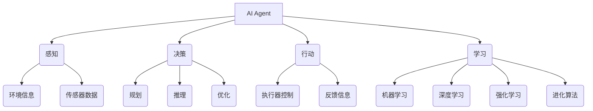

# AI人工智能 Agent：对生活的影响

## 1. 背景介绍
### 1.1 人工智能的发展历程
#### 1.1.1 人工智能的起源与早期发展
#### 1.1.2 人工智能的现状与突破
#### 1.1.3 人工智能的未来展望

### 1.2 AI Agent的定义与分类
#### 1.2.1 AI Agent的定义
#### 1.2.2 AI Agent的分类
#### 1.2.3 AI Agent的特点

### 1.3 AI Agent对生活的影响概述
#### 1.3.1 AI Agent在各行业的应用现状
#### 1.3.2 AI Agent对生活方式的改变
#### 1.3.3 AI Agent带来的机遇与挑战

## 2. 核心概念与联系
### 2.1 AI Agent的核心概念
#### 2.1.1 感知(Perception)
#### 2.1.2 决策(Decision Making)
#### 2.1.3 行动(Action)
#### 2.1.4 学习(Learning)

### 2.2 AI Agent与机器学习、深度学习的关系
#### 2.2.1 机器学习在AI Agent中的应用
#### 2.2.2 深度学习在AI Agent中的应用
#### 2.2.3 AI Agent与机器学习、深度学习的互补与融合

### 2.3 AI Agent与其他人工智能技术的关系
#### 2.3.1 AI Agent与自然语言处理的关系
#### 2.3.2 AI Agent与计算机视觉的关系
#### 2.3.3 AI Agent与知识图谱的关系

## 3. 核心算法原理具体操作步骤
### 3.1 强化学习(Reinforcement Learning)
#### 3.1.1 马尔可夫决策过程(Markov Decision Process)
#### 3.1.2 Q-Learning算法
#### 3.1.3 深度强化学习(Deep Reinforcement Learning)

### 3.2 蒙特卡洛树搜索(Monte Carlo Tree Search)
#### 3.2.1 蒙特卡洛树搜索的基本原理
#### 3.2.2 蒙特卡洛树搜索的具体步骤
#### 3.2.3 蒙特卡洛树搜索在AI Agent中的应用

### 3.3 进化算法(Evolutionary Algorithm)
#### 3.3.1 遗传算法(Genetic Algorithm)
#### 3.3.2 进化策略(Evolution Strategy)
#### 3.3.3 遗传编程(Genetic Programming)

## 4. 数学模型和公式详细讲解举例说明
### 4.1 马尔可夫决策过程数学模型
#### 4.1.1 状态转移概率矩阵
#### 4.1.2 奖励函数
#### 4.1.3 贝尔曼方程(Bellman Equation)

### 4.2 Q-Learning算法数学模型
#### 4.2.1 Q值更新公式
#### 4.2.2 ε-贪心策略(ε-Greedy Policy)
#### 4.2.3 Q-Learning算法的收敛性证明

### 4.3 蒙特卡洛树搜索数学模型
#### 4.3.1 上置信区间(Upper Confidence Bound)
#### 4.3.2 策略值网络(Policy Value Network)
#### 4.3.3 蒙特卡洛树搜索的收敛性分析

## 5. 项目实践：代码实例和详细解释说明
### 5.1 基于强化学习的AI Agent项目实践
#### 5.1.1 OpenAI Gym环境介绍
#### 5.1.2 DQN(Deep Q-Network)算法实现
#### 5.1.3 PPO(Proximal Policy Optimization)算法实现

### 5.2 基于蒙特卡洛树搜索的AI Agent项目实践
#### 5.2.1 AlphaGo的蒙特卡洛树搜索实现
#### 5.2.2 蒙特卡洛树搜索在游戏AI中的应用
#### 5.2.3 蒙特卡洛树搜索在机器人路径规划中的应用

### 5.3 基于进化算法的AI Agent项目实践
#### 5.3.1 遗传算法在优化问题中的应用
#### 5.3.2 进化策略在连续控制问题中的应用
#### 5.3.3 遗传编程在自动化程序设计中的应用

## 6. 实际应用场景
### 6.1 智能助理与客服
#### 6.1.1 智能客服系统的实现原理
#### 6.1.2 基于自然语言处理的智能助理
#### 6.1.3 情感计算在智能助理中的应用

### 6.2 自动驾驶与智能交通
#### 6.2.1 自动驾驶汽车的决策与控制
#### 6.2.2 交通流量预测与优化
#### 6.2.3 车联网与智能交通系统

### 6.3 智能医疗与健康管理
#### 6.3.1 医疗诊断与辅助决策
#### 6.3.2 药物研发与个性化治疗
#### 6.3.3 健康监测与预测

## 7. 工具和资源推荐
### 7.1 机器学习与深度学习框架
#### 7.1.1 TensorFlow
#### 7.1.2 PyTorch
#### 7.1.3 Keras

### 7.2 强化学习与蒙特卡洛树搜索库
#### 7.2.1 OpenAI Baselines
#### 7.2.2 Stable Baselines
#### 7.2.3 RLlib

### 7.3 进化算法库
#### 7.3.1 DEAP(Distributed Evolutionary Algorithms in Python)
#### 7.3.2 PyGAD(Python Genetic Algorithm Library)
#### 7.3.3 LEAP(Library for Evolutionary Algorithms in Python)

## 8. 总结：未来发展趋势与挑战
### 8.1 AI Agent的发展趋势
#### 8.1.1 多智能体系统(Multi-Agent System)
#### 8.1.2 人机协作与共生
#### 8.1.3 可解释性与透明度

### 8.2 AI Agent面临的挑战
#### 8.2.1 伦理与安全问题
#### 8.2.2 数据隐私与保护
#### 8.2.3 算法偏见与公平性

### 8.3 AI Agent的未来展望
#### 8.3.1 人工智能的普及与应用
#### 8.3.2 人工智能与人类智能的融合
#### 8.3.3 人工智能推动社会进步

## 9. 附录：常见问题与解答
### 9.1 AI Agent与人工智能的区别
### 9.2 AI Agent的局限性
### 9.3 如何评估AI Agent的性能
### 9.4 AI Agent的安全性如何保障
### 9.5 AI Agent对就业的影响

人工智能(Artificial Intelligence, AI)是计算机科学的一个分支,旨在创造能够模拟人类智能的机器。AI Agent则是人工智能的一个重要概念,指的是能够感知环境、做出决策并采取行动的自主实体。AI Agent通过机器学习、深度学习等技术,不断学习和优化自身的决策和行为,以适应复杂多变的环境。

AI Agent的核心概念包括感知、决策、行动和学习。感知是指AI Agent通过传感器获取环境信息,决策是指根据感知信息和自身知识做出判断和规划,行动是指通过执行器控制实体与环境交互,学习则是指不断优化感知、决策和行动的过程。这四个概念相互关联,共同构成了AI Agent的基本框架。

AI Agent的实现离不开机器学习、深度学习等人工智能技术的支持。机器学习通过数据驱动的方式,让AI Agent从经验中总结规律,不断优化自身的决策模型。深度学习则利用多层神经网络,让AI Agent能够处理更加复杂的感知和决策任务。此外,强化学习、进化算法等技术也在AI Agent的实现中发挥着重要作用。

强化学习是AI Agent的核心算法之一,其基本原理是通过试错和奖惩机制,让AI Agent学习最优的决策策略。马尔可夫决策过程(Markov Decision Process, MDP)是强化学习的数学基础,描述了AI Agent与环境交互的过程。在MDP中,AI Agent根据当前状态选择动作,环境根据动作给出奖励和下一个状态,AI Agent的目标是最大化累积奖励。Q-Learning是一种经典的强化学习算法,通过不断更新状态-动作值函数(Q函数),逐步逼近最优策略。深度强化学习则将深度学习与强化学习相结合,使用深度神经网络来逼近Q函数或策略函数,从而让AI Agent能够处理高维、连续的状态和动作空间。

蒙特卡洛树搜索(Monte Carlo Tree Search, MCTS)是另一种重要的AI Agent算法,常用于博弈和规划问题。MCTS通过随机采样和树搜索相结合的方式,在有限的时间内找到近似最优的决策。其基本步骤包括选择、扩展、模拟和回溯,通过不断迭代这四个步骤,逐步构建和优化搜索树。上置信区间(Upper Confidence Bound, UCB)是MCTS中常用的节点选择策略,通过平衡探索和利用,选择最有潜力的子节点进行扩展。AlphaGo等著名的AI Agent都采用了MCTS算法,在围棋、国际象棋等领域取得了重大突破。

进化算法是一类基于生物进化原理的优化算法,在AI Agent的实现中也有广泛应用。遗传算法、进化策略、遗传编程等都属于进化算法的范畴。进化算法通过模拟自然选择和遗传变异的过程,不断优化AI Agent的决策模型或控制策略。与传统的优化算法相比,进化算法具有更强的全局搜索能力和鲁棒性,能够处理非凸、非线性、多模态的优化问题。

AI Agent在智能助理、自动驾驶、智能医疗等领域有广泛的应用前景。以智能助理为例,基于自然语言处理和情感计算技术,AI Agent能够理解用户的语义和情感,提供个性化的服务和交互体验。在自动驾驶领域,AI Agent通过感知、决策、控制等模块,实现车辆的自主导航和避障。在智能医疗领域,AI Agent可以辅助医生进行诊断和治疗决策,提高医疗质量和效率。

未来,AI Agent将向着多智能体系统、人机协作、可解释性等方向发展。多智能体系统研究多个AI Agent之间的交互和协作,人机协作则探索人与AI Agent之间的无缝配合,可解释性旨在让AI Agent的决策过程更加透明和可理解。同时,AI Agent的发展也面临着伦理、安全、隐私等方面的挑战,需要在技术进步的同时,加强对伦理和安全问题的研究和管理。

总之,AI Agent是人工智能领域的重要研究方向,对人类生活和社会发展有着深远的影响。通过机器学习、深度学习、强化学习、进化算法等技术,AI Agent不断提升感知、决策、行动和学习的能力,在各个领域展现出广阔的应用前景。未来,AI Agent将与人类智能进一步融合,推动人工智能的普及和应用,为人类社会的进步贡献力量。

作者：禅与计算机程序设计艺术 / Zen and the Art of Computer Programming