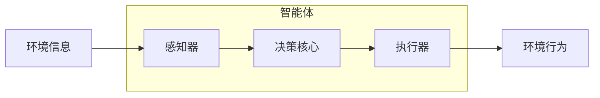

# AI人工智能 Agent：资源配置中智能体的应用

## 1.背景介绍

### 1.1 资源配置问题概述

在现实世界中,资源往往是有限的,如何合理分配和利用这些资源以实现最大化效益是一个长期存在的挑战。资源配置问题广泛存在于各个领域,例如生产调度、项目管理、运输优化等。传统的资源配置方法通常基于确定性模型和经验规则,但在复杂动态环境下,这些方法往往效率低下且不够灵活。

随着人工智能技术的发展,智能体(Agent)系统逐渐应用于资源配置领域,展现出巨大的潜力。智能体是具有自主性、反应性、主动性和社会能力的软件实体,能够根据环境状态做出合理决策并执行相应行为。在资源配置场景中,智能体可以实时感知环境变化,动态调整分配策略,从而提高资源利用效率。

### 1.2 智能体在资源配置中的应用价值

相较于传统方法,应用智能体技术进行资源配置具有以下优势:

1. **动态决策**:智能体能够根据环境状态的变化实时调整资源分配策略,提高系统的响应能力和适应性。

2. **自主协作**:多个智能体可以通过协作完成复杂的资源配置任务,并通过竞争实现最优化。

3. **学习优化**:智能体具备学习能力,可以从历史数据中总结经验,持续优化资源分配策略。

4. **高效分布式**:智能体系统天然具有分布式特性,能够高效处理大规模资源配置问题。

5. **可解释性**:基于规则的智能体决策过程具有可解释性,有助于提高决策的透明度和可信度。

基于上述优势,智能体技术在资源配置领域展现出广阔的应用前景,有望显著提升资源利用效率,降低运营成本,创造更大的经济价值。

## 2.核心概念与联系

### 2.1 智能体(Agent)

智能体是具有自主性的计算机系统,能够根据感知环境做出决策并执行相应行为,以实现特定目标。一个智能体系统通常包括以下几个核心组件:

- **感知器(Sensor)**: 用于获取环境状态信息。
- **执行器(Actuator)**: 用于在环境中执行行为。
- **决策核心(Decision Core)**: 根据感知信息做出决策,选择合适的行为。

智能体与环境之间通过感知-决策-行为的闭环交互过程来完成任务。根据决策核心的不同,智能体可分为反应型、基于模型、基于目标、基于效用等多种类型。

### 2.2 资源配置问题

资源配置问题(Resource Allocation Problem,RAP)是指如何将有限的资源分配给不同的任务或实体,以优化某些目标函数(如最大化效益、最小化成本等)。常见的资源配置问题包括:

- **生产调度**: 将机器、人力等资源分配给不同的生产任务。
- **项目管理**: 将人力、财力等资源分配给不同的项目或任务。
- **网络优化**: 将带宽、计算资源等分配给不同的网络流量或服务。
- **资产配置**: 将投资资金分配给不同的金融产品组合。

资源配置问题通常需要考虑多种约束条件,如资源可用量、任务优先级、时间窗口等,并在满足这些约束的前提下寻求最优解。

### 2.3 智能体在资源配置中的应用

智能体技术可以应用于各种资源配置场景,发挥其动态决策、自主协作、学习优化等优势。常见的应用模式包括:

1. **单智能体决策**: 一个智能体根据环境状态做出资源分配决策。
2. **多智能体协作**: 多个智能体通过协作完成复杂的资源分配任务。
3. **智能体与优化算法混合**: 将智能体与启发式算法、约束规划等优化方法相结合。

在实际应用中,智能体系统通常需要与其他模块(如数据库、规则引擎等)集成,构建完整的资源配置解决方案。

## 3.核心算法原理具体操作步骤

### 3.1 马尔可夫决策过程(MDP)

马尔可夫决策过程(Markov Decision Process,MDP)是智能体决策的重要数学基础,广泛应用于资源配置等序列决策问题。MDP通常定义为一个五元组 $(S, A, P, R, \gamma)$:

- $S$ 是有限的状态集合
- $A$ 是有限的行为集合
- $P(s'|s,a)$ 是状态转移概率,表示在状态 $s$ 执行行为 $a$ 后,转移到状态 $s'$ 的概率
- $R(s,a)$ 是即时奖励函数,表示在状态 $s$ 执行行为 $a$ 所获得的即时奖励
- $\gamma \in [0,1)$ 是折现因子,用于权衡未来奖励的重要性

MDP的目标是找到一个策略 $\pi: S \rightarrow A$,使得期望的累积折现奖励最大化:

$$
\max_\pi \mathbb{E}\left[ \sum_{t=0}^\infty \gamma^t R(s_t, a_t) \right]
$$

其中 $s_t$ 和 $a_t$ 分别表示在时间步 $t$ 的状态和行为。

### 3.2 价值迭代算法

价值迭代(Value Iteration)是求解MDP的经典动态规划算法,其核心思想是通过迭代更新状态价值函数,直至收敛为最优策略。算法步骤如下:

1. 初始化状态价值函数 $V(s)=0, \forall s \in S$
2. 对每个状态 $s \in S$, 更新 $V(s)$:

$$
V(s) \leftarrow \max_{a \in A} \left\{ R(s,a) + \gamma \sum_{s' \in S} P(s'|s,a)V(s') \right\}
$$

3. 重复步骤2,直至 $V$ 收敛
4. 对于每个状态 $s$,根据 $V$ 选择最优行为:

$$
\pi(s) = \arg\max_{a \in A} \left\{ R(s,a) + \gamma \sum_{s' \in S} P(s'|s,a)V(s') \right\}
$$

价值迭代算法的时间复杂度为 $O(|S|^2|A|)$,对于大型问题可能效率较低。

### 3.3 Q-Learning算法

Q-Learning是一种强化学习算法,可以在线学习最优策略,无需事先知道MDP的转移概率和奖励函数。算法步骤如下:

1. 初始化Q函数 $Q(s,a)=0, \forall s \in S, a \in A$
2. 对每个状态-行为对 $(s,a)$,根据经验更新 $Q(s,a)$:

$$
Q(s,a) \leftarrow Q(s,a) + \alpha \left[ r + \gamma \max_{a'} Q(s',a') - Q(s,a) \right]
$$

其中 $\alpha$ 是学习率, $r$ 是即时奖励, $s'$ 是执行 $a$ 后的新状态。

3. 重复步骤2,直至 $Q$ 收敛
4. 根据 $Q$ 函数选择最优行为:

$$
\pi(s) = \arg\max_{a \in A} Q(s,a)
$$

Q-Learning算法无需知道MDP的精确模型,可以通过与环境的在线交互逐步学习最优策略,具有很强的通用性和适用性。

## 4.数学模型和公式详细讲解举例说明

### 4.1 马尔可夫决策过程(MDP)模型

马尔可夫决策过程(MDP)是研究智能体序列决策问题的重要数学模型。MDP通常定义为一个五元组 $(S, A, P, R, \gamma)$:

- $S$ 是有限的**状态集合**,表示环境可能的状态。例如在生产调度场景中,状态可以表示各个机器的工作状态。
- $A$ 是有限的**行为集合**,表示智能体可执行的行为。例如分配某个任务给某台机器。
- $P(s'|s,a)$ 是**状态转移概率**,表示在状态 $s$ 执行行为 $a$ 后,转移到状态 $s'$ 的概率。例如分配任务后,机器状态发生变化的概率。
- $R(s,a)$ 是**即时奖励函数**,表示在状态 $s$ 执行行为 $a$ 所获得的即时奖励。例如完成一个任务所获得的收益。
- $\gamma \in [0,1)$ 是**折现因子**,用于权衡未来奖励的重要性。$\gamma$ 越小,表示越注重当前奖励;$\gamma$ 越大,表示越注重长期累积奖励。

MDP的目标是找到一个**策略** $\pi: S \rightarrow A$,使得期望的累积折现奖励最大化:

$$
\max_\pi \mathbb{E}\left[ \sum_{t=0}^\infty \gamma^t R(s_t, a_t) \right]
$$

其中 $s_t$ 和 $a_t$ 分别表示在时间步 $t$ 的状态和行为。

例如,在生产调度场景中,我们希望找到一个分配策略,使得在满足各种约束条件(如机器数量、任务优先级等)的前提下,最大化总体生产收益。

### 4.2 价值迭代算法

价值迭代(Value Iteration)是求解MDP的经典动态规划算法,其核心思想是通过迭代更新**状态价值函数** $V(s)$,直至收敛为最优策略。

对于任意策略 $\pi$,其状态价值函数 $V^\pi(s)$ 定义为:

$$
V^\pi(s) = \mathbb{E}_\pi \left[ \sum_{t=0}^\infty \gamma^t R(s_t, a_t) \big| s_0 = s \right]
$$

即从状态 $s$ 开始执行策略 $\pi$,期望获得的累积折现奖励。我们的目标是找到使 $V^\pi(s)$ 最大化的最优策略 $\pi^*$。

价值迭代算法利用贝尔曼最优方程更新 $V(s)$:

$$
V(s) \leftarrow \max_{a \in A} \left\{ R(s,a) + \gamma \sum_{s' \in S} P(s'|s,a)V(s') \right\}
$$

算法步骤如下:

1. 初始化状态价值函数 $V(s)=0, \forall s \in S$
2. 对每个状态 $s \in S$, 更新 $V(s)$ 使用上述贝尔曼最优方程
3. 重复步骤2,直至 $V$ 收敛
4. 对于每个状态 $s$,根据 $V$ 选择最优行为:

$$
\pi^*(s) = \arg\max_{a \in A} \left\{ R(s,a) + \gamma \sum_{s' \in S} P(s'|s,a)V(s') \right\}
$$

价值迭代算法的时间复杂度为 $O(|S|^2|A|)$,对于大型问题可能效率较低。但它为求解MDP奠定了理论基础,并启发了许多高效算法的发展。

### 4.3 Q-Learning算法

Q-Learning是一种强化学习算法,可以在线学习最优策略,无需事先知道MDP的转移概率和奖励函数。它通过与环境的交互,逐步更新一个**行为价值函数** $Q(s,a)$,最终收敛到最优策略。

Q函数 $Q^\pi(s,a)$ 定义为:

$$
Q^\pi(s,a) = \mathbb{E}_\pi \left[ \sum_{t=0}^\infty \gamma^t R(s_t, a_t) \big| s_0 = s, a_0 = a \right]
$$

即从状态 $s$ 执行行为 $a$ 开始,按策略 $\pi$ 执行,期望获得的累积折现奖励。我们的目标是找到使 $Q^*(s,a)$ 最大化的最优策略 $\pi^*$。

Q-Learning算法利用以下更新规则迭代 $Q(s,