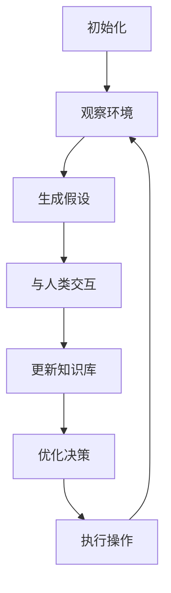

# AI人工智能代理工作流AI Agent WorkFlow：互动学习在工作流中的角色与方法

## 1.背景介绍

### 1.1 工作流自动化的重要性

在当今快节奏的商业环境中，工作流自动化已经成为提高效率、降低运营成本的关键因素。传统的手动流程不仅耗时耗力,而且容易出错,难以满足不断变化的业务需求。因此,越来越多的企业开始寻求自动化解决方案,以优化和简化各种工作流程。

### 1.2 人工智能在工作流中的作用

人工智能(AI)技术的飞速发展为工作流自动化带来了新的契机。AI代理可以通过机器学习算法来分析和理解复杂的工作流模式,从而实现智能化的流程管理和优化。与传统的基于规则的自动化系统不同,AI代理具有自主学习和决策的能力,可以根据实际情况动态调整流程,提高效率和适应性。

### 1.3 互动学习的重要性

然而,要充分发挥AI代理在工作流中的作用,仅依赖预先编码的规则和模型是不够的。工作流往往涉及多个参与者、多个系统和大量的异构数据,这需要AI代理具备与人类互动学习的能力。通过与人类专家的交互,AI代理可以不断获取新知识、优化决策逻辑,从而更好地适应复杂多变的工作流环境。

## 2.核心概念与联系

### 2.1 工作流

工作流(Workflow)是指为了完成特定任务而按照特定顺序执行的一系列活动。它通常涉及多个参与者、多个系统和多种资源,需要对这些要素进行有效的协调和管理。工作流广泛应用于各个领域,如办公自动化、业务流程管理、软件开发等。

### 2.2 AI代理

AI代理(AI Agent)是一种基于人工智能技术的软件实体,能够感知环境、学习知识、做出决策并执行相应的操作。在工作流中,AI代理可以充当智能协调员的角色,负责监控和优化整个流程。

### 2.3 互动学习

互动学习(Interactive Learning)是指AI代理与人类专家之间的双向交互过程。在这个过程中,AI代理不仅可以从人类那里获取领域知识,而且人类也可以根据AI代理的反馈来调整和完善知识库。这种互动式的学习方式有助于AI代理更好地理解和适应复杂的工作流环境。

### 2.4 核心概念关系

上述三个核心概念相互关联、相辅相成。工作流提供了AI代理应用的场景,AI代理则为工作流带来智能化管理的能力。而互动学习使AI代理能够不断获取新知识,提高对工作流的理解和优化能力。三者的有机结合正是实现智能工作流自动化的关键所在。

## 3.核心算法原理具体操作步骤

在AI代理工作流中,互动学习扮演着至关重要的角色。它的核心算法原理可以概括为以下几个步骤:



### 3.1 初始化

AI代理首先需要初始化一个基础知识库,包括工作流的基本模型、规则和策略。这个初始知识库可以来自于预先编码,也可以通过学习历史数据获得。

### 3.2 观察环境

接下来,AI代理需要持续观察工作流的执行环境,收集相关的数据和信息。这些数据可能包括流程状态、参与者行为、异常事件等,为后续的学习和决策提供依据。

### 3.3 生成假设

基于观察到的数据,AI代理会运用机器学习算法生成各种假设,试图解释当前的工作流状态和行为模式。这些假设可能涉及流程优化、异常处理、资源调度等多个方面。

### 3.4 与人类交互

AI代理会将生成的假设呈现给相关的人类专家,并与他们进行互动交流。人类专家可以根据自己的经验和判断,对这些假设进行评估、修正或补充。

### 3.5 更新知识库

经过与人类的互动,AI代理会将获取的新知识融入到自身的知识库中,不断丰富和完善对工作流的理解。

### 3.6 优化决策

在更新后的知识库基础上,AI代理会运用各种优化算法(如强化学习、约束优化等)来制定更加合理的决策策略,以提高工作流的效率和质量。

### 3.7 执行操作

最后,AI代理会根据优化后的决策执行相应的操作,如调度资源、修改流程、处理异常等,从而对工作流进行实际的干预和优化。

上述步骤并非一次性完成,而是一个不断循环的过程。AI代理会持续观察环境、学习新知识、优化决策,使工作流自动化能够与时俱进,适应不断变化的业务需求。

## 4.数学模型和公式详细讲解举例说明

在AI代理工作流中,数学模型和公式扮演着重要的角色,为互动学习和决策优化提供了理论基础和量化支持。下面将详细介绍其中的几个关键模型和公式。

### 4.1 马尔可夫决策过程(MDP)

马尔可夫决策过程(Markov Decision Process, MDP)是一种广泛应用于强化学习的数学框架,它可以很好地描述AI代理与环境之间的交互过程。在工作流场景中,MDP可以形式化地表示为一个四元组 $\langle\mathcal{S}, \mathcal{A}, \mathcal{P}, \mathcal{R}\rangle$:

- $\mathcal{S}$ 是工作流的状态集合
- $\mathcal{A}$ 是AI代理可执行的操作集合
- $\mathcal{P}$ 是状态转移概率函数,表示在执行操作 $a \in \mathcal{A}$ 时,从状态 $s \in \mathcal{S}$ 转移到状态 $s' \in \mathcal{S}$ 的概率 $\mathcal{P}(s'|s, a)$
- $\mathcal{R}$ 是奖励函数,定义了在状态 $s \in \mathcal{S}$ 执行操作 $a \in \mathcal{A}$ 后获得的即时奖励 $\mathcal{R}(s, a)$

基于MDP框架,AI代理的目标是找到一个最优策略 $\pi^*: \mathcal{S} \rightarrow \mathcal{A}$,使得按照该策略执行操作时,可以最大化预期的累积奖励:

$$
\pi^* = \arg\max_\pi \mathbb{E}\left[\sum_{t=0}^\infty \gamma^t R(s_t, a_t) \mid \pi\right]
$$

其中 $\gamma \in [0, 1)$ 是折现因子,用于权衡即时奖励和长期奖励的重要性。

通过将工作流建模为MDP,AI代理可以利用各种强化学习算法(如Q-Learning、策略梯度等)来学习最优策略,从而实现工作流的自动化优化。

### 4.2 约束优化

在实际的工作流场景中,我们往往需要在优化目标和各种约束条件之间寻求平衡。例如,我们希望最大化工作流的效率,但同时也要控制成本、满足服务质量等约束。这可以通过约束优化(Constrained Optimization)模型来描述:

$$
\begin{aligned}
\max_x & \quad f(x) \\
\text{s.t.} & \quad g_i(x) \leq 0, \quad i = 1, \ldots, m \\
& \quad h_j(x) = 0, \quad j = 1, \ldots, p
\end{aligned}
$$

其中:

- $x$ 是决策变量向量,表示工作流中需要优化的参数(如资源分配、流程设计等)
- $f(x)$ 是目标函数,表示我们希望最大化的目标(如效率、收益等)
- $g_i(x) \leq 0$ 是不等式约束条件,如成本限制、时间限制等
- $h_j(x) = 0$ 是等式约束条件,如质量要求、平衡性要求等

AI代理可以利用各种约束优化算法(如序列二次规划、内点法等)来求解上述模型,从而在满足约束条件的前提下,获得最优的工作流参数配置。

### 4.3 异常检测

在工作流执行过程中,可能会出现各种异常情况,如延迟、错误、资源冲突等。及时发现和处理这些异常对于保证工作流的顺利运行至关重要。AI代理可以利用统计学习方法来实现异常检测,其中一种常用的模型是高斯混合模型(Gaussian Mixture Model, GMM)。

GMM假设观测数据 $\mathbf{x}$ 是由 $K$ 个高斯分布的混合而成,其概率密度函数为:

$$
p(\mathbf{x}) = \sum_{k=1}^K \pi_k \mathcal{N}(\mathbf{x} \mid \boldsymbol{\mu}_k, \boldsymbol{\Sigma}_k)
$$

其中:

- $\pi_k$ 是第 $k$ 个高斯分布的混合系数,满足 $\sum_{k=1}^K \pi_k = 1$
- $\mathcal{N}(\mathbf{x} \mid \boldsymbol{\mu}_k, \boldsymbol{\Sigma}_k)$ 是第 $k$ 个高斯分布的概率密度函数,其均值为 $\boldsymbol{\mu}_k$,协方差矩阵为 $\boldsymbol{\Sigma}_k$

通过对正常工作流数据进行GMM训练,AI代理可以获得模型参数 $\{\pi_k, \boldsymbol{\mu}_k, \boldsymbol{\Sigma}_k\}_{k=1}^K$。对于新的观测数据 $\mathbf{x}^*$,如果其在训练好的GMM下的概率密度 $p(\mathbf{x}^*)$ 较低,就可以将其识别为异常情况。

上述只是AI代理工作流中应用的几个数学模型和公式,实际上还有许多其他模型和算法(如贝叶斯网络、决策树、聚类分析等)也可以被应用于不同的场景和任务中。

## 5.项目实践:代码实例和详细解释说明

为了更好地理解AI代理工作流的实现,下面将提供一个基于Python的简单项目实例,并对关键代码进行详细解释。

### 5.1 项目概述

本项目模拟了一个简化的办公自动化工作流,其中包括以下几个主要组件:

- **WorkflowManager**: 管理整个工作流的执行,协调各个参与者的工作
- **HumanAgent**: 模拟人类参与者,执行分配的任务
- **AIAgent**: 基于强化学习的AI代理,负责观察工作流状态并优化流程
- **Task**: 表示工作流中的任务
- **Environment**: 模拟工作流的执行环境

### 5.2 代码实例

#### 5.2.1 WorkflowManager

```python
class WorkflowManager:
    def __init__(self, agents, tasks):
        self.agents = agents
        self.tasks = tasks
        self.current_task = None

    def start(self):
        for task in self.tasks:
            self.assign_task(task)
            self.execute_task()

    def assign_task(self, task):
        self.current_task = task
        for agent in self.agents:
            agent.receive_task(task)

    def execute_task(self):
        while not self.current_task.is_completed():
            for agent in self.agents:
                agent.work()
            self.current_task.update_status()

        print(f"Task '{self.current_task.name}' completed!")
```

`WorkflowManager` 负责管理整个工作流的执行。它首先初始化参与者列表和任务列表,然后依次分配和执行每个任务。在执行任务时,它会不断地让参与者工作,直到任务完成。

#### 5.2.2 HumanAgent

```python
class HumanAgent:
    def __init__(self, name):
        self.name = name
        self.task = None

    def receive_task(self, task):
        self.task = task

    def work(self):
        if self.task:
            self.task.make_progress(0.1)  # 模拟人类工作
            print(f"{self.name} worked on '{self.task.name}'")