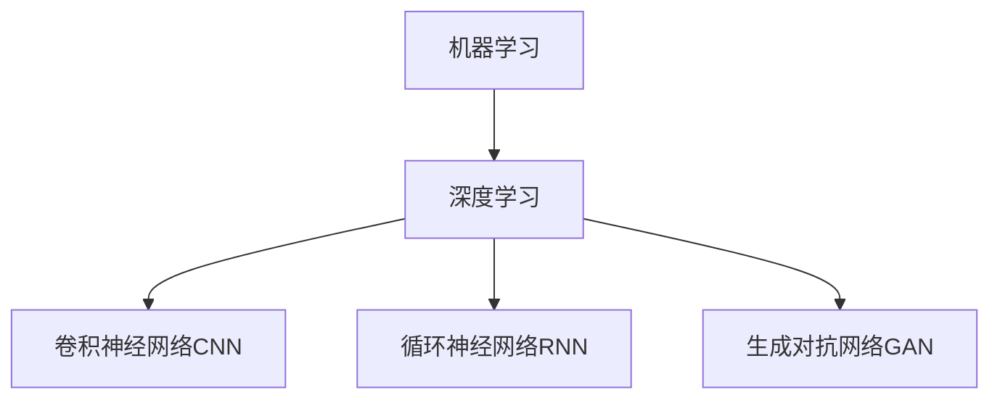
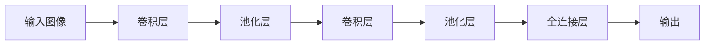
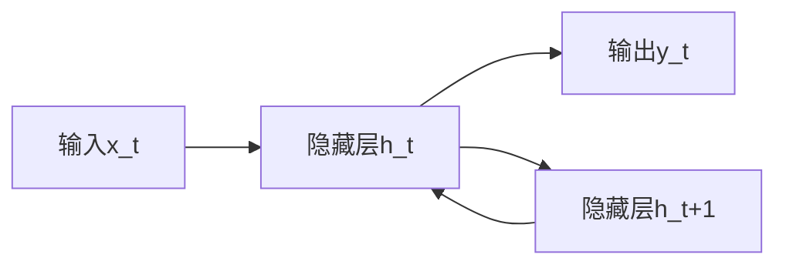

# AI人工智能核心算法原理与代码实例讲解：人工智能应用发展趋势

## 1.背景介绍

### 1.1 人工智能的兴起

人工智能(Artificial Intelligence, AI)是当代科技发展的前沿领域,近年来受到了前所未有的关注和投入。AI技术的快速发展正在深刻影响和改变着各行各业,催生了大量创新应用,为解决人类面临的诸多挑战提供了新的思路和方法。

### 1.2 人工智能的重要性

人工智能被誉为"新一轮产业革命"的核心驱动力,它可以赋予机器学习和推理能力,使得机器能够模拟人类的认知过程,完成复杂任务。AI技术在计算机视觉、自然语言处理、决策优化等领域的广泛应用,正在重塑着制造业、医疗健康、交通运输、教育等传统行业,催生出新的商业模式和增长动能。

### 1.3 人工智能发展现状

当前,以深度学习为代表的人工智能技术取得了突破性进展,在图像识别、语音识别、自然语言处理等任务上展现出超人的能力。大型科技公司和人工智能初创企业蓬勃发展,人工智能产业生态系统日趋成熟。但同时,AI技术的发展也面临着算力瓶颈、训练数据缺乏、模型可解释性差等挑战。

## 2.核心概念与联系

### 2.1 机器学习

机器学习(Machine Learning)是人工智能的核心部分,它赋予了计算机在没有明确程序的情况下,通过学习数据获取知识、总结规律并应用于解决新问题的能力。常见的机器学习算法包括监督学习、非监督学习、强化学习等。

### 2.2 深度学习

深度学习(Deep Learning)是机器学习的一个新兴热点领域,它模仿人脑神经网络结构和工作机制,通过构建深层神经网络对大规模数据进行表示学习和特征提取,在计算机视觉、自然语言处理等领域取得了突破性进展。

### 2.3 神经网络

神经网络(Neural Network)是深度学习的基础模型,它模拟生物神经元的工作原理,由多层节点和连接组成,能够从数据中自动学习特征表示,并对输入数据进行映射和处理。常见的神经网络结构包括前馈神经网络、卷积神经网络和循环神经网络等。

### 2.4 人工智能与其他技术的融合

人工智能技术与大数据、云计算、物联网等新兴技术的融合,正在催生出新的应用场景和商业模式。如利用物联网设备收集海量数据,通过人工智能算法进行分析和处理,为智能制造、智慧城市等领域提供智能化解决方案。

## 3.核心算法原理具体操作步骤  

### 3.1 监督学习算法

监督学习是机器学习中最常见和最成熟的一种范式,它利用带有标签的训练数据集,学习出一个从输入到输出的映射函数,并将其应用于新的无标签数据进行预测或分类。

#### 3.1.1 线性回归

线性回归是最基础和常用的监督学习算法之一,它试图找到一个最佳拟合的线性方程,使得输入特征值和目标值之间的残差平方和最小化。线性回归的一般过程如下:

1. 收集数据
2. 准备数据,包括填充缺失值、标准化特征等
3. 将数据分为训练集和测试集
4. 使用训练集数据训练线性回归模型,通过优化算法(如梯度下降)估计模型参数
5. 在测试集上评估模型性能,计算均方根误差等指标
6. 使用训练好的模型对新数据进行预测

线性回归的数学模型可表示为:

$$y = \theta_0 + \theta_1x_1 + \theta_2x_2 + ... + \theta_nx_n$$

其中$y$是目标值,$x_i$是第$i$个特征值,$\theta_i$是对应的权重系数。训练过程就是通过优化算法找到最优的$\theta$值,使残差平方和最小化。

#### 3.1.2 逻辑回归

逻辑回归是一种用于分类任务的监督学习算法。它通过对数几率回归模型,将输入映射到0到1之间的值,从而预测某个实例属于某个类别的概率。逻辑回归算法步骤如下:

1. 准备数据,对特征进行标准化或归一化处理
2. 将数据分为训练集和测试集 
3. 使用训练集数据训练逻辑回归模型,通过优化算法(如梯度下降)估计模型参数
4. 在测试集上评估模型性能,计算准确率等指标
5. 使用训练好的模型对新数据进行分类预测

逻辑回归的数学模型为:

$$P(y=1|x) = \sigma(\theta^Tx) = \frac{1}{1+e^{-\theta^Tx}}$$

其中$\sigma$为Sigmoid函数,用于将线性函数值映射到(0,1)范围内。$\theta$为模型参数向量。训练过程就是找到最优$\theta$,使得训练数据的对数似然函数最大化。

#### 3.1.3 决策树

决策树是一种常用的监督学习算法,它通过对训练数据不断进行递归分割,构建一个树状决策模型,用于对新的数据实例进行分类或回归。决策树算法的基本步骤为:

1. 从训练集中找出能最好地将训练数据分开的特征作为决策树根节点
2. 对于树的每个分支节点,重复步骤1,递归地构建决策树
3. 直到所有实例都被正确分类或者无法再进行分割为止
4. 使用生成的决策树对新实例进行分类或回归预测

决策树的优点是模型可解释性强,缺点是容易过拟合。常用的决策树算法有ID3、C4.5、CART等。

#### 3.1.4 支持向量机

支持向量机(Support Vector Machine, SVM)是一种基于统计学习理论的有监督学习模型,常用于分类和回归分析。SVM的基本思想是在高维空间中构建一个超平面,将不同类别的数据点分隔开,并使正负实例与超平面的距离最大化。SVM算法步骤如下:

1. 收集数据,进行特征缩放或归一化处理
2. 选择合适的核函数,将数据映射到高维空间
3. 在训练集上训练SVM模型,求解最优超平面参数
4. 使用训练好的模型对新数据进行分类或回归预测

SVM的数学模型为:

$$\begin{align*}
&\underset{w,b}{\text{minimize}} & & \frac{1}{2}||w||^2 \\
&\text{subject to} & & y_i(w^Tx_i+b) \geq 1, \quad i=1,...,n
\end{align*}$$

其中$w$为超平面法向量,$b$为偏置项。求解过程是一个二次规划优化问题。SVM的优点是泛化能力强,可以处理高维数据,缺点是对大规模数据计算开销大。

### 3.2 非监督学习算法

非监督学习是在没有给定任何标签数据的情况下,对数据进行聚类或降维等处理,以发现数据内在的模式和结构。常见的非监督学习算法包括聚类算法和降维算法。

#### 3.2.1 K-Means聚类

K-Means是一种简单而经典的聚类算法,它将数据集划分为K个聚类,每个数据点被分配到离它最近的聚类中心。K-Means算法步骤如下:

1. 随机选择K个初始聚类中心
2. 对每个数据点,计算它与K个聚类中心的距离,将其分配到最近的聚类
3. 重新计算每个聚类的中心点,作为新的聚类中心
4. 重复步骤2和3,直到聚类中心不再发生变化

K-Means的目标函数是最小化所有数据点到其所属聚类中心的平方距离之和:

$$J = \sum_{i=1}^{n}\sum_{x \in C_i}||x - \mu_i||^2$$

其中$n$是聚类数量,$C_i$是第$i$个聚类,$\mu_i$是第$i$个聚类的均值向量。

#### 3.2.2 主成分分析PCA

主成分分析(Principal Component Analysis, PCA)是一种常用的降维算法,它通过正交变换将原始高维数据映射到一个新的低维空间,使得新空间中的数据方差最大化,从而实现对数据的降维。PCA算法步骤如下:

1. 对原始数据进行归一化处理
2. 计算数据的协方差矩阵
3. 对协方差矩阵进行特征值分解,得到特征向量
4. 选择与最大K个特征值对应的K个特征向量作为新的坐标轴
5. 将原始数据投影到新的K维空间中,得到降维后的数据

PCA的数学模型为:

$$\max_{\alpha^T\alpha=1} \alpha^T\Sigma\alpha$$

其中$\Sigma$是数据的协方差矩阵,$\alpha$是待求的投影方向向量。解是协方差矩阵的特征向量。

### 3.3 深度学习算法

深度学习算法是构建在人工神经网络之上的一种表示学习方法,通过对数据的多层次非线性变换捕获数据的高阶特征表示,从而解决复杂的机器学习任务。常见的深度学习模型包括卷积神经网络、循环神经网络和生成对抗网络等。

#### 3.3.1 卷积神经网络CNN

卷积神经网络(Convolutional Neural Network, CNN)是一种常用于计算机视觉任务的深度神经网络模型,它通过卷积、池化等操作自动学习图像的空间特征。CNN模型的基本结构如下:

1. 卷积层通过滤波器对图像进行卷积操作,提取局部特征
2. 池化层对卷积结果进行下采样,减小计算量
3. 全连接层对前面层的输出进行加权求和,得到最终分类或回归输出

CNN模型通过反向传播算法对网络参数进行训练,使用随机梯度下降等优化方法最小化损失函数。CNN的优点是对平移、缩放等变换具有一定鲁棒性,缺点是对旋转变换不太鲁棒。

#### 3.3.2 循环神经网络RNN

循环神经网络(Recurrent Neural Network, RNN)是一种用于处理序列数据的深度学习模型,它通过内部循环连接捕获序列之间的依赖关系。RNN模型结构如下:

在每个时间步$t$,RNN根据当前输入$x_t$和上一时间步的隐藏状态$h_{t-1}$,计算当前时间步的隐藏状态$h_t$和输出$y_t$:

$$\begin{align*}
h_t &= \tanh(W_{hh}h_{t-1} + W_{xh}x_t) \\
y_t &= W_{hy}h_t
\end{align*}$$

其中$W$是权重矩阵。RNN通过反向传播算法训练网络参数。

由于传统RNN存在梯度消失或爆炸问题,实际应用中常使用改进的LSTM(Long Short-Term Memory)或GRU(Gated Recurrent Unit)等变体模型。RNN广泛应用于自然语言处理、语音识别等序列数据处理任务。

#### 3.3.3 生成对抗网络GAN

生成对抗网络(Generative Adversarial Network, GAN)是一种用于生成式建模的深