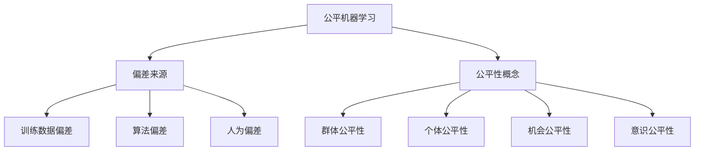
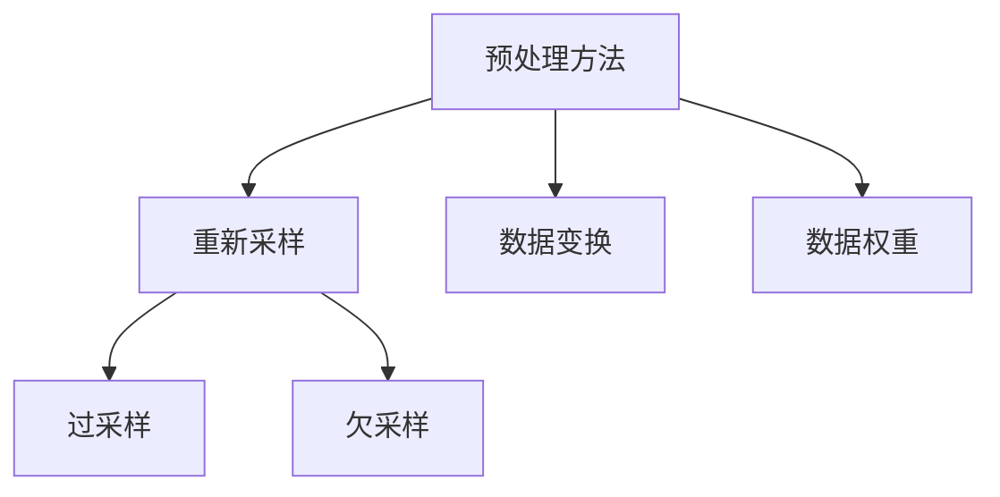
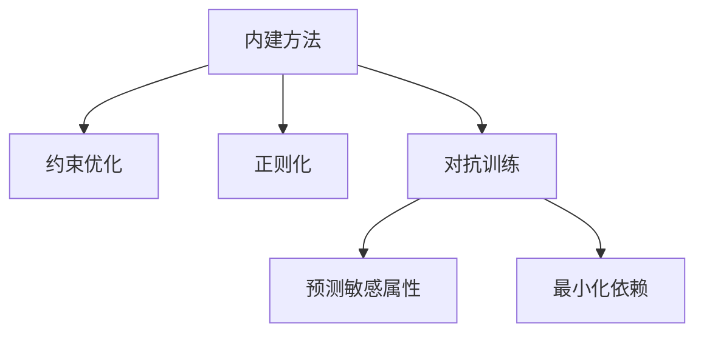
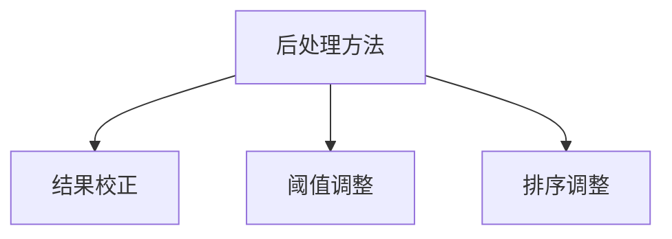

# AI人工智能核心算法原理与代码实例讲解：公平机器学习

## 1.背景介绍

在当今时代,人工智能(AI)已经渗透到了我们生活的方方面面,从网络搜索和社交媒体,到医疗诊断和金融服务。然而,随着AI系统的广泛应用,一个日益受到关注的问题是公平性。如果训练数据存在偏差,或者模型本身存在偏差,那么基于这些模型做出的决策就可能对某些群体产生不公平的结果。

公平机器学习(Fair Machine Learning)旨在缓解和消除AI系统中的偏差和歧视,确保人工智能系统能够公平对待所有个人和群体。这不仅是一个道德和伦理问题,也关系到AI系统的可靠性和可信度。如果一个系统对某些群体存在系统性偏差,那么它的决策就可能是不准确和不合理的。

## 2.核心概念与联系

### 2.1 什么是公平性?

公平性是一个复杂的概念,不同的人和群体对它有不同的理解。在机器学习的背景下,公平性通常被定义为确保模型的预测或决策不会因个人的敏感属性(如种族、性别、年龄等)而有所偏差。然而,公平性的具体定义和度量方式仍然是一个充满挑战的研究领域。

### 2.2 公平机器学习的关键概念

公平机器学习涉及以下几个关键概念:

- **群体公平性(Group Fairness)**:模型对不同的人口统计群体应该有相似的表现。
- **个体公平性(Individual Fairness)**:类似的个体应该得到类似的预测结果。
- **机会公平性(Opportunity Fairness)**:不同群体在获得特定结果(如工作机会、贷款批准等)的机会应该相等。
- **意识公平性(Awareness Fairness)**:模型不应该利用与任务无关的敏感属性来做出决策。

### 2.3 偏差来源

机器学习系统中的偏差可能来自以下几个方面:

1. **训练数据偏差**:如果训练数据本身存在偏差或代表性不足,那么基于这些数据训练出来的模型就可能继承这些偏差。
2. **算法偏差**:某些算法在优化过程中可能会放大或引入新的偏差。
3. **人为偏差**:人类的偏见可能会在数据收集、标注或模型开发过程中引入偏差。



## 3.核心算法原理具体操作步骤

实现公平机器学习的核心算法主要有三种方法:预处理、内建和后处理。

### 3.1 预处理方法

预处理方法在训练数据上进行变换,以减少或消除数据中的偏差。常见的预处理技术包括:

1. **重新采样(Resampling)**: 通过过采样(Oversampling)或欠采样(Undersampling)来平衡不同群体的样本数量。
2. **数据变换(Data Transformation)**: 移除、编码或修改与任务无关的敏感属性。
3. **数据权重(Data Weighting)**: 为不同群体的样本赋予不同的权重。



### 3.2 内建方法

内建方法在模型的训练过程中直接考虑公平性约束,使得训练出来的模型本身就是公平的。常见的内建技术包括:

1. **约束优化(Constrained Optimization)**: 在模型优化过程中加入公平性约束,例如最小化预测误差和最大化群体公平性之间的权衡。
2. **正则化(Regularization)**: 在损失函数中加入公平性正则项,惩罚不公平的解。
3. **对抗训练(Adversarial Debiasing)**: 训练一个辅助模型来预测样本的敏感属性,并最小化主模型对敏感属性的依赖。



### 3.3 后处理方法

后处理方法在模型训练完成后,对模型的输出结果进行调整,以满足公平性要求。常见的后处理技术包括:

1. **结果校正(Output Correction)**: 根据预测结果和真实标签,计算出每个群体的校正系数,并对预测结果进行调整。
2. **阈值调整(Threshold Adjustment)**: 为不同群体设置不同的决策阈值,以满足公平性要求。
3. **排序调整(Ranking Adjustment)**: 对排序结果进行调整,确保不同群体在排序中的表现是公平的。



## 4.数学模型和公式详细讲解举例说明

### 4.1 公平性指标

为了量化和评估模型的公平性,我们需要定义一些公平性指标。常见的公平性指标包括:

1. **统计率公平(Statistical Parity)**: 不同群体被正面预测(如获得工作机会)的概率应该相等。

$$
P(Y=1|G=0) = P(Y=1|G=1)
$$

其中 $Y$ 表示预测结果, $G$ 表示敏感属性(如性别)。

2. **等机会差异(Equal Opportunity Difference)**: 不同群体在条件正面结果(如真实合格)下被正面预测的概率应该相等。

$$
P(Y=1|Y^*=1,G=0) = P(Y=1|Y^*=1,G=1)
$$

其中 $Y^*$ 表示真实标签。

3. **平均绝对残差(Average Absolute Residual)**: 衡量不同群体的预测结果与真实结果之间的平均绝对差异。

$$
\frac{1}{n}\sum_{i=1}^n |y_i - \hat{y}_i|
$$

其中 $y_i$ 表示第 $i$ 个样本的真实标签, $\hat{y}_i$ 表示预测标签。

### 4.2 公平性约束优化

在内建方法中,我们可以将公平性指标作为约束加入到模型优化过程中。以统计率公平为例,我们可以构建如下优化问题:

$$
\begin{aligned}
\min_{\theta} & \quad \mathcal{L}(f_\theta(X), Y) \\
\text{s.t.} & \quad |P(f_\theta(X)=1|G=0) - P(f_\theta(X)=1|G=1)| \leq \epsilon
\end{aligned}
$$

其中 $\mathcal{L}$ 表示模型的损失函数, $f_\theta$ 表示模型, $\theta$ 表示模型参数, $\epsilon$ 是公平性约束的上限。

这个优化问题试图同时最小化模型的损失函数,并确保不同群体被正面预测的概率差异不超过 $\epsilon$。

### 4.3 对抗训练

对抗训练是一种常见的内建方法,它通过训练一个辅助模型来预测样本的敏感属性,并最小化主模型对敏感属性的依赖。具体来说,我们可以构建如下优化问题:

$$
\begin{aligned}
\min_{\theta_Y} \max_{\theta_G} & \quad \mathcal{L}_Y(f_{\theta_Y}(X), Y) - \lambda \mathcal{L}_G(g_{\theta_G}(f_{\theta_Y}(X)), G) \\
\text{s.t.} & \quad \theta_Y, \theta_G \in \Theta
\end{aligned}
$$

其中 $f_{\theta_Y}$ 表示主模型, $g_{\theta_G}$ 表示辅助模型, $\mathcal{L}_Y$ 和 $\mathcal{L}_G$ 分别表示主模型和辅助模型的损失函数, $\lambda$ 是一个权重参数, $\Theta$ 表示模型参数的可行域。

这个优化问题试图同时最小化主模型的损失函数,并最大化辅助模型预测敏感属性的损失函数。通过这种对抗训练,主模型就会学习到与敏感属性无关的特征表示,从而减少了对敏感属性的依赖。

## 5.项目实践:代码实例和详细解释说明

在这一部分,我们将通过一个实际的代码示例来演示如何使用Python中的公平机器学习库实现公平分类。我们将使用著名的成人收入数据集(Adult Income Dataset),并尝试构建一个公平的分类模型来预测个人的年收入是否超过50,000美元,同时确保模型对性别属性是公平的。

### 5.1 导入所需库

```python
import numpy as np
import pandas as pd
from sklearn.preprocessing import LabelEncoder
from sklearn.compose import ColumnTransformer
from sklearn.preprocessing import OneHotEncoder
from sklearn.model_selection import train_test_split
from sklearn.linear_model import LogisticRegression
from aif360.datasets import BinaryLabelDataset
from aif360.metrics import ClassificationMetric
from aif360.algorithms.preprocessing import Reweighing
from aif360.algorithms.inprocessing import PrejudiceRemover
```

我们将使用scikit-learn进行数据预处理和模型训练,使用AI Fairness 360 (AIF360)库来评估和缓解模型的公平性问题。

### 5.2 加载和预处理数据

```python
# 加载数据
data = pd.read_csv('adult.data.csv')

# 将分类特征编码为数值
categorical_features = ['workclass', 'education', 'marital-status', 'occupation', 'relationship', 'race', 'sex', 'native-country']
label_encoders = {col: LabelEncoder() for col in categorical_features}
data[categorical_features] = data[categorical_features].apply(lambda col: label_encoders[col.name].fit_transform(col))

# 对分类特征进行一热编码
categorical_transformer = ColumnTransformer(transformers=[('encoder', OneHotEncoder(), categorical_features)], remainder='passthrough')
X = categorical_transformer.fit_transform(data)

# 将目标变量编码为0和1
y = (data['income-level'] == ' >50K').astype(int)

# 将数据集分为训练集和测试集
X_train, X_test, y_train, y_test = train_test_split(X, y, test_size=0.2, random_state=42)

# 将数据集转换为AIF360所需的格式
dataset_train = BinaryLabelDataset(favorable_label=1, unfavorable_label=0, df=pd.DataFrame(data=X_train, columns=categorical_transformer.get_feature_names_out()), label_names=['income'], protected_attribute_names=['sex'])
dataset_test = BinaryLabelDataset(favorable_label=1, unfavorable_label=0, df=pd.DataFrame(data=X_test, columns=categorical_transformer.get_feature_names_out()), label_names=['income'], protected_attribute_names=['sex'])
```

在这一步骤中,我们加载了成人收入数据集,对分类特征进行了编码和一热编码,并将数据集分为训练集和测试集。最后,我们将数据集转换为AIF360所需的格式,指定了目标变量和敏感属性(性别)。

### 5.3 评估模型的公平性

```python
# 训练基线模型
base_model = LogisticRegression(solver='liblinear')
base_model.fit(X_train, y_train)

# 评估模型在测试集上的公平性
metric_base = ClassificationMetric(dataset_test, base_model, unprivileged_groups=[{'sex': 1}], privileged_groups=[{'sex': 0}])
print('Base Model:')
print('Statistical Parity Difference: {}'.format(metric_base.statistical_parity_difference()))
print('Equal Opportunity Difference: {}'.format(metric_base.equal_opportunity_difference()))
print('Average Absolute Residual: {}'.format(metric_base.average_abs_residual()))
```

在这一步骤中,我们训练了一个基线的逻辑回归模型,并使用AIF360提供的公平性指标来评估模型在测试集上的公平性表现。我们计算了统计率公平差异、等机会差异和平均绝对残差,并将女性群体设置为不利群体。

### 5.4 使用预处理方法缓解偏差

```python
# 使用重新加权预处理方