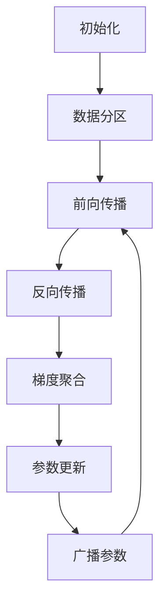
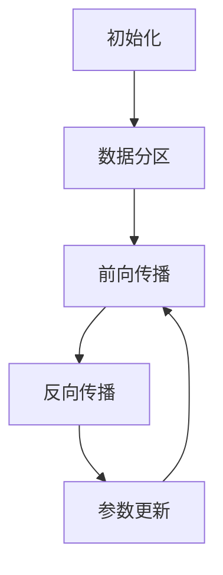
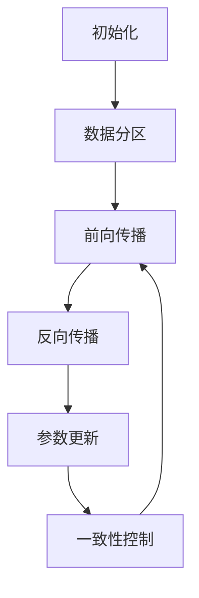

# AI人工智能深度学习算法：分布式深度学习代理的同步与数据共享

## 1.背景介绍

随着大数据时代的到来,人工智能和深度学习技术得到了前所未有的发展。深度学习模型的训练数据集和模型参数规模都在不断增长,这使得在单机环境下训练这些模型变得越来越困难。为了解决这一问题,分布式深度学习应运而生。

分布式深度学习是指将深度学习模型的训练过程分散到多个计算节点上并行执行,从而加速训练过程并处理大规模数据。这种方法可以显著提高训练效率,缩短训练时间,并且能够处理无法在单机环境下训练的大型模型。

在分布式深度学习系统中,存在多个深度学习代理,每个代理都在不同的计算节点上运行,并且需要相互协作以完成模型的训练。这就需要解决代理之间的同步和数据共享问题,以确保训练过程的一致性和效率。

### 1.1 同步问题

在分布式深度学习中,同步是一个关键挑战。由于每个代理都在独立的计算节点上运行,它们可能会以不同的速度进行训练,从而导致模型参数不一致。为了解决这个问题,需要采用同步机制来确保所有代理在每个训练迭代中使用相同的模型参数。

常见的同步方法包括:

- 同步更新(Synchronous Update):所有代理在每次迭代后等待其他代理完成,然后共享并更新模型参数。这种方法可以确保一致性,但可能会导致较慢的代理拖慢整个训练过程。

- 异步更新(Asynchronous Update):代理可以独立更新模型参数,而无需等待其他代理。这种方法可以提高效率,但可能会导致不一致性和训练不稳定。

- 弹性一致性(Stale Synchronous Parallel):允许代理使用略旧但一致的模型参数进行训练,从而在一致性和效率之间寻求平衡。

### 1.2 数据共享问题

另一个重要挑战是如何在代理之间共享训练数据。由于数据集可能非常庞大,无法完全复制到每个计算节点上,因此需要采用数据并行或模型并行等策略来分发数据。

数据并行是指将训练数据集划分为多个子集,每个代理负责处理一个子集。这种方法可以有效地利用多个计算节点的资源,但需要解决数据分区和代理之间的通信问题。

模型并行则是将深度学习模型的不同层或组件分配给不同的代理,每个代理只需要处理模型的一部分。这种方法可以减少单个代理的内存需求,但需要解决模型分区和层与层之间的通信问题。

## 2.核心概念与联系

为了解决分布式深度学习中的同步和数据共享问题,需要引入以下几个核心概念:

### 2.1 参数服务器(Parameter Server)

参数服务器是一种常见的分布式深度学习架构,它将模型参数存储在一个或多个中央服务器上,而深度学习代理则从这些服务器获取和更新参数。

参数服务器架构可以有效地解决同步和数据共享问题。代理可以从参数服务器获取最新的模型参数,并将梯度更新发送回服务器进行聚合。这种方式确保了模型参数的一致性,并且可以通过调整服务器和代理之间的通信策略来平衡一致性和效率。

### 2.2 梯度更新

在分布式深度学习中,每个代理都会计算出一组梯度更新,这些梯度更新需要被聚合以更新模型参数。常见的梯度更新聚合方法包括:

- 简单平均(Simple Averaging):将所有代理的梯度更新求平均值,作为最终的更新。
- 加权平均(Weighted Averaging):根据每个代理处理的数据量或其他指标,对梯度更新赋予不同的权重。
- 动量更新(Momentum Update):在梯度更新中引入动量项,以加速收敛并提高鲁棒性。
- 自适应更新(Adaptive Update):根据梯度的历史信息动态调整学习率,如AdaGrad、RMSProp和Adam等优化算法。

### 2.3 通信策略

在分布式深度学习系统中,代理之间需要频繁地交换数据和模型参数,因此通信策略对系统的性能和效率有着重大影响。常见的通信策略包括:

- 集中式通信(Centralized Communication):所有代理都与中央参数服务器进行通信,交换数据和参数。
- 分散式通信(Decentralized Communication):代理之间可以直接进行点对点通信,无需中央服务器。
- 混合通信(Hybrid Communication):结合集中式和分散式通信,根据具体情况选择合适的通信模式。

通信策略需要考虑网络带宽、延迟、容错性和可扩展性等因素,以确保系统的高效运行。

### 2.4 数据分区和模型分区

为了实现数据并行和模型并行,需要对训练数据和模型进行合理的分区。常见的数据分区策略包括:

- 样本分区(Sample Partitioning):将训练样本均匀地划分为多个子集,每个代理处理一个子集。
- 特征分区(Feature Partitioning):将训练样本的特征划分为多个子集,每个代理处理一部分特征。

模型分区则需要根据模型的结构和计算需求进行划分,常见的策略包括:

- 层分区(Layer Partitioning):将模型的不同层分配给不同的代理,每个代理处理一部分层。
- 操作分区(Operation Partitioning):将模型中的不同操作(如卷积、池化等)分配给不同的代理。

数据分区和模型分区需要考虑数据和计算的均衡性,以及代理之间的通信开销,从而实现高效的分布式训练。

这些核心概念相互关联,共同构建了分布式深度学习系统的基础架构。下面将详细介绍它们在实际算法和系统中的应用。

## 3.核心算法原理具体操作步骤

### 3.1 同步分布式深度学习算法

同步分布式深度学习算法是一种常见的分布式训练方法,它确保所有代理在每次迭代中使用相同的模型参数,从而保证了训练过程的一致性。以下是同步分布式深度学习算法的具体操作步骤:

1. **初始化**: 所有代理从参数服务器获取初始模型参数。

2. **数据分区**: 将训练数据集划分为多个子集,每个代理负责处理一个子集。

3. **前向传播**: 每个代理使用当前的模型参数对其数据子集进行前向传播,计算损失函数。

4. **反向传播**: 每个代理计算其数据子集对应的梯度,并将梯度发送到参数服务器。

5. **梯度聚合**: 参数服务器收集所有代理的梯度,并使用预定义的策略(如简单平均或加权平均)对梯度进行聚合。

6. **参数更新**: 参数服务器使用聚合后的梯度更新模型参数。

7. **广播参数**: 参数服务器将更新后的模型参数广播给所有代理。

8. **重复步骤3-7**: 重复前向传播、反向传播、梯度聚合和参数更新,直到模型收敛或达到预定的迭代次数。

同步分布式深度学习算法的优点是可以保证训练过程的一致性,但缺点是可能会由于代理之间的速度差异而导致性能bottleneck。为了解决这个问题,可以采用异步更新或弹性一致性等策略。

### 3.2 异步分布式深度学习算法

异步分布式深度学习算法允许代理独立地更新模型参数,而无需等待其他代理完成。这种方法可以提高训练效率,但可能会导致模型参数不一致,从而影响训练的稳定性和收敛性。以下是异步分布式深度学习算法的具体操作步骤:

1. **初始化**: 所有代理从参数服务器获取初始模型参数。

2. **数据分区**: 将训练数据集划分为多个子集,每个代理负责处理一个子集。

3. **前向传播**: 每个代理使用当前的模型参数对其数据子集进行前向传播,计算损失函数。

4. **反向传播**: 每个代理计算其数据子集对应的梯度。

5. **参数更新**: 每个代理将其梯度发送到参数服务器,并从服务器获取最新的模型参数。代理使用自己的梯度和最新的参数进行更新。

6. **重复步骤3-5**: 重复前向传播、反向传播和参数更新,直到模型收敛或达到预定的迭代次数。

异步分布式深度学习算法的优点是可以充分利用计算资源,提高训练效率。但是,由于代理使用的模型参数可能不一致,因此需要采用一些策略来减少不一致性对训练的影响,如:

- 添加正则化项,提高模型的鲁棒性。
- 使用动量更新或自适应学习率优化算法,提高收敛速度和稳定性。
- 限制代理使用的模型参数的"陈旧程度",确保一定程度的一致性。

### 3.3 弹性一致性并行算法

弹性一致性并行(Stale Synchronous Parallel, SSP)算法是一种介于同步和异步之间的分布式深度学习算法。它允许代理使用略旧但一致的模型参数进行训练,从而在一致性和效率之间寻求平衡。以下是弹性一致性并行算法的具体操作步骤:

1. **初始化**: 所有代理从参数服务器获取初始模型参数。

2. **数据分区**: 将训练数据集划分为多个子集,每个代理负责处理一个子集。

3. **前向传播**: 每个代理使用当前的模型参数对其数据子集进行前向传播,计算损失函数。

4. **反向传播**: 每个代理计算其数据子集对应的梯度。

5. **参数更新**: 每个代理将其梯度发送到参数服务器,并从服务器获取最新的模型参数。代理使用自己的梯度和最新的参数进行更新。

6. **一致性控制**: 参数服务器控制代理使用的模型参数的"陈旧程度"。如果代理使用的参数太旧,服务器将阻止该代理进行更新,直到它获取到足够新的参数。

7. **重复步骤3-6**: 重复前向传播、反向传播和参数更新,直到模型收敛或达到预定的迭代次数。

弹性一致性并行算法的关键在于控制代理使用的模型参数的"陈旧程度"。通常使用一个阈值τ来限制参数的最大延迟,即代理使用的参数不能比服务器的最新参数旧超过τ次更新。这种方式可以在一致性和效率之间达成平衡,提高训练的稳定性和收敛速度。

## 4.数学模型和公式详细讲解举例说明

在分布式深度学习算法中,数学模型和公式起着重要的作用,用于描述和优化训练过程。本节将详细讲解一些常见的数学模型和公式,并给出具体的例子和说明。

### 4.1 梯度聚合

在分布式深度学习中,每个代理都会计算出一组梯度更新,这些梯度更新需要被聚合以更新模型参数。常见的梯度聚合方法包括简单平均和加权平均。

#### 4.