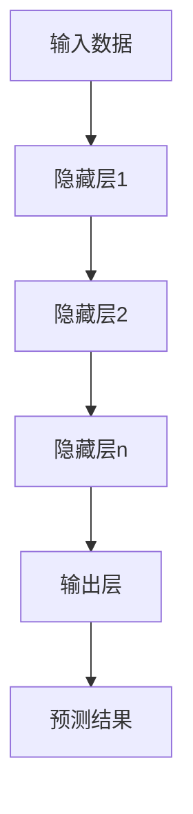
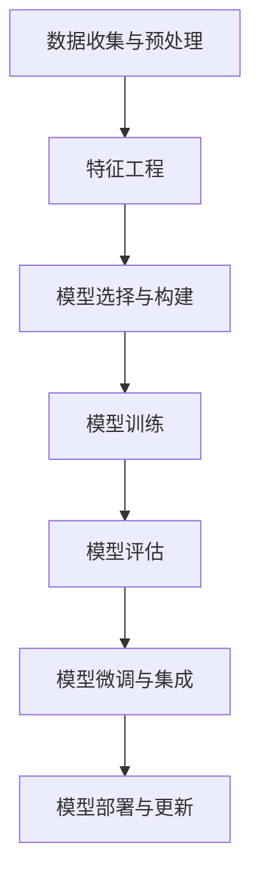

# AI人工智能深度学习算法：在股市预测中的应用

## 1.背景介绍

### 1.1 股市预测的重要性

股市预测是金融领域一项极具挑战性的任务,能够准确预测股市走势对于投资者和金融机构都具有重大意义。股市是一个复杂的非线性动态系统,受到诸多宏观经济因素、政治事件、公司业绩等多方面的影响,这使得股价的变化具有很强的不确定性和随机性。准确预测股价走势可以帮助投资者制定更好的投资策略,规避风险,实现收益最大化。同时也有助于金融监管机构评估市场风险,维护金融体系稳定。

### 1.2 传统股市预测方法的局限性  

过去,人们主要依赖基本面分析和技术分析等传统方法进行股市预测。基本面分析关注公司的基本因素,如财务状况、盈利能力等;技术分析则通过研究历史股价走势,寻找可能重复出现的模式。但这些方法存在明显缺陷:

1. 分析过程主观性强,依赖分析师的专业经验和判断
2. 难以全面考虑影响股价的所有复杂因素  
3. 线性模型难以有效捕捉股市的非线性动态特征

随着大数据时代的到来和人工智能技术的不断发展,基于深度学习的股市预测方法开始崭露头角,展现出前所未有的潜力。

## 2.核心概念与联系

### 2.1 深度学习概述

深度学习(Deep Learning)是机器学习的一个新的领域,其灵感来源于人脑的结构和功能。深度学习模型通过对数据的多级表示学习,捕捉数据的高阶抽象特征,从而实现端到端的模式识别和预测。与传统的机器学习方法相比,深度学习具有以下优势:

1. 自动从数据中学习特征表示,无需人工设计特征  
2. 能够学习多层次非线性映射,具有强大的表达和建模能力
3. 在大规模数据集上表现出色,性能随数据量增加而提高

深度学习模型主要包括前馈神经网络、卷积神经网络、递归神经网络等,通过构建多层非线性变换,对输入数据进行高维抽象,最终完成分类、回归等任务。



### 2.2 深度学习在股市预测中的应用

将深度学习应用于股市预测,能够克服传统方法的不足,从大量历史数据中自动学习到影响股价的复杂特征,并对未来走势进行预测。常见的做法是将历史股价、技术指标、基本面数据等输入深度学习模型,经过训练得到的模型可用于对未来股价进行预测。

深度学习在股市预测中的优势主要体现在:

1. 能够自动学习影响股价的高阶非线性特征
2. 处理高维度异构数据的能力强 
3. 通过加入注意力机制等模块,增强对时序数据的建模能力
4. 端到端的训练方式,无需人工特征工程

总的来说,深度学习为股市预测提供了一种全新的数据驱动方法,有望突破传统方法的瓶颈,实现更加准确的预测。

## 3.核心算法原理具体操作步骤

### 3.1 深度学习在股市预测中的一般流程

将深度学习应用于股市预测通常包括以下几个主要步骤:

1. **数据收集与预处理**:收集相关的历史股价、技术指标、财务数据等,并对缺失值、异常值等进行处理,将数据转换为深度学习模型可接受的格式。

2. **特征工程**:从原始数据中提取或构造对股价预测有效的特征,如技术指标、情感分析等。

3. **模型选择与构建**:根据任务特点选择合适的深度学习模型,如前馈神经网络、卷积神经网络、长短期记忆网络等,并确定网络结构和超参数。

4. **模型训练**:使用训练数据对模型进行训练,通过损失函数和优化算法不断调整模型参数,提高预测精度。

5. **模型评估**:在验证集或测试集上评估模型的预测性能,可采用均方根误差、方向准确率等指标。

6. **模型微调与集成**:根据评估结果对模型进行微调,或使用集成学习等方法融合多个模型,进一步提高预测性能。

7. **模型部署与更新**:将训练好的模型部署到实际的交易系统中,并根据市场新数据不断更新模型参数。



### 3.2 常用的深度学习模型

在股市预测任务中,常用的深度学习模型包括:

1. **前馈神经网络(FNN)**:最基本的深度学习模型,由多个全连接隐藏层组成,能够学习输入和输出之间的复杂非线性映射关系。适用于处理结构化数据,如技术指标等。

2. **长短期记忆网络(LSTM)**:一种特殊的递归神经网络,擅长处理序列数据,通过门控机制解决了传统RNN的梯度消失和爆炸问题。适用于建模股价等时序数据。

3. **卷积神经网络(CNN)**: 在计算机视觉领域表现出色,能够自动学习局部特征并对其进行组合,捕捉数据的空间和时间相关性。可用于处理技术指标图像等。

4. **注意力机制(Attention)**:通过分配不同的权重关注输入序列的不同部分,增强了模型对关键信息的建模能力,常与RNN、CNN等网络结合使用。

5. **生成对抗网络(GAN)**:由生成网络和判别网络组成,能够从训练数据中学习数据分布,用于数据增强、模拟交易策略测试等。

6. **混合模型**:融合CNN、RNN等不同网络模块的优点,形成更加强大的混合模型,以提高股市预测的准确性。

不同的模型适用于不同的场景和数据类型,在实际应用中需要根据具体问题进行选择和设计。

## 4.数学模型和公式详细讲解举例说明

### 4.1 长短期记忆网络(LSTM)

长短期记忆网络是一种广泛应用于时序数据建模的有力工具,在股市预测任务中发挥着重要作用。LSTM的核心思想是通过设计特殊的门控机制,解决传统RNN梯度消失和爆炸的问题,从而更好地捕捉长期依赖关系。

LSTM的数学模型可以表示为:

$$
\begin{aligned}
f_t &= \sigma(W_f \cdot [h_{t-1}, x_t] + b_f) \\
i_t &= \sigma(W_i \cdot [h_{t-1}, x_t] + b_i) \\
\tilde{C}_t &= \tanh(W_C \cdot [h_{t-1}, x_t] + b_C) \\
C_t &= f_t \odot C_{t-1} + i_t \odot \tilde{C}_t \\
o_t &= \sigma(W_o \cdot [h_{t-1}, x_t] + b_o) \\
h_t &= o_t \odot \tanh(C_t)
\end{aligned}
$$

其中:

- $x_t$是时刻t的输入
- $h_t$是时刻t的隐藏状态
- $C_t$是时刻t的细胞状态
- $f_t$是时刻t的遗忘门
- $i_t$是时刻t的输入门
- $o_t$是时刻t的输出门
- $\tilde{C}_t$是时刻t的候选细胞状态
- $\sigma$是sigmoid激活函数
- $\odot$是元素级乘积运算

LSTM通过精心设计的门控机制,能够有选择性地保留、遗忘或增加信息,从而更好地捕捉长期依赖关系。在股市预测中,LSTM可以对历史股价、技术指标等序列数据进行建模,捕捉其内在的时序模式,为未来走势的预测提供依据。

### 4.2 注意力机制(Attention)

注意力机制是近年来在深度学习领域获得巨大成功的关键技术之一,它通过自适应地分配不同的权重关注输入序列的不同部分,从而增强了模型对关键信息的建模能力。在股市预测任务中,注意力机制常与RNN、CNN等网络相结合,用于捕捉时序数据中的重要模式。

注意力机制的数学表达式如下:

$$
\begin{aligned}
u_t &= \tanh(W_u h_t + b_u) \\
\alpha_t &= \text{softmax}(u_t^T u_w) \\
c_t &= \sum_{i=1}^T \alpha_{t,i} h_i \\
\tilde{h}_t &= \tanh(W_c [c_t, h_t] + b_c)
\end{aligned}
$$

其中:

- $h_t$是时刻t的隐藏状态
- $u_t$是用于计算注意力权重的中间变量
- $\alpha_t$是时刻t的注意力权重向量
- $u_w$是学习的注意力向量
- $c_t$是时刻t的上下文向量,通过加权求和得到
- $\tilde{h}_t$是注意力机制的输出,融合了原始隐藏状态和上下文信息

通过学习注意力权重$\alpha_t$,模型可以自动分配不同的权重关注输入序列的不同时刻,从而更好地捕捉关键的时序模式。在股市预测中,注意力机制可以帮助模型关注对预测更为重要的历史时刻,提高预测的准确性。

## 5.项目实践:代码实例和详细解释说明

为了更好地理解如何将深度学习应用于股市预测,我们将通过一个实际的代码示例来演示整个流程。这个示例使用了长短期记忆网络(LSTM)和注意力机制,对标准普尔500指数(S&P 500)的历史数据进行建模和预测。

### 5.1 数据准备

我们首先需要获取S&P 500指数的历史数据,包括开盘价、最高价、最低价、收盘价和成交量等字段。这些数据可以从雅虎财经或其他金融数据源获取。为了简化示例,我们将使用已经处理好的数据集。

```python
import pandas as pd

# 加载数据
data = pd.read_csv('sp500.csv', index_col='Date', parse_dates=True)
data = data.sort_index(ascending=True)

# 数据探索
print(data.head())
print(data.info())
```

### 5.2 特征工程

在这个示例中,我们将使用收盘价作为预测目标,并从原始数据中构造一些技术指标作为特征,包括移动平均线、相对强弱指数(RSI)和均幅指标(ATR)等。

```python
import talib

# 计算技术指标
data['SMA_20'] = talib.SMA(data['Close'].values, timeperiod=20)
data['RSI_14'] = talib.RSI(data['Close'].values, timeperiod=14)
data['ATR_14'] = talib.ATR(data['High'].values, data['Low'].values, data['Close'].values, timeperiod=14)

# 标准化数据
from sklearn.preprocessing import MinMaxScaler
scaler = MinMaxScaler()
data[['Close', 'SMA_20', 'RSI_14', 'ATR_14']] = scaler.fit_transform(data[['Close', 'SMA_20', 'RSI_14', 'ATR_14']])
```

### 5.3 构建LSTM模型

接下来,我们将构建一个包含LSTM层和注意力机制的深度学习模型,用于对股价序列进行建模和预测。

```python
import tensorflow as tf
from tensorflow.keras.models import Sequential
from tensorflow.keras.layers import LSTM, Dense, Dropout, Attention

# 定义模型
model = Sequential()
model.add(LSTM(128, return_sequences=True, input_shape=(None, 4)))
model.add(Attention