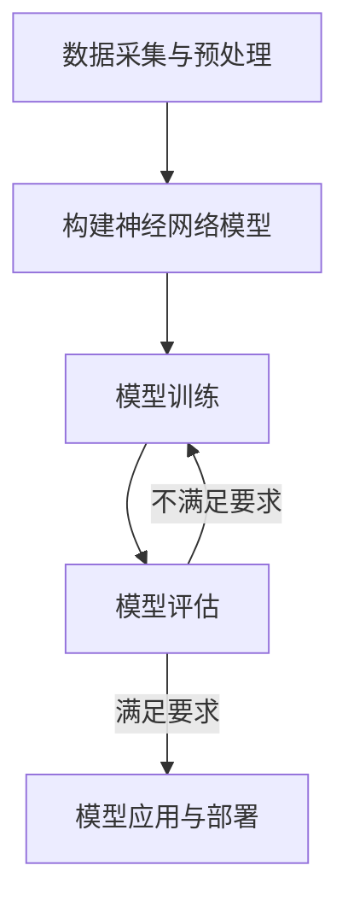

# AI人工智能深度学习算法：在航空航天中的应用

## 1.背景介绍

航空航天领域一直是人类科技创新的前沿阵地,也是人工智能技术应用的重要领域之一。随着深度学习算法的不断发展和计算能力的提升,人工智能在航空航天领域的应用越来越广泛,为航空航天技术的发展注入了新的动力。

### 1.1 航空航天领域面临的挑战

航空航天领域面临着诸多挑战,例如:

- 复杂的环境条件,如高空低温、强烈振动等,对设备的可靠性提出了极高要求。
- 大量高维度数据需要实时处理和分析,如飞行数据、遥感图像等。
- 需要对飞行器进行精确控制,确保飞行安全。
- 维修保养工作繁重,需要及时发现潜在故障隐患。

### 1.2 人工智能的优势

人工智能技术,特别是深度学习算法,在处理复杂数据、模式识别、智能决策等方面具有独特的优势,可以为航空航天领域提供有力支持:

- 深度学习算法擅长从海量数据中自动提取特征,发现潜在规律。
- 神经网络具有很强的泛化能力,能够处理未见过的新数据。
- 智能决策系统可以快速作出准确的判断,提高效率和安全性。
- 机器学习技术可用于故障诊断、预测维护等,提高设备可靠性。

## 2.核心概念与联系

### 2.1 深度学习算法

深度学习算法是机器学习的一个重要分支,它模仿人脑神经网络的工作原理,通过构建多层神经网络模型对输入数据进行特征提取和模式识别。常用的深度学习算法包括:

- 卷积神经网络(CNN)
- 循环神经网络(RNN)
- 长短期记忆网络(LSTM)
- 生成对抗网络(GAN)
- 自编码器(AutoEncoder)

这些算法在计算机视觉、自然语言处理、时序数据分析等领域都有广泛应用。

### 2.2 航空航天数据特点

航空航天领域产生的数据具有以下特点:

- 高维度、多源异构
- 时序性和动态性
- 噪声干扰和缺失值
- 安全性和隐私性要求高

这些特点给数据处理带来了极大挑战,需要采用先进的深度学习算法进行智能分析。

### 2.3 核心概念联系

深度学习算法与航空航天数据处理存在天然的联系:

- CNN擅长对图像、视频等高维数据进行特征提取和模式识别,可用于目标检测、导航避障等。
- RNN/LSTM适合处理时序数据,如飞行轨迹预测、故障预警等。
- GAN可用于数据增广、模拟虚拟环境等,提高算法的泛化能力。
- 自编码器能够对噪声数据进行去噪和修复,提高数据质量。

通过将深度学习算法应用于航空航天数据处理,可以极大提升数据分析的智能化水平,为航空航天技术的发展提供有力支撑。

## 3.核心算法原理具体操作步骤

在航空航天领域,深度学习算法通常需要经过以下几个步骤进行训练和应用:



### 3.1 数据采集与预处理

首先需要收集航空航天相关的数据,包括飞行数据、遥感图像、维修记录等。由于原始数据通常存在噪声、缺失值等问题,需要进行数据清洗、标注、增广等预处理操作,以确保数据质量。

### 3.2 构建神经网络模型

根据具体应用场景,选择合适的深度学习算法,如CNN用于图像处理,RNN用于时序数据分析等。然后设计网络结构,包括层数、神经元数量、激活函数等超参数。

### 3.3 模型训练

将预处理后的数据输入神经网络模型,通过反向传播算法不断调整网络参数,使模型在训练数据集上的性能不断提高,达到期望的精度要求。

### 3.4 模型评估

在保留的测试数据集上评估模型的泛化能力,计算相关指标如准确率、精确率、召回率等。如果模型性能不理想,需要重新调整网络结构或训练策略。

### 3.5 模型应用与部署

当模型性能满足要求后,就可以将其部署到实际的航空航天系统中,用于智能决策、故障诊断、飞行控制等应用场景,提高系统的智能化水平。

## 4.数学模型和公式详细讲解举例说明

深度学习算法的数学原理主要基于以下几个方面:

### 4.1 神经网络模型

神经网络模型由多层神经元组成,每个神经元对输入信号进行加权求和,然后通过激活函数进行非线性变换,得到输出信号。

对于单个神经元,其数学表达式为:

$$
y = f\left(\sum_{i=1}^{n}w_ix_i + b\right)
$$

其中:
- $x_i$是第$i$个输入
- $w_i$是第$i$个输入对应的权重
- $b$是偏置项
- $f$是激活函数,如Sigmoid、ReLU等

多层神经网络则是将多个神经元按层级组合而成,前一层的输出作为下一层的输入,通过不断传递和变换,最终得到预期的输出。

### 4.2 损失函数

在训练过程中,需要定义一个损失函数(Loss Function)来衡量模型的预测值与真实值之间的差异,常用的损失函数有均方误差、交叉熵等。

均方误差损失函数:

$$
L(y, \hat{y}) = \frac{1}{n}\sum_{i=1}^{n}(y_i - \hat{y}_i)^2
$$

其中$y$是真实值,$\hat{y}$是预测值,$n$是样本数量。

交叉熵损失函数(二分类):

$$
L(y, p) = -\frac{1}{n}\sum_{i=1}^{n}[y_i\log(p_i) + (1 - y_i)\log(1 - p_i)]
$$

其中$y$是真实标签(0或1),$p$是模型预测的概率值。

### 4.3 优化算法

通过优化算法如梯度下降法,可以不断调整神经网络的权重和偏置,使损失函数的值不断减小,从而提高模型的预测精度。

梯度下降算法的数学表达式为:

$$
\theta_{t+1} = \theta_t - \eta \cdot \nabla_\theta J(\theta)
$$

其中:
- $\theta$是需要优化的参数(权重和偏置)
- $J(\theta)$是损失函数
- $\nabla_\theta J(\theta)$是损失函数关于参数$\theta$的梯度
- $\eta$是学习率,控制每次更新的步长

通过不断迭代,算法可以找到使损失函数最小化的参数值,从而获得最优模型。

### 4.4 正则化

为了防止过拟合,提高模型的泛化能力,通常需要在损失函数中加入正则化项,常用的有L1正则化和L2正则化。

L2正则化的数学表达式为:

$$
L(y, \hat{y}) = \frac{1}{n}\sum_{i=1}^{n}(y_i - \hat{y}_i)^2 + \lambda\sum_i\left\lVert w_i\right\rVert_2^2
$$

其中$\lambda$是正则化系数,控制正则化项的权重。通过限制权重的大小,可以减少模型的复杂度,提高泛化能力。

以上是深度学习算法中一些核心的数学模型和公式,在实际应用中还会涉及到更多的细节,如激活函数的选择、批量归一化、dropout等技术,需要根据具体问题进行调整和优化。

## 5.项目实践:代码实例和详细解释说明

为了更好地理解深度学习算法在航空航天领域的应用,我们以一个具体的项目为例,介绍如何使用Python和Keras框架构建一个卷积神经网络模型,对航空器遥感图像进行目标检测。

### 5.1 数据准备

首先,我们需要准备一个包含航空器遥感图像的数据集,图像中需要标注出目标航空器的位置和类型。这里我们使用开源的DIOR数据集,它包含628张800x800像素的RGB图像,共标注了188295个目标框。

我们将数据集划分为训练集、验证集和测试集,比例为7:2:1。

```python
import os
import numpy as np
from sklearn.model_selection import train_test_split

# 加载数据集
images = []
bboxes = []
for filename in os.listdir('dior/images'):
    img_path = os.path.join('dior/images', filename)
    annot_path = os.path.join('dior/annotations', filename.replace('.png', '.txt'))
    
    # 读取图像
    img = imread(img_path)
    images.append(img)
    
    # 读取标注
    bboxes_per_img = []
    with open(annot_path, 'r') as f:
        for line in f.readlines():
            bbox = [float(x) for x in line.strip().split()]
            bboxes_per_img.append(bbox)
    bboxes.append(bboxes_per_img)

images = np.array(images)
bboxes = np.array(bboxes)

# 划分数据集
X_train, X_test, y_train, y_test = train_test_split(images, bboxes, test_size=0.2, random_state=42)
X_train, X_val, y_train, y_val = train_test_split(X_train, y_train, test_size=0.2, random_state=42)
```

### 5.2 构建CNN模型

接下来,我们使用Keras构建一个卷积神经网络模型,用于对航空器图像进行目标检测。

```python
from keras.models import Sequential
from keras.layers import Dense, Dropout, Flatten, Conv2D, MaxPooling2D

model = Sequential()

# 卷积层
model.add(Conv2D(32, (3, 3), activation='relu', input_shape=(800, 800, 3)))
model.add(MaxPooling2D((2, 2)))
model.add(Conv2D(64, (3, 3), activation='relu'))
model.add(MaxPooling2D((2, 2)))
model.add(Conv2D(128, (3, 3), activation='relu'))
model.add(MaxPooling2D((2, 2)))

# 全连接层
model.add(Flatten())
model.add(Dense(512, activation='relu'))
model.add(Dropout(0.5))
model.add(Dense(256, activation='relu'))
model.add(Dropout(0.5))
model.add(Dense(4, activation='linear'))  # 输出为4个值,表示目标框的(x, y, w, h)

# 编译模型
model.compile(optimizer='adam', loss='mse')
```

该模型包含3个卷积层和2个全连接层,用于从图像中提取特征并预测目标框的位置和大小。我们使用均方误差(MSE)作为损失函数,Adam作为优化器。

### 5.3 模型训练

现在,我们可以开始训练模型了。在训练过程中,我们将图像输入到模型中,模型会预测出目标框的坐标,然后与真实标注进行比较,计算损失值,并根据损失值更新网络参数。

```python
# 数据生成器
def data_generator(X, y, batch_size=32):
    while True:
        idx = np.random.permutation(len(X))[:batch_size]
        X_batch = X[idx]
        y_batch = y[idx]
        yield X_batch, y_batch

# 训练模型
train_generator = data_generator(X_train, y_train)
val_generator = data_generator(X_val, y_val)

model.fit_generator(
    train_generator,
    steps_per_epoch=len(X_train) // 32,
    epochs=50,
    validation_data=val_generator,
    validation_steps=len(X_val) // 32
)
```

我们使用了一个数据生成器,每次从训练集中随机取出一个批次的数据,送入模型进行训练。训练过程持续50个epoch,并使用验证集对模型进行评估。

### 5.4 模型评估和应用

训练完成后,我们可以在测试集上评估模型的性能,并将其应