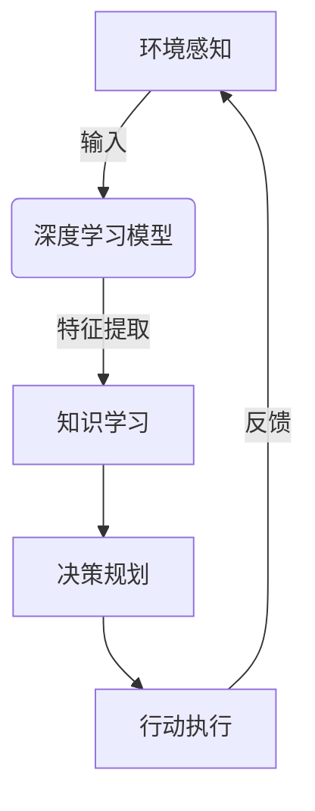

# AI人工智能深度学习算法：智能深度学习代理在公关危机管理中的应用

## 1.背景介绍

### 1.1 公关危机的重要性

在当今快节奏的商业环境中,公司面临着各种各样的风险和挑战。其中,公关危机是一个不容忽视的重大问题。公关危机可能源于产品缺陷、环境污染、员工不当行为等多种原因,一旦发生,将对企业的声誉、品牌形象和财务状况造成巨大损害。有效管理公关危机对于企业的可持续发展至关重要。

### 1.2 传统公关危机管理的局限性

传统的公关危机管理方式主要依赖于人工分析和判断,存在一些明显的局限性:

1. 反应滞后:人工分析需要一定的时间,在危机发生的初期容易错失最佳应对时机。
2. 分析偏差:人工分析容易受到主观因素的影响,导致判断失误。
3. 处理效率低下:面对大量复杂的数据,人工处理效率有限。
4. 缺乏预测能力:传统方式难以对未来危机进行预测和预警。

### 1.3 AI在公关危机管理中的作用

人工智能(AI)技术,尤其是深度学习算法,为公关危机管理带来了新的契机。智能深度学习代理可以实时监测各种数据源,快速识别潜在危机,并提出有效的应对策略,从而弥补了传统方式的不足。

## 2.核心概念与联系

### 2.1 深度学习

深度学习(Deep Learning)是机器学习的一个新兴热点领域,其灵感来源于人脑的结构和功能。深度学习算法通过对大量数据的训练,能够自主学习数据的特征,并对新数据进行分类或预测。

主要的深度学习模型包括:

- 卷积神经网络(CNN)
- 递归神经网络(RNN)
- 长短期记忆网络(LSTM)
- 生成对抗网络(GAN)等

### 2.2 智能代理

智能代理(Intelligent Agent)是一种自主的软件实体,能够感知环境、学习知识、制定计划并采取行动以实现预定目标。智能代理可以应用于各种领域,如游戏、机器人、决策支持系统等。

在公关危机管理中,智能深度学习代理可以集成深度学习模型,从海量数据中提取有价值的信息,并基于学习到的知识做出明智的决策和行动。

上图展示了智能深度学习代理的工作流程。代理首先感知环境数据,将其输入到深度学习模型中进行特征提取和知识学习。在此基础上,代理能够制定合理的决策计划,并执行相应的行动来应对危机。同时,代理会根据行动的结果对模型进行反馈和优化,形成一个闭环过程。

## 3.核心算法原理具体操作步骤

智能深度学习代理在公关危机管理中的应用,主要包括以下几个核心步骤:

### 3.1 数据采集

代理需要从多个渠道采集相关数据,包括:

- 新闻媒体报道
- 社交媒体数据(如微博、推特等)
- 线上论坛和评论
- 政府监管信息
- 行业报告和分析等

这些数据将作为代理的输入,需要进行适当的预处理和清洗,以确保数据质量。

### 3.2 危机识别

基于采集的数据,代理利用深度学习模型(如CNN、RNN等)对数据进行语义分析,从中识别出潜在的危机信号。这个过程可以分为以下几个步骤:

1. **特征提取**: 将文本数据转换为向量表示,作为深度学习模型的输入。
2. **模型训练**: 使用标注的危机数据集对模型进行训练,学习危机和非危机数据的模式。
3. **模型评估**: 在测试集上评估模型的性能,包括精确率、召回率等指标。
4. **模型优化**: 根据评估结果,通过调整超参数、增加训练数据等方式优化模型。
5. **危机识别**: 将优化后的模型应用于新的数据,识别出潜在的危机信号。

### 3.3 危机评估

对于识别出的危机信号,代理需要进一步评估其严重程度和影响范围,为后续的决策提供依据。评估过程可以考虑以下因素:

- 危机来源的可信度
- 危机主题的敏感程度
- 危机事件的发展趋势
- 潜在的经济和声誉损失等

代理可以使用基于规则的方法或机器学习模型(如决策树、SVM等)对危机进行综合评估和分级。

### 3.4 策略制定

根据危机的评估结果,代理需要制定合理的应对策略,包括:

- 发布澄清公告
- 采取补救措施
- 进行有针对性的宣传
- 与利益相关方进行沟通等

策略制定可以借助决策理论和优化算法,将多个目标(如声誉保护、经济损失最小化等)纳入考量,选择最优策略。

### 3.5 策略执行

代理将制定的策略转化为具体的行动计划,并协调相关部门执行,如:

- 撰写新闻稿和社交媒体内容
- 安排新闻发布会
- 开展产品召回或赔偿方案
- 部署人力物力资源等

在执行过程中,代理需要持续监测执行效果,并根据反馈适时调整策略。

### 3.6 效果评估与优化

代理需要评估整个危机管理过程的效果,包括:

- 危机事件的最终影响
- 公众舆论的变化
- 品牌声誉的恢复程度
- 经济损失的控制情况等

基于评估结果,代理可以总结经验教训,优化危机识别模型、评估机制和决策流程,以提高未来应对危机的能力。

## 4.数学模型和公式详细讲解举例说明

在智能深度学习代理的各个环节中,都涉及了多种数学模型和算法,下面将对其中的几个核心模型进行详细讲解。

### 4.1 文本特征提取

将文本数据转换为向量表示是深度学习模型处理的前提。常用的文本特征提取方法包括:

1. **One-Hot编码**

   对于词汇表$V$中的每个词$w_i$,使用一个|V|维的向量$\boldsymbol{x}_i$进行编码,其中只有第i个元素为1,其余元素为0。

   $$\boldsymbol{x}_i = \begin{bmatrix} 0 \\ \vdots \\ 1 \\ \vdots \\ 0 \end{bmatrix}$$

   One-Hot编码简单直观,但是当词汇表很大时,向量会变得非常稀疏和高维。

2. **Word Embedding**

   Word Embedding将每个词映射到一个低维的稠密向量空间,相似的词会被映射到相近的向量。常用的Word Embedding方法包括Word2Vec、GloVe等。

   设词$w_i$的Embedding向量为$\boldsymbol{v}_i \in \mathbb{R}^d$,其中d是embedding维度,通常取值在几百到上千的范围。一个长度为n的句子可以表示为:

   $$\boldsymbol{s} = \boldsymbol{v}_1 \oplus \boldsymbol{v}_2 \oplus \cdots \oplus \boldsymbol{v}_n$$

   其中$\oplus$表示向量的拼接或加权求和操作。Word Embedding能够很好地捕捉词与词之间的语义关系,是深度学习模型中常用的输入表示方式。

### 4.2 卷积神经网络

卷积神经网络(CNN)是一种常用的深度学习模型,在计算机视觉和自然语言处理等领域有着广泛的应用。CNN能够自动学习输入数据的局部特征,并对其进行组合和抽象,形成更高层次的语义表示。

对于一个长度为n的句子$\boldsymbol{s} = \boldsymbol{x}_1 \oplus \boldsymbol{x}_2 \oplus \cdots \oplus \boldsymbol{x}_n$,其中$\boldsymbol{x}_i \in \mathbb{R}^d$是词向量,CNN的计算过程如下:

1. **卷积层**

   使用一个高度为h的卷积核$\boldsymbol{W} \in \mathbb{R}^{h \times d}$在句子上滑动,对每个窗口$\boldsymbol{x}_{i:i+h-1} = \boldsymbol{x}_i \oplus \boldsymbol{x}_{i+1} \oplus \cdots \oplus \boldsymbol{x}_{i+h-1}$进行卷积运算:

   $$c_i = f(\boldsymbol{W} \cdot \boldsymbol{x}_{i:i+h-1} + b)$$

   其中$f$是非线性激活函数(如ReLU),b是偏置项。通过在不同位置进行卷积,可以得到一个特征映射$\boldsymbol{c} = [c_1, c_2, \ldots, c_{n-h+1}]$。

2. **池化层**

   池化层对卷积特征进行下采样,常用的池化方式包括最大池化(Max Pooling)和平均池化(Average Pooling)等。设池化窗口大小为p,则池化后的特征为:

   $$\hat{c}_j = \text{pool}(c_{(j-1)p+1}, \ldots, c_{jp})$$

   其中$\text{pool}$表示具体的池化操作。池化能够减小特征维度,提取局部的最显著特征。

3. **全连接层**

   将池化后的特征向量$\hat{\boldsymbol{c}}$输入到全连接层,进行分类或回归等任务:

   $$\boldsymbol{y} = \boldsymbol{W}^T \hat{\boldsymbol{c}} + \boldsymbol{b}$$

   其中$\boldsymbol{W}$和$\boldsymbol{b}$是全连接层的权重和偏置。

通过端到端的训练,CNN能够自动学习文本数据的层次化特征表示,并在危机识别等任务中发挥出色的性能。

### 4.3 长短期记忆网络

长短期记忆网络(LSTM)是一种广泛使用的递归神经网络(RNN)变体,能够有效地捕捉序列数据中的长期依赖关系,在自然语言处理等领域有着重要应用。

对于一个长度为n的序列$\boldsymbol{x} = (\boldsymbol{x}_1, \boldsymbol{x}_2, \ldots, \boldsymbol{x}_n)$,在时间步t,LSTM的计算过程如下:

1. **遗忘门**

   遗忘门决定了从上一时间步传递过来的信息中,有多少需要被遗忘:

   $$\boldsymbol{f}_t = \sigma(\boldsymbol{W}_f \cdot [\boldsymbol{h}_{t-1}, \boldsymbol{x}_t] + \boldsymbol{b}_f)$$

   其中$\sigma$是sigmoid函数,$\boldsymbol{W}_f$和$\boldsymbol{b}_f$是遗忘门的权重和偏置,$\boldsymbol{h}_{t-1}$是上一时间步的隐状态。

2. **输入门**

   输入门决定了当前时间步的输入信息中,有多少需要被存储到细胞状态中:

   $$\boldsymbol{i}_t = \sigma(\boldsymbol{W}_i \cdot [\boldsymbol{h}_{t-1}, \boldsymbol{x}_t] + \boldsymbol{b}_i)$$
   $$\tilde{\boldsymbol{C}}_t = \tanh(\boldsymbol{W}_C \cdot [\boldsymbol{h}_{t-1}, \boldsymbol{x}_t] + \boldsymbol{b}_C)$$

   其中$\boldsymbol{i}_t$是输入门的激活值向量,$\tilde{\boldsymbol{C}}_t$是新的候选细胞状态。

3. **细胞状态更新**

   根据遗忘门和输入门的信息,更新细胞状态:

   $$\boldsymbol{C}_t = \boldsymbol{f}_t \odot \boldsymbol{C}_{t-1} + \