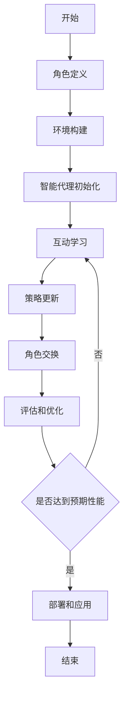

# AI人工智能深度学习算法：智能深度学习代理的互动学习与角色方法

## 1. 背景介绍

### 1.1 人工智能的发展历程

人工智能(Artificial Intelligence, AI)是一门富有挑战性的计算机科学领域,旨在创建能够模仿人类智能行为的智能系统。自20世纪50年代问世以来,AI已经取得了长足的进步,并广泛应用于各个领域,如计算机视觉、自然语言处理、机器人技术、专家系统等。

### 1.2 深度学习的兴起

近年来,深度学习(Deep Learning)作为机器学习的一个新的研究热点,正在推动着人工智能的飞速发展。深度学习是一种基于对数据的表征学习的机器学习算法,其灵感来源于人脑的神经网络结构和处理数据的方式。通过构建深层次的神经网络模型,深度学习算法能够自主从海量数据中提取有用的特征表示,并对复杂的数据进行高效处理和智能决策。

### 1.3 智能代理与互动学习

在人工智能系统中,智能代理(Intelligent Agent)扮演着至关重要的角色。智能代理是一种能够感知环境、思考并采取行动以实现特定目标的自主实体。随着人工智能技术的不断进步,智能代理的能力也在不断提高,其中一个重要的发展方向就是互动学习(Interactive Learning)。

互动学习旨在让智能代理通过与人类或环境的互动来获取知识和经验,从而不断优化和提高自身的决策能力。这种学习方式更加贴近真实世界,能够帮助智能代理更好地理解和适应复杂的环境,提高其泛化能力和鲁棒性。

### 1.4 角色方法在互动学习中的应用

在互动学习过程中,角色方法(Role Method)被广泛应用于智能代理的训练和优化。角色方法基于这样一种思想:通过赋予智能代理不同的角色,模拟不同的场景和任务,从而促进其学习和发展。每个角色都代表了一种特定的行为模式、目标和约束,智能代理需要根据所扮演的角色做出相应的决策和行动。

通过角色方法,智能代理可以获得更加丰富和多样化的学习体验,提高其对复杂环境的适应能力。同时,角色方法也为人工智能系统的设计、测试和评估提供了一种有效的框架,有助于提高系统的可靠性和鲁棒性。

## 2. 核心概念与联系

### 2.1 深度学习模型

深度学习模型是实现智能代理互动学习的核心组件之一。常见的深度学习模型包括:

#### 2.1.1 卷积神经网络(Convolutional Neural Network, CNN)

CNN是一种常用于计算机视觉任务的深度神经网络模型,擅长从图像或视频中提取特征。它通过卷积操作和池化操作来捕获局部模式,并通过多层网络结构来学习更高层次的抽象特征表示。

#### 2.1.2 循环神经网络(Recurrent Neural Network, RNN)

RNN是一种常用于序列数据处理的深度神经网络模型,如自然语言处理、时间序列预测等。它通过内部状态的循环传递,能够有效地捕捉序列数据中的长期依赖关系。常见的RNN变体包括长短期记忆网络(LSTM)和门控循环单元(GRU)。

#### 2.1.3 生成对抗网络(Generative Adversarial Network, GAN)

GAN是一种用于生成式建模的深度学习模型,由生成器(Generator)和判别器(Discriminator)两个对抗网络组成。生成器负责从噪声或潜在空间生成新的样本,而判别器则负责判断生成的样本是真实的还是伪造的。通过两个网络的对抗训练,GAN能够学习到数据的真实分布,并生成高质量的新样本。

### 2.2 强化学习

强化学习(Reinforcement Learning)是一种基于环境反馈的机器学习范式,常用于训练智能代理在复杂环境中做出最优决策。在强化学习中,智能代理通过与环境的交互来学习一个策略(Policy),以最大化未来的累积奖励。

强化学习算法通常包括以下几个核心要素:

- 状态(State):描述环境的当前状态
- 动作(Action):智能代理可以采取的行动
- 奖励(Reward):环境对智能代理行动的反馈,用于指导学习过程
- 策略(Policy):智能代理根据当前状态选择动作的策略
- 值函数(Value Function):评估当前状态或状态-动作对的长期价值

常见的强化学习算法包括Q-Learning、Deep Q-Network(DQN)、策略梯度(Policy Gradient)等。

### 2.3 多智能体系统

在许多现实场景中,智能代理需要与其他智能体进行协作或竞争,形成一个多智能体系统(Multi-Agent System, MAS)。多智能体系统中的每个智能体都拥有自己的目标、策略和行为,它们需要相互协调以实现共同的目标或解决复杂的任务。

多智能体强化学习(Multi-Agent Reinforcement Learning, MARL)是一种将强化学习应用于多智能体系统的方法,旨在训练智能体在动态环境中做出最优决策。MARL需要解决诸如非静态性、部分可观测性、多目标优化等挑战。

### 2.4 人机交互

人机交互(Human-Computer Interaction, HCI)是一门研究人与计算机系统之间交互过程的学科,旨在设计出更加自然、高效和用户友好的交互方式。在智能代理的互动学习中,人机交互扮演着重要的角色,因为智能代理需要与人类用户进行有效的交流和协作。

人机交互技术包括自然语言处理、计算机视觉、手势识别、虚拟现实/增强现实等,可以帮助智能代理更好地理解人类的意图和行为,并提供更加自然和直观的交互体验。

### 2.5 概念联系

上述核心概念之间存在着密切的联系,共同构建了智能深度学习代理的互动学习与角色方法的理论基础和技术支撑。

深度学习模型为智能代理提供了强大的数据处理和特征提取能力,能够从复杂的环境数据中学习出有用的表示。强化学习则为智能代理提供了一种在动态环境中做出最优决策的范式,通过与环境的交互来不断优化策略。

在多智能体系统中,每个智能体都可以被视为一个独立的角色,它们需要相互协作或竞争以完成任务。人机交互技术则为智能代理与人类用户之间的互动提供了支持,使得智能代理能够更好地理解人类的意图和行为,并提供更加自然和友好的交互体验。

角色方法将上述概念有机地结合在一起,通过赋予智能代理不同的角色,模拟不同的场景和任务,促进其在多样化的环境中进行互动学习,从而提高其泛化能力和鲁棒性。

## 3. 核心算法原理具体操作步骤

### 3.1 角色方法的基本流程

角色方法在智能深度学习代理的互动学习中的基本流程如下:

1. **角色定义**: 根据应用场景和任务需求,定义一组不同的角色。每个角色都具有特定的目标、约束和行为模式。

2. **环境构建**: 构建一个模拟真实世界的虚拟环境,用于智能代理的训练和测试。该环境应该能够支持多智能体的交互,并提供必要的状态信息和奖励机制。

3. **智能代理初始化**: 根据角色定义,初始化一组智能代理,每个智能代理对应一个角色。智能代理可以采用深度学习模型、强化学习算法或其他机器学习技术来实现。

4. **互动学习**: 在虚拟环境中,智能代理根据所扮演的角色进行互动学习。每个智能代理都需要根据当前状态做出决策,并执行相应的动作。环境会根据智能代理的行为提供奖励或惩罚,以指导智能代理优化其策略。

5. **策略更新**: 根据互动学习过程中获得的经验,智能代理使用强化学习算法或其他机器学习技术来更新其策略,以提高未来的决策质量。

6. **角色交换**: 在一定的训练周期后,智能代理可以交换角色,以获得不同角色的学习体验。这有助于提高智能代理的泛化能力和鲁棒性。

7. **评估和优化**: 定期评估智能代理的性能,并根据评估结果对环境、角色定义或智能代理模型进行优化和调整。

8. **部署和应用**: 当智能代理达到预期的性能水平时,可以将其部署到实际的应用场景中,并继续通过与真实环境的互动来进一步优化和学习。

### 3.2 算法流程图

下面是角色方法在智能深度学习代理的互动学习中的算法流程图,使用Mermaid语法绘制:

### 3.3 关键步骤详解

#### 3.3.1 角色定义

角色定义是角色方法的基础,它决定了智能代理在互动学习过程中所扮演的不同角色。每个角色都应该具有明确的目标、约束和行为模式,以模拟真实世界中的不同场景和任务。

角色定义可以基于以下几个方面:

- **目标(Goal)**: 角色需要实现的最终目标,如最大化奖励、完成特定任务等。
- **约束(Constraints)**: 角色在行动过程中需要遵守的限制条件,如资源限制、时间限制等。
- **行为模式(Behavior Pattern)**: 角色在不同情况下应该采取的行为策略,如合作、竞争、自我保护等。
- **观测空间(Observation Space)**: 角色可以观测到的环境状态信息。
- **动作空间(Action Space)**: 角色可以执行的一组动作。

角色定义应该尽可能贴近真实场景,以确保智能代理在训练过程中获得有价值的学习体验。同时,角色之间也应该存在一定的差异和互补性,以促进智能代理的泛化能力。

#### 3.3.2 环境构建

环境构建是智能代理互动学习的关键基础。一个良好的环境应该能够模拟真实世界的复杂性,提供丰富的状态信息和合理的奖励机制,同时支持多智能体的交互。

环境构建可以考虑以下几个方面:

- **状态表示(State Representation)**: 如何有效地表示环境的当前状态,以便智能代理做出正确的决策。
- **动作空间(Action Space)**: 智能代理可以执行的一组动作,应该与角色定义相匹配。
- **奖励函数(Reward Function)**: 定义合理的奖励函数,以指导智能代理的学习过程。奖励函数应该与角色目标相关,并能够反映智能代理行为的好坏。
- **环境动态(Environment Dynamics)**: 模拟环境的变化规则,如智能体行为对环境的影响、环境的自然演化等。
- **多智能体交互(Multi-Agent Interaction)**: 支持多个智能体在同一环境中进行交互,包括合作、竞争或混合模式。
- **可观测性(Observability)**: 控制智能代理对环境状态的可观测程度,以增加任务的难度和真实性。
- **随机性(Stochasticity)**: 引入一定的随机性,使环境更加动态和不确定,增加智能代理的鲁棒性。

环境构建可以利用各种模拟工具和游戏引擎,如OpenAI Gym、Unity3D等,也可以基于真实世界的数据集构建虚拟环境。

#### 3.3.3 智