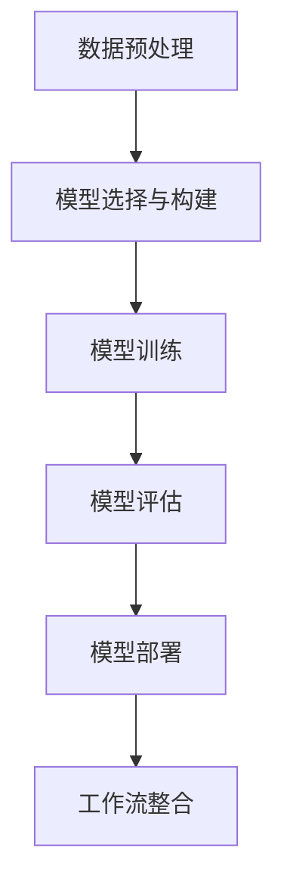

# AI人工智能深度学习算法：智能深度学习代理的工作流整合方法

## 1.背景介绍

在当今的科技时代，人工智能（AI）和深度学习（DL）已经成为推动技术进步的核心力量。深度学习算法通过模拟人脑的神经网络结构，能够处理复杂的数据并从中提取有价值的信息。智能深度学习代理（Intelligent Deep Learning Agents，IDLA）是深度学习技术的一个重要应用，它们能够自主学习和决策，广泛应用于自动驾驶、自然语言处理、图像识别等领域。

然而，尽管深度学习算法在各个领域取得了显著的成果，但其工作流的整合仍然面临诸多挑战。本文将深入探讨智能深度学习代理的工作流整合方法，旨在为读者提供一个全面的视角，帮助他们更好地理解和应用这些技术。

## 2.核心概念与联系

### 2.1 深度学习

深度学习是一种基于人工神经网络的机器学习方法，通过多层神经元的连接和权重调整，实现对复杂数据的学习和预测。其核心在于通过大量数据的训练，自动提取特征并进行分类或回归。

### 2.2 智能代理

智能代理是一种能够自主感知环境、做出决策并执行动作的计算机程序。它们通常具备学习能力，能够根据环境的变化不断优化自身的行为。

### 2.3 工作流整合

工作流整合是指将多个独立的任务或过程有机地结合在一起，以实现更高效的工作流程。在深度学习领域，工作流整合涉及数据预处理、模型训练、模型评估和部署等多个环节。

### 2.4 核心联系

智能深度学习代理的工作流整合方法，核心在于将深度学习算法与智能代理技术相结合，通过优化工作流，提高系统的整体性能和效率。

## 3.核心算法原理具体操作步骤

### 3.1 数据预处理

数据预处理是深度学习工作流的第一步，主要包括数据清洗、数据增强和特征提取等步骤。数据清洗是指去除数据中的噪声和异常值，数据增强是通过对数据进行变换和扩展，增加数据的多样性，特征提取是从原始数据中提取出有用的特征。

### 3.2 模型选择与构建

模型选择与构建是深度学习工作的核心步骤。根据具体的应用场景，选择合适的深度学习模型，如卷积神经网络（CNN）、循环神经网络（RNN）等。然后，根据数据的特征和任务的要求，构建相应的神经网络结构。

### 3.3 模型训练

模型训练是指通过大量的训练数据，不断调整模型的参数，使其能够准确地预测或分类。训练过程中，通常采用梯度下降算法和反向传播算法，来最小化损失函数。

### 3.4 模型评估

模型评估是指通过测试数据，评估模型的性能。常用的评估指标包括准确率、精确率、召回率和F1值等。通过评估，可以了解模型的优缺点，并进行相应的优化。

### 3.5 模型部署

模型部署是指将训练好的模型应用到实际的生产环境中。部署过程中，需要考虑模型的性能、稳定性和可扩展性等因素。

### 3.6 工作流整合

工作流整合是指将上述各个步骤有机地结合在一起，形成一个高效的工作流程。通过自动化工具和平台，可以实现数据预处理、模型训练、评估和部署的自动化，提高工作效率和系统的整体性能。

以下是一个典型的智能深度学习代理工作流整合的Mermaid流程图：



## 4.数学模型和公式详细讲解举例说明

### 4.1 神经网络基础

神经网络是深度学习的基础，其核心在于通过多个神经元的连接和权重调整，实现对数据的学习和预测。一个简单的神经网络可以表示为：

$$
y = f(Wx + b)
$$

其中，$y$ 是输出，$x$ 是输入，$W$ 是权重矩阵，$b$ 是偏置，$f$ 是激活函数。

### 4.2 损失函数

损失函数是衡量模型预测结果与真实结果之间差距的函数。常用的损失函数包括均方误差（MSE）和交叉熵损失（Cross-Entropy Loss）等。均方误差的公式为：

$$
L = \frac{1}{n} \sum_{i=1}^{n} (y_i - \hat{y}_i)^2
$$

其中，$n$ 是样本数量，$y_i$ 是真实值，$\hat{y}_i$ 是预测值。

### 4.3 梯度下降算法

梯度下降算法是优化神经网络参数的常用方法。其核心思想是通过不断调整参数，使损失函数达到最小值。梯度下降算法的更新公式为：

$$
W = W - \eta \frac{\partial L}{\partial W}
$$

其中，$\eta$ 是学习率，$\frac{\partial L}{\partial W}$ 是损失函数对权重的偏导数。

### 4.4 反向传播算法

反向传播算法是神经网络训练的核心算法，通过计算损失函数对每个参数的偏导数，来更新参数。反向传播算法的核心公式为：

$$
\delta^l = (W^{l+1})^T \delta^{l+1} \odot f'(z^l)
$$

其中，$\delta^l$ 是第 $l$ 层的误差，$W^{l+1}$ 是第 $l+1$ 层的权重矩阵，$f'(z^l)$ 是激活函数的导数。

### 4.5 实例说明

假设我们要训练一个简单的二分类模型，输入数据为 $x$，输出为 $y$。我们选择一个两层的神经网络，第一层有 $n$ 个神经元，第二层有 1 个神经元。模型的结构可以表示为：

$$
h = f(W_1 x + b_1)
$$

$$
y = \sigma(W_2 h + b_2)
$$

其中，$W_1$ 和 $W_2$ 是权重矩阵，$b_1$ 和 $b_2$ 是偏置，$f$ 是激活函数，$\sigma$ 是sigmoid函数。

## 5.项目实践：代码实例和详细解释说明

### 5.1 数据预处理

```python
import numpy as np
from sklearn.preprocessing import StandardScaler

# 生成示例数据
X = np.random.rand(100, 10)
y = np.random.randint(0, 2, size=(100, 1))

# 数据标准化
scaler = StandardScaler()
X_scaled = scaler.fit_transform(X)
```

### 5.2 模型选择与构建

```python
import tensorflow as tf
from tensorflow.keras.models import Sequential
from tensorflow.keras.layers import Dense

# 构建模型
model = Sequential([
    Dense(64, activation='relu', input_shape=(10,)),
    Dense(1, activation='sigmoid')
])

# 编译模型
model.compile(optimizer='adam', loss='binary_crossentropy', metrics=['accuracy'])
```

### 5.3 模型训练

```python
# 训练模型
model.fit(X_scaled, y, epochs=10, batch_size=32)
```

### 5.4 模型评估

```python
# 评估模型
loss, accuracy = model.evaluate(X_scaled, y)
print(f'Loss: {loss}, Accuracy: {accuracy}')
```

### 5.5 模型部署

```python
# 保存模型
model.save('my_model.h5')

# 加载模型
new_model = tf.keras.models.load_model('my_model.h5')
```

