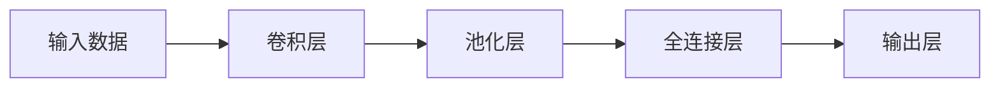
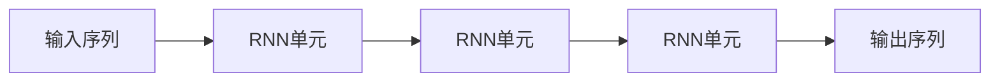
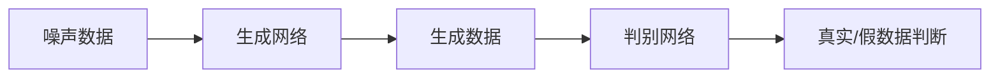
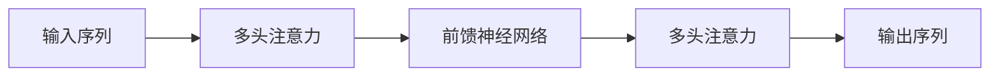
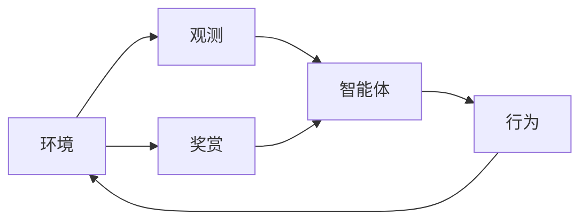
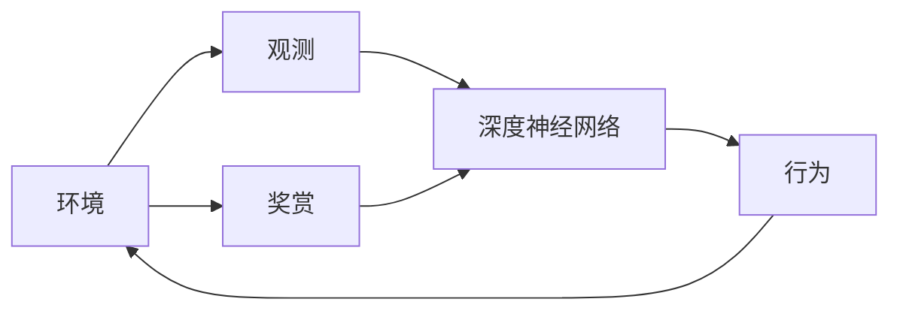
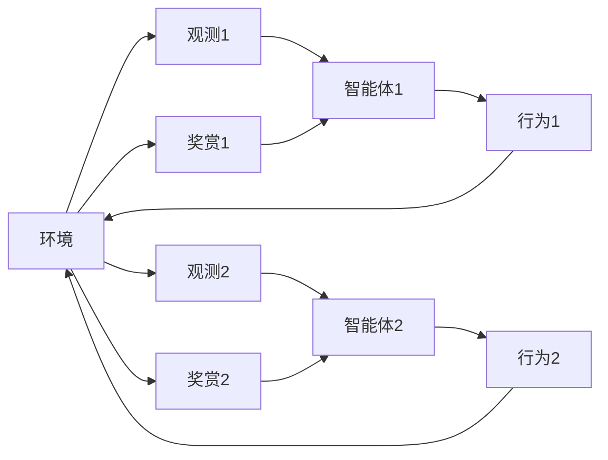
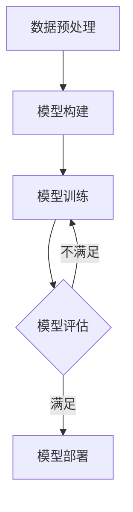
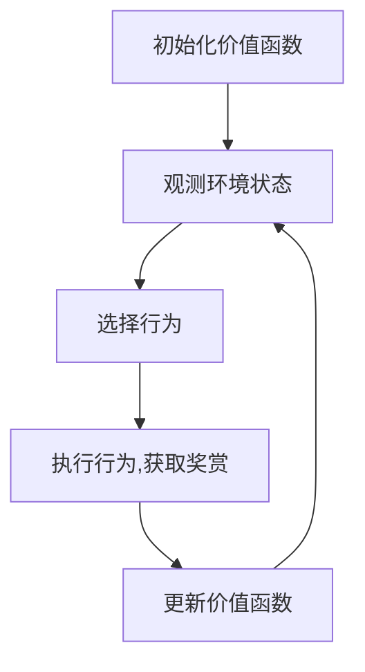
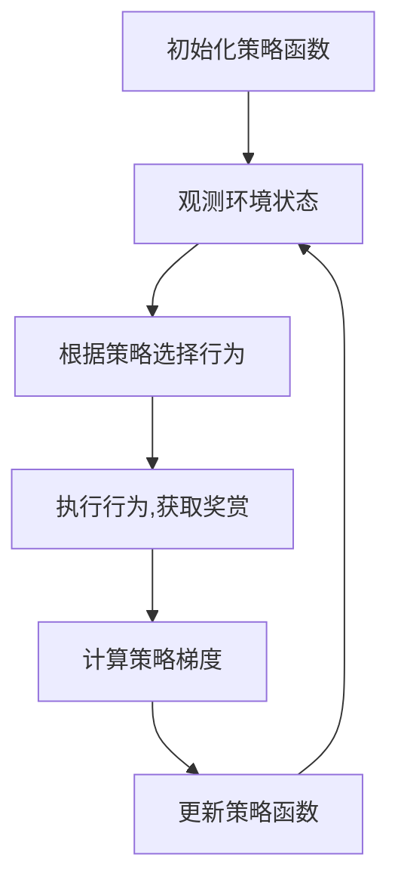

# AI人工智能深度学习算法：智能深度学习代理的未来发展趋势

## 1.背景介绍

### 1.1 人工智能的兴起

人工智能(Artificial Intelligence, AI)是当代科技领域最具革命性和颠覆性的技术之一。自20世纪50年代诞生以来,AI技术不断演进,已广泛应用于计算机视觉、自然语言处理、决策系统、机器人技术等诸多领域,为人类社会带来了深刻的变革。

### 1.2 深度学习的崛起

深度学习(Deep Learning)是人工智能的一个新的阶段,是机器学习(Machine Learning)的一种技术。它模仿人脑神经网络结构和工作机制,通过对大量数据进行训练,自动学习数据特征,并用于检测、分类和预测等任务。近年来,深度学习在语音识别、图像识别、自然语言处理等领域取得了突破性进展。

### 1.3 智能代理的概念

智能代理(Intelligent Agent)是人工智能系统中一种具有自主性、响应性、持续性和主动性等特征的虚拟实体。它能够感知环境,并根据设定的目标做出理性决策和行为,与人类或其他代理进行交互。智能代理可应用于各种复杂环境,如游戏、机器人控制、网络系统等。

### 1.4 深度学习代理的重要性

深度学习代理是指基于深度学习技术构建的智能代理系统。它们能够从大量数据中自主学习,并做出智能决策和行为响应。深度学习代理在很多领域展现出卓越的性能,如围棋、视频游戏、自动驾驶等,成为人工智能发展的重要方向。

## 2.核心概念与联系  

### 2.1 深度学习模型

深度学习模型是构建智能深度学习代理的核心。常见的深度学习模型有:

#### 2.1.1 卷积神经网络(CNN)

适用于处理网格数据(如图像),能自动学习数据的空间特征。CNN广泛应用于计算机视觉、图像分类等领域。

#### 2.1.2 循环神经网络(RNN)

适用于处理序列数据(如文本、语音),能捕捉数据的时序特征。RNN及其变种(LSTM、GRU)广泛应用于自然语言处理、语音识别等领域。

#### 2.1.3 生成对抗网络(GAN)

由生成网络和判别网络组成,用于生成逼真的数据样本。GAN可用于图像生成、语音合成、数据增广等任务。

#### 2.1.4 transformer

基于自注意力机制,适用于处理序列数据。Transformer在机器翻译、语言模型等任务中表现优异。

### 2.2 强化学习

强化学习(Reinforcement Learning)是机器学习的一个重要分支,旨在让智能体(Agent)通过与环境的交互,学习获取最大化奖赏的策略。它是构建智能深度学习代理的关键技术之一。

### 2.3 深度强化学习

深度强化学习(Deep Reinforcement Learning)是将深度学习与强化学习相结合,使用深度神经网络来近似智能体的策略或值函数,从而提高学习效率和性能。

### 2.4 多智能体系统

多智能体系统(Multi-Agent System)由多个智能体组成,它们可以相互协作或竞争,以完成复杂任务。多智能体强化学习是一种重要的研究方向,可应用于机器人控制、交通管理等领域。

## 3.核心算法原理具体操作步骤

### 3.1 深度学习模型训练

#### 3.1.1 数据预处理

- 数据清洗和标注
- 数据增广
- 数据归一化

#### 3.1.2 模型构建

- 选择合适的网络架构(CNN、RNN等)
- 定义网络层数和参数
- 选择损失函数和优化器

#### 3.1.3 模型训练

- 将数据输入模型
- 计算损失函数
- 通过优化器更新模型参数
- 重复训练,直到模型收敛

### 3.2 强化学习算法

#### 3.2.1 价值函数方法

- 使用价值函数来估计状态或状态-行为对的价值
- 常见算法包括Q-Learning、Sarsa、Deep Q-Network(DQN)等

#### 3.2.2 策略梯度方法

- 直接学习智能体的策略函数
- 常见算法包括REINFORCE、Actor-Critic、Proximal Policy Optimization(PPO)等

### 3.3 多智能体强化学习算法

- 独立学习者(Independent Learners)
- 集中式训练分布式执行(Centralized Training with Decentralized Execution)
- 多智能体演化策略(Multi-Agent Evolution Strategies)
- 多智能体对抗性训练(Multi-Agent Adversarial Training)

## 4.数学模型和公式详细讲解举例说明

### 4.1 深度学习模型

#### 4.1.1 卷积神经网络

卷积层的计算过程可以表示为:

$$
y_{ij}^l = f\left(\sum_{m}\sum_{p=0}^{P_m-1}\sum_{q=0}^{Q_m-1}w_{pq}^{lm}x_{i+p,j+q}^{l-1} + b^{lm}\right)
$$

其中:
- $y_{ij}^l$是第l层第i行第j列的输出特征图
- $x_{ij}^{l-1}$是第l-1层第i行第j列的输入特征图
- $w_{pq}^{lm}$是第l层第m个卷积核的权重
- $b^{lm}$是第l层第m个卷积核的偏置
- $f$是激活函数,如ReLU

池化层用于降低特征维度,常用的是最大池化:

$$
y_{ij}^l = \max_{(p,q)\in R_{ij}}x_{p,q}^{l-1}
$$

其中$R_{ij}$是输入特征图上的池化区域。

#### 4.1.2 循环神经网络

RNN在时间步t的隐藏状态$h_t$由前一时间步的隐藏状态$h_{t-1}$和当前输入$x_t$计算得到:

$$
h_t = f(W_{hh}h_{t-1} + W_{xh}x_t + b_h)
$$

其中$W_{hh}$、$W_{xh}$和$b_h$分别是隐藏层权重矩阵、输入权重矩阵和偏置向量,$f$是激活函数。

输出$y_t$由隐藏状态$h_t$计算得到:

$$
y_t = g(W_{yh}h_t + b_y)
$$

其中$W_{yh}$和$b_y$分别是输出层权重矩阵和偏置向量,$g$是输出激活函数。

#### 4.1.3 生成对抗网络

生成对抗网络由生成器G和判别器D组成,目标是找到一个生成器G,使得生成的样本分布$p_g$与真实数据分布$p_{data}$的JS距离最小:

$$
\min_G\max_D V(D,G) = \mathbb{E}_{x\sim p_{data}}[\log D(x)] + \mathbb{E}_{z\sim p_z}[\log(1-D(G(z)))]
$$

其中$z$是噪声向量,服从先验分布$p_z$。

训练过程是生成器G和判别器D的minimax博弈:生成器G努力生成逼真的样本以欺骗判别器D,而判别器D则努力区分真实样本和生成样本。

#### 4.1.4 Transformer

Transformer的核心是多头注意力机制,它对序列中的每个元素计算其与其他元素的注意力权重,并基于这些权重对元素进行加权求和。

给定查询$Q$、键$K$和值$V$,单头注意力计算如下:

$$
\text{Attention}(Q, K, V) = \text{softmax}\left(\frac{QK^T}{\sqrt{d_k}}\right)V
$$

其中$d_k$是缩放因子,用于防止内积过大导致softmax函数梯度较小。

多头注意力则是将注意力机制运行多次(多个头),最后将每个头的结果进行拼接:

$$
\text{MultiHead}(Q, K, V) = \text{Concat}(\text{head}_1, \dots, \text{head}_h)W^O
$$

$$
\text{where } \text{head}_i = \text{Attention}(QW_i^Q, KW_i^K, VW_i^V)
$$

$W_i^Q$、$W_i^K$、$W_i^V$和$W^O$是可学习的线性投影参数。

### 4.2 强化学习

#### 4.2.1 马尔可夫决策过程

强化学习问题通常建模为马尔可夫决策过程(Markov Decision Process, MDP),定义为一个五元组$(S, A, P, R, \gamma)$:

- $S$是状态空间集合
- $A$是行为空间集合
- $P(s'|s,a)$是状态转移概率,表示在状态$s$执行行为$a$后,转移到状态$s'$的概率
- $R(s,a)$是奖赏函数,表示在状态$s$执行行为$a$后获得的即时奖赏
- $\gamma \in [0, 1)$是折扣因子,用于权衡即时奖赏和长期奖赏

目标是找到一个策略$\pi: S \rightarrow A$,使得期望的累积折扣奖赏最大化:

$$
\max_\pi \mathbb{E}_\pi \left[ \sum_{t=0}^\infty \gamma^t R(s_t, a_t) \right]
$$

#### 4.2.2 Q-Learning

Q-Learning是一种基于价值函数的强化学习算法,它直接学习状态-行为对的价值函数$Q(s,a)$,表示在状态$s$执行行为$a$后,可获得的期望累积奖赏。

Q-Learning的更新规则为:

$$
Q(s_t, a_t) \leftarrow Q(s_t, a_t) + \alpha \left[ r_t + \gamma \max_{a'} Q(s_{t+1}, a') - Q(s_t, a_t) \right]
$$

其中$\alpha$是学习率,$r_t$是即时奖赏,$\gamma$是折扣因