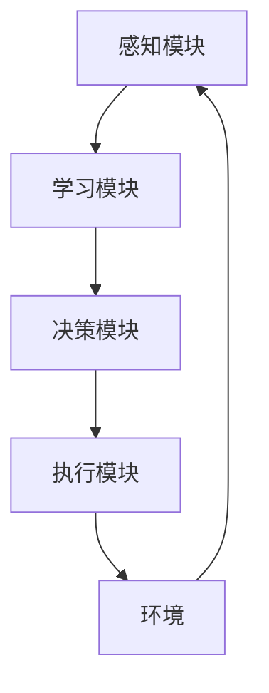

# AI人工智能深度学习算法：智能深度学习代理的未来发展趋势

## 1.背景介绍

### 1.1 人工智能的兴起

人工智能(Artificial Intelligence, AI)是当代科技发展的前沿领域,近年来受到了前所未有的关注和投入。随着算力的不断提升、海量数据的积累以及深度学习等先进技术的突破,AI已经渗透到了我们生活的方方面面,为各行各业带来了革命性的变革。

### 1.2 深度学习的核心地位

在人工智能的多种技术路线中,深度学习(Deep Learning)凭借其在计算机视觉、自然语言处理、决策控制等领域的卓越表现,成为了AI技术发展的核心驱动力。深度学习通过对大量数据的训练,能够自主学习数据内在的特征模式,并对新数据作出预测和决策,显示出超越人类的能力。

### 1.3 智能代理的重要性

在人工智能系统中,智能代理(Intelligent Agent)扮演着至关重要的角色。智能代理是指能够感知环境、学习知识、制定计划并采取行动以完成特定目标的自主系统。随着深度学习技术的不断发展,智能代理的能力也在与日俱增,成为推动人工智能向更高水平迈进的关键力量。

## 2.核心概念与联系

### 2.1 深度学习模型

深度学习模型是构建智能代理系统的核心。常见的深度学习模型包括:

#### 2.1.1 卷积神经网络(Convolutional Neural Networks, CNN)

CNN擅长处理图像、视频等高维数据,广泛应用于计算机视觉领域。其通过卷积和池化操作提取数据特征,再经过全连接层进行分类或回归。

#### 2.1.2 循环神经网络(Recurrent Neural Networks, RNN)

RNN适用于处理序列数据,如自然语言、时间序列等。它能够捕捉数据中的长期依赖关系,常用于自然语言处理、语音识别等任务。

#### 2.1.3 生成对抗网络(Generative Adversarial Networks, GAN)

GAN由生成网络和判别网络组成,两者相互对抗训练,最终使生成网络能够生成逼真的数据样本。GAN在图像生成、语音合成等领域有广泛应用。

#### 2.1.4 transformer

Transformer是一种全新的基于注意力机制的神经网络架构,在机器翻译、文本生成等任务中表现出色,成为自然语言处理领域的主流模型。

#### 2.1.5 强化学习

强化学习是一种基于环境交互的学习范式,智能代理通过不断尝试并根据反馈调整策略,最终学习到最优决策序列。这种方法在机器人控制、游戏AI等领域有着广泛应用。

### 2.2 智能代理架构

智能代理的核心架构通常包括以下几个模块:

- **感知模块**: 负责从环境中获取各种数据输入,如图像、声音、文本等。
- **学习模块**: 基于感知模块获取的数据,利用深度学习等技术进行模型训练,获取对环境的理解和知识。
- **决策模块**: 根据学习模块得到的知识,制定行动计划,输出代理的决策。
- **执行模块**: 将决策模块的输出转化为具体的行动,作用于环境。
- **环境**: 代理所处的外部世界,包括各种物理和虚拟环境。

这些模块相互协作,构成了一个完整的智能代理系统。代理通过不断感知、学习、决策和行动的循环,逐步提高自身的能力。

## 3.核心算法原理具体操作步骤  

### 3.1 深度学习模型训练

训练深度学习模型是构建智能代理的基础,通常包括以下几个步骤:

1. **数据准备**: 收集并清洗待训练的数据集,可能需要进行数据增强等预处理。

2. **模型选择**: 根据任务需求选择合适的深度学习模型架构,如CNN、RNN等。

3. **模型初始化**: 对模型的参数进行随机初始化。

4. **前向传播**: 输入训练数据,计算模型输出与真实标签之间的损失。

5. **反向传播**: 根据损失函数,计算模型参数的梯度。

6. **参数更新**: 使用优化算法(如梯度下降)根据梯度更新模型参数。

7. **迭代训练**: 重复4-6步骤,直到模型收敛或达到期望的性能指标。

训练过程中还需要注意诸如超参数调整、避免过拟合等技巧,以获得泛化性能良好的模型。

### 3.2 强化学习算法

强化学习算法是训练智能代理决策模块的关键,常见算法包括:

#### 3.2.1 Q-Learning

Q-Learning是一种基于价值函数的无模型强化学习算法,适用于离散状态和动作空间。其核心思想是学习一个Q函数,表示在某个状态下执行某个动作所能获得的期望回报,并根据这个Q函数来选择最优动作。

Q-Learning算法步骤:

1. 初始化Q函数,通常将所有Q值设为0或小的常数。

2. 对于每个时间步:
    - 观测当前状态$s_t$
    - 根据当前Q函数值选择动作$a_t$,如采用$\epsilon$-贪婪策略
    - 执行动作$a_t$,获得回报$r_t$和新状态$s_{t+1}$
    - 更新Q函数:

$$Q(s_t, a_t) \leftarrow Q(s_t, a_t) + \alpha \left[ r_t + \gamma \max_a Q(s_{t+1}, a) - Q(s_t, a_t) \right]$$

其中$\alpha$为学习率,$\gamma$为折现因子。

3. 重复步骤2,直到Q函数收敛。

#### 3.2.2 策略梯度算法

策略梯度算法直接对代理的策略$\pi_\theta$进行参数化,通过梯度上升的方式最大化期望回报,常用于连续动作空间的强化学习问题。

策略梯度算法步骤:

1. 初始化策略参数$\theta$。

2. 对于每个episode:
    - 生成一个trajactory $\tau = (s_0, a_0, r_0, s_1, a_1, r_1, ...)$根据当前策略$\pi_\theta$
    - 计算trajactory的折现回报:
    
$$R(\tau) = \sum_{t=0}^\infty \gamma^t r_t$$

    - 根据trajactory和回报,更新策略参数:
    
$$\theta \leftarrow \theta + \alpha \nabla_\theta \log \pi_\theta(\tau) R(\tau)$$

    其中$\alpha$为学习率。

3. 重复步骤2,直到策略收敛。

上述算法可以通过各种技巧(如重要性采样、基线等)进行改进和优化。

### 3.3 多智能体系统训练

在复杂环境中,通常需要多个智能代理协同工作,形成多智能体系统(Multi-Agent System)。训练多智能体系统面临着新的挑战,如代理间的竞争与合作、信息不对称、非平稳环境等。目前常用的训练算法有:

#### 3.3.1 独立学习

最简单的方法是让每个代理独立地进行单智能体训练,忽略其他代理的存在。这种方法计算效率高,但很容易导致收敛到次优的策略。

#### 3.3.2 自我建模

自我建模(Self-Modeling)的思路是让每个代理试图对其他代理的策略进行建模,并将这种建模融入到自身的训练过程中。这需要代理具备足够的理解和推理能力。

#### 3.3.3 中心化训练分布式执行

中心化训练(Centralized Training)是指在训练阶段使用一个中心控制器,可以访问所有代理的状态和动作信息,但在执行阶段各代理仍然是分布式的。这种方法可以提高训练效率,但需要设计合理的中心控制器和信息传递机制。

#### 3.3.4 对手建模

对手建模(Opponent Modeling)专注于对手智能体的策略识别和预测,并据此调整自身策略,在对抗性环境中表现良好。常见的对手建模算法包括交互式神经预测等。

#### 3.3.5 多智能体游戏论

多智能体游戏论(Multi-Agent Game Theory)将多智能体系统建模为一个多参与者的马尔可夫博弈,并尝试寻找纳什均衡等理论上的最优策略。然而,求解高维复杂博弈的计算开销通常很大。

训练多智能体系统是一个前沿的研究热点,还有许多新的算法和框架不断涌现。随着算力和新技术的发展,相信未来会有更多突破性的进展。

## 4.数学模型和公式详细讲解举例说明

### 4.1 深度学习模型数学原理

#### 4.1.1 神经网络基本原理

神经网络的基本思想是通过对数据特征的层层提取和转换,最终获得对输入数据的高层次表示,并基于这种表示完成相应的任务。

设输入为$\mathbf{x}$,神经网络的前向传播过程可以表示为:

$$\mathbf{h}^{(0)} = \mathbf{x}$$
$$\mathbf{h}^{(l+1)} = \sigma(\mathbf{W}^{(l)}\mathbf{h}^{(l)} + \mathbf{b}^{(l)})$$
$$\hat{\mathbf{y}} = f(\mathbf{h}^{(L)})$$

其中$\mathbf{h}^{(l)}$为第$l$层的隐含层输出,$\mathbf{W}^{(l)}$和$\mathbf{b}^{(l)}$分别为该层的权重和偏置参数,$\sigma$为非线性激活函数,$f$为最终输出层的映射函数。

通过训练数据和反向传播算法,可以学习网络的参数$\mathbf{W}$和$\mathbf{b}$,使得输出$\hat{\mathbf{y}}$逼近真实标签$\mathbf{y}$。

#### 4.1.2 卷积神经网络

卷积神经网络(CNN)引入了卷积操作,能够有效地捕捉输入数据(如图像)的局部特征。

设输入特征图为$\mathbf{X}$,卷积核为$\mathbf{K}$,卷积操作可以表示为:

$$\mathbf{Y}_{i,j} = \sum_{m,n} \mathbf{X}_{i+m,j+n} \mathbf{K}_{m,n}$$

其中$\mathbf{Y}$为输出特征图。卷积操作可以有效地提取输入数据的空间或时间局部模式。

在CNN中,通常会交替使用卷积层和池化层,前者用于特征提取,后者用于特征映射,从而逐步获得对输入的高层次表示。

#### 4.1.3 循环神经网络

循环神经网络(RNN)适用于处理序列数据,其核心思想是在神经网络中引入状态递推和循环连接,能够有效地捕捉序列数据中的长期依赖关系。

设输入序列为$\mathbf{x}_t$,隐藏状态为$\mathbf{h}_t$,那么RNN的状态递推公式为:

$$\mathbf{h}_t = f(\mathbf{W}_{hh}\mathbf{h}_{t-1} + \mathbf{W}_{xh}\mathbf{x}_t + \mathbf{b}_h)$$
$$\mathbf{y}_t = g(\mathbf{W}_{hy}\mathbf{h}_t + \mathbf{b}_y)$$

其中$f$和$g$分别为隐藏层和输出层的激活函数,$\mathbf{W}$为相应的权重矩阵,$\mathbf{b}$为偏置向量。

通过反向传播训练,RNN能够自动学习到序列数据中的内在模式,并对新序列数据作出预测。

#### 4.1.4 注意力机制

注意力机制是近年来深度学习的一个重大突破,它允许模型只关注输入数据的部分区域,从而更高效地处理长序列或高维数据。