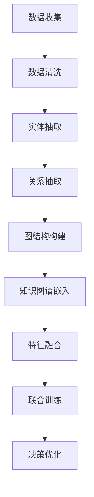

# AI人工智能深度学习算法：知识图谱在深度学习代理中的应用

## 1.背景介绍

在人工智能（AI）和深度学习（DL）领域，知识图谱（Knowledge Graph, KG）作为一种结构化的知识表示方式，正在逐渐成为研究热点。知识图谱通过节点和边的形式表示实体及其关系，能够有效地组织和管理大规模的知识数据。深度学习代理（Deep Learning Agents, DLA）则是利用深度学习技术来实现智能决策和任务执行的系统。将知识图谱与深度学习代理结合，可以显著提升AI系统的智能水平和应用效果。

## 2.核心概念与联系

### 2.1 知识图谱

知识图谱是一种用于表示知识的图结构，其中节点代表实体，边代表实体之间的关系。知识图谱的核心特点包括：

- **结构化表示**：通过图结构表示复杂的知识关系。
- **语义丰富**：包含实体的属性和关系的语义信息。
- **可扩展性**：能够不断添加新的实体和关系。

### 2.2 深度学习代理

深度学习代理是利用深度学习技术来实现智能决策和任务执行的系统。其核心特点包括：

- **自学习能力**：通过大量数据进行训练，自动学习任务执行策略。
- **高效决策**：利用深度神经网络进行快速决策。
- **适应性强**：能够适应不同的任务和环境。

### 2.3 知识图谱与深度学习代理的联系

将知识图谱与深度学习代理结合，可以实现以下目标：

- **增强知识表示**：利用知识图谱的结构化表示，提升深度学习代理的知识获取和表示能力。
- **改进决策过程**：通过知识图谱提供的语义信息，优化深度学习代理的决策过程。
- **提高系统智能**：结合知识图谱和深度学习代理的优势，构建更智能的AI系统。

## 3.核心算法原理具体操作步骤

### 3.1 知识图谱构建

构建知识图谱的步骤包括：

1. **数据收集**：从多种数据源收集原始数据。
2. **数据清洗**：对原始数据进行清洗和预处理。
3. **实体抽取**：从清洗后的数据中抽取实体。
4. **关系抽取**：识别实体之间的关系。
5. **图结构构建**：将实体和关系组织成图结构。

### 3.2 知识图谱嵌入

知识图谱嵌入是将图结构中的节点和边映射到低维向量空间的过程。常用的嵌入方法包括：

- **TransE**：将实体和关系表示为向量，通过向量加法表示关系。
- **Node2Vec**：通过随机游走生成节点序列，并使用Word2Vec进行嵌入。
- **Graph Convolutional Networks (GCN)**：利用图卷积网络进行嵌入。

### 3.3 深度学习代理训练

训练深度学习代理的步骤包括：

1. **数据准备**：收集和标注训练数据。
2. **模型选择**：选择合适的深度学习模型，如卷积神经网络（CNN）、循环神经网络（RNN）等。
3. **模型训练**：使用训练数据对模型进行训练。
4. **模型评估**：使用验证数据评估模型性能。
5. **模型优化**：根据评估结果优化模型。

### 3.4 知识图谱与深度学习代理结合

将知识图谱与深度学习代理结合的步骤包括：

1. **知识图谱嵌入**：将知识图谱中的实体和关系嵌入到低维向量空间。
2. **特征融合**：将知识图谱嵌入与深度学习模型的特征进行融合。
3. **联合训练**：对融合后的模型进行联合训练。
4. **决策优化**：利用知识图谱的语义信息优化深度学习代理的决策过程。

以下是知识图谱与深度学习代理结合的Mermaid流程图：

## 4.数学模型和公式详细讲解举例说明

### 4.1 知识图谱嵌入模型

#### 4.1.1 TransE模型

TransE模型将实体和关系表示为向量，并通过向量加法表示关系。具体公式如下：

$$
\mathbf{h} + \mathbf{r} \approx \mathbf{t}
$$

其中，$\mathbf{h}$ 表示头实体的向量，$\mathbf{r}$ 表示关系的向量，$\mathbf{t}$ 表示尾实体的向量。模型的目标是最小化以下损失函数：

$$
L = \sum_{(h, r, t) \in S} \sum_{(h', r, t') \in S'} [\gamma + d(\mathbf{h} + \mathbf{r}, \mathbf{t}) - d(\mathbf{h'} + \mathbf{r}, \mathbf{t'})]_+
$$

其中，$S$ 表示正样本集合，$S'$ 表示负样本集合，$\gamma$ 是一个超参数，$d$ 表示向量之间的距离。

#### 4.1.2 Node2Vec模型

Node2Vec模型通过随机游走生成节点序列，并使用Word2Vec进行嵌入。具体步骤如下：

1. **随机游走**：从每个节点出发，进行随机游走，生成节点序列。
2. **Word