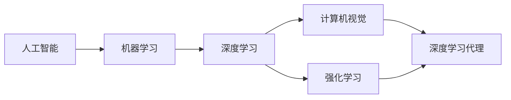

# AI人工智能深度学习算法：计算机视觉在深度学习代理中的集成

## 1.背景介绍
人工智能(Artificial Intelligence,AI)是计算机科学的一个分支,它致力于研究如何让计算机模拟甚至超越人类的智能。深度学习(Deep Learning,DL)作为人工智能的一个重要分支,近年来取得了突破性的进展,特别是在计算机视觉(Computer Vision,CV)领域。深度学习代理(Deep Learning Agent)结合了深度学习和智能体(Agent)的概念,通过深度神经网络来感知环境、学习策略、做出决策,在许多任务上取得了超越人类的表现。

计算机视觉是人工智能的一个重要分支,它研究如何让计算机从图像或视频中获取高层次的理解。传统的计算机视觉方法主要依赖人工设计的特征和算法,难以处理复杂的真实场景。近年来,深度学习特别是卷积神经网络(Convolutional Neural Network,CNN)在计算机视觉领域取得了巨大成功,一举刷新了图像分类、目标检测、语义分割等任务的性能记录。

深度学习代理将计算机视觉作为感知模块,通过卷积神经网络从原始像素中提取高层特征,再结合强化学习等算法学习最优策略。这种端到端的学习范式克服了传统计算机视觉和决策系统割裂的问题,使得智能体能够直接从视觉观测中学习,具有更强的适应性和鲁棒性。深度学习代理在自动驾驶、机器人控制、视频游戏等领域展现出了巨大的应用前景。

本文将系统地探讨计算机视觉在深度学习代理中的集成,介绍相关的核心概念、算法原理、数学模型、代码实践、应用场景等。通过本文,读者可以全面了解这一前沿交叉领域的研究现状和发展趋势,并掌握实践中的关键技术和工具。

## 2.核心概念与联系

### 2.1 人工智能、机器学习与深度学习
- 人工智能(AI):研究如何让计算机模拟甚至超越人类智能的科学。
- 机器学习(ML):人工智能的一个分支,通过数据驱动的方法让计算机自动学习和改进。
- 深度学习(DL):机器学习的一个分支,利用多层神经网络从数据中学习层次化的特征表示。

### 2.2 计算机视觉
- 定义:研究如何让计算机从图像或视频中获取高层次理解的科学。
- 任务:图像分类、目标检测、语义分割、姿态估计等。
- 传统方法:人工设计特征(SIFT、HOG等)+机器学习分类器(SVM等)。
- 深度学习方法:端到端学习,卷积神经网络(CNN)直接从像素中提取特征。

### 2.3 智能体与强化学习
- 智能体(Agent):可感知环境并做出行动的实体,以最大化长期累积奖励为目标。
- 强化学习(RL):智能体通过与环境的交互学习最优策略的机器学习范式。
- 马尔可夫决策过程(MDP):表示智能体与环境交互的数学模型。
- 值函数(Value Function):估计状态或状态-行动对的长期累积奖励。
- 策略(Policy):将状态映射为行动的函数。

### 2.4 深度学习代理
- 定义:将深度学习与强化学习结合,通过端到端学习直接从原始观测中学习策略的智能体。
- 感知模块:负责从原始观测(如图像)中提取特征表示,通常采用卷积神经网络。
- 决策模块:根据感知模块提取的特征,输出行动或值函数/策略,可采用全连接层、LSTM等。
- 训练算法:异策略(如DQN)、同策略(如A3C)、演员-评论家(如DDPG)等。

### 核心概念之间的联系


## 3.核心算法原理具体操作步骤

### 3.1 深度Q网络(DQN)
- 思想:用深度神经网络近似值函数Q(s,a),即在某状态s下采取行动a的长期累积奖励期望。
- 网络结构:卷积层提取特征,全连接层输出每个行动的Q值。
- 损失函数:时序差分(TD)误差,即当前Q值估计与时序差分目标的均方误差。
- 训练算法:
  - 经验回放:用一个缓冲区存储转移样本(s,a,r,s'),打破相关性。
  - 固定Q目标:每C步更新一次目标Q网络,提高稳定性。
- 探索策略:ε-贪婪,以ε的概率随机探索,1-ε的概率选择Q值最大的行动。

### 3.2 优势演员-评论家(A2C)
- 思想:用一个网络(演员)近似策略π(a|s),另一个网络(评论家)近似值函数V(s)。
- 网络结构:共享的卷积层提取特征,演员和评论家分别连接若干全连接层。
- 损失函数:
  - 演员:策略梯度,即优势函数与对数策略概率的乘积。
  - 评论家:时序差分(TD)误差。
- 训练算法:
  - 并行环境:多个并行的环境副本,提高数据效率。
  - 同步更新:所有并行环境运行固定的步数,然后汇总梯度更新网络。
- 探索策略:随机性来自策略本身,无需额外的探索。

### 3.3 深度确定性策略梯度(DDPG)
- 思想:结合DQN和演员-评论家,应用于连续动作空间。
- 网络结构:
  - 演员:输入状态,输出确定性动作。
  - 评论家:输入状态和动作,输出Q值。
- 损失函数:
  - 演员:评论家对动作梯度的负均值。
  - 评论家:时序差分(TD)误差。 
- 训练算法:
  - 软更新目标网络:每步以一个小系数τ更新目标网络参数。
  - 探索噪声:在演员输出的动作上添加OU噪声,平衡探索和利用。

## 4.数学模型和公式详细讲解举例说明

### 4.1 马尔可夫决策过程(MDP)
- 定义:一个马尔可夫决策过程由一个五元组 $\langle \mathcal{S},\mathcal{A},\mathcal{P},\mathcal{R},\gamma \rangle$ 组成:
  - $\mathcal{S}$:状态空间,代表智能体所处的环境状态集合。
  - $\mathcal{A}$:动作空间,代表智能体可采取的动作集合。
  - $\mathcal{P}$:转移概率,其中 $\mathcal{P}(s'|s,a)$ 表示在状态 $s$ 下采取动作 $a$ 后转移到状态 $s'$ 的概率。
  - $\mathcal{R}$:奖励函数,其中 $\mathcal{R}(s,a)$ 表示在状态 $s$ 下采取动作 $a$ 后获得的即时奖励。
  - $\gamma$:折扣因子,$\gamma \in [0,1]$,表示未来奖励的折现程度。
- 目标:智能体的目标是最大化累积期望奖励 $\mathbb{E}\left[\sum_{t=0}^{\infty}\gamma^t \mathcal{R}(s_t,a_t)\right]$。

### 4.2 值函数
- 状态值函数:
$$V^{\pi}(s)=\mathbb{E}_{a_t \sim \pi(\cdot|s_t),s_{t+1} \sim \mathcal{P}(\cdot|s_t,a_t)}\left[\sum_{k=0}^{\infty}\gamma^k \mathcal{R}(s_{t+k},a_{t+k})|s_t=s\right]$$
表示从状态 $s$ 开始,遵循策略 $\pi$ 的累积期望奖励。
- 动作值函数:
$$Q^{\pi}(s,a)=\mathbb{E}_{s_{t+1} \sim \mathcal{P}(\cdot|s_t,a_t),a_{t+1} \sim \pi(\cdot|s_{t+1})}\left[\sum_{k=0}^{\infty}\gamma^k \mathcal{R}(s_{t+k},a_{t+k})|s_t=s,a_t=a\right]$$
表示在状态 $s$ 下采取动作 $a$,然后遵循策略 $\pi$ 的累积期望奖励。
- 贝尔曼方程:值函数满足贝尔曼方程,体现了动态规划的思想:
$$V^{\pi}(s)=\sum_{a}\pi(a|s)\sum_{s'}\mathcal{P}(s'|s,a)\left[\mathcal{R}(s,a)+\gamma V^{\pi}(s')\right]$$
$$Q^{\pi}(s,a)=\sum_{s'}\mathcal{P}(s'|s,a)\left[\mathcal{R}(s,a)+\gamma\sum_{a'}\pi(a'|s')Q^{\pi}(s',a')\right]$$

### 4.3 策略梯度定理
- 定义:策略 $\pi_{\theta}$ 的期望累积奖励关于参数 $\theta$ 的梯度为:
$$\nabla_{\theta}J(\theta)=\mathbb{E}_{s \sim d^{\pi},a \sim \pi_{\theta}}\left[Q^{\pi}(s,a)\nabla_{\theta}\log\pi_{\theta}(a|s)\right]$$
其中 $d^{\pi}(s)$ 是策略 $\pi$ 诱导的状态分布。
- 直观解释:梯度方向是在有利状态-动作对($Q^{\pi}(s,a)>0$)上增加其概率,在不利状态-动作对($Q^{\pi}(s,a)<0$)上减少其概率。
- 优势函数:$A^{\pi}(s,a)=Q^{\pi}(s,a)-V^{\pi}(s)$,表示在状态 $s$ 下采取动作 $a$ 相比平均表现的优势。用优势函数替代 $Q^{\pi}(s,a)$ 可以减少方差,提高稳定性。

## 5.项目实践：代码实例和详细解释说明

### 5.1 DQN在Atari游戏上的应用
```python
import gym
import numpy as np
import tensorflow as tf

# 超参数
GAMMA = 0.99 # 折扣因子
LEARNING_RATE = 0.001 # 学习率
EPSILON = 0.1 # ε-贪婪探索
REPLAY_SIZE = 10000 # 经验回放缓冲区大小
BATCH_SIZE = 32 # 批大小

class DQN:
    def __init__(self, env):
        self.env = env
        self.state_dim = env.observation_space.shape
        self.action_dim = env.action_space.n
        
        self.Q = self._build_net() # Q网络
        self.Q_target = self._build_net() # 目标Q网络
        self.replay_buffer = [] # 经验回放缓冲区
        
        self.sess = tf.Session()
        self.sess.run(tf.global_variables_initializer())
        
    def _build_net(self):
        """构建深度Q网络"""
        state = tf.placeholder(tf.float32, [None]+list(self.state_dim))
        action = tf.placeholder(tf.int32, [None])
        reward = tf.placeholder(tf.float32, [None])
        next_state = tf.placeholder(tf.float32, [None]+list(self.state_dim))
        done = tf.placeholder(tf.float32, [None])
        
        # 卷积层
        conv1 = tf.layers.conv2d(state, 32, 8, 4, activation=tf.nn.relu)
        conv2 = tf.layers.conv2d(conv1, 64, 4, 2, activation=tf.nn.relu)
        conv3 = tf.layers.conv2d(conv2, 64, 3, 1, activation=tf.nn.relu)
        
        # 全连接层
        flatten = tf.layers.flatten(conv3)
        fc = tf.layers.dense(flatten, 512, activation=tf.nn.relu)
        Q_value = tf.layers.dense(fc, self.action_dim)
        
        # 损失函数
        action_onehot = tf.one_hot(action, self.action_dim)
        Q_action = tf.reduce_sum(tf.multiply(Q_value, action_onehot), axis=1)
        target = reward + GAMMA * (1-done) * tf.reduce_max