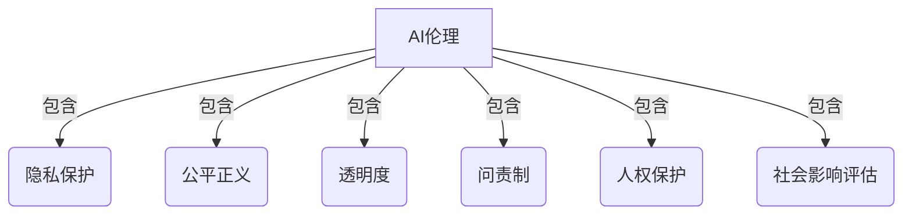
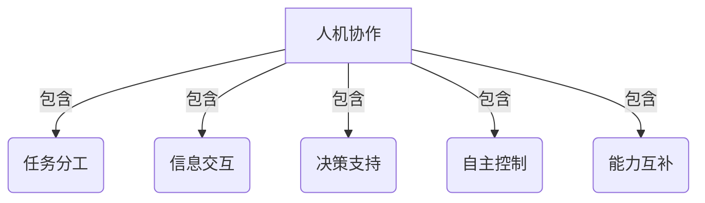

# AI伦理与人机协作：人机共生的未来展望

## 1.背景介绍

随着人工智能(AI)技术的快速发展,AI系统正在渗透到我们生活和工作的方方面面。无论是智能助理、自动驾驶汽车、医疗诊断系统还是金融风险评估模型,AI都在发挥着越来越重要的作用。然而,AI的崛起也带来了一系列伦理挑战和社会影响,亟需我们重视AI伦理问题,推动人机协作的健康发展。

伴随AI能力的不断提升,人类与AI的互动也变得更加频繁和深入。如何确保AI系统的行为符合人类的价值观和道德标准?如何保护个人隐私和数据安全?如何防止AI带来的歧视和不公平?如何规范AI系统的决策过程?这些都是我们必须正视和解决的重大伦理挑战。

与此同时,人机协作模式也在不断演进。未来,人类和AI系统将在更多领域携手合作,相互补充,实现"1+1>2"的协同效应。如何设计高效、和谐的人机协作机制,充分发挥人类和AI的各自优势,是我们需要思考和探索的重要课题。

本文将深入探讨AI伦理和人机协作的相关问题,分析潜在风险和挑战,提出可行的解决方案和最佳实践,为人机共生的美好未来贡献一份力量。

## 2.核心概念与联系

### 2.1 人工智能(AI)

人工智能(Artificial Intelligence)是一门研究如何使机器模拟人类智能行为的科学,包括感知、学习、推理、规划和控制等多个方面。AI系统通过数据训练和算法迭代,可以执行特定任务,如图像识别、自然语言处理、决策优化等。

### 2.2 AI伦理

AI伦理(AI Ethics)是研究AI系统在设计、开发和应用过程中所涉及的伦理原则、价值观和规范的学科。它关注AI系统对个人隐私、公平正义、透明度、问责制等方面的影响,旨在确保AI的发展符合人类的道德标准和社会价值观。



### 2.3 人机协作

人机协作(Human-AI Collaboration)是指人类和AI系统之间的互动和合作。它旨在充分发挥人类和AI各自的优势,实现协同增效。人类拥有创造力、情商和领导力等AI所缺乏的能力,而AI则擅长大规模数据处理、模式识别和快速计算等任务。通过合理分工和高效协作,人机结合可以取得超越单一方式的卓越成果。



### 2.4 人机共生

人机共生(Human-AI Coexistence)是一种更高层次的人机关系,它不仅强调人机协作,更重视人机之间的和谐共处、互利共赢。在这种模式下,人类和AI系统将深度融合,相互信任、相互依赖,共同构建一个可持续发展的智能生态系统。

人机共生需要我们在技术、伦理和社会层面上进行全方位的考量和设计,确保人类和AI的健康共存,实现真正意义上的共赢。这是一个系统工程,需要跨学科的理论指导和实践探索。

## 3.核心算法原理具体操作步骤

虽然AI伦理和人机协作涉及广泛的社会、伦理和技术层面的问题,但在具体的AI系统设计和开发过程中,我们仍然可以借助一些核心算法原理和最佳实践,来提高AI系统的伦理性和协作能力。

### 3.1 公平机器学习算法

公平机器学习(Fair Machine Learning)旨在消除AI模型中的潜在偏见和歧视,确保模型的决策对不同群体是公平的。常用的公平机器学习算法包括:

1. **敏感度分数(Disparate Impact Remover)**: 通过修改训练数据或模型权重,使不同群体的预测结果具有相似的统计分布。
2. **对抗去偏(Adversarial Debiasing)**: 在模型训练过程中引入对抗损失函数,最小化模型对于敏感属性(如性别、种族等)的关注度。
3. **因果建模(Causal Modeling)**: 利用因果推理技术,识别和移除模型中的不公平因果路径。

这些算法可以有效降低AI模型的偏差和歧视风险,提高决策的公平性。

### 3.2 可解释AI算法

可解释AI(Explainable AI)旨在提高AI系统的透明度和可解释性,使人类能够理解AI是如何做出决策的。常用的可解释AI算法包括:

1. **LIME(Local Interpretable Model-Agnostic Explanations)**: 通过训练局部可解释模型,近似解释黑箱模型在特定实例上的决策过程。
2. **SHAP(SHapley Additive exPlanations)**: 基于联合游戏理论,计算每个特征对模型输出的贡献度,从而解释模型的决策逻辑。
3. **注意力机制(Attention Mechanism)**: 在深度学习模型中引入注意力机制,使模型能够自动学习关注哪些输入特征对决策更加重要。

可解释AI算法有助于增强人类对AI系统的信任,促进人机之间的有效协作。

### 3.3 人机交互算法

人机交互算法旨在优化人机之间的信息交换和决策协同,实现高效的人机协作。常用的人机交互算法包括:

1. **主动学习(Active Learning)**: AI系统主动询问人类,获取有价值的标注数据,加速模型训练和改进。
2. **对话系统(Dialogue Systems)**: 基于自然语言处理技术,构建人机对话界面,实现自然语言交互。
3. **混合智能(Hybrid Intelligence)**: 将人类的创造力、洞察力和AI的计算能力相结合,协同完成复杂任务。

通过优化人机交互算法,我们可以充分发挥人类和AI的各自优势,提高协作效率和决策质量。

## 4.数学模型和公式详细讲解举例说明

在AI伦理和人机协作领域,一些数学模型和公式可以帮助我们更好地量化和优化相关指标,从而指导实践。

### 4.1 公平性度量

衡量AI模型公平性的一个常用指标是**统计率差异(Statistical Rate Difference)**,定义如下:

$$
\text{StatRateDiff} = \frac{|P(Y=1|A=0) - P(Y=1|A=1)|}{P(Y=1)}
$$

其中,Y是模型的预测输出,A是敏感属性(如性别或种族),P(Y=1|A=0)和P(Y=1|A=1)分别表示在A=0和A=1的条件下,模型预测为正例(Y=1)的概率。StatRateDiff越小,表明模型对不同群体的决策越公平。

在信贷风险评估等场景中,我们可以使用StatRateDiff来评估模型是否存在潜在的种族歧视,并采取相应的公平机器学习算法进行优化。

### 4.2 可解释性度量

衡量AI模型可解释性的一种方法是使用**保留预测精度下的最小化描述长度(Minimum Description Length for Preserving Prediction Accuracy, MDLPPA)**,定义如下:

$$
\text{MDLPPA}(f, \mathcal{D}) = \underbrace{\text{CodeLen}(f)}_{\text{模型复杂度}} + \underbrace{\sum_{(x, y) \in \mathcal{D}} \text{CodeLen}(y | f(x))}_{\text{预测误差}}
$$

其中,f是AI模型,D是训练数据集,CodeLen(f)表示编码模型f所需的描述长度(反映模型复杂度),CodeLen(y|f(x))表示在已知模型f(x)的情况下,编码真实标签y所需的描述长度(反映预测误差)。

MDLPPA越小,表明模型在保持预测精度的同时,具有更好的可解释性(更简单)。我们可以在模型训练过程中,将MDLPPA作为正则化项,促进模型学习更加简单、可解释的决策逻辑。

### 4.3 人机协作效率

评估人机协作效率的一个重要指标是**任务完成时间(Task Completion Time, TCT)**,定义如下:

$$
\text{TCT} = \text{TCT}_\text{human} + \text{TCT}_\text{AI} + \text{TCT}_\text{interaction}
$$

其中,TCT_human是人类完成子任务所需的时间,TCT_AI是AI系统完成子任务所需的时间,TCT_interaction是人机之间交互和协调所需的时间。

在设计人机协作系统时,我们可以通过优化任务分工、交互界面和协作机制,最小化TCT,提高整体效率。例如,将AI用于自动化重复性劳动,将人类投入到需要创造力和判断力的环节;或者采用主动学习算法,让AI系统主动询问人类获取反馈,加速模型改进。

通过数学建模和公式化,我们可以更精确地量化和优化AI伦理和人机协作相关的指标,为实践提供理论指导。

## 5.项目实践:代码实例和详细解释说明

为了更好地理解AI伦理和人机协作的实现方式,我们来看一个具体的项目实践案例。

假设我们需要开发一个AI辅助的贷款审批系统,该系统需要评估申请人的信用风险,并为人类审核员提供决策建议。我们希望该系统能够做到公平、可解释和高效的人机协作。

### 5.1 公平性优化

首先,我们使用对抗去偏(Adversarial Debiasing)算法,消除模型对于敏感属性(如种族)的偏见。具体实现如下:

```python
import torch
import torch.nn as nn

class AdversarialDebiasing(nn.Module):
    def __init__(self, model, sensitive_attr_idx, adversary_loss_weight=0.1):
        super().__init__()
        self.model = model
        self.sensitive_attr_idx = sensitive_attr_idx
        self.adversary_loss_weight = adversary_loss_weight
        
        # 初始化对抗网络
        self.adversary = nn.Sequential(
            nn.Linear(model.output_dim, 64),
            nn.ReLU(),
            nn.Linear(64, 1),
            nn.Sigmoid()
        )
        
    def forward(self, x):
        output = self.model(x)
        sensitive_attr = x[:, self.sensitive_attr_idx]
        
        # 计算对抗损失
        adversary_output = self.adversary(output)
        adversary_loss = nn.BCELoss()(adversary_output, sensitive_attr)
        
        # 计算总损失
        total_loss = self.model.loss(output, y) - self.adversary_loss_weight * adversary_loss
        
        return output, total_loss
```

在这个实现中,我们首先通过一个对抗网络(adversary)试图从模型的输出中预测敏感属性(如种族)。然后,我们将对抗网络的损失(adversary_loss)作为正则化项,与原始模型的损失相结合,构建总损失函数(total_loss)。在训练过程中,模型会尽量降低对抗网络的预测精度,从而减小对敏感属性的关注度,达到去偏的目的。

### 5.2 可解释性优化

为了提高模型的可解释性,我们采用SHAP(SHapley Additive exPlanations)算法,计算每个特征对模型输出的贡献度,从而解释模型的决策逻辑。具体实现如下:

```python
import shap

# 训练模型
model.fit(X_train, y_train)

# 计算SHAP值
explainer = shap.TreeExplainer(model)
shap_values = explainer.shap_values(X_test)

# 可视化SHAP值
shap.summary_plot(shap_values, X_test, plot_type="bar")
```

在这个实现中,我们首先使用SHAP库中的TreeExplainer初始化一个解释器对象。然后,我们