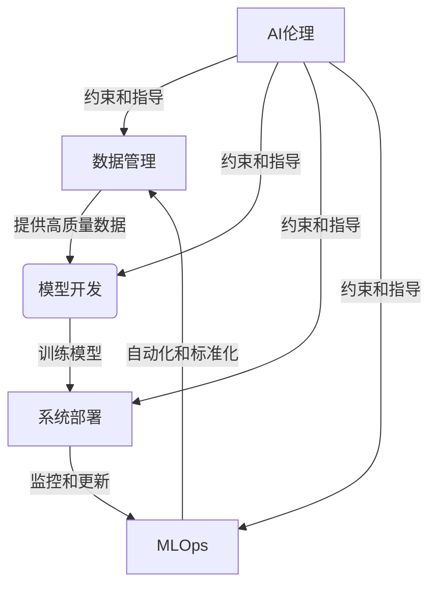

# AI工程最佳实践原理与代码实战案例讲解

## 1.背景介绍

人工智能(AI)已经成为当今科技领域最热门、最具革命性的技术之一。从计算机视觉、自然语言处理到机器学习和深度学习,AI技术正在彻底改变我们的生活、工作和社会运作方式。随着AI技术的不断发展和应用范围的扩大,AI工程实践也变得越来越重要。

AI工程是一门跨学科领域,涵盖了软件工程、数据工程、机器学习工程等多个领域。它旨在将AI理论和算法应用于实际问题,并开发可扩展、可靠和高效的AI系统。良好的AI工程实践不仅可以提高AI系统的性能和可靠性,还能确保AI系统的安全性、公平性和透明度。

本文将探讨AI工程的最佳实践原理,并通过代码实战案例深入讲解如何应用这些原理。我们将涵盖AI工程的整个生命周期,包括数据管理、模型开发、系统部署和监控等关键环节。无论您是AI工程师、数据科学家还是软件开发人员,本文都将为您提供宝贵的见解和实用技巧。

## 2.核心概念与联系

在深入探讨AI工程最佳实践之前,我们需要了解一些核心概念及其相互关系。这些概念是AI工程实践的基础,也是确保AI系统高效、可靠和安全运行的关键。

### 2.1 数据管理

数据是训练AI模型的燃料,因此良好的数据管理对于AI工程至关重要。数据管理包括数据采集、清洗、标注、版本控制和存储等方面。确保数据的质量、多样性和隐私保护是数据管理的核心目标。

### 2.2 模型开发

模型开发是AI工程的核心环节,包括特征工程、模型选择、训练、评估和优化等步骤。选择合适的算法、调整超参数和避免过拟合是模型开发中的关键挑战。

### 2.3 系统部署

将训练好的AI模型部署到生产环境中是AI工程的最终目标。系统部署需要考虑模型服务化、资源管理、监控和更新等问题,以确保AI系统的稳定性和可扩展性。

### 2.4 MLOps

MLOps(Machine Learning Operations)是一种将软件工程最佳实践应用于机器学习系统的方法。它旨在通过自动化和标准化的流程,提高AI系统的可靠性、可重复性和可维护性。

### 2.5 AI伦理

随着AI技术的快速发展,AI伦理问题也日益受到关注。AI工程师需要确保AI系统的公平性、透明度和可解释性,并考虑AI系统对社会和环境的影响。

这些核心概念相互关联,共同构成了AI工程的基础框架。掌握这些概念及其联系,对于实现AI工程的最佳实践至关重要。



## 3.核心算法原理具体操作步骤

在AI工程中,算法原理和具体操作步骤是实现高效、可靠AI系统的关键。本节将重点介绍一些核心算法原理及其实现步骤。

### 3.1 监督学习算法

监督学习是机器学习中最常见和最成熟的范式之一。它旨在从标记数据中学习一个映射函数,以便对新的输入数据进行预测或分类。常见的监督学习算法包括线性回归、逻辑回归、决策树、支持向量机(SVM)和深度神经网络等。

以线性回归为例,其具体操作步骤如下:

1. **数据准备**:收集并清洗训练数据,将其分为特征(X)和目标变量(y)。
2. **特征缩放**:对特征进行标准化或归一化处理,以提高模型的收敛速度和性能。
3. **模型初始化**:初始化模型参数(如权重和偏置)。
4. **模型训练**:使用优化算法(如梯度下降)最小化损失函数,迭代更新模型参数。
5. **模型评估**:在测试数据集上评估模型的性能,计算指标如均方根误差(RMSE)。
6. **模型调优**:根据评估结果,调整超参数(如学习率和正则化强度)以提高模型性能。
7. **模型部署**:将训练好的模型部署到生产环境中,用于实际预测任务。

### 3.2 无监督学习算法

无监督学习旨在从未标记的数据中发现潜在的模式和结构。常见的无监督学习算法包括聚类算法(如K-Means和层次聚类)和降维算法(如主成分分析和t-SNE)。

以K-Means聚类算法为例,其具体操作步骤如下:

1. **数据准备**:收集并清洗待聚类的数据。
2. **特征缩放**:对特征进行标准化或归一化处理。
3. **初始化聚类中心**:随机选择K个数据点作为初始聚类中心。
4. **数据分配**:将每个数据点分配到最近的聚类中心。
5. **更新聚类中心**:计算每个聚类中所有数据点的均值,作为新的聚类中心。
6. **迭代**:重复步骤4和5,直到聚类中心不再发生变化。
7. **结果输出**:输出最终的聚类结果和聚类中心。

### 3.3 深度学习算法

深度学习是机器学习的一个子领域,它利用深层神经网络模型来学习数据的层次表示。常见的深度学习算法包括卷积神经网络(CNN)、递归神经网络(RNN)和transformer等。

以CNN为例,其具体操作步骤如下:

1. **数据准备**:收集并预处理训练数据(如图像数据)。
2. **网络架构设计**:设计CNN的架构,包括卷积层、池化层和全连接层等。
3. **初始化参数**:初始化网络权重和偏置参数。
4. **前向传播**:输入数据经过网络层,计算输出。
5. **反向传播**:计算损失函数,并通过反向传播算法更新网络参数。
6. **模型训练**:迭代执行前向传播和反向传播,直到模型收敛或达到最大迭代次数。
7. **模型评估**:在测试数据集上评估模型的性能,计算指标如准确率或F1分数。
8. **模型调优**:根据评估结果,调整超参数(如学习率和正则化强度)以提高模型性能。
9. **模型部署**:将训练好的模型部署到生产环境中,用于实际任务。

这些核心算法原理和操作步骤为AI工程实践奠定了坚实的基础。掌握它们对于开发高效、可靠的AI系统至关重要。

## 4.数学模型和公式详细讲解举例说明

AI算法背后的数学模型和公式是理解和优化这些算法的关键。本节将详细讲解一些常见的数学模型和公式,并通过实例说明它们的应用。

### 4.1 线性回归

线性回归是一种常见的监督学习算法,用于预测连续型目标变量。它假设目标变量y和特征向量x之间存在线性关系,可以表示为:

$$y = \theta_0 + \theta_1x_1 + \theta_2x_2 + ... + \theta_nx_n$$

其中,θ是需要学习的模型参数(权重和偏置)。

为了找到最优参数,我们需要定义一个损失函数,通常使用均方误差(MSE)作为损失函数:

$$J(\theta) = \frac{1}{2m}\sum_{i=1}^m(h_\theta(x^{(i)}) - y^{(i)})^2$$

其中,m是训练样本数量,h_θ(x)是模型的预测值。

我们可以使用梯度下降法来最小化损失函数,更新参数θ:

$$\theta_j := \theta_j - \alpha\frac{\partial}{\partial\theta_j}J(\theta)$$

其中,α是学习率,控制更新步长的大小。

以下是一个使用Python和scikit-learn库实现线性回归的示例:

```python
from sklearn.linear_model import LinearRegression

# 创建训练数据
X = [[1], [2], [3], [4], [5]]
y = [2, 4, 6, 8, 10]

# 创建线性回归模型
model = LinearRegression()

# 训练模型
model.fit(X, y)

# 预测新数据
new_data = [[6]]
prediction = model.predict(new_data)
print(f"Prediction for x=6: {prediction}")
```

输出:
```
Prediction for x=6: [12.]
```

### 4.2 逻辑回归

逻辑回归是一种常用的分类算法,用于预测二元或多元分类问题。它将输入特征映射到概率值,表示样本属于某个类别的概率。

对于二元分类问题,逻辑回归模型可以表示为:

$$h_\theta(x) = \sigma(\theta^Tx) = \frac{1}{1 + e^{-\theta^Tx}}$$

其中,σ(z)是sigmoid函数,将线性函数的输出映射到(0,1)区间,表示样本属于正类的概率。

为了学习模型参数θ,我们可以使用最大似然估计,即最大化训练数据的似然函数:

$$J(\theta) = \frac{1}{m}\sum_{i=1}^m[y^{(i)}\log(h_\theta(x^{(i)})) + (1 - y^{(i)})\log(1 - h_\theta(x^{(i)}))]$$

同样,我们可以使用梯度下降法来最小化负对数似然函数-J(θ),从而找到最优参数θ。

以下是一个使用Python和scikit-learn库实现逻辑回归的示例:

```python
from sklearn.linear_model import LogisticRegression
from sklearn.datasets import make_blobs
import matplotlib.pyplot as plt

# 生成示例数据
X, y = make_blobs(n_samples=1000, centers=2, n_features=2, random_state=0)

# 创建逻辑回归模型
model = LogisticRegression()

# 训练模型
model.fit(X, y)

# 可视化决策边界
x_min, x_max = X[:, 0].min() - 1, X[:, 0].max() + 1
y_min, y_max = X[:, 1].min() - 1, X[:, 1].max() + 1
xx, yy = np.meshgrid(np.arange(x_min, x_max, 0.02),
                     np.arange(y_min, y_max, 0.02))
Z = model.predict(np.c_[xx.ravel(), yy.ravel()])
Z = Z.reshape(xx.shape)

plt.contourf(xx, yy, Z, cmap=plt.cm.Paired)
plt.scatter(X[:, 0], X[:, 1], c=y, cmap=plt.cm.Paired)
plt.show()
```

这个示例使用make_blobs函数生成了一个二元分类数据集,并使用逻辑回归模型对其进行建模。最后,它可视化了决策边界和数据点。

### 4.3 神经网络

神经网络是一种强大的机器学习模型,可以学习复杂的非线性映射关系。它由多层神经元组成,每层神经元通过权重矩阵和激活函数相连。

对于一个单层神经网络,其输出可以表示为:

$$h_\theta(x) = g(\theta^Tx)$$

其中,g(z)是激活函数(如sigmoid或ReLU函数),用于引入非线性。

对于多层神经网络,我们可以将其表示为多个单层网络的组合:

$$h_\theta(x) = g_3(W_3^T(g_2(W_2^T(g_1(W_1^Tx)))))$$

其中,W_i是第i层的权重矩阵,g_i是第i层的激活函数。

为了训练神经网络,我们需要定义一个损失函数(如交叉熵损失函数),并使用反向传播算法计算梯度,从而更新网络参数。

以下是一个使用Python和TensorFlow库实现简单神经网络的示例:

```python
import tensorflow as tf

# 创建