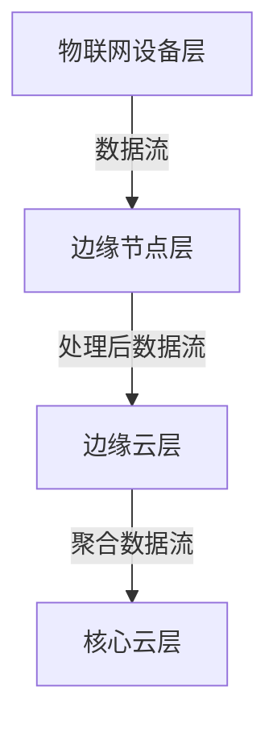

# AI模型部署到边缘原理与代码实战案例讲解

## 1.背景介绍

### 1.1 边缘计算的兴起

随着物联网(IoT)设备的快速增长,以及5G、人工智能(AI)等新兴技术的发展,传统的云计算架构面临着一些挑战。例如,大量设备产生的海量数据需要传输到云端进行处理,会导致网络拥塞、高延迟等问题。为了解决这些问题,边缘计算(Edge Computing)应运而生。

边缘计算是一种分布式计算范式,它将计算资源和数据处理能力下放到靠近数据源的边缘节点,如工厂、零售店、交通枢纽等。通过在边缘设备上部署AI模型,可以实现实时的数据处理和智能决策,减少了与云端的数据传输,提高了响应速度和系统可靠性。

### 1.2 AI模型在边缘设备上的优势

将AI模型部署到边缘设备可以带来诸多优势:

1. **低延迟**:边缘设备就近处理数据,无需将数据传输到远程云端,从而减少了网络延迟,实现近乎实时的响应。
2. **高隐私性**:敏感数据可以在本地进行处理,而无需传输到云端,从而提高了数据隐私性和安全性。
3. **高可靠性**:即使网络中断,边缘设备仍可独立运行,保证系统的连续性和可靠性。
4. **节省带宽**:只需传输处理后的结果,而非原始数据,从而节省了网络带宽。
5. **降低成本**:边缘设备通常成本较低,且无需支付高昂的云服务费用。

### 1.3 边缘AI的应用场景

边缘AI的应用场景非常广泛,包括但不限于:

- 智能视频监控:在边缘设备上进行目标检测、人脸识别等,实现实时监控和警报。
- 智能制造:利用边缘AI对工业设备进行故障预测、产品质量检测等,提高生产效率。
- 智能交通:通过边缘AI实现智能信号控制、车辆检测和跟踪等,优化交通流量。
- 智能家居:在家用设备上部署AI模型,实现语音控制、人脸识别等智能家居功能。
- 智能零售:在商店中使用边缘AI进行客流统计、购物行为分析等,优化营销策略。

## 2.核心概念与联系

### 2.1 边缘计算架构

边缘计算架构通常包括以下几个层次:

1. **物联网设备层**:各种传感器、摄像头等数据采集设备。
2. **边缘节点层**:具有一定计算能力的边缘设备,如网关、路由器、工业PC等,用于部署AI模型和进行本地计算。
3. **边缘云层**:位于靠近边缘节点的小型数据中心,提供更强大的计算和存储资源。
4. **核心云层**:传统的大型云数据中心,用于处理复杂的任务和长期数据存储。



### 2.2 AI模型优化与压缩

为了在资源受限的边缘设备上高效运行AI模型,需要对模型进行优化和压缩。常用的优化技术包括:

1. **量化(Quantization)**:将原始的32位或16位浮点数模型参数压缩为8位或更低位宽的定点数表示,从而减小模型大小和计算量。
2. **剪枝(Pruning)**:移除模型中的冗余参数和连接,降低模型复杂度。
3. **知识蒸馏(Knowledge Distillation)**:使用一个大型教师模型指导训练一个小型的学生模型,以获得相近的性能。
4. **模型压缩(Model Compression)**:通过低秩分解、张量分解等技术减小模型大小。
5. **硬件加速**:利用GPU、TPU等专用硬件加速模型推理。

### 2.3 边缘AI框架和工具

为了简化AI模型在边缘设备上的部署和运行,出现了多种边缘AI框架和工具,例如:

1. **TensorFlow Lite**:Google开源的轻量级深度学习框架,专为移动和嵌入式设备优化。
2. **OpenVINO**:英特尔开源的跨平台AI推理工具包,支持多种硬件加速。
3. **NVIDIA TensorRT**:NVIDIA推出的高性能深度学习推理优化器。
4. **Apache TVM**:开源的端到端机器学习编译器,支持多种硬件平台。
5. **Arm NN**:Arm推出的针对Arm CPU和GPU优化的深度学习推理引擎。

这些工具提供了模型优化、量化、硬件加速等功能,简化了边缘AI的开发和部署流程。

## 3.核心算法原理具体操作步骤

### 3.1 模型转换和优化

将训练好的AI模型部署到边缘设备之前,需要进行模型转换和优化。以TensorFlow Lite为例,主要步骤如下:

1. **导出SavedModel或FrozenGraph**:使用TensorFlow保存模型为SavedModel或FrozenGraph格式。

2. **模型转换**:使用TensorFlow Lite Converter将SavedModel或FrozenGraph转换为TensorFlow Lite格式。

```python
import tensorflow as tf

# 加载SavedModel
saved_model_dir = '/path/to/saved_model'
converter = tf.lite.TFLiteConverter.from_saved_model(saved_model_dir)

# 设置转换选项
converter.optimizations = [tf.lite.Optimize.DEFAULT]
converter.target_spec.supported_types = [tf.float16]

# 转换并保存TensorFlow Lite模型
tflite_model = converter.convert()
open('model.tflite', 'wb').write(tflite_model)
```

3. **模型优化**:使用TensorFlow Lite优化工具对模型进行量化、剪枝等优化,以减小模型大小和提高推理速度。

```bash
tflite_model_optimizer \
    --input_file=model.tflite \
    --output_file=optimized_model.tflite \
    --quantize_weights=true \
    --quantize_nodes=true
```

### 3.2 模型部署和推理

优化后的TensorFlow Lite模型可以在Android、iOS、Raspberry Pi等边缘设备上运行。以Android为例,主要步骤如下:

1. **加载TensorFlow Lite解释器**:创建TensorFlow Lite解释器并加载优化后的模型文件。

```java
try (Interpreter interpreter = new Interpreter(loadModelFile())) {
    // 执行推理
}
```

2. **准备输入数据**:根据模型输入要求,准备输入数据(如图像数据)。

```java
float[][][] inputData = loadInputData();
```

3. **执行推理**:使用TensorFlow Lite解释器执行模型推理,获取输出结果。

```java
Object[] inputs = {inputData};
Map<Integer, Object> outputs = new HashMap<>();

interpreter.runForMultipleInputsOutputs(inputs, outputs);

// 处理输出结果
Object outputData = outputs.get(0);
```

4. **后续处理**:根据推理结果,执行相应的操作,如显示结果、触发警报等。

通过上述步骤,即可在边缘设备上部署和运行优化后的AI模型,实现本地智能计算。

## 4.数学模型和公式详细讲解举例说明

在深度学习模型中,常见的数学模型和公式包括卷积运算、池化运算、激活函数等。以卷积运算为例,详细讲解其数学原理和实现方式。

### 4.1 卷积运算原理

卷积运算是深度学习模型中的核心操作之一,尤其在计算机视觉任务中发挥着重要作用。它可以有效地提取输入数据(如图像)中的局部特征,并构建更高层次的特征表示。

卷积运算的基本思想是,使用一个小的权重核(kernel)在输入数据上滑动,计算核与输入数据对应区域的元素wise乘积之和,作为输出特征图上对应位置的值。

设输入数据为$I$,权重核为$K$,输出特征图为$O$,则卷积运算可以表示为:

$$O(m,n) = \sum_{i=0}^{k_h-1}\sum_{j=0}^{k_w-1}I(m+i,n+j)K(i,j)$$

其中,$(m,n)$表示输出特征图的坐标位置,$(k_h,k_w)$表示权重核的高度和宽度。

### 4.2 卷积运算实现

在深度学习框架中,卷积运算通常使用高度优化的库函数实现,如TensorFlow的`tf.nn.conv2d`或PyTorch的`torch.nn.functional.conv2d`。这些函数可以自动处理输入数据和权重核的维度、步长(stride)、填充(padding)等参数,并利用CPU或GPU进行加速计算。

以TensorFlow为例,一个典型的2D卷积运算实现如下:

```python
import tensorflow as tf

# 输入数据: [batch, height, width, channels]
input_data = tf.random.normal([1, 28, 28, 1])

# 权重核: [height, width, in_channels, out_channels]
kernel = tf.random.normal([5, 5, 1, 32])

# 执行卷积运算
conv = tf.nn.conv2d(input_data, kernel, strides=[1, 1, 1, 1], padding='SAME')
```

在上述代码中,`tf.nn.conv2d`函数执行了一个2D卷积运算,输入数据的形状为`[1, 28, 28, 1]`(批大小为1,高度和宽度为28,通道数为1),权重核的形状为`[5, 5, 1, 32]`(高度和宽度为5,输入通道数为1,输出通道数为32)。`strides`参数指定了卷积运算的步长,`padding`参数指定了边界处理方式。

通过卷积运算,输入数据经过局部特征提取和组合,最终生成了一个`[1, 28, 28, 32]`形状的输出特征图,其中每个位置包含32个特征值,表示该位置的高级特征表示。

### 4.3 卷积运算的优化

为了提高卷积运算的计算效率,深度学习框架和硬件厂商提供了多种优化策略,包括:

1. **基于FFT的卷积**:利用快速傅里叶变换(FFT)加速卷积运算。
2. **Winograd卷积**:使用一种更高效的卷积算法,减少算术运算次数。
3. **分组卷积(Group Convolution)**:将输入通道和输出通道分组,减少计算量和内存占用。
4. **深度可分离卷积(Depthwise Separable Convolution)**:将标准卷积分解为深度卷积和逐点卷积,降低计算复杂度。
5. **硬件加速**:利用GPU、TPU等专用硬件加速卷积运算。

通过上述优化策略,可以显著提高卷积运算的性能,从而加速深度学习模型的推理过程,尤其对于资源受限的边缘设备而言更加重要。

## 5.项目实践:代码实例和详细解释说明

在本节中,我们将通过一个实际项目案例,演示如何使用TensorFlow Lite将一个图像分类模型部署到Android设备上。

### 5.1 准备工作

1. **安装Android Studio**:Android Studio是Google官方提供的Android应用开发集成环境(IDE)。

2. **创建Android项目**:在Android Studio中创建一个新的Android项目,选择合适的SDK版本和目标设备。

3. **添加TensorFlow Lite依赖**:在项目的`build.gradle`文件中添加TensorFlow Lite依赖:

```gradle
dependencies {
    implementation 'org.tensorflow:tensorflow-lite:0.0.0-nightly'
}
```

4. **准备模型文件**:将预先训练好的图像分类模型转换为TensorFlow Lite格式,并将模型文件(`model.tflite`)复制到项目的`assets`目录下。

### 5.2 加载模型和执行推理

在Android应用的主要Activity中,我们需要加载TensorFlow Lite模型并执行推理。以下是关键代码:

```java
import org.tensorflow.lite.Interpreter;

public class MainActivity extends AppCompatActivity {
    private Interpreter interpreter;

    @Override
    protected void onCreate(Bundle savedInstanceState) {
        super.onCreate(savedInstanceState);
        setContentView(R.layout.activity_main);

        try {
            interpreter = new Interpreter(loadModelFile());
        } catch (IOException e) {