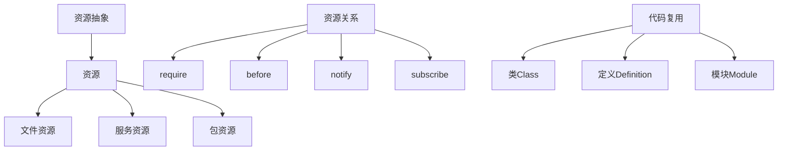
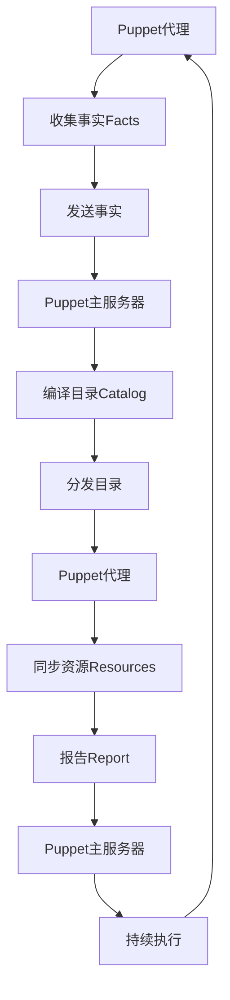

# AI系统Puppet原理与代码实战案例讲解

## 1.背景介绍

在当今快速发展的数字时代,人工智能(AI)已经广泛应用于各个领域,成为推动科技创新和商业发展的重要驱动力。随着AI技术的不断演进,越来越多的企业和组织开始探索如何利用AI系统来提高效率、优化流程和创造新的商业机会。在这种背景下,Puppet作为一种领先的AI系统,凭借其强大的功能和灵活的架构,成为了许多公司实现AI自动化和智能管理的首选解决方案。

Puppet是一个开源的配置管理工具,最初设计用于管理服务器基础设施。但随着时间的推移,它已经发展成为一个功能强大的AI系统,可以自动执行各种复杂的任务,包括资源供应、配置管理、应用程序部署等。Puppet的核心理念是将基础设施作为代码(Infrastructure as Code)来管理,这使得IT运营团队能够以可重复、可预测和可扩展的方式管理整个IT环境。

通过将基础设施定义为代码,Puppet可以自动化许多繁琐的手动任务,从而减少人为错误,提高效率,并确保整个环境保持一致性。此外,Puppet还提供了强大的报告和监控功能,让管理员可以实时了解系统的运行状况,并及时发现和解决潜在的问题。

## 2.核心概念与联系

### 2.1 资源抽象

Puppet的核心概念之一是资源抽象。资源是Puppet用来描述和管理系统中各种实体(如文件、服务、包等)的基本单元。每种资源类型都有一组预定义的属性,用于描述该资源的状态和行为。例如,文件资源有路径、内容、权限等属性,而服务资源有名称、状态、启用等属性。

通过资源抽象,Puppet可以将复杂的系统配置转化为一组简单的资源声明,使管理员能够以一种统一且易于理解的方式来管理整个IT环境。

```ruby
file { '/etc/motd':
  ensure  => present,
  content => "Welcome to ${::fqdn}\n",
}

service { 'httpd':
  ensure => running,
  enable => true,
}
```

### 2.2 资源关系

另一个核心概念是资源关系。在现实世界中,系统中的各种实体往往存在着复杂的依赖关系。例如,Web服务器需要依赖于操作系统和底层软件包,而数据库服务器又可能依赖于文件系统和存储资源。

Puppet通过元资源语法(metaparameters)来定义资源之间的关系,如require、before、notify和subscribe。这些元参数可以确保资源按照正确的顺序进行管理,从而避免出现潜在的配置错误或冲突。

```ruby
package { 'httpd':
  ensure => installed,
}

service { 'httpd':
  ensure  => running,
  enable  => true,
  require => Package['httpd'],
}
```

在上面的示例中,服务资源`httpd`依赖于包资源`httpd`,因此Puppet会先安装`httpd`包,然后再启动`httpd`服务。

### 2.3 代码复用

为了提高效率和可维护性,Puppet鼓励代码复用。它提供了多种机制来实现代码共享和模块化,包括:

- **类(Classes)**: 类是Puppet代码的基本构建块,它们可以封装一组相关的资源和参数。类可以被声明在节点(Node)上,也可以被其他类包含(include)或继承(inherit)。
- **定义(Defined Resource Types)**: 定义类似于类,但它们是用于创建可重用的资源模板。定义可以接受参数,并根据这些参数生成相应的资源。
- **模块(Modules)**: 模块是Puppet代码的分发单元,它们可以包含类、定义、事实(Facts)、模板(Templates)等多种组件。模块可以在Puppet Forge上共享和下载,从而促进了社区的代码复用。

通过利用这些代码复用机制,Puppet用户可以避免重复劳动,提高开发效率,并确保代码的一致性和可维护性。

### 2.4 Mermaid流程图

下面是Puppet核心概念的Mermaid流程图:



在这个流程图中,我们可以看到资源抽象是Puppet的核心概念,它将系统中的各种实体抽象为资源。资源之间可以通过资源关系来定义依赖关系,以确保它们按照正确的顺序进行管理。为了提高代码的可重用性和可维护性,Puppet提供了类、定义和模块等代码复用机制。

## 3.核心算法原理具体操作步骤

Puppet的核心算法原理是基于事实(Facts)、资源(Resources)和目录(Catalogs)的声明式配置管理。下面是Puppet的具体操作步骤:

1. **收集事实(Facts)**

   Puppet代理(Agent)会收集本机系统的事实,如操作系统、IP地址、内存大小等。这些事实将被发送到Puppet主服务器(Master)。

2. **编译目录(Catalog)**

   Puppet主服务器根据收到的事实和预定义的配置文件(Manifests),编译出一个目录。目录描述了系统的期望状态,包括需要管理的资源及其属性。

3. **分发目录(Catalog)**

   编译好的目录将被发送回Puppet代理。

4. **同步资源(Resources)**

   Puppet代理会将本机系统的当前状态与目录中描述的期望状态进行比较,并对不一致的资源执行必要的操作(如创建、修改或删除),以使系统达到期望状态。

5. **报告(Report)**

   同步完成后,Puppet代理会将操作报告发送回Puppet主服务器,报告中包含了所执行的更改以及任何错误或警告信息。

6. **持续执行**

   Puppet代理会根据配置的时间间隔(通常为30分钟),重复执行上述步骤,以确保系统一直保持在期望的状态。

下面是Puppet核心算法原理的Mermaid流程图:



在这个流程图中,我们可以清晰地看到Puppet的核心算法原理是一个循环过程,包括收集事实、编译目录、分发目录、同步资源和报告等步骤。通过这种声明式的方式,Puppet可以自动化地将系统配置到期望的状态,并持续地维护这种状态。

## 4.数学模型和公式详细讲解举例说明

在Puppet的核心算法中,有一些重要的数学模型和公式,用于描述和优化资源管理过程。下面将详细讲解其中的几个关键模型和公式。

### 4.1 资源收敛模型

资源收敛模型(Resource Convergence Model)是Puppet的核心理论基础。它描述了如何将系统从当前状态转换到期望状态的过程。

假设系统中有n个资源$R = \{r_1, r_2, \ldots, r_n\}$,每个资源$r_i$都有一个当前状态$s_i^c$和一个期望状态$s_i^d$。我们定义资源$r_i$的状态差异为:

$$\Delta_i = d(s_i^c, s_i^d)$$

其中$d$是一个距离函数,用于衡量当前状态与期望状态之间的差异。

为了使系统达到期望状态,Puppet需要对所有存在状态差异的资源执行相应的操作,以最小化总体状态差异:

$$\min \sum_{i=1}^n \Delta_i$$

在实际操作中,Puppet会根据资源之间的依赖关系,确定一个合理的执行顺序,并对每个资源进行必要的创建、修改或删除操作,直到所有资源都达到期望状态。

### 4.2 资源依赖图模型

资源依赖图(Resource Dependency Graph)是一种用于表示资源之间依赖关系的数学模型。它可以帮助Puppet确定资源的执行顺序,避免潜在的配置冲突。

假设系统中有n个资源$R = \{r_1, r_2, \ldots, r_n\}$,我们可以构建一个有向图$G = (V, E)$,其中:

- 顶点集$V$对应资源集$R$,即$V = \{v_1, v_2, \ldots, v_n\}$,每个顶点$v_i$对应一个资源$r_i$。
- 边集$E$表示资源之间的依赖关系。如果资源$r_i$依赖于资源$r_j$,则在图中存在一条有向边$(v_j, v_i)$。

基于这个依赖图模型,Puppet可以使用拓扑排序算法来确定资源的执行顺序,从而避免潜在的配置冲突。具体来说,如果存在一条路径$(v_i, v_j, \ldots, v_k)$,则资源$r_k$必须在资源$r_j$之后执行,资源$r_j$必须在资源$r_i$之后执行。

### 4.3 配置一致性检查

配置一致性检查(Configuration Consistency Checking)是Puppet用于验证系统状态的一种技术。它可以帮助管理员快速发现潜在的配置问题,并及时采取纠正措施。

假设系统中有n个资源$R = \{r_1, r_2, \ldots, r_n\}$,每个资源$r_i$都有一个当前状态$s_i^c$和一个期望状态$s_i^d$。我们定义资源$r_i$的一致性指标为:

$$c_i = \begin{cases}
1, & \text{if } s_i^c = s_i^d \\
0, & \text{otherwise}
\end{cases}$$

即如果资源的当前状态与期望状态一致,则一致性指标为1,否则为0。

基于这个指标,我们可以定义系统的整体一致性分数为:

$$C = \frac{1}{n} \sum_{i=1}^n c_i$$

一致性分数$C$的取值范围为$[0, 1]$,值越接近1,表示系统的配置越一致。

通过定期计算和监控系统的一致性分数,Puppet可以及时发现配置偏差,并提醒管理员采取相应的措施。这有助于确保系统始终保持在期望的状态,提高整体的可靠性和稳定性。

## 5.项目实践:代码实例和详细解释说明

为了更好地理解Puppet的工作原理,我们将通过一个实际项目案例来演示如何使用Puppet管理Web服务器的配置。在这个案例中,我们将部署一个Apache Web服务器,并配置它来托管一个简单的静态网站。

### 5.1 准备工作

在开始之前,我们需要准备以下环境:

- 一台运行CentOS 7的虚拟机或物理机,作为Puppet代理节点。
- 一台运行CentOS 7的虚拟机或物理机,作为Puppet主服务器。
- 确保两台机器之间可以通过网络互相访问。

接下来,我们需要在Puppet主服务器上安装Puppet Master,在Puppet代理节点上安装Puppet Agent。可以使用系统包管理器(如yum或apt)来完成安装。

### 5.2 编写Puppet代码

在Puppet主服务器上,我们需要创建一个模块来定义Web服务器的配置。首先,创建一个名为`web`的模块目录:

```
$ mkdir -p /etc/puppetlabs/code/environments/production/modules/web
```

然后,在`web`模块目录下创建一个`manifests`子目录,并在其中创建一个`init.pp`文件,用于定义Web服务器的配置:

```puppet
# /etc/puppetlabs/code/environments/production/modules/web/manifests/init.pp

class web {
  package { 'httpd':
    ensure => installed,
  }

  service { 'httpd':
    ensure  => running,