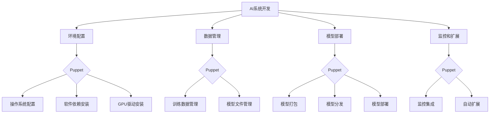

# AI系统Puppet原理与代码实战案例讲解

## 1.背景介绍

随着人工智能技术的快速发展,AI系统已经广泛应用于各个领域,如自然语言处理、计算机视觉、机器学习等。然而,构建一个高效、可靠的AI系统并非易事,需要解决诸多挑战,如数据处理、模型训练、系统集成等。Puppet作为一种基础设施自动化工具,可以帮助我们更好地管理和部署AI系统,提高开发和运维效率。

## 2.核心概念与联系

### 2.1 Puppet概述

Puppet是一种开源的配置管理工具,它使用声明式语言来描述所需的系统状态,并自动执行必要的操作来达到该状态。Puppet采用客户端-服务器架构,包括以下核心组件:

- Puppet Master: 作为中央服务器,存储配置文件并编译成目录清单。
- Puppet Agent: 运行在被管理节点上,负责从Puppet Master获取目录清单并执行相应的操作。
- Puppet Forge: 一个在线模块仓库,提供各种预先打包的模块供使用。

### 2.2 Puppet与AI系统集成

在AI系统的开发和部署过程中,Puppet可以发挥重要作用:

1. **环境配置**: 通过Puppet,我们可以自动化配置AI系统所需的各种环境,如操作系统、软件依赖项、GPU驱动程序等,确保一致性和可重复性。

2. **数据管理**: Puppet可以帮助管理AI系统的训练数据、模型文件等,实现版本控制和集中存储。

3. **模型部署**: 使用Puppet,我们可以自动化AI模型的打包、分发和部署,简化上线流程。

4. **监控和扩展**: Puppet可以与其他工具(如Prometheus、Grafana)集成,实现对AI系统的监控和自动扩展。

### 2.3 Mermaid流程图

下面的Mermaid流程图展示了Puppet在AI系统中的应用:



## 3.核心算法原理具体操作步骤

Puppet的核心算法原理基于资源抽象和声明式配置。下面是具体的操作步骤:

1. **定义资源**: 使用Puppet的领域特定语言(DSL)定义所需的资源,如文件、软件包、服务等。这些资源描述了系统的期望状态。

2. **编写Manifest文件**: Manifest文件是Puppet配置的入口点,包含了资源定义和其他配置信息。

3. **编译Manifest文件**: Puppet Master会将Manifest文件编译成目录清单(Catalog),描述了需要在被管理节点上执行的具体操作。

4. **分发目录清单**: Puppet Master将目录清单分发给相应的Puppet Agent。

5. **应用目录清单**: Puppet Agent接收目录清单并执行其中的操作,将系统状态调整到期望状态。

6. **报告状态**: Puppet Agent将执行结果报告给Puppet Master,以便进行监控和故障排查。

下面是一个简单的Manifest文件示例,用于安装Apache Web服务器:

```puppet
package { 'apache2':
  ensure => installed,
}

service { 'apache2':
  ensure  => running,
  enable  => true,
  require => Package['apache2'],
}
```

在这个示例中,我们定义了两个资源:一个`package`资源用于安装Apache软件包,一个`service`资源用于确保Apache服务处于运行状态并开机自启动。`require`元参数指定了资源之间的依赖关系。

## 4.数学模型和公式详细讲解举例说明

在AI系统中,数学模型和公式扮演着重要角色,如机器学习算法、优化方法等。下面我们以线性回归为例,介绍相关的数学模型和公式。

### 4.1 线性回归模型

线性回归是一种常见的监督学习算法,用于预测连续值的目标变量。给定一组特征向量$\boldsymbol{x}$和对应的目标值$y$,线性回归模型可以表示为:

$$y = \boldsymbol{w}^T\boldsymbol{x} + b$$

其中$\boldsymbol{w}$是权重向量,表示每个特征的重要性;$b$是偏置项,表示整个模型的基线值。

### 4.2 损失函数

为了训练线性回归模型,我们需要定义一个损失函数,用于衡量模型预测值与真实值之间的差异。常用的损失函数是均方误差(Mean Squared Error, MSE):

$$\mathrm{MSE}(\boldsymbol{w}, b) = \frac{1}{n}\sum_{i=1}^n (y_i - (\boldsymbol{w}^T\boldsymbol{x}_i + b))^2$$

其中$n$是训练样本数量。我们的目标是找到$\boldsymbol{w}$和$b$的值,使得MSE最小化。

### 4.3 优化算法

为了最小化损失函数,我们可以使用梯度下降(Gradient Descent)等优化算法。梯度下降的基本思想是沿着损失函数的负梯度方向更新模型参数,直到收敛。对于线性回归,参数更新规则为:

$$\boldsymbol{w} \leftarrow \boldsymbol{w} - \alpha \frac{\partial \mathrm{MSE}}{\partial \boldsymbol{w}}$$
$$b \leftarrow b - \alpha \frac{\partial \mathrm{MSE}}{\partial b}$$

其中$\alpha$是学习率,控制更新步长的大小。梯度可以通过对损失函数求偏导得到:

$$\frac{\partial \mathrm{MSE}}{\partial \boldsymbol{w}} = \frac{2}{n}\sum_{i=1}^n (\boldsymbol{w}^T\boldsymbol{x}_i + b - y_i)\boldsymbol{x}_i$$
$$\frac{\partial \mathrm{MSE}}{\partial b} = \frac{2}{n}\sum_{i=1}^n (\boldsymbol{w}^T\boldsymbol{x}_i + b - y_i)$$

通过迭代更新$\boldsymbol{w}$和$b$,我们可以找到使损失函数最小化的模型参数。

## 5.项目实践:代码实例和详细解释说明

为了更好地理解Puppet在AI系统中的应用,我们将通过一个实际案例来演示如何使用Puppet管理和部署一个基于TensorFlow的深度学习项目。

### 5.1 项目概述

我们将构建一个基于卷积神经网络(CNN)的手写数字识别系统。该项目包括以下主要组件:

- TensorFlow: 深度学习框架
- MNIST数据集: 手写数字图像数据集
- CNN模型: 用于识别手写数字的卷积神经网络模型
- Flask Web应用: 提供Web界面,用户可以上传图像并获取识别结果

### 5.2 环境配置

首先,我们需要配置项目所需的环境,包括操作系统、Python、TensorFlow等。下面是一个Puppet模块示例,用于在Ubuntu系统上安装所需的软件包:

```puppet
class deep_learning {
  package { 'python3-pip':
    ensure => installed,
  }

  package { 'tensorflow':
    ensure   => installed,
    provider => pip3,
    require  => Package['python3-pip'],
  }

  # 其他软件包...
}
```

在这个模块中,我们定义了两个资源:一个`package`资源用于安装Python的包管理器pip,另一个`package`资源用于通过pip安装TensorFlow。`require`元参数确保了正确的安装顺序。

### 5.3 数据管理

接下来,我们需要管理项目所需的数据,即MNIST数据集。我们可以使用Puppet的`file`资源来下载和解压数据集:

```puppet
class mnist_data {
  file { '/opt/mnist':
    ensure => directory,
  }

  archive { '/opt/mnist/mnist.zip':
    source       => 'http://example.com/mnist.zip',
    extract      => true,
    extract_path => '/opt/mnist',
    creates      => '/opt/mnist/train-images-idx3-ubyte',
    require      => File['/opt/mnist'],
  }
}
```

在这个模块中,我们首先创建一个目录`/opt/mnist`用于存放数据集。然后,我们使用`archive`资源从指定的URL下载数据集压缩包,并将其解压到`/opt/mnist`目录下。`creates`元参数确保只有在目标文件不存在时才执行下载和解压操作。

### 5.4 模型部署

完成环境配置和数据管理后,我们可以部署深度学习模型了。下面是一个Python脚本示例,用于训练和保存CNN模型:

```python
import tensorflow as tf
from tensorflow.keras.models import Sequential
from tensorflow.keras.layers import Conv2D, MaxPooling2D, Flatten, Dense

# 加载MNIST数据集
(x_train, y_train), (x_test, y_test) = tf.keras.datasets.mnist.load_data()

# 构建CNN模型
model = Sequential([
    Conv2D(32, (3, 3), activation='relu', input_shape=(28, 28, 1)),
    MaxPooling2D((2, 2)),
    Conv2D(64, (3, 3), activation='relu'),
    MaxPooling2D((2, 2)),
    Flatten(),
    Dense(64, activation='relu'),
    Dense(10, activation='softmax')
])

# 编译模型
model.compile(optimizer='adam',
              loss='sparse_categorical_crossentropy',
              metrics=['accuracy'])

# 训练模型
model.fit(x_train, y_train, epochs=5)

# 保存模型
model.save('/opt/mnist/cnn_model')
```

在这个脚本中,我们首先加载MNIST数据集,然后构建并编译一个CNN模型。接下来,我们使用训练数据训练模型,最后将训练好的模型保存到`/opt/mnist/cnn_model`目录下。

为了使用Puppet部署这个模型,我们可以创建一个`file`资源,将Python脚本复制到被管理节点上,并通过`exec`资源执行脚本:

```puppet
class cnn_model {
  file { '/opt/mnist/train_model.py':
    source => 'puppet:///modules/deep_learning/train_model.py',
  }

  exec { 'train_cnn_model':
    command     => 'python3 /opt/mnist/train_model.py',
    refreshonly => true,
    subscribe   => File['/opt/mnist/train_model.py'],
    require     => Class['mnist_data'],
  }
}
```

在这个模块中,我们首先将`train_model.py`脚本复制到`/opt/mnist`目录下。然后,我们定义一个`exec`资源,用于执行Python脚本并训练模型。`refreshonly`元参数确保只有在脚本文件发生变化时才执行训练操作。`subscribe`元参数指定了当`train_model.py`文件发生变化时,自动触发`exec`资源的执行。`require`元参数确保了先安装MNIST数据集,再进行模型训练。

### 5.5 Web应用部署

最后,我们需要部署一个Web应用,提供手写数字识别服务。下面是一个基于Flask的Web应用示例:

```python
from flask import Flask, request, render_template
import tensorflow as tf
import numpy as np
from PIL import Image

app = Flask(__name__)

# 加载CNN模型
model = tf.keras.models.load_model('/opt/mnist/cnn_model')

@app.route('/', methods=['GET', 'POST'])
def index():
    if request.method == 'POST':
        # 获取上传的图像
        file = request.files['image']
        img = Image.open(file.stream).convert('L')
        img = img.resize((28, 28))
        img = np.array(img) / 255.0
        img = img.reshape(1, 28, 28, 1)

        # 使用模型进行预测
        prediction = model.predict(img)
        digit = np.argmax(prediction)

        # 渲染结果页面
        return render_template('result.html', digit=digit)

    return render_template('index.html')

if __name__ == '__main__':
    app.run(host='0.0.0.0', port=5000)
```

在这个Web应用中,我们首先加载训练好的CNN模型。然后,我们定义了一个路由处理函数`index()`。当用户上传图像时,我们会对图像进行预处理,并使用CNN模型进行预测。最后,我们渲染一个结果