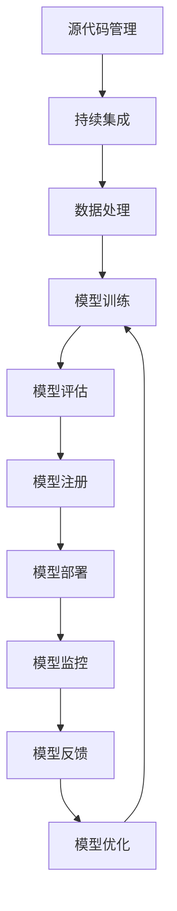
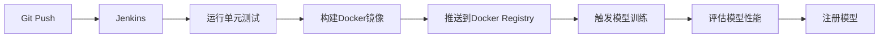
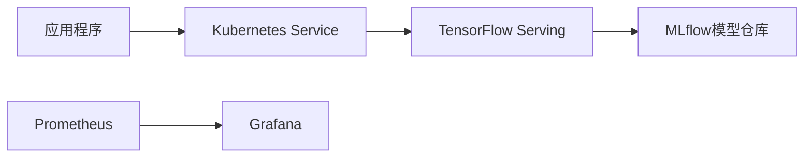

# AI系统持续交付原理与代码实战案例讲解

## 1.背景介绍

随着人工智能(AI)技术的快速发展,越来越多的企业开始采用AI系统来提高效率、优化决策和创造新的商业价值。然而,AI系统的开发和部署过程通常比传统软件系统更加复杂,需要处理大量的数据、训练模型、调整超参数等步骤。为了确保AI系统的高质量和可靠性,需要建立一个高效的持续交付流程。

持续交付(Continuous Delivery,CD)是一种软件工程方法,旨在使软件可以随时安全、可靠地部署到生产环境。在AI系统中,持续交付可以帮助企业更快地将AI模型投入生产,缩短从开发到部署的周期,从而提高AI系统的响应能力和商业价值。

## 2.核心概念与联系

### 2.1 持续集成(Continuous Integration,CI)

持续集成是持续交付的基础,它强调开发人员频繁地将代码集成到共享代码库中,并通过自动化构建和测试来检测集成错误。在AI系统中,持续集成不仅包括代码的集成,还包括数据处理、模型训练和评估等步骤。

### 2.2 模型版本控制

与传统软件一样,AI模型也需要进行版本控制。模型版本控制可以跟踪模型的变化历史,方便回滚到之前的版本或比较不同版本的性能。常用的模型版本控制工具包括Git、DVC(Data Version Control)等。

### 2.3 模型注册与部署

模型注册是将训练好的模型存储到中央模型仓库中,以便于后续的部署和管理。模型部署则是将模型发布到生产环境中,供应用程序调用。常用的模型部署工具包括TensorFlow Serving、KFServing等。

### 2.4 模型监控与反馈

在生产环境中,需要持续监控模型的性能和行为,以确保其符合预期。同时,也需要收集用户反馈,用于改进模型或重新训练。模型监控和反馈是持续交付中的重要环节,可以帮助企业持续优化AI系统。

### 2.5 CI/CD工具链

为了实现AI系统的持续交付,需要构建一个完整的CI/CD工具链。常用的工具包括:

- 代码仓库:Git、GitHub、GitLab等
- CI工具:Jenkins、Travis CI、CircleCI等
- 容器化:Docker、Kubernetes等
- 模型管理:MLflow、Valohai等
- 部署工具:TensorFlow Serving、KFServing等
- 监控工具:Prometheus、Grafana等

这些工具需要紧密集成,才能形成一个高效的AI系统持续交付流程。

## 3.核心算法原理具体操作步骤

AI系统持续交付的核心算法原理主要包括以下几个方面:



### 3.1 源代码管理

使用Git等版本控制工具管理AI系统的源代码,包括数据处理、模型训练、评估等脚本。

### 3.2 持续集成

在每次代码提交后,自动触发构建和测试流程,确保代码的正确性和一致性。

### 3.3 数据处理

从各种数据源获取原始数据,进行清洗、转换和标注等预处理步骤,生成可用于模型训练的数据集。

### 3.4 模型训练

使用预处理后的数据集训练AI模型,可能需要反复调整超参数和训练策略,直到达到满意的性能。

### 3.5 模型评估

在保留的测试集上评估模型的性能,包括准确率、精确率、召回率等指标,确保模型满足预期要求。

### 3.6 模型注册

将通过评估的模型版本注册到中央模型仓库中,为后续部署和管理做准备。

### 3.7 模型部署

使用工具如TensorFlow Serving将模型部署到生产环境中,供应用程序调用。

### 3.8 模型监控

持续监控生产环境中模型的性能和行为,包括响应时间、资源使用情况、预测结果等,并设置警报。

### 3.9 模型反馈

收集来自用户的反馈,包括模型预测错误、新的数据分布等,作为模型优化的依据。

### 3.10 模型优化

根据监控数据和用户反馈,对模型进行优化,如重新训练、微调等,然后重新部署新版本的模型。

## 4.数学模型和公式详细讲解举例说明

在AI系统中,常用的数学模型和公式包括:

### 4.1 监督学习

监督学习是机器学习中最常见的一种范式,它的目标是从给定的输入-输出数据对中学习一个映射函数,使其能够对新的输入数据做出正确的预测。常用的监督学习算法包括线性回归、逻辑回归、支持向量机、决策树、随机森林等。

以线性回归为例,其数学模型可表示为:

$$y = w^Tx + b$$

其中$y$是预测值,$x$是输入特征向量,$w$是权重向量,$b$是偏置项。目标是通过优化算法(如梯度下降)找到最优的$w$和$b$,使得预测值$y$尽可能接近真实值。

线性回归的损失函数通常采用均方误差(Mean Squared Error,MSE):

$$MSE = \frac{1}{n}\sum_{i=1}^n(y_i - \hat{y}_i)^2$$

其中$n$是样本数量,$y_i$是第$i$个样本的真实值,$\hat{y}_i$是预测值。

### 4.2 无监督学习

无监督学习旨在从未标记的数据中发现潜在的模式和结构。常用的无监督学习算法包括聚类(如K-Means)和降维(如主成分分析,PCA)。

以K-Means聚类为例,其目标是将$n$个数据点划分为$k$个簇,使得簇内数据点之间的距离尽可能小,簇间距离尽可能大。数学模型如下:

$$J = \sum_{i=1}^k\sum_{x \in C_i}||x - \mu_i||^2$$

其中$J$是目标函数,$C_i$是第$i$个簇,$\mu_i$是第$i$个簇的质心。算法通过迭代优化$J$,直到收敛。

### 4.3 深度学习

深度学习是机器学习的一个子领域,它使用深层神经网络来学习数据的层次表示。常用的深度学习模型包括卷积神经网络(CNN)、循环神经网络(RNN)、长短期记忆网络(LSTM)等。

以CNN为例,它通常由卷积层、池化层和全连接层组成。卷积层的数学模型为:

$$s(t) = (x * w)(t)$$

其中$x$是输入特征图,$w$是卷积核,*表示卷积操作。卷积层可以自动学习输入数据的局部模式。

全连接层的数学模型为:

$$y = f(Wx + b)$$

其中$x$是输入向量,$W$是权重矩阵,$b$是偏置向量,$f$是非线性激活函数(如ReLU、Sigmoid等)。

深度学习模型通常使用反向传播算法和随机梯度下降等优化方法进行训练。

## 5.项目实践:代码实例和详细解释说明

为了更好地理解AI系统持续交付的实践,我们将使用一个图像分类项目作为示例,并使用Python、TensorFlow、Docker、Jenkins等工具构建完整的CI/CD流程。

### 5.1 项目概述

该项目旨在构建一个图像分类模型,可以识别图像中的猫和狗。我们将使用来自Kaggle的猫狗数据集进行训练和测试。

### 5.2 代码结构

```
image-classifier/
├── data/
│   ├── train/
│   │   ├── cats/
│   │   └── dogs/
│   └── test/
│       ├── cats/
│       └── dogs/
├── models/
├── notebooks/
│   └── train.ipynb
├── src/
│   ├── data.py
│   ├── model.py
│   ├── train.py
│   └── utils.py
├── tests/
├── Dockerfile
├── requirements.txt
└── README.md
```

- `data/`目录存放训练和测试数据集
- `models/`目录用于存储训练好的模型
- `notebooks/`目录包含用于交互式开发的Jupyter Notebook
- `src/`目录包含数据处理、模型定义、训练和评估等Python脚本
- `tests/`目录包含单元测试
- `Dockerfile`用于构建Docker镜像
- `requirements.txt`列出了Python依赖项

### 5.3 持续集成流程

我们使用Jenkins作为CI工具,构建如下流水线:



1. 开发人员将代码推送到Git仓库
2. Jenkins检测到代码更新,自动触发构建流水线
3. 运行单元测试,确保代码质量
4. 使用Dockerfile构建Docker镜像,包含所有依赖项
5. 将Docker镜像推送到私有Registry
6. 在Kubernetes集群中启动训练Job,使用推送的Docker镜像
7. 在保留的测试集上评估模型性能
8. 如果性能满足要求,将模型注册到MLflow模型仓库

### 5.4 模型部署和监控

成功注册的模型版本可以使用TensorFlow Serving进行部署,并通过Kubernetes Service暴露给外部应用。我们使用Prometheus和Grafana对模型的性能和资源使用情况进行监控。



1. 应用程序通过Kubernetes Service调用TensorFlow Serving提供的模型服务
2. TensorFlow Serving从MLflow模型仓库加载已注册的模型版本
3. Prometheus自动抓取TensorFlow Serving的监控指标
4. Grafana展示Prometheus收集的监控数据,提供可视化仪表盘

### 5.5 模型优化

如果监控发现模型性能下降或收到用户反馈,我们可以重新训练模型并部署新版本:

1. 从MLflow模型仓库检出之前的模型版本
2. 在新的训练数据集上重新训练模型
3. 评估新模型的性能
4. 如果性能改善,则注册新模型版本
5. 使用Rolling Update策略,逐步将流量切换到新模型版本

通过这种方式,我们可以持续优化和更新AI系统,提高其性能和适应能力。

## 6.实际应用场景

AI系统持续交付在多个领域都有广泛的应用场景,包括但不限于:

### 6.1 计算机视觉

计算机视觉是AI的一个重要分支,包括图像分类、目标检测、语义分割等任务。持续交付可以帮助企业快速将最新的计算机视觉模型投入生产,如自动驾驶、安防监控、医疗影像诊断等。

### 6.2 自然语言处理

自然语言处理(NLP)技术可以让机器理解和生成人类语言,在智能客服、文本分析、机器翻译等领域有广泛应用。持续交付可以确保NLP系统及时更新,提高语言理解和生成的准确性。

### 6.3 推荐系统

推荐系统是电子商务、社交媒体等领域的关键技术,它通过分析用户行为和偏好,为用户推荐感兴趣的内容或产品。持续交付可以使推荐系统及时适应用户偏好的变化,提高推荐的准确性和多样性。

### 6.4 金融风险管理

在金融领域,AI技术可以用于欺诈检测、贷款审批、投资组合优化等任务。持续交付可以确保风险管理模型及时更新,提高风险预测的准确性