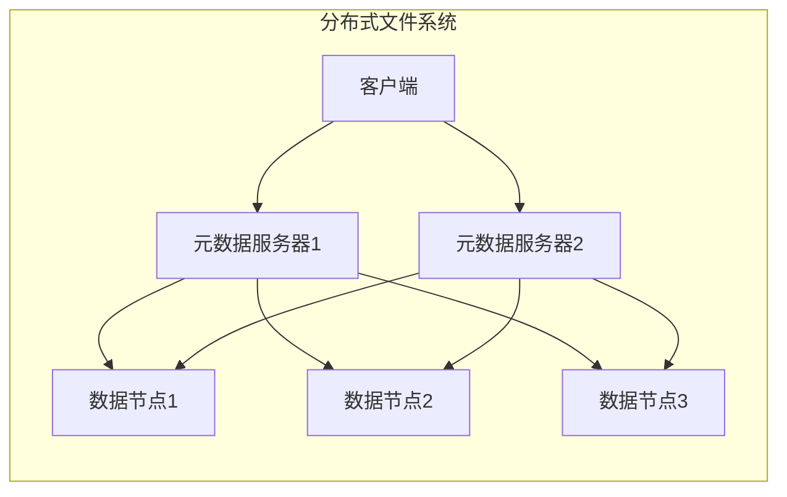

# AI系统故障自愈原理与代码实战案例讲解

## 1.背景介绍

### 1.1 AI系统的重要性

在当今时代,人工智能(AI)系统已经广泛应用于各个领域,包括金融、医疗、制造业、交通运输等。这些系统通过处理大量数据并进行智能决策,为我们的生活带来了巨大便利。然而,AI系统也面临着各种故障和异常情况,这可能会导致系统停机、数据丢失或者错误决策等严重后果。因此,确保AI系统的可靠性和健壮性至关重要。

### 1.2 AI系统故障的挑战

AI系统故障可能源于多种原因,例如硬件故障、软件缺陷、数据质量问题、网络中断等。这些故障不仅会影响系统的正常运行,还可能导致严重的经济损失和安全隐患。传统的故障处理方式通常依赖于人工干预,需要专业人员进行故障诊断和修复,这往往是一个漫长和昂贵的过程。

### 1.3 自愈计算的概念

为了解决上述挑战,自愈计算(Self-Healing Computing)的概念应运而生。自愈计算旨在赋予系统自我修复和自我优化的能力,使其能够在出现故障时自动检测、诊断并采取相应的恢复措施,从而最大限度地减少人工干预,提高系统的可用性和可靠性。

## 2.核心概念与联系

### 2.1 自愈计算的四个阶段

自愈计算通常包括以下四个阶段:

1. **监控(Monitoring)**: 持续监控系统的各个组件,收集运行时数据和日志信息。
2. **分析(Analysis)**: 对收集到的数据进行分析,识别潜在的故障模式和异常情况。
3. **规划(Planning)**: 根据故障类型和严重程度,制定恢复策略和行动计划。
4. **执行(Execution)**: 执行预定的恢复策略,修复故障并恢复系统到正常运行状态。

### 2.2 自愈计算与其他相关概念的关系

自愈计算与其他一些相关概念有着密切联系,例如:

- **自适应系统(Adaptive Systems)**: 自适应系统能够根据环境变化自动调整自身行为,与自愈计算的目标类似。
- **自组织系统(Self-Organizing Systems)**: 自组织系统能够自发地形成有序结构,这对于自愈计算中的故障恢复策略制定很有帮助。
- **自优化系统(Self-Optimizing Systems)**: 自优化系统能够持续优化自身性能,这与自愈计算的目标一致。

## 3.核心算法原理具体操作步骤

自愈计算系统通常采用以下核心算法和操作步骤:

### 3.1 故障检测算法

故障检测算法负责持续监控系统的各个组件,并识别潜在的故障模式和异常情况。常用的故障检测算法包括:

1. **基于阈值的检测**: 设置一些关键指标的阈值,当指标超过阈值时,认为发生了故障。
2. **基于模型的检测**: 构建系统的正常行为模型,将实际观测到的行为与模型进行比较,发现偏差即认为发生了故障。
3. **基于规则的检测**: 定义一系列规则,如果系统行为违反了这些规则,则认为发生了故障。

### 3.2 故障诊断算法

故障诊断算法旨在确定故障的根本原因,为后续的恢复策略制定提供依据。常用的故障诊断算法包括:

1. **基于案例的诊断**: 将当前故障情况与历史案例进行匹配,找到最相似的案例,并借鉴其诊断结果。
2. **基于模型的诊断**: 构建系统的因果模型,根据观测到的症状推理出可能的故障原因。
3. **基于知识的诊断**: 利用领域专家的知识和经验,建立故障诊断规则库,根据规则进行诊断。

### 3.3 故障恢复策略制定

根据故障类型和严重程度,制定合适的恢复策略和行动计划。常见的恢复策略包括:

1. **重启(Restart)**: 重新启动受影响的组件或整个系统。
2. **回滚(Rollback)**: 将系统恢复到之前的正常状态。
3. **重配置(Reconfiguration)**: 动态调整系统配置,绕过故障组件。
4. **补丁修复(Patch Repair)**: 对故障组件进行热补丁,修复缺陷。

### 3.4 故障恢复执行

执行预定的恢复策略,修复故障并恢复系统到正常运行状态。这一步骤可能需要协调多个组件的行为,并确保恢复过程的原子性和一致性。

## 4.数学模型和公式详细讲解举例说明

在自愈计算系统中,数学模型和公式往往用于故障检测、诊断和恢复策略制定等环节。下面我们将详细讲解一些常见的数学模型和公式。

### 4.1 马尔可夫模型

马尔可夫模型是一种常用的随机过程模型,它假设系统的未来状态只依赖于当前状态,而与过去状态无关。在自愈计算中,马尔可夫模型可用于建模系统的状态转移,并基于此进行故障检测和诊断。

设系统有 $n$ 个可能状态 $S = \{s_1, s_2, \dots, s_n\}$,其中 $s_1$ 表示正常状态,其他状态表示不同的故障情况。系统在时间 $t$ 处于状态 $s_i$ 的概率记为 $P(X_t = s_i)$,状态转移概率记为 $P(X_{t+1} = s_j | X_t = s_i) = p_{ij}$。根据马尔可夫性质,我们有:

$$
P(X_{t+1} = s_j | X_t = s_i, X_{t-1} = s_k, \dots) = P(X_{t+1} = s_j | X_t = s_i) = p_{ij}
$$

通过估计状态转移概率矩阵 $P = (p_{ij})_{n \times n}$,我们可以预测系统在未来时刻处于各种状态的概率,从而实现故障检测和诊断。

### 4.2 贝叶斯网络

贝叶斯网络是一种基于概率论的图模型,它能够有效地表示随机变量之间的因果关系和条件独立性。在自愈计算中,贝叶斯网络可用于构建系统的因果模型,并基于观测到的症状推理出可能的故障原因。

设系统包含 $n$ 个随机变量 $X = \{X_1, X_2, \dots, X_n\}$,其中某些变量表示系统组件的状态,另一些变量表示观测到的症状。贝叶斯网络由一个有向无环图 $G$ 和一组条件概率分布 $P(X_i | \text{Parents}(X_i))$ 组成,其中 $\text{Parents}(X_i)$ 表示 $X_i$ 在图 $G$ 中的父节点。根据贝叶斯定理,我们可以计算出联合概率分布:

$$
P(X_1, X_2, \dots, X_n) = \prod_{i=1}^n P(X_i | \text{Parents}(X_i))
$$

给定观测到的症状,我们可以使用贝叶斯网络推理出各个组件状态的后验概率,从而诊断出最可能的故障原因。

### 4.3 控制理论

控制理论提供了一种数学框架,用于分析和设计自动控制系统。在自愈计算中,控制理论可用于制定故障恢复策略,确保系统在故障发生后能够平稳地恢复到正常运行状态。

设系统的状态表示为 $x(t)$,期望状态表示为 $r(t)$,控制输入表示为 $u(t)$。我们希望通过合适的控制输入 $u(t)$,使系统状态 $x(t)$ 跟踪期望状态 $r(t)$。根据系统的动态方程,我们可以设计一个反馈控制器,其中控制输入 $u(t)$ 是系统状态 $x(t)$ 和期望状态 $r(t)$ 的函数:

$$
u(t) = K(r(t) - x(t))
$$

其中 $K$ 是控制器的增益参数,需要根据系统的稳定性和响应速度等指标进行调整。通过反馈控制,我们可以使系统在发生故障后逐步恢复到正常运行状态。

## 5.项目实践:代码实例和详细解释说明

为了更好地理解自愈计算的原理和实现方式,我们将通过一个具体的项目实践来进行说明。在这个项目中,我们将构建一个简单的分布式文件系统,并为其添加自愈能力,使其能够自动检测和修复节点故障。

### 5.1 系统架构

我们的分布式文件系统由以下几个主要组件组成:

- **元数据服务器(Metadata Server)**: 负责管理文件元数据,例如文件名、大小、存储位置等。
- **数据节点(Data Node)**: 负责实际存储文件数据块。
- **客户端(Client)**: 用户通过客户端与文件系统进行交互,执行文件上传、下载等操作。

这些组件通过网络相互通信,构成一个分布式系统。为了提高可靠性,我们将部署多个元数据服务器和数据节点,它们通过复制和一致性协议来实现故障容错。



### 5.2 故障检测

我们将在系统中引入一个监控组件,负责定期检查各个节点的健康状态。具体来说,监控组件会向每个节点发送心跳消息,如果在一定时间内没有收到响应,就认为该节点发生了故障。

下面是一段用于实现故障检测的 Python 代码:

```python
import time
import threading

class HealthMonitor:
    def __init__(self, nodes, timeout=5):
        self.nodes = nodes
        self.timeout = timeout
        self.failures = set()
        self.lock = threading.Lock()

    def check_node(self, node):
        try:
            # 发送心跳消息并等待响应
            response = node.send_heartbeat(self.timeout)
            if not response:
                with self.lock:
                    self.failures.add(node)
        except Exception as e:
            with self.lock:
                self.failures.add(node)

    def monitor(self):
        while True:
            threads = []
            for node in self.nodes:
                thread = threading.Thread(target=self.check_node, args=(node,))
                thread.start()
                threads.append(thread)

            for thread in threads:
                thread.join()

            time.sleep(self.timeout)

    def get_failures(self):
        with self.lock:
            return list(self.failures)
```

在这段代码中,`HealthMonitor`类维护了一个节点列表和一个故障节点集合。`monitor`方法会定期启动多个线程,分别检查每个节点的健康状态。如果某个节点在规定时间内没有响应,就将其加入故障节点集合中。`get_failures`方法可以获取当前的故障节点列表。

### 5.3 故障诊断

一旦检测到节点故障,我们需要进一步诊断故障原因,以便采取合适的恢复措施。在本例中,我们将使用一种基于规则的故障诊断方法。

具体来说,我们将定义一系列规则,用于将观测到的症状与可能的故障原因进行匹配。例如,如果节点无法响应心跳消息,但可以通过网络 ping 通,那么可能是节点的进程崩溃了;如果节点无法 ping 通,那么可能是硬件故障或网络故障。

下面是一段用于实现故障诊断的 Python 代码:

```python
import subprocess

class FaultDiagnosis:
    def __init__(self, nodes):
        self.nodes = nodes
        self.rules = [
            (self.process_crashed, "Process Crashed"),