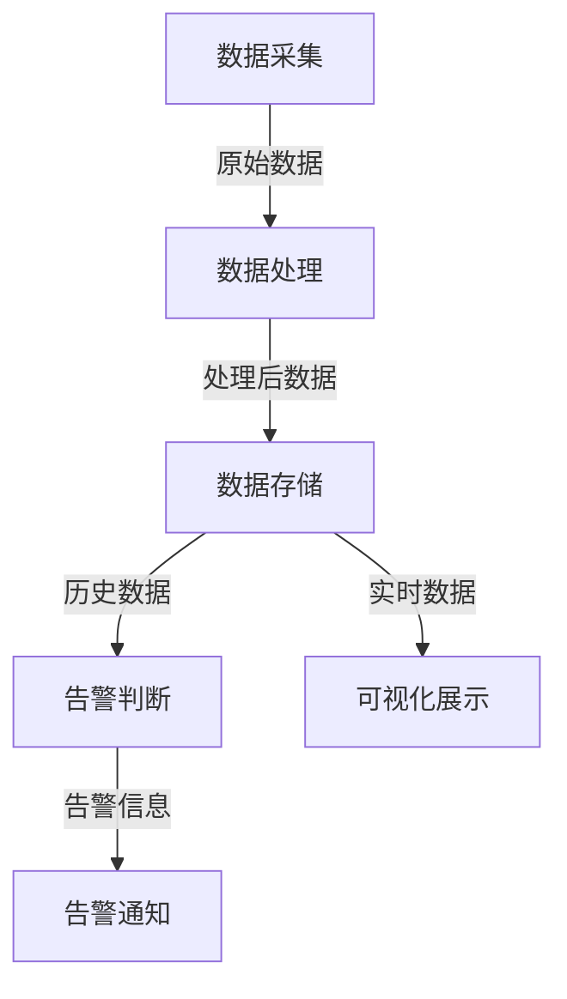

# AI系统监控告警原理与代码实战案例讲解

## 1. 背景介绍

随着人工智能(AI)系统在各行业的广泛应用,确保这些系统的可靠性和稳定性变得至关重要。AI系统监控和告警机制是保证系统健康运行的关键环节。本文将探讨AI系统监控告警的原理、实现方法和实战案例,为读者提供全面的理解和实践指导。

### 1.1 AI系统监控告警的重要性

AI系统通常涉及复杂的数据处理、模型训练和推理过程,任何环节出现异常都可能导致系统故障或性能下降。及时发现和解决这些问题对于确保AI系统的可靠性至关重要。此外,AI系统往往需要处理大量数据,任何数据质量问题都可能影响模型的准确性和效率。

有效的监控告警机制可以帮助我们:

1. 实时监测系统的运行状态,包括硬件、软件和数据质量等各个方面。
2. 及时发现异常情况,如硬件故障、软件错误、数据质量下降等。
3. 自动触发相应的告警,通知相关人员采取必要的措施。
4. 收集系统运行数据,用于故障诊断和性能优化。

### 1.2 AI系统监控告警的挑战

尽管监控告警对于AI系统的稳定运行至关重要,但实现一个高效、可靠的监控告警系统并非易事。主要挑战包括:

1. **复杂性**: AI系统涉及多个组件和环节,需要监控各个层面的指标。
2. **动态性**: AI系统的工作负载和资源需求通常是动态变化的,需要动态调整监控策略。
3. **数据量大**: AI系统往往需要处理大量数据,监控数据的存储和分析也是一个挑战。
4. **模型不确定性**: AI模型的行为往往具有不确定性,难以建立明确的异常判断标准。

## 2. 核心概念与联系

在深入探讨AI系统监控告警的原理和实现之前,我们需要先了解一些核心概念及其之间的联系。

### 2.1 监控指标

监控指标是衡量系统运行状态的关键数据,通常包括:

- **系统指标**: CPU利用率、内存使用情况、磁盘I/O等。
- **应用指标**: 请求延迟、吞吐量、错误率等。
- **数据指标**: 数据流量、数据质量等。
- **模型指标**: 模型准确率、推理延迟等。

不同的AI系统可能需要关注不同的指标集合。选择合适的监控指标是实现有效监控的前提。

### 2.2 告警规则

告警规则定义了何种情况下应该触发告警。常见的告警规则包括:

- **阈值告警**: 当监控指标超过预设阈值时触发告警。
- **模式匹配告警**: 当监控数据与预定义的异常模式匹配时触发告警。
- **趋势分析告警**: 根据监控数据的历史趋势预测未来异常并提前告警。

告警规则的设置需要结合具体场景和经验,过于宽松或过于严格都会影响告警的有效性。

### 2.3 告警通知

当告警被触发时,需要通过合适的渠道将告警信息通知相关人员,以便及时采取应对措施。常见的通知渠道包括:

- 邮件
- 短信
- 即时通讯工具(如slack、微信等)
- 呼叫中心

通知内容通常包括告警级别、触发时间、相关指标等信息,以帮助快速定位和诊断问题。

### 2.4 监控架构

监控架构描述了监控系统的整体结构和各个组件之间的交互关系。一个典型的监控架构包括:

1. **数据采集**:从被监控系统收集相关指标数据。
2. **数据处理**:对采集的数据进行过滤、转换和归并等处理。
3. **数据存储**:将处理后的监控数据持久化存储。
4. **告警判断**:根据预设规则判断是否需要触发告警。
5. **告警通知**:将告警信息通知相关人员。
6. **可视化展示**:以图表或仪表盘的形式展示监控数据。

不同的监控系统可能采用不同的架构设计,但上述组件是必不可少的。



上图展示了一个典型的监控架构流程。在实际应用中,这些组件可能会有不同的实现方式和细节,但总体思路是相似的。

## 3. 核心算法原理具体操作步骤

在前面章节中,我们已经了解了AI系统监控告警的背景知识和核心概念。接下来,我们将深入探讨监控告警系统的核心算法原理和具体实现步骤。

### 3.1 数据采集

数据采集是监控系统的基础,它负责从被监控系统中收集相关的指标数据。常见的数据采集方式包括:

1. **主动拉取(Pull)**:监控系统主动向被监控系统发送请求,获取指标数据。
2. **被动接收(Push)**:被监控系统主动将指标数据推送到监控系统。

不同的采集方式各有优缺点,具体选择取决于被监控系统的特点和监控需求。

数据采集算法的核心步骤如下:

1. 确定需要采集的指标列表。
2. 根据指标类型选择合适的采集方式(Pull或Push)。
3. 设置采集频率和超时时间。
4. 实现数据采集逻辑,处理异常情况。
5. 将采集到的原始数据传递给后续的数据处理模块。

### 3.2 数据处理

由于原始采集数据通常是分散的、不规范的,因此需要进行数据处理,以便后续的存储和分析。常见的数据处理操作包括:

1. **过滤**:根据预设规则过滤掉无用或异常的数据。
2. **转换**:将数据转换为统一的格式,方便后续处理。
3. **归并**:将来自不同来源的相关数据进行合并。
4. **计算**:根据需求对数据进行一些计算操作,如取平均值、求和等。

数据处理算法的核心步骤如下:

1. 定义数据处理流程,包括需要执行的操作及其顺序。
2. 实现各个操作的具体逻辑,如过滤规则、转换函数等。
3. 处理异常情况,如异常数据、操作失败等。
4. 将处理后的数据传递给后续的数据存储模块。

### 3.3 数据存储

为了支持历史数据分析和回溯,监控系统需要将处理后的数据持久化存储。常见的存储方式包括:

1. **时序数据库**:专门为时序数据设计的数据库,如InfluxDB、OpenTSDB等。
2. **通用数据库**:利用传统的关系型或NoSQL数据库进行存储。
3. **对象存储**:将数据存储为对象,如AWS S3、阿里云OSS等。

不同的存储方式各有优缺点,选择时需要考虑数据量、查询性能、成本等因素。

数据存储算法的核心步骤如下:

1. 选择合适的存储方式,根据需求配置存储系统。
2. 设计数据模型,定义存储结构和索引。
3. 实现数据写入逻辑,处理异常情况。
4. 实现数据查询接口,供后续模块使用。

### 3.4 告警判断

告警判断是监控系统的核心功能,它根据预设的告警规则判断是否需要触发告警。常见的告警判断算法包括:

1. **阈值判断**:当监控指标超过预设阈值时触发告警。
2. **模式匹配**:利用机器学习算法,将监控数据与已知的异常模式进行匹配。
3. **趋势分析**:基于历史数据,预测未来的趋势,提前发现异常并告警。

告警判断算法的核心步骤如下:

1. 定义告警规则,包括判断条件、告警级别等。
2. 从数据存储中获取相关的监控数据。
3. 执行告警判断逻辑,根据规则判断是否需要触发告警。
4. 将告警信息传递给后续的告警通知模块。

### 3.5 告警通知

当告警被触发时,监控系统需要通过合适的渠道将告警信息通知相关人员。常见的通知渠道包括邮件、短信、即时通讯工具等。

告警通知算法的核心步骤如下:

1. 定义通知渠道和接收人列表。
2. 构建告警信息,包括告警级别、触发时间、相关指标等内容。
3. 根据通知渠道的不同,实现对应的发送逻辑。
4. 处理发送失败的情况,如重试、升级通知级别等。

### 3.6 可视化展示

为了直观地展示监控数据和系统状态,监控系统通常提供可视化展示功能,如仪表盘、图表等。

可视化展示算法的核心步骤如下:

1. 从数据存储中获取相关的监控数据。
2. 根据展示需求对数据进行加工,如聚合、计算等。
3. 选择合适的可视化组件,如折线图、饼图等。
4. 渲染可视化组件,展示监控数据。
5. 提供交互功能,如缩放、筛选等。

## 4. 数学模型和公式详细讲解举例说明

在AI系统监控告警领域,数学模型和公式也扮演着重要的角色。本节将介绍一些常见的数学模型和公式,并通过具体示例加深理解。

### 4.1 指数加权移动平均(EWMA)

EWMA是一种常用的时序数据平滑算法,它可以有效地减少数据噪声,并突出数据的趋势变化。EWMA的计算公式如下:

$$
EWM_t = \alpha \times value_t + (1 - \alpha) \times EWM_{t-1}
$$

其中:

- $EWM_t$是当前时刻的EWMA值
- $value_t$是当前时刻的原始数据值
- $\alpha$是平滑系数,取值范围为(0, 1)
- $EWM_{t-1}$是上一时刻的EWMA值

$\alpha$的取值决定了EWMA对新数据的敏感程度。$\alpha$越大,EWMA对新数据的响应越快;$\alpha$越小,EWMA对历史数据的依赖越大。

例如,我们有一个CPU利用率序列:

```
60%, 65%, 70%, 75%, 80%
```

假设$\alpha=0.3$,初始$EWM_0=60\%$,则EWMA序列为:

```
60.0%, 61.5%, 64.1%, 67.5%, 71.5%
```

可以看到,EWMA序列相比原始数据更加平滑,同时也能较好地反映数据的上升趋势。

在监控系统中,EWMA可以用于平滑监控指标数据,从而更容易发现真实的异常模式。同时,EWMA也可以作为告警规则的一部分,当EWMA值超过阈值时触发告警。

### 4.2 预测模型

除了基于历史数据的简单平滑算法,我们还可以使用更复杂的预测模型来分析监控数据的趋势,从而提前发现异常。常见的预测模型包括:

1. **自回归移动平均模型(ARIMA)**
2. **指数平滑模型(ETS)**
3. **Prophet模型**

以Prophet模型为例,它是一种由Facebook开源的时序数据预测模型,可以有效捕获周期性趋势和节假日效应。Prophet模型的核心公式如下:

$$
y(t) = g(t) + s(t) + h(t) + \epsilon_t
$$

其中:

- $y(t)$是预测目标
- $g(t)$是增长趋势项
- $s(t)$是周期性项
- $h(t)$是节假日项
- $\epsilon_t$是误差项

Prophet模型通过对历史数据进行拟合,估计出