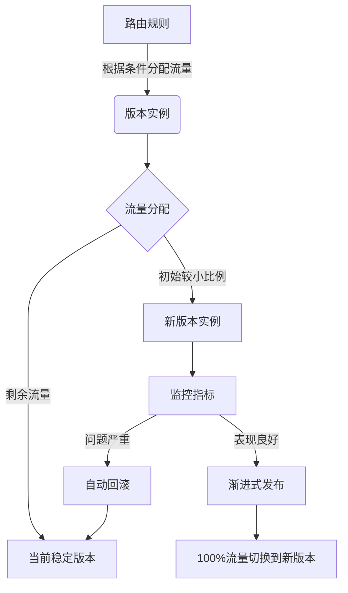

# AI系统金丝雀发布原理与代码实战案例讲解

## 1.背景介绍

### 1.1 什么是金丝雀发布

在软件开发过程中,金丝雀发布(Canary Release)是一种可控的持续交付技术,用于将新版本的应用程序逐步推广给一小部分真实用户,以便在全面推广之前监控应用程序的运行情况和性能。这种技术的名称源于矿工在井下工作时,他们会带着金丝雀进入矿井。如果有有毒气体存在,金丝雀会先示警,这样矿工就可以及时撤离。

金丝雀发布的核心思想是通过向一小部分用户发布新版本,收集反馈并监控系统运行情况,从而降低全量发布带来的风险。如果新版本存在问题,只会影响少数用户,可以快速回滚,将风险控制在可控范围内。一旦新版本的表现令人满意,就可以逐步扩大发布范围,最终实现全量发布。

### 1.2 金丝雀发布的优势

相比传统的一次性全量发布,金丝雀发布具有以下优势:

1. **降低风险**: 通过分批发布,可以控制新版本带来的影响范围,降低全量发布的风险。
2. **提高可靠性**: 在全量发布前,可以对新版本进行充分测试和监控,确保其稳定可靠。
3. **快速反馈**: 可以从真实用户那里获得及时反馈,快速发现并修复问题。
4. **持续交付**: 支持持续交付,缩短从开发到上线的周期,加快创新迭代。
5. **平滑过渡**: 通过逐步扩大发布范围,可以实现平滑无缝的版本升级。

### 1.3 金丝雀发布的应用场景

金丝雀发布广泛应用于各种软件系统,尤其适合以下场景:

1. **高风险应用**: 对可用性和稳定性要求较高的关键应用,例如金融系统、电子商务平台等。
2. **大规模分布式系统**: 由于系统复杂,全量发布风险较高,需要通过分批发布来控制风险。
3. **面向大量用户的系统**: 用户群体庞大,全量发布可能导致大面积故障,影响范围广。
4. **快速迭代的系统**: 需要频繁发布新版本的系统,金丝雀发布可以缩短上线周期。

## 2.核心概念与联系

### 2.1 金丝雀发布的核心概念

要理解金丝雀发布的原理,需要掌握以下几个核心概念:

1. **路由规则(Routing Rules)**: 用于控制流量如何在不同版本的应用程序实例之间分配。通常基于HTTP头、Cookie、IP地址等条件进行路由。

2. **版本实例(Version Instances)**: 指运行在生产环境中的不同版本的应用程序实例。通常包括当前稳定版本和新版本。

3. **流量分配(Traffic Allocation)**: 决定将多少比例的流量路由到新版本实例。通常从较小比例开始,逐步增加,直至100%。

4. **监控指标(Monitoring Metrics)**: 用于监视新版本实例的运行状况,包括性能指标(延迟、错误率等)和业务指标(转化率、收入等)。

5. **自动回滚(Automated Rollback)**: 如果监控到新版本存在严重问题,需要自动将流量切换回旧版本,以保证系统可用性。

6. **渐进式发布(Progressive Delivery)**: 根据监控反馈,逐步增加新版本的流量比例,直至100%全量发布。

这些概念相互关联,共同构成了金丝雀发布的核心机制。下面将通过一个流程图来展示它们之间的关系。

### 2.2 金丝雀发布与其他发布策略的区别

除了金丝雀发布,还有其他一些常见的发布策略,例如:

1. **蓝绿部署(Blue-Green Deployment)**: 同时运行新旧两个版本,切换路由规则实现版本升级。
2. **滚动发布(Rolling Deployment)**: 逐个实例升级,直至全部实例升级完成。
3. **A/B测试(A/B Testing)**: 将流量分配给不同版本,测试新版本的性能表现。

虽然这些策略都涉及分批发布的概念,但与金丝雀发布有所不同:

- 蓝绿部署和滚动发布通常是一次性切换或升级,而金丝雀发布则是逐步发布。
- A/B测试侧重于测试新版本的性能表现,而金丝雀发布还关注实际用户体验和业务影响。
- 金丝雀发布结合了自动化监控和回滚机制,可以更好地控制风险。

因此,金丝雀发布是一种更加全面、可控的持续交付策略,融合了分批发布、监控反馈和自动化控制等多个方面。

## 3.核心算法原理具体操作步骤

实施金丝雀发布通常包括以下几个主要步骤:

### 3.1 准备新版本应用程序

首先,需要准备好新版本的应用程序,并将其部署到生产环境中。新版本应用程序实例与当前稳定版本实例共存,但初始状态下不会接收任何流量。

### 3.2 配置路由规则

接下来,需要配置路由规则,以控制流量在不同版本实例之间的分配。路由规则可以基于多种条件,如HTTP头、Cookie、IP地址等。常见的路由实现方式包括:

1. **服务网格(Service Mesh)**: 利用Istio、Linkerd等服务网格技术实现路由控制。
2. **API网关(API Gateway)**: 在API网关层配置路由规则,如Nginx、Kong等。
3. **负载均衡器(Load Balancer)**: 利用负载均衡器的路由策略进行流量分配。

无论采用何种方式,都需要确保路由规则可以灵活控制流量分配比例。

### 3.3 分配初始流量

在金丝雀发布的初始阶段,我们通常会将较小比例的流量(例如5%或10%)路由到新版本实例,其余流量继续路由到当前稳定版本实例。这样可以在受控的范围内测试新版本的表现。

### 3.4 监控新版本实例

当新版本实例接收到流量后,需要密切监控其运行状况。监控指标通常包括:

1. **系统指标**: CPU利用率、内存使用情况、网络流量等。
2. **应用指标**: 响应时间、错误率、吞吐量等。
3. **业务指标**: 转化率、收入、用户参与度等。

监控数据可以通过各种方式收集,如应用程序日志、分布式跟踪系统(Jaeger、Zipkin)、监控系统(Prometheus、Datadog)等。

### 3.5 评估监控数据

持续评估监控数据,判断新版本实例的表现是否符合预期。如果发现严重问题(如错误率明显升高、关键业务指标下降等),则需要立即执行回滚操作,将流量切换回当前稳定版本。

### 3.6 渐进式发布

如果新版本实例的表现令人满意,则可以逐步增加其接收的流量比例,例如从5%增加到10%、20%,直至100%。每次增加流量比例前,都需要仔细评估监控数据,确保新版本实例的性能和稳定性。

### 3.7 全量发布

当新版本实例接收100%流量且运行稳定后,即可完成全量发布。此时,可以停止当前稳定版本实例,释放相关资源。

### 3.8 回滚操作(如有必要)

如果在任何阶段发现新版本存在严重问题,都需要立即执行回滚操作,将所有流量切换回当前稳定版本实例。回滚操作应该是自动化的,以确保快速反应。

回滚后,需要分析问题根源,修复新版本中的缺陷,并重新开始金丝雀发布流程。

上述步骤形成了一个闭环,通过不断迭代,可以持续交付高质量的新版本应用程序,同时最大限度地控制风险。

## 4.数学模型和公式详细讲解举例说明

在金丝雀发布过程中,我们需要合理分配流量,并根据监控数据评估新版本的表现。这些决策通常需要借助一些数学模型和公式。

### 4.1 流量分配模型

假设我们有两个版本的应用程序实例:当前稳定版本(V1)和新版本(V2)。我们需要决定将多少比例的流量分配给V2。

令:
- $r$表示分配给V2的流量比例,取值范围为$[0,1]$
- $N$表示总流量
- $N_1$表示分配给V1的流量
- $N_2$表示分配给V2的流量

则有:

$$
N_1 = (1-r)N \\
N_2 = rN
$$

在金丝雀发布的初始阶段,我们通常会选择一个较小的$r$值,例如0.05或0.1,以控制风险。随着新版本表现良好,我们可以逐步增加$r$的值,直至达到1(即100%流量切换到新版本)。

### 4.2 错误率评估模型

监控新版本实例的关键指标之一是错误率。假设我们在一段时间内观察到的错误数为$e$,总请求数为$n$,则错误率$p$可以计算如下:

$$
p = \frac{e}{n}
$$

我们可以设置一个阈值$p_0$,如果$p>p_0$,则认为新版本存在严重问题,需要执行回滚操作。

例如,假设我们观察到在5分钟内,新版本实例共处理了10000个请求,其中发生错误的有50个。则错误率为:

$$
p = \frac{50}{10000} = 0.005 = 0.5\%
$$

如果我们事先设置的阈值$p_0$为0.1%(即1000ppm),那么上述错误率就超过了阈值,需要考虑回滚。

### 4.3 响应时间评估模型

除了错误率,我们还需要关注新版本实例的响应时间。假设我们观察到的响应时间序列为$\{t_1, t_2, \ldots, t_n\}$,则平均响应时间$\overline{t}$可以计算如下:

$$
\overline{t} = \frac{1}{n}\sum_{i=1}^{n}t_i
$$

我们可以将新版本的平均响应时间$\overline{t}_2$与当前稳定版本的平均响应时间$\overline{t}_1$进行比较,如果$\overline{t}_2$明显大于$\overline{t}_1$,则可能需要回滚或优化新版本。

例如,假设当前稳定版本的平均响应时间为50ms,而新版本的平均响应时间为80ms,那么新版本的响应时间就比较慢,可能会影响用户体验。

### 4.4 业务指标评估模型

除了系统和应用指标,我们还需要关注业务指标,例如转化率、收入等。假设我们观察到的新版本实例的转化率为$c_2$,当前稳定版本的转化率为$c_1$,则两者的差异$\Delta c$可以计算如下:

$$
\Delta c = c_2 - c_1
$$

如果$\Delta c$过大且为负值,则说明新版本可能对业务产生了负面影响,需要审慎考虑是否继续发布。

例如,假设当前稳定版本的转化率为5%,而新版本的转化率为4%,则$\Delta c = -1\%$,说明新版本可能会导致1%的转化率下降,需要评估其对业务的影响程度。

通过上述数学模型和公式,我们可以更加客观地评估新版本的表现,从而做出是否继续发布、回