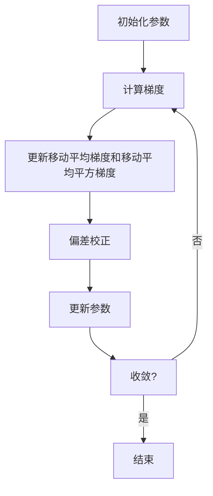

# Adam Optimization原理与代码实例讲解

## 1.背景介绍

在深度学习和机器学习领域中,优化算法扮演着至关重要的角色。它们用于调整模型参数,以最小化损失函数并提高模型性能。Adam(Adaptive Moment Estimation)是一种广泛使用的优化算法,由Diederik Kingma等人于2014年提出。它结合了两种流行的优化算法的优点:动量(Momentum)和RMSProp。

Adam算法在许多情况下表现出色,特别是在处理稀疏梯度和噪声问题时。它还可以自动调整每个参数的学习率,从而加快收敛速度。由于其简单性、计算效率和收敛性能,Adam已成为深度学习中的事实上的标准优化算法之一。

## 2.核心概念与联系

Adam算法的核心思想是计算梯度的指数加权移动平均值,并利用这些平均值来更新参数。它包含以下两个主要估计值:

1. **移动平均梯度(Moving Average of the Gradients)**: 这是过去所有梯度的指数加权平均值,用于估计梯度的动量方向。

2. **移动平均平方梯度(Moving Average of the Squared Gradients)**: 这是过去所有梯度平方的指数加权平均值,用于估计梯度的尺度。

通过结合这两个估计值,Adam可以自适应地调整每个参数的学习率,从而实现更快的收敛和更好的性能。

Adam算法与经典的随机梯度下降(SGD)和动量优化算法有着密切的联系。它可以被视为在SGD中引入动量和自适应学习率的扩展版本。与RMSProp相比,Adam还引入了偏差校正,以解决初始化时的偏差问题。

## 3.核心算法原理具体操作步骤 

Adam算法的具体操作步骤如下:

1. **初始化参数**:初始化需要优化的参数$\theta$,初始化移动平均梯度$m_0=0$,移动平均平方梯度$v_0=0$,设置超参数$\alpha$(学习率)、$\beta_1$(一阶矩估计的指数衰减率)、$\beta_2$(二阶矩估计的指数衰减率)和$\epsilon$(一个很小的常数,防止除以零)。

2. **计算梯度**:在第$t$次迭代中,计算目标函数关于参数$\theta_t$的梯度$g_t=\nabla_{\theta}J(\theta_t)$。

3. **更新移动平均梯度和移动平均平方梯度**:
   $$m_t = \beta_1 m_{t-1} + (1 - \beta_1)g_t$$
   $$v_t = \beta_2 v_{t-1} + (1 - \beta_2)g_t^2$$

4. **偏差校正**:由于初始化时$m_0=0$和$v_0=0$,会导致$m_t$和$v_t$在前几次迭代时存在偏差。为了解决这个问题,Adam引入了偏差校正:
   $$\hat{m}_t = \frac{m_t}{1 - \beta_1^t}$$
   $$\hat{v}_t = \frac{v_t}{1 - \beta_2^t}$$

5. **更新参数**:使用校正后的移动平均梯度和移动平均平方梯度来更新参数:
   $$\theta_{t+1} = \theta_t - \alpha \frac{\hat{m}_t}{\sqrt{\hat{v}_t} + \epsilon}$$

Adam算法的流程图如下所示:



## 4.数学模型和公式详细讲解举例说明

为了更好地理解Adam算法,让我们通过一个简单的线性回归示例来详细讲解其数学模型和公式。

假设我们有一个线性回归模型:$y = \theta_0 + \theta_1x$,其中$\theta_0$和$\theta_1$是需要优化的参数。我们的目标是最小化均方误差损失函数:

$$J(\theta_0, \theta_1) = \frac{1}{2m}\sum_{i=1}^m(y^{(i)} - \theta_0 - \theta_1x^{(i)})^2$$

其中$m$是训练样本的数量。

我们将使用Adam算法来优化参数$\theta_0$和$\theta_1$。假设我们设置超参数$\alpha=0.01$、$\beta_1=0.9$、$\beta_2=0.999$和$\epsilon=10^{-8}$。

初始化:
$$\theta_0 = 0, \theta_1 = 0$$
$$m_0^{(0)} = 0, m_0^{(1)} = 0$$
$$v_0^{(0)} = 0, v_0^{(1)} = 0$$

在第$t$次迭代中,我们计算梯度:

$$g_t^{(0)} = \frac{1}{m}\sum_{i=1}^m((\theta_0^{(t)} + \theta_1^{(t)}x^{(i)}) - y^{(i)})$$
$$g_t^{(1)} = \frac{1}{m}\sum_{i=1}^m((\theta_0^{(t)} + \theta_1^{(t)}x^{(i)}) - y^{(i)})x^{(i)}$$

然后更新移动平均梯度和移动平均平方梯度:

$$m_t^{(0)} = 0.9m_{t-1}^{(0)} + 0.1g_t^{(0)}$$
$$m_t^{(1)} = 0.9m_{t-1}^{(1)} + 0.1g_t^{(1)}$$
$$v_t^{(0)} = 0.999v_{t-1}^{(0)} + 0.001(g_t^{(0)})^2$$
$$v_t^{(1)} = 0.999v_{t-1}^{(1)} + 0.001(g_t^{(1)})^2$$

进行偏差校正:

$$\hat{m}_t^{(0)} = \frac{m_t^{(0)}}{1 - 0.9^t}$$
$$\hat{m}_t^{(1)} = \frac{m_t^{(1)}}{1 - 0.9^t}$$
$$\hat{v}_t^{(0)} = \frac{v_t^{(0)}}{1 - 0.999^t}$$
$$\hat{v}_t^{(1)} = \frac{v_t^{(1)}}{1 - 0.999^t}$$

最后,使用校正后的移动平均梯度和移动平均平方梯度来更新参数:

$$\theta_0^{(t+1)} = \theta_0^{(t)} - 0.01\frac{\hat{m}_t^{(0)}}{\sqrt{\hat{v}_t^{(0)}} + 10^{-8}}$$
$$\theta_1^{(t+1)} = \theta_1^{(t)} - 0.01\frac{\hat{m}_t^{(1)}}{\sqrt{\hat{v}_t^{(1)}} + 10^{-8}}$$

通过重复上述步骤,我们可以逐步优化参数$\theta_0$和$\theta_1$,直到收敛或达到最大迭代次数。

## 5.项目实践:代码实例和详细解释说明

为了更好地理解Adam算法的实现,让我们看一个Python代码示例。我们将使用PyTorch库来实现一个简单的线性回归模型,并使用Adam优化器来训练模型。

```python
import torch
import torch.nn as nn

# 生成一些虚拟数据
X = torch.randn(100, 1) * 10
y = X * 3 + torch.randn(100, 1) * 2

# 定义线性回归模型
model = nn.Linear(1, 1)

# 定义损失函数和优化器
criterion = nn.MSELoss()
optimizer = torch.optim.Adam(model.parameters(), lr=0.01)

# 训练模型
epochs = 1000
for epoch in range(epochs):
    # 前向传播
    outputs = model(X)
    loss = criterion(outputs, y)
    
    # 反向传播和优化
    optimizer.zero_grad()
    loss.backward()
    optimizer.step()
    
    # 打印损失
    if (epoch+1) % 100 == 0:
        print(f'Epoch [{epoch+1}/{epochs}], Loss: {loss.item():.4f}')

# 打印模型参数
print(f'Model parameters: w = {model.weight.item():.3f}, b = {model.bias.item():.3f}')
```

在上面的代码中,我们首先生成了一些虚拟数据,包括输入`X`和目标输出`y`。然后,我们定义了一个简单的线性回归模型`nn.Linear(1, 1)`。

接下来,我们定义了均方误差损失函数`nn.MSELoss()`和Adam优化器`torch.optim.Adam(model.parameters(), lr=0.01)`。注意,我们将模型的参数传递给了优化器,并设置了学习率为0.01。

在训练循环中,我们执行以下步骤:

1. 前向传播:通过`outputs = model(X)`计算模型的输出。
2. 计算损失:使用`loss = criterion(outputs, y)`计算输出与目标输出之间的均方误差损失。
3. 反向传播:调用`loss.backward()`计算梯度。
4. 优化:调用`optimizer.step()`使用Adam算法更新模型参数。

每100个epoch,我们打印当前的损失值。最后,我们打印出训练后的模型参数。

在运行这个示例代码时,您应该会看到损失值逐渐减小,最终收敛到一个较小的值。同时,模型参数也会逐步接近真实值(在这个例子中,真实的$w$应该接近3,真实的$b$应该接近0)。

## 6.实际应用场景

Adam优化算法在各种深度学习和机器学习任务中都有广泛的应用,包括但不限于:

1. **计算机视觉**:在图像分类、目标检测、语义分割等计算机视觉任务中,Adam优化算法被广泛用于训练卷积神经网络(CNN)模型。

2. **自然语言处理**:在文本分类、机器翻译、文本生成等自然语言处理任务中,Adam优化算法被用于训练循环神经网络(RNN)、长短期记忆网络(LSTM)和Transformer等模型。

3. **推荐系统**:在推荐系统中,Adam优化算法被用于训练协同过滤模型、深度神经网络模型等,以提供个性化的推荐。

4. **强化学习**:在强化学习领域,Adam优化算法被用于训练智能体(Agent)的策略网络,以最大化累积奖励。

5. **生成对抗网络(GAN)**:在生成对抗网络中,Adam优化算法被用于同时训练生成器(Generator)和判别器(Discriminator),以生成逼真的图像或其他数据。

6. **元学习**:在元学习中,Adam优化算法被用于优化模型参数,以提高模型在新任务上的快速适应能力。

7. **迁移学习**:在迁移学习中,Adam优化算法被用于微调预训练模型,以适应新的数据集或任务。

总的来说,Adam优化算法的简单性、鲁棒性和高效性使其成为深度学习和机器学习中广泛采用的优化算法之一。

## 7.工具和资源推荐

如果您想进一步学习和使用Adam优化算法,以下是一些推荐的工具和资源:

1. **PyTorch**:PyTorch是一个流行的深度学习框架,内置了Adam优化器的实现。您可以在PyTorch中轻松使用Adam优化器来训练您的模型。

2. **TensorFlow**:TensorFlow是另一个广泛使用的深度学习框架,也提供了Adam优化器的实现。您可以在TensorFlow中使用`tf.train.AdamOptimizer`来创建Adam优化器。

3. **Keras**:Keras是一个高级神经网络API,可以在TensorFlow或Theano之上运行。在Keras中,您可以使用`keras.optimizers.Adam`来创建Adam优化器。

4. **Adam论文**:Adam优化算法的原始论文"Adam: A Method for Stochastic Optimization"是一个非常有价值的资源,详细介绍了算法的理论基础和derivation。

5. **在线课程**:像Coursera、edX和Udacity这样的在线学习平台提供了许多关于深度学习和优化算法的优质课程。这些课程可以帮助您更好地理解Adam优化算法及其在实际应用中的使用。

6. **开源代码库**:GitHub上有许多开源的深度学习代码库,如PyTorch Examples、TensorFlow Models和Keras Examples,其中包含了使用Adam优化算法的