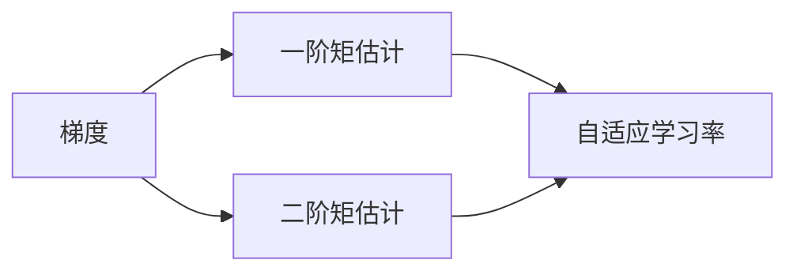

## 1.背景介绍

在深度学习领域，优化算法起着至关重要的作用，它们负责调整神经网络的权重和偏差，以最小化损失函数。其中，Adam优化算法是最受欢迎的优化算法之一。它结合了Momentum和RMSprop两种优化算法的优点，使得模型的训练更加快速和稳定。

## 2.核心概念与联系

Adam优化算法的核心思想是通过计算梯度的一阶矩估计和二阶矩估计来进行自适应的学习率调整。一阶矩估计相当于梯度的均值，二阶矩估计相当于梯度的未中心化的方差。通过这两个矩的估计，Adam算法能够对每一个参数的学习率进行自适应的调整。



## 3.核心算法原理具体操作步骤

Adam算法的更新规则如下：

1. 计算梯度的一阶矩估计和二阶矩估计。
2. 对一阶矩估计和二阶矩估计进行偏差修正。
3. 使用修正后的一阶矩估计和二阶矩估计更新参数。

具体的算法步骤如下：

1. 初始化参数。
2. 在每一轮迭代中，首先计算出当前梯度。
3. 更新一阶矩估计和二阶矩估计。
4. 对一阶矩估计和二阶矩估计进行偏差修正。
5. 使用修正后的一阶矩估计和二阶矩估计更新参数。

## 4.数学模型和公式详细讲解举例说明

在Adam算法中，一阶矩估计和二阶矩估计的计算公式如下：

$$
m_t = \beta_1 m_{t-1} + (1-\beta_1)g_t
$$

$$
v_t = \beta_2 v_{t-1} + (1-\beta_2)g_t^2
$$

其中，$m_t$和$v_t$分别是梯度的一阶矩估计和二阶矩估计，$g_t$是当前的梯度，$\beta_1$和$\beta_2$是超参数，控制一阶矩估计和二阶矩估计的更新速度。

偏差修正的公式如下：

$$
\hat{m}_t = \frac{m_t}{1-\beta_1^t}
$$

$$
\hat{v}_t = \frac{v_t}{1-\beta_2^t}
$$

其中，$\hat{m}_t$和$\hat{v}_t$是偏差修正后的一阶矩估计和二阶矩估计。

参数更新的公式如下：

$$
\theta_t = \theta_{t-1} - \frac{\eta}{\sqrt{\hat{v}_t} + \epsilon}\hat{m}_t
$$

其中，$\theta_t$是当前的参数，$\eta$是学习率，$\epsilon$是防止分母为零的小常数。

## 5.项目实践：代码实例和详细解释说明

下面是一个使用Python和TensorFlow实现的Adam算法的示例：

```python
import tensorflow as tf

# 初始化参数
theta = tf.Variable(tf.random.normal([2, 1]))
# 设置超参数
beta1 = 0.9
beta2 = 0.999
eta = 0.001
epsilon = 1e-8
# 初始化一阶矩估计和二阶矩估计
m = tf.Variable(tf.zeros([2, 1]))
v = tf.Variable(tf.zeros([2, 1]))

# 在每一轮迭代中
for t in range(1, 10000):
    with tf.GradientTape() as tape:
        # 计算当前的梯度
        g = tape.gradient(loss(theta), theta)
    # 更新一阶矩估计和二阶矩估计
    m.assign(beta1 * m + (1 - beta1) * g)
    v.assign(beta2 * v + (1 - beta2) * tf.square(g))
    # 计算偏差修正后的一阶矩估计和二阶矩估计
    m_hat = m / (1 - tf.pow(beta1, t))
    v_hat = v / (1 - tf.pow(beta2, t))
    # 更新参数
    theta.assign(theta - eta / (tf.sqrt(v_hat) + epsilon) * m_hat)
```

## 6.实际应用场景

Adam算法在各种深度学习任务中都有广泛的应用，包括图像分类、语音识别、自然语言处理等。由于其对参数的自适应学习率调整，使得它在处理复杂和大规模的数据集时，能够更快地收敛，并且得到更好的性能。

## 7.工具和资源推荐

- [TensorFlow](https://www.tensorflow.org/)：一个强大的开源深度学习框架，提供了丰富的优化算法，包括Adam。
- [PyTorch](https://pytorch.org/)：另一个强大的开源深度学习框架，也提供了Adam算法。

## 8.总结：未来发展趋势与挑战

尽管Adam算法已经在深度学习领域取得了广泛的应用，但是它仍然面临一些挑战。例如，如何选择合适的超参数$\beta_1$和$\beta_2$，以及如何处理梯度稀疏的问题。未来，我们期待有更多的研究能够进一步改进Adam算法，使其在更多的应用场景中发挥更大的作用。

## 9.附录：常见问题与解答

Q: Adam算法和SGD有什么区别？

A: SGD是最基本的优化算法，它每次只使用一个样本来计算梯度并更新参数。而Adam算法则使用了一阶矩估计和二阶矩估计来自适应地调整学习率，使得参数更新更加稳定和快速。

Q: Adam算法的超参数应该如何选择？

A: 一般来说，$\beta_1$可以设置为0.9，$\beta_2$可以设置为0.999，$\eta$可以设置为0.001，$\epsilon$可以设置为1e-8。这些都是经验值，具体的设置可能需要根据问题的具体情况进行调整。

作者：禅与计算机程序设计艺术 / Zen and the Art of Computer Programming