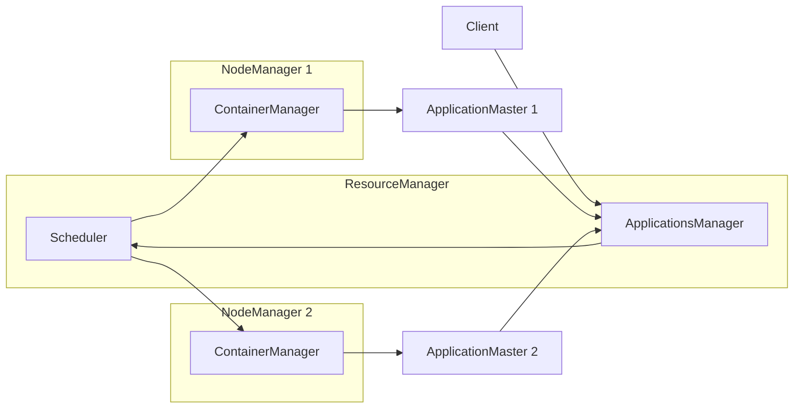
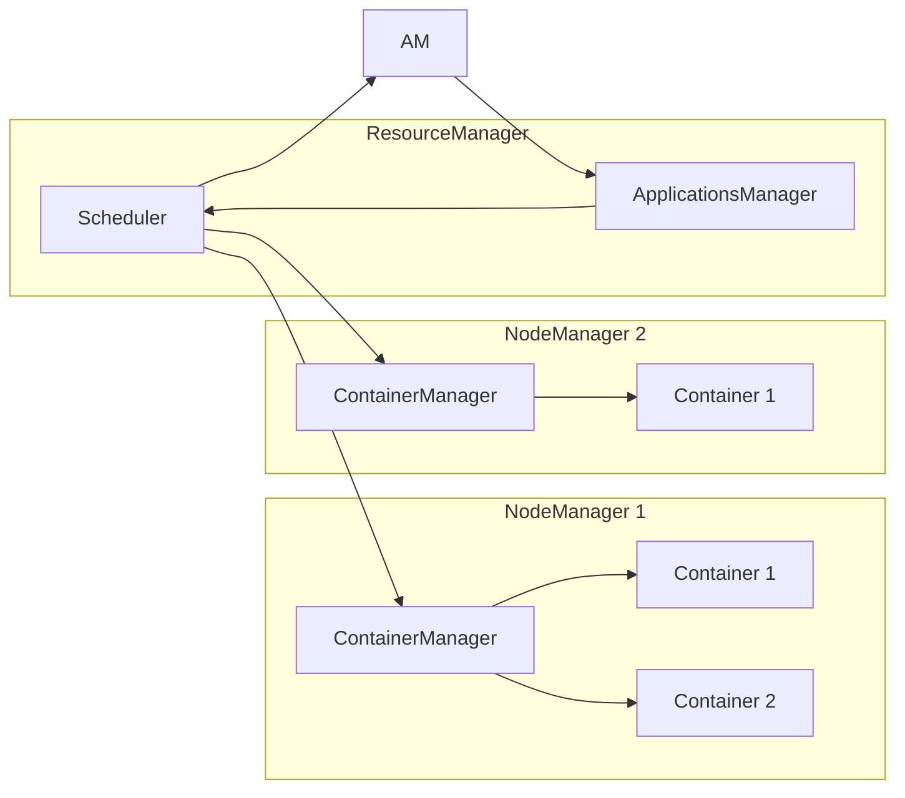
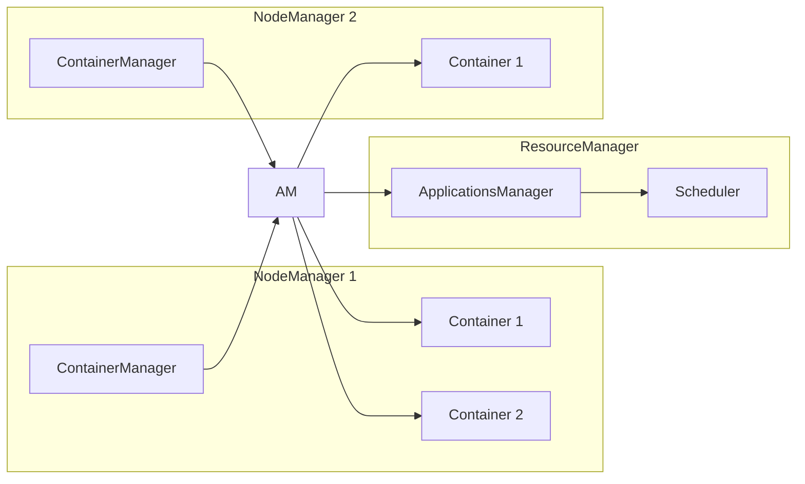
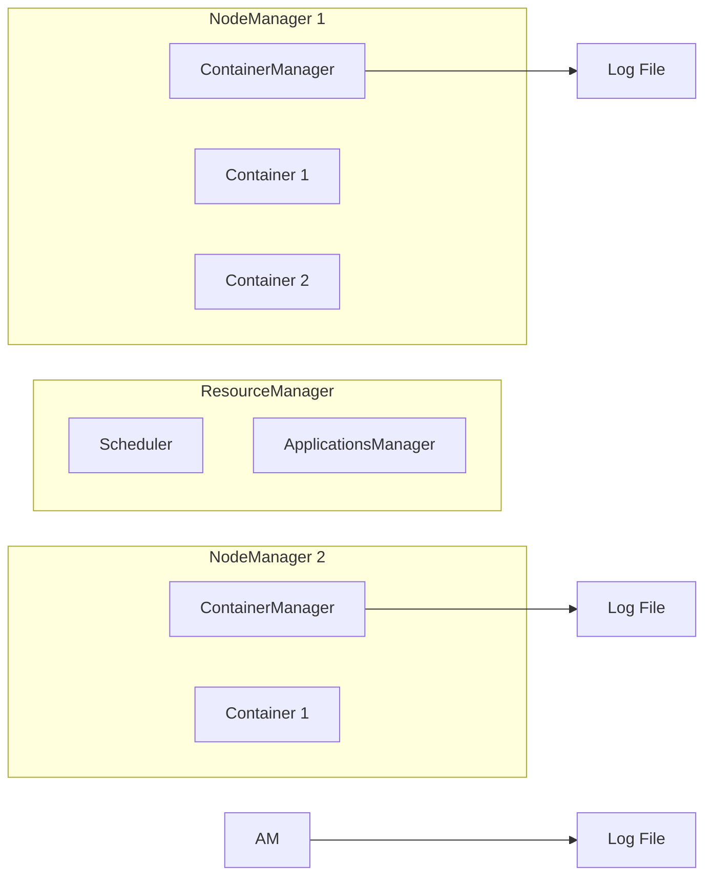
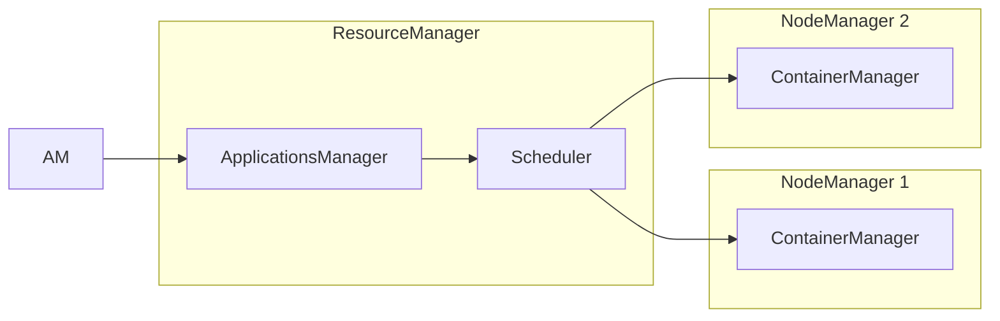

# ApplicationMaster监控与日志：洞察运行状态

## 1.背景介绍

在大数据时代,Apache Hadoop和Apache Spark等分布式计算框架已经成为了处理海量数据的重要工具。这些框架通常在集群环境中运行,由多个节点组成。为了确保应用程序的正常运行和高效执行,有必要对集群中的各个组件进行监控和日志记录。其中,ApplicationMaster(AM)作为管理应用程序执行的核心组件,对其进行监控和日志记录尤为重要。

ApplicationMaster是Hadoop YARN(Yet Another Resource Negotiator)中的一个关键组件。在YARN架构中,ResourceManager负责集群资源的管理和调度,而ApplicationMaster则负责管理和监控特定应用程序的执行过程。每个应用程序在提交到YARN后,都会启动一个ApplicationMaster进程,该进程负责向ResourceManager申请资源,并在获取资源后启动相应的容器(Container)来执行任务。

监控ApplicationMaster的运行状态对于确保应用程序的正常执行至关重要。通过监控,我们可以了解应用程序的进度、资源使用情况、任务执行情况等,从而及时发现并解决潜在的问题。同时,ApplicationMaster的日志记录也为故障排查和性能优化提供了宝贵的信息。

## 2.核心概念与联系

在探讨ApplicationMaster监控与日志之前,我们需要了解一些核心概念及其之间的关系。

### 2.1 YARN架构

YARN(Yet Another Resource Negotiator)是Hadoop 2.x版本引入的全新资源管理和任务调度框架。它将资源管理和任务调度/监控分离,提高了集群资源利用率和系统可扩展性。YARN架构主要由以下三个核心组件组成:

1. **ResourceManager(RM)**: 负责集群资源的管理和调度,包括处理来自ApplicationMaster的资源请求,并为其分配适当的容器(Container)。

2. **NodeManager(NM)**: 运行在每个节点上,负责管理该节点上的资源(CPU、内存等),并监控和报告容器的使用情况。

3. **ApplicationMaster(AM)**: 为每个应用程序启动一个实例,负责与ResourceManager协商获取资源,并监控和管理应用程序的执行过程。

### 2.2 ApplicationMaster生命周期

ApplicationMaster的生命周期包括以下几个阶段:

1. **启动**: 应用程序提交到YARN后,ResourceManager会为其启动一个ApplicationMaster进程。

2. **资源申请**: ApplicationMaster向ResourceManager申请所需的资源(如容器)。

3. **任务执行**: 获取到资源后,ApplicationMaster会在容器中启动相应的任务(如MapReduce任务或Spark任务)。

4. **监控和管理**: ApplicationMaster会持续监控任务的执行情况,并根据需要申请或释放资源。

5. **完成**: 所有任务执行完毕后,ApplicationMaster会向ResourceManager报告应用程序的完成状态,并自身终止。

### 2.3 监控和日志记录

监控和日志记录是了解ApplicationMaster运行状态的两个重要手段。

- **监控**: 通过监控ApplicationMaster的各种指标,如资源使用情况、任务进度、失败任务等,可以及时发现并解决潜在问题。

- **日志记录**: ApplicationMaster会将其运行过程中的重要事件和信息记录到日志文件中,这些日志对于故障排查和性能优化非常有价值。

## 3.核心算法原理具体操作步骤

ApplicationMaster的监控和日志记录涉及多个组件的协作,包括ResourceManager、NodeManager和ApplicationMaster本身。下面我们将分步骤介绍其核心原理和具体操作。

### 3.1 ApplicationMaster启动

当用户提交一个应用程序到YARN时,ResourceManager会为该应用程序启动一个ApplicationMaster进程。ApplicationMaster启动后,会向ResourceManager发送心跳信号,并申请所需的资源(如容器)。



### 3.2 资源申请和分配

ApplicationMaster会根据应用程序的需求向ResourceManager申请资源。ResourceManager的Scheduler组件会根据集群的资源情况,为ApplicationMaster分配合适的容器。



### 3.3 任务执行和监控

ApplicationMaster获取到容器资源后,会在容器中启动相应的任务(如MapReduce任务或Spark任务)。同时,ApplicationMaster会持续监控任务的执行情况,包括进度、资源使用情况、失败任务等。如果需要,ApplicationMaster可以向ResourceManager申请或释放资源。



### 3.4 日志记录

ApplicationMaster会将其运行过程中的重要事件和信息记录到日志文件中。这些日志包括启动信息、资源申请和分配情况、任务执行情况、错误和警告信息等。日志文件通常存储在HDFS或本地文件系统中,方便后续的故障排查和性能优化。



### 3.5 ApplicationMaster完成

当所有任务执行完毕后,ApplicationMaster会向ResourceManager报告应用程序的完成状态,并自身终止。ResourceManager会回收ApplicationMaster占用的资源,以供其他应用程序使用。



## 4.数学模型和公式详细讲解举例说明

在监控ApplicationMaster的运行状态时,我们通常会关注一些关键指标,如资源使用情况、任务进度等。这些指标可以通过数学模型和公式来表示和计算。

### 4.1 资源使用情况

资源使用情况是一个重要的监控指标,它反映了ApplicationMaster占用的资源数量,包括CPU、内存等。我们可以使用以下公式来计算资源使用率:

$$
资源使用率 = \frac{已使用资源量}{总资源量} \times 100\%
$$

其中,已使用资源量和总资源量分别指ApplicationMaster占用的资源数量和集群中可用的总资源数量。

例如,假设一个ApplicationMaster占用了4个CPU核心和8GB内存,而集群中总共有100个CPU核心和1TB内存,那么CPU使用率和内存使用率分别为:

$$
CPU使用率 = \frac{4}{100} \times 100\% = 4\%
$$

$$
内存使用率 = \frac{8GB}{1TB} \times 100\% = 0.8\%
$$

通过监控资源使用率,我们可以及时发现资源过度使用或浪费的情况,从而进行相应的调整和优化。

### 4.2 任务进度

任务进度是另一个重要的监控指标,它反映了应用程序执行的进展情况。对于MapReduce任务,我们可以使用以下公式来计算Map任务和Reduce任务的进度:

$$
Map任务进度 = \frac{已完成Map任务数}{总Map任务数} \times 100\%
$$

$$
Reduce任务进度 = \frac{已完成Reduce任务数}{总Reduce任务数} \times 100\%
$$

对于Spark应用程序,任务进度的计算方式可能会有所不同,具体取决于应用程序的类型和执行模式。但总的思路是类似的,即通过已完成任务数和总任务数来计算进度。

例如,假设一个MapReduce作业总共有1000个Map任务和100个Reduce任务,目前已完成800个Map任务和60个Reduce任务,那么Map任务进度和Reduce任务进度分别为:

$$
Map任务进度 = \frac{800}{1000} \times 100\% = 80\%
$$

$$
Reduce任务进度 = \frac{60}{100} \times 100\% = 60\%
$$

通过监控任务进度,我们可以了解应用程序的执行情况,并及时发现和解决可能存在的问题或瓶颈。

### 4.3 其他指标

除了资源使用情况和任务进度之外,还有一些其他重要的监控指标,如:

- **失败任务数**: 反映了应用程序执行过程中发生的失败任务数量,可用于故障排查和优化。

- **数据shuffle情况**: 对于MapReduce作业,shuffle过程是一个关键环节,监控shuffle的数据量和速度可以帮助优化性能。

- **GC(垃圾回收)情况**: 监控JVM的GC情况,可以发现潜在的内存问题并进行优化。

- **网络和磁盘IO**: 监控集群节点之间的网络传输情况和磁盘IO情况,有助于发现潜在的瓶颈。

这些指标通常可以通过特定的公式或算法进行计算和表示,具体取决于监控系统的实现方式。

## 5.项目实践:代码实例和详细解释说明

在实际项目中,我们可以使用各种工具和框架来实现ApplicationMaster的监控和日志记录。以下是一些常见的实践和代码示例。

### 5.1 Hadoop日志

Hadoop提供了一套日志记录机制,可以记录ApplicationMaster的运行信息。默认情况下,Hadoop会将日志写入本地文件系统,但也可以配置为写入HDFS或其他存储系统。

以下是一个示例日志文件的片段:

```
2023-06-05 10:23:45,867 INFO org.apache.hadoop.yarn.server.resourcemanager.rmapp.attempt.RMAppAttemptImpl: Application attempt_1685952225867_0001_m_000001_0 started running
2023-06-05 10:23:46,012 INFO org.apache.hadoop.yarn.server.resourcemanager.rmapp.attempt.RMAppAttemptImpl: Allocated container container_e01_1685952225867_0001_01_000001 on node node1
2023-06-05 10:23:46,234 INFO org.apache.hadoop.yarn.server.resourcemanager.rmapp.attempt.RMAppAttemptImpl: Allocated container container_e01_1685952225867_0001_01_000002 on node node2
2023-06-05 10:24:01,456 WARN org.apache.hadoop.yarn.server.resourcemanager.rmapp.attempt.RMAppAttemptImpl: Container container_e01_1685952225867_0001_01_000001 failed
2023-06-05 10:24:02,789 INFO org.apache.hadoop.yarn.server