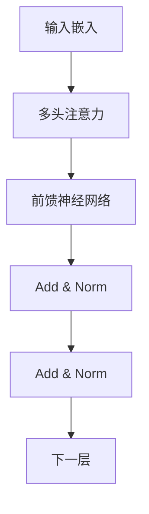

# BERT 原理与代码实例讲解

## 1. 背景介绍

在自然语言处理(NLP)领域,Transformer模型在2017年被提出后,引发了深度学习在NLP领域的新浪潮。作为Transformer模型的一种改进版本,BERT(Bidirectional Encoder Representations from Transformers)模型于2018年由Google的AI团队提出,并在多个NLP任务上取得了state-of-the-art的表现。

BERT的核心创新在于采用了全新的预训练(Pre-training)方法,通过在大规模语料库上进行双向建模,学习到了深层次的语义表示。这种预训练方式使得BERT模型在下游NLP任务上,只需少量的任务数据就可以快速进行微调(Fine-tuning),从而取得了卓越的效果。

自发布以来,BERT模型在NLP领域掀起了新的热潮,成为事实上的新标准基线模型。其高效的语义表示能力不仅在学术界引起了广泛关注,在工业界也得到了大规模应用。

## 2. 核心概念与联系

### 2.1 Transformer 模型

BERT模型的核心是基于Transformer的Encoder部分。Transformer模型最初被设计用于机器翻译任务,其全新的自注意力(Self-Attention)机制可以更好地捕捉输入序列中的长程依赖关系。

Transformer的核心组件有两个:

1. **Multi-Head Attention**
2. **Position-wise Feed-Forward Networks**

这两个组件被编码器(Encoder)和解码器(Decoder)模块广泛使用。

### 2.2 BERT 模型结构

BERT模型的核心是只保留了Transformer的Encoder部分,不包含Decoder部分。BERT的基本思想是通过预训练得到通用的语义表示,然后将这些表示迁移到下游NLP任务中进行微调。

BERT模型由多层Transformer的Encoder组成,每层包含多头注意力(Multi-Head Attention)和前馈神经网络(Feed-Forward Neural Network)。



### 2.3 预训练任务

BERT采用了两种无监督预训练任务:

1. **Masked Language Model (MLM)**: 随机将一些词替换为特殊的[MASK]标记,模型需要预测这些被遮蔽词的正确词语。
2. **Next Sentence Prediction (NSP)**: 判断两个句子是否为连续关系,从而学习到句子间的表示。

通过这两个预训练任务,BERT可以在大规模语料库上学习到双向的上下文表示,捕捉词语和句子级别的语义关系。

## 3. 核心算法原理具体操作步骤 

### 3.1 输入表示

BERT的输入由三部分组成:

1. **Token Embeddings**: 词语的嵌入表示
2. **Segment Embeddings**: 句子级别的嵌入,区分不同句子
3. **Position Embeddings**: 位置嵌入,捕捉单词在句子中的位置信息

这三部分相加作为BERT的初始输入嵌入表示。

### 3.2 Multi-Head Attention

Multi-Head Attention是BERT的核心机制,可以同时关注输入序列中的不同位置,捕捉长程依赖关系。

具体操作步骤如下:

1. 将输入嵌入投影到查询(Query)、键(Key)和值(Value)空间
2. 计算查询与所有键的点积,应用softmax函数得到注意力权重
3. 将注意力权重与值相乘,得到上下文表示
4. 对多个注意力头的结果进行拼接

$$\begin{aligned}
\text{MultiHead}(Q, K, V) &= \text{Concat}(\text{head}_1, \ldots, \text{head}_h)W^O\\
\text{where\ head}_i &= \text{Attention}(QW_i^Q, KW_i^K, VW_i^V)
\end{aligned}$$

### 3.3 前馈神经网络

每个Transformer块中,Multi-Head Attention后接着一个前馈全连接网络,包含两个线性变换和一个非线性激活函数(如ReLU)。

$$\text{FFN}(x)=\max(0, xW_1 + b_1)W_2 + b_2$$

### 3.4 残差连接与层归一化

为了更好地训练,BERT在每个子层后使用了残差连接(Residual Connection)和层归一化(Layer Normalization)。

残差连接有助于更好地传播梯度信号,而层归一化则有助于加速收敛和提高泛化能力。

### 3.5 预训练

在预训练阶段,BERT在大规模语料库上使用MLM和NSP任务进行训练,得到通用的语义表示。

### 3.6 微调

在下游NLP任务上,BERT通过在预训练模型的基础上,添加一个输出层,并使用任务相关的少量数据进行微调,从而快速适应新任务。

## 4. 数学模型和公式详细讲解举例说明

### 4.1 注意力机制(Attention Mechanism)

注意力机制是BERT中的核心机制,它允许模型在编码序列时,动态地关注不同位置的单词,从而捕捉长程依赖关系。

给定一个查询 $q$ 和一组键值对 $(k_i, v_i)$,注意力权重 $\alpha_i$ 计算如下:

$$\alpha_i = \text{softmax}(\frac{q^Tk_i}{\sqrt{d_k}})$$

其中 $d_k$ 是缩放因子,用于防止点积的值过大导致梯度消失。

然后,注意力加权和就是将注意力权重与值 $v_i$ 相乘并求和:

$$\text{Attention}(q, K, V) = \sum_{i=1}^n \alpha_i v_i$$

在BERT中,我们使用Multi-Head Attention,将注意力机制分成多个子空间,每个子空间单独计算注意力,最后将结果拼接起来:

$$\begin{aligned}
\text{MultiHead}(Q, K, V) &= \text{Concat}(\text{head}_1, \ldots, \text{head}_h)W^O\\
\text{where\ head}_i &= \text{Attention}(QW_i^Q, KW_i^K, VW_i^V)
\end{aligned}$$

其中 $W_i^Q$、$W_i^K$、$W_i^V$ 和 $W^O$ 是可学习的投影矩阵。

### 4.2 Masked Language Model (MLM)

MLM任务的目标是基于上下文预测被遮蔽的单词。具体来说,给定一个句子,我们随机选择15%的单词进行遮蔽,其中80%的遮蔽单词用特殊的[MASK]标记替换,10%用随机单词替换,剩余10%保持不变。

假设输入序列为 $\mathbf{x} = (x_1, x_2, \ldots, x_n)$,其中 $x_i$ 是单词的嵌入向量。对于被遮蔽的位置 $i$,我们需要预测其原始单词 $x_i$。

BERT将输入序列 $\mathbf{x}$ 输入到Transformer Encoder中,得到每个位置的上下文表示 $\mathbf{h} = (h_1, h_2, \ldots, h_n)$。对于被遮蔽的位置 $i$,我们使用其上下文表示 $h_i$ 和一个分类器(通常是一个线性层加softmax)来预测单词 $x_i$:

$$P(x_i|\mathbf{x}) = \text{softmax}(W_ch_i + b_c)$$

其中 $W_c$ 和 $b_c$ 是可学习的参数。

在训练过程中,我们最小化所有被遮蔽位置的交叉熵损失:

$$\mathcal{L}_\text{MLM} = -\sum_{i \in \text{masked}} \log P(x_i|\mathbf{x})$$

通过MLM任务,BERT可以学习到双向的上下文表示,捕捉单词在句子中的语义关系。

### 4.3 Next Sentence Prediction (NSP)

NSP任务的目标是判断两个句子是否为连续关系。具体来说,给定两个句子 $A$ 和 $B$,我们需要预测 $B$ 是否为 $A$ 的下一句。

我们将两个句子的表示 $\mathbf{h}_A$ 和 $\mathbf{h}_B$ 连接起来,然后使用一个二分类器(通常是一个线性层加softmax)来预测它们是否为连续关系:

$$P_\text{isNext} = \text{softmax}(W_n[\mathbf{h}_A; \mathbf{h}_B] + b_n)$$

其中 $W_n$ 和 $b_n$ 是可学习的参数,分号表示向量拼接操作。

在训练过程中,我们最小化二分类交叉熵损失:

$$\mathcal{L}_\text{NSP} = -\log P_\text{isNext}$$

通过NSP任务,BERT可以学习到句子级别的表示,捕捉句子之间的关系。

### 4.4 BERT 损失函数

BERT的最终损失函数是MLM损失和NSP损失的加权和:

$$\mathcal{L} = \mathcal{L}_\text{MLM} + \lambda \mathcal{L}_\text{NSP}$$

其中 $\lambda$ 是一个超参数,用于平衡两个损失项的重要性。

## 5. 项目实践: 代码实例和详细解释说明

在这一部分,我们将使用Python和PyTorch库,实现一个简化版本的BERT模型,并在一个简单的文本分类任务上进行训练和测试。

### 5.1 导入所需库

```python
import torch
import torch.nn as nn
import torch.optim as optim
from torch.utils.data import DataLoader, TensorDataset
```

### 5.2 定义BERT模型

我们首先定义一个简化版本的BERT模型,包含一个Transformer Encoder层和一个线性分类层。

```python
class BERTClassifier(nn.Module):
    def __init__(self, vocab_size, hidden_size, num_layers, num_heads, dropout):
        super(BERTClassifier, self).__init__()
        
        # 词嵌入层
        self.word_embeddings = nn.Embedding(vocab_size, hidden_size)
        
        # Transformer Encoder层
        encoder_layer = nn.TransformerEncoderLayer(hidden_size, num_heads, hidden_size * 4, dropout)
        self.transformer_encoder = nn.TransformerEncoder(encoder_layer, num_layers)
        
        # 线性分类层
        self.classifier = nn.Linear(hidden_size, 2)
        
    def forward(self, input_ids):
        # 词嵌入
        embeddings = self.word_embeddings(input_ids)
        
        # Transformer Encoder
        outputs = self.transformer_encoder(embeddings)
        
        # 取最后一个时间步的隐藏状态
        last_hidden_state = outputs[:, -1, :]
        
        # 线性分类层
        logits = self.classifier(last_hidden_state)
        
        return logits
```

### 5.3 准备数据

我们将使用一个简单的文本分类数据集,其中每个样本是一个句子,标签为0或1。

```python
sentences = [
    "This movie is great!",
    "I didn't like the acting.",
    "The plot was confusing.",
    "The visual effects were amazing!",
    # ... 更多样本
]

labels = [1, 0, 0, 1, ...]

# 构建词汇表
vocab = set()
for sentence in sentences:
    vocab.update(sentence.split())
vocab_to_idx = {word: idx for idx, word in enumerate(vocab)}
idx_to_vocab = {idx: word for word, idx in vocab_to_idx.items()}

# 将句子转换为索引序列
input_ids = []
for sentence in sentences:
    indices = [vocab_to_idx[word] for word in sentence.split()]
    input_ids.append(indices)

# 构建数据集和数据加载器
input_ids = torch.tensor(input_ids, dtype=torch.long)
labels = torch.tensor(labels, dtype=torch.long)
dataset = TensorDataset(input_ids, labels)
dataloader = DataLoader(dataset, batch_size=32, shuffle=True)
```

### 5.4 训练模型

现在,我们可以实例化BERT模型,定义优化器和损失函数,并在数据集上进行训练。

```python
# 实例化模型
model = BERTClassifier(len(vocab), hidden_size=256, num_layers=2, num_heads=4, dropout=0.1)

# 定义优化器和损失函数
optimizer = optim.Adam(model.parameters(), lr=1e-4)
criterion = nn.CrossEntropyLoss()

# 训练循环
for epoch in range(10):
    for batch in dataloader:
        input_ids, labels = batch
        
        # 前向传播
        logits = model(input_ids)
        loss = criterion(logits, labels)