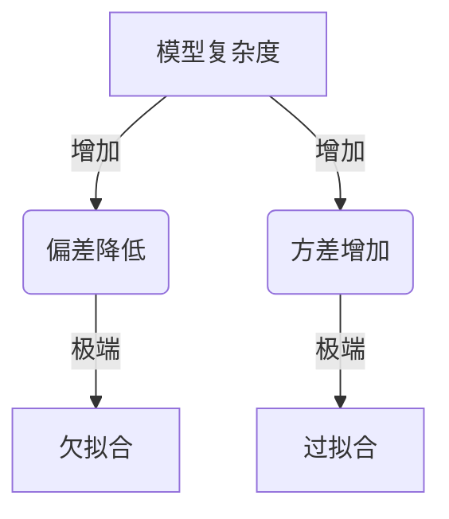
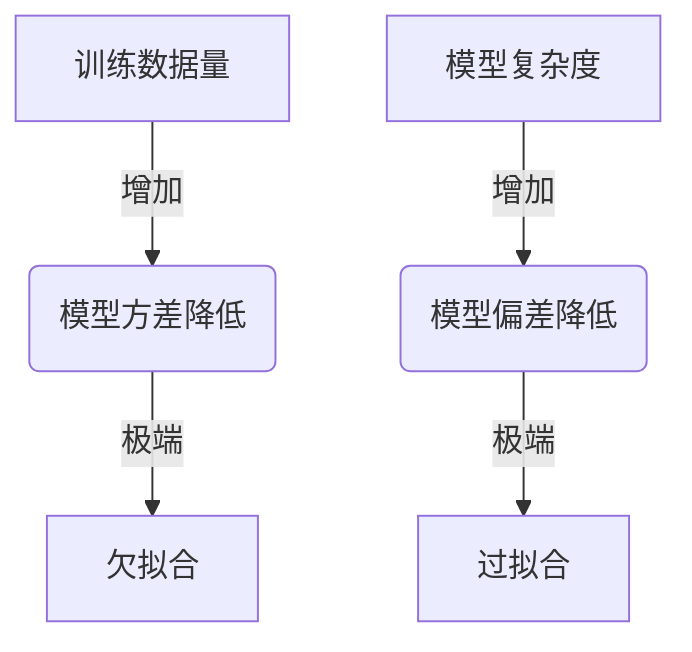

# Bias-Variance Tradeoff 原理与代码实战案例讲解

## 1.背景介绍

在机器学习和统计学习领域中,Bias-Variance Tradeoff(偏差-方差权衡)是一个非常重要的概念。它描述了学习算法的预测性能受到两个相互矛盾的因素的影响:偏差(Bias)和方差(Variance)。理解这个权衡对于选择合适的模型复杂度、避免过拟合或欠拟合以及提高模型的泛化能力至关重要。

### 1.1 过拟合与欠拟合

- **过拟合(Overfitting)**:当模型过于复杂时,它会过度捕捉训练数据中的噪声和细节,导致在训练数据上表现良好,但在新的未见数据上泛化能力较差。过拟合的模型会"记住"训练数据,而不是真正学习到数据背后的一般规律。
- **欠拟合(Underfitting)**:当模型过于简单时,它无法捕捉数据中的重要模式和趋势,导致无法很好地拟合训练数据,也无法很好地泛化到新的数据。欠拟合的模型过于简单,无法学习到数据的内在规律。

### 1.2 偏差与方差

- **偏差(Bias)**:偏差衡量了模型的预测值与真实值之间的系统性差异。高偏差意味着模型过于简单,无法很好地捕捉数据的复杂模式。
- **方差(Variance)**:方差衡量了模型对于不同的训练数据集的敏感程度。高方差意味着模型过于复杂,会过度拟合训练数据中的噪声和细节。

理想情况下,我们希望模型具有低偏差和低方差,但实际上这两者往往是一对矛盾体。当我们试图降低偏差时,方差往往会增加,反之亦然。因此,我们需要在偏差和方差之间寻找一个适当的平衡点,这就是Bias-Variance Tradeoff。

## 2.核心概念与联系

### 2.1 模型复杂度

模型复杂度是影响偏差和方差的关键因素。一般来说,复杂度较低的模型(如线性回归)往往具有较高的偏差和较低的方差,而复杂度较高的模型(如决策树或神经网络)则倾向于具有较低的偏差和较高的方差。

选择合适的模型复杂度是Bias-Variance Tradeoff的核心。过于简单的模型可能无法捕捉数据的复杂模式,导致高偏差;而过于复杂的模型则可能过度拟合训练数据,导致高方差。



### 2.2 训练数据量

训练数据的数量也会影响Bias-Variance Tradeoff。一般来说,当训练数据量较小时,模型倾向于具有较高的方差,因为有限的数据无法很好地约束复杂模型。当训练数据量足够大时,复杂模型的方差会降低,因为它们可以更好地从大量数据中学习。

然而,即使训练数据量很大,过于简单的模型仍然可能存在高偏差问题。因此,我们需要根据训练数据量和问题的复杂程度来选择合适的模型复杂度。



### 2.3 正则化

正则化是一种常用的技术,可以帮助我们控制模型的复杂度,从而减少过拟合的风险。正则化通过在模型的损失函数中添加惩罚项,来限制模型参数的大小或复杂度。

常见的正则化方法包括L1正则化(Lasso回归)和L2正则化(Ridge回归)。L1正则化可以产生稀疏解,即一些模型参数会被精确地设置为0;而L2正则化则倾向于使所有参数接近于0,但很少有参数被精确设置为0。

正则化可以帮助我们找到偏差和方差之间的平衡点,从而提高模型的泛化能力。

## 3.核心算法原理具体操作步骤

理解Bias-Variance Tradeoff的核心算法原理及其具体操作步骤对于有效控制模型的复杂度和提高泛化能力至关重要。下面我们将详细介绍这一过程。

### 3.1 模型评估指标

在讨论Bias-Variance Tradeoff之前,我们需要了解一些用于评估模型性能的指标。常见的指标包括:

- **均方误差(Mean Squared Error, MSE)**: $MSE = \frac{1}{n}\sum_{i=1}^{n}(y_i - \hat{y}_i)^2$,其中$y_i$是真实值,$\hat{y}_i$是模型预测值。
- **均方根误差(Root Mean Squared Error, RMSE)**: $RMSE = \sqrt{\frac{1}{n}\sum_{i=1}^{n}(y_i - \hat{y}_i)^2}$

MSE和RMSE都衡量了模型预测值与真实值之间的差异,值越小表示模型性能越好。

### 3.2 偏差和方差的分解

我们可以将MSE分解为偏差项、方差项和不可约噪声项:

$$MSE(\hat{f}) = Bias^2(\hat{f}) + Var(\hat{f}) + \sigma^2_\epsilon$$

其中:

- $Bias^2(\hat{f})$是偏差项,衡量了模型预测值与真实值之间的系统性差异。
- $Var(\hat{f})$是方差项,衡量了模型对于不同的训练数据集的敏感程度。
- $\sigma^2_\epsilon$是不可约噪声项,表示数据本身的随机噪声。

我们的目标是最小化MSE,即找到一个具有较低偏差和较低方差的模型。

### 3.3 Bias-Variance Tradeoff算法步骤

1. **选择模型家族**:首先,我们需要选择一个适合问题的模型家族,例如线性模型、决策树或神经网络等。
2. **训练模型**:使用训练数据集训练模型,可以尝试不同的模型复杂度和超参数设置。
3. **计算偏差和方差**:在验证数据集上计算模型的偏差和方差,可以使用下面的方法:
   - 偏差可以通过计算模型预测值与真实值之间的平均差异来估计。
   - 方差可以通过训练多个模型,计算它们在验证数据集上的预测值的方差来估计。
4. **评估模型性能**:使用MSE或其他指标在测试数据集上评估模型的性能。
5. **调整模型复杂度**:根据偏差和方差的值,调整模型的复杂度。如果偏差较高,可以增加模型复杂度;如果方差较高,可以减小模型复杂度或使用正则化技术。
6. **重复步骤2-5**:重复训练、评估和调整模型的过程,直到找到一个具有较低偏差和较低方差的模型。

通过这一过程,我们可以有效地控制模型的复杂度,避免过拟合或欠拟合,从而提高模型的泛化能力。

## 4.数学模型和公式详细讲解举例说明

在上一节中,我们提到了MSE可以分解为偏差项、方差项和不可约噪声项。现在,我们将详细讲解这一分解的数学模型和公式。

### 4.1 MSE分解公式

$$MSE(\hat{f}) = E[(Y - \hat{f}(X))^2]$$

其中,$Y$是真实值,$\hat{f}(X)$是模型对于输入$X$的预测值。我们可以将MSE分解为:

$$MSE(\hat{f}) = Bias^2(\hat{f}) + Var(\hat{f}) + \sigma^2_\epsilon$$

### 4.2 偏差项

偏差项衡量了模型预测值与真实值之间的系统性差异,定义为:

$$Bias^2(\hat{f}) = E[(E[\hat{f}(X)] - E[Y])^2]$$

其中,$E[\hat{f}(X)]$是模型预测值的期望,$E[Y]$是真实值的期望。偏差项反映了模型的系统性误差,即使在无限多的训练数据下,模型的预测值与真实值之间的差异。

### 4.3 方差项

方差项衡量了模型对于不同的训练数据集的敏感程度,定义为:

$$Var(\hat{f}) = E[(\hat{f}(X) - E[\hat{f}(X)])^2]$$

方差项反映了模型的不稳定性,即使用不同的训练数据集训练得到的模型会有多大的差异。

### 4.4 不可约噪声项

不可约噪声项$\sigma^2_\epsilon$表示数据本身的随机噪声,是无法通过改进模型而消除的。它是MSE的下限,即使模型具有零偏差和零方差,MSE也不会小于$\sigma^2_\epsilon$。

### 4.5 示例说明

为了更好地理解这些概念,我们来看一个简单的线性回归示例。假设我们有一个一维输入$X$和一个目标值$Y$,它们之间的真实关系为:

$$Y = 2X + 3 + \epsilon$$

其中,$\epsilon$是服从正态分布$N(0, 1)$的噪声项。

我们使用一个线性模型$\hat{f}(X) = \hat{w}X + \hat{b}$来拟合这个数据,其中$\hat{w}$和$\hat{b}$是通过最小二乘法估计得到的模型参数。

在这个示例中,我们可以计算出:

- 偏差项:$Bias^2(\hat{f}) = (E[\hat{w}] - 2)^2 + (E[\hat{b}] - 3)^2$
- 方差项:$Var(\hat{f}) = Var(\hat{w})X^2 + Var(\hat{b})$
- 不可约噪声项:$\sigma^2_\epsilon = 1$

通过调整模型的复杂度(例如使用多项式回归),我们可以降低偏差项,但同时会增加方差项。反之,如果我们使用过于简单的模型(如常数模型),则会导致高偏差但低方差。

因此,我们需要在偏差和方差之间寻找一个适当的平衡点,以最小化MSE,从而获得最佳的模型性能。

## 5.项目实践:代码实例和详细解释说明

为了更好地理解Bias-Variance Tradeoff,我们将通过一个实际的代码示例来演示如何评估模型的偏差和方差,并调整模型复杂度以找到最佳的平衡点。

在这个示例中,我们将使用scikit-learn库中的一个玩具数据集,并尝试使用不同复杂度的模型(从线性回归到决策树)来拟合该数据集。我们将计算每个模型的偏差、方差和MSE,并可视化它们之间的关系。

### 5.1 导入所需库

```python
import numpy as np
import matplotlib.pyplot as plt
from sklearn.datasets import make_circles
from sklearn.model_selection import train_test_split
from sklearn.linear_model import LinearRegression
from sklearn.tree import DecisionTreeRegressor
from sklearn.metrics import mean_squared_error
```

### 5.2 生成玩具数据集

我们将使用`make_circles`函数生成一个环形数据集,其中包含一些噪声。

```python
X, y = make_circles(n_samples=1000, noise=0.1, random_state=42)
X_train, X_test, y_train, y_test = train_test_split(X, y, test_size=0.2, random_state=42)
```

### 5.3 定义模型列表

我们将尝试使用不同复杂度的模型,包括线性回归和决策树回归。

```python
models = [
    LinearRegression(),
    DecisionTreeRegressor(max_depth=1),
    DecisionTreeRegressor(max_depth=3),
    DecisionTreeRegressor(max_depth=5),
    DecisionTreeRegressor(max_depth=10),
]
```

### 5.4 训练模型并计算偏差和方差

我们将使用K-fold交叉验证的方法来估计每个模型的偏差和方差。

```python
from sklearn.model_selection import KFold

n_folds = 10
kf = KFold(n_